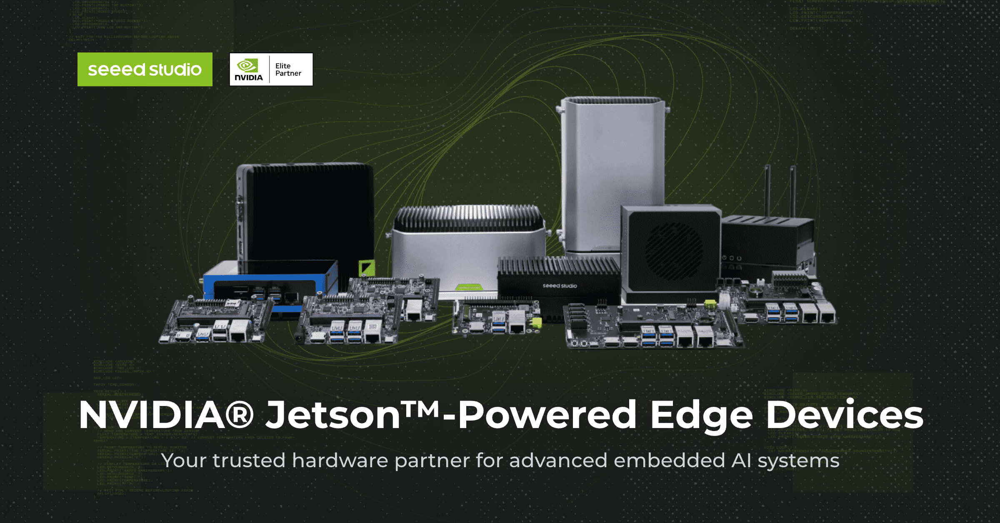

# What is reComputer

The reComputer Jetson series  is a comprehensive selection for NVIDIA Jetson compatible carrier boards and full systems, covering full range of Jetson modules from Jetson Nano and Xavier NX, to the advanced Orin Nano, Orin NX, and AGX Orin. Designed for reliability and ease of use, this series empowers developers and businesses to bring AI to the edge. Our commitment is to simplify access to cutting-edge technology, accelerating the development and deployment of intelligent devices and applications. This enables the creation of AI models like YOLOv8, YOLOv10, CLIP, LLM, VLM, Whisper, and RAG to be easily deployed across industries, from vision AI in video analytics and robotics sensing, to human-like interactions in Generative AI area.

    

Taking our TOP1 shinning star - reComputer J4012 Jetson Orin NX 16GB as an example. When you make an order on Seeed bazaar, you'll receive a package containing a reComputer Edge box, and a power adapter as 19V/5A(Barrel Jack 5.5/2.5mm) standard. 

    

### 🛍️ Get a reComputer Jetson Orin NX Device 

| **Device Model** | **Description**            | **Link**           |
|:----------------:|:--------------------------:|:------------------:|
| reComputer J4011| powered by NVIDIA Jetson Orin NX 8GB|[**Make an Order**](https://www.seeedstudio.com/reComputer-J4011-p-5585.html)|
| reComputer J4012| powered by NVIDIA Jetson Orin NX 16GB| [**Make an Order**](https://www.seeedstudio.com/reComputer-J4012-p-5586.html)|

The reComputer J4012 edge device is composed with one reComputer J401 carrier board, one Jetson Orin NX 16GB module, one heatsink with fan, and one aluminum enclosure:

### - Jetson Orin NX Module

The NVIDIA® Jetson Orin™ NX delivers AI supercomputer performance in a compact system-on-module (SOM) smaller than a credit card. Powered by a low-power NVIDIA Orin SoC, it combines the NVIDIA Ampere™ GPU architecture with advanced 64-bit processing, multi-function video and image capabilities, and Deep Learning Accelerators. 

With up to 100 INT8 TOPs for compute and 50 INT8 TOPs for deep learning, it supports running multiple neural networks and processing high-resolution sensor data simultaneously. The Jetson Orin NX offers a blend of performance and power efficiency with diverse I/Os, including high-speed CSI and PCIe, as well as low-speed I2Cs and GPIOs, ideal for embedded and edge computing devices where size, weight, and power are critical.

### - reComputer J401 Carrier Board

The reComputer J401 carrier board is an advanced, open-source extension board for NVIDIA Jetson Orin Nano/ Orin Nano modules. It breaks out typical IO interfaces from the SoM, inlcuding 4x USB 3.2, HDMI 2.1, 2x CSI, 1x RJ45 for GbE, M.2 Key E for WiFi/BLE connection, M.2 Key M for storage expansion, CAN, and GPIO, Pre-installed JetPack 5.1.1 on 128GB NVMe SSD, and also supporting the latest JetPack 6 BSP , all for accelarating your solution to market in ease.

    

### - Heatsink with Fan

This Aluminum Heatsink offers essential, active, physical, and strong fan air cooling function for reComputer J401 carrier board, to avoid overheating and throttling problems while operating tough computing tasks. It is designed for continuous deployment, and can be customized to air flow speed through PWM function.

### - Aluminum Enclosure

The whole device with aluminum case is compact as  130mm x120mm x 58.5mm, which can be easily embedded into various scenarios from autonomous machine to industrial system supporting multiple installation modes such as desktop and wall mounting. We also provide comprehensive certifications such as ROHS, CE, FCC, KC, UKCA,  ensuring your product ready-to-go for the market. 

