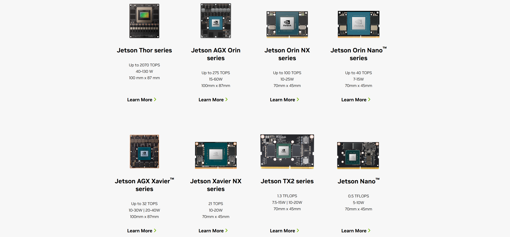

# 2.2 NVIDIA Jetson Module

    

## What Is an NVIDIA Jetson Module

Jetson modules are NVIDIA `System-on-Module (SoM)` products designed for edge AI and robotics. Each module integrates the CPU, GPU, AI accelerators, memory, and high-speed interfaces into a compact hardware unit. A carrier board then exposes power, display, camera, network, and expansion interfaces for practical system integration.

## Jetson Modules Used Across reComputer Jetson

| **Typical Jetson Platform** | **Official Compute Reference** | **How to Think About It** |
|:----------------------------|:-------------------------------|:--------------------------|
| Jetson Nano | `0.5 TFLOPS (FP16)` | An early entry-level platform suitable for Linux, JetPack, and basic vision experiments |
| Jetson Xavier NX | `21 TOPS` | Better suited to more complex vision and traditional edge AI workloads, and still relevant for many existing projects |
| Jetson Orin Nano | `up to 67 TOPS` | The current entry to mid-range mainstream option for learning, basic multi-camera vision, and lightweight generative AI |
| Jetson Orin NX | `up to 157 TOPS` | A compact high-performance option for robotics, multi-camera systems, and larger model inference |
| Jetson AGX Orin | `up to 275 TOPS` | Designed for higher-end autonomous systems and multi-sensor fusion workloads |
| Jetson AGX Thor | `up to 2070 FP4 TFLOPS` | A next-generation platform for physical AI and robotics, with metrics that extend beyond traditional INT8 TOPS |

## References

- [NVIDIA Embedded Systems](https://www.nvidia.com/en-us/autonomous-machines/embedded-systems/)
