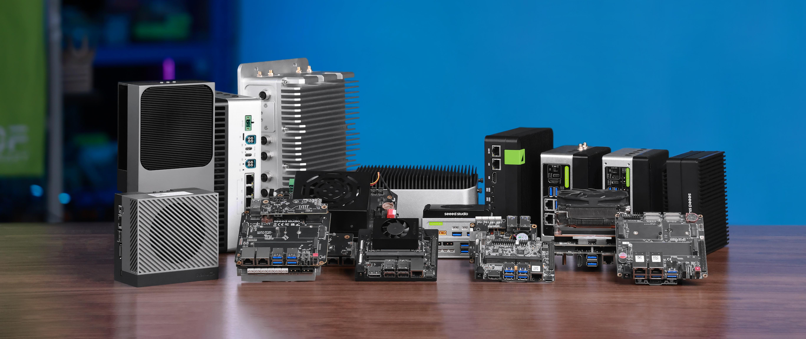

# Chapter 2: reComputer Jetson Platform Overview

    

This chapter answers one core question: what exactly is Seeed's reComputer Jetson platform, and how does it relate to NVIDIA Jetson modules, carrier boards, full systems, and the software stack?

## Why This Chapter Matters

Before diving into JetPack, CUDA, TensorRT, and the AI projects in later chapters, it helps to separate three layers clearly:

- `Jetson module`: the compute core provided by NVIDIA, including the CPU, GPU, NPU, memory, and other core processing resources.
- `carrier board`: the platform provided by Seeed that exposes interfaces such as USB, CSI, Ethernet, CAN, and M.2.
- `full system`: a deployable edge AI device built by combining the module and carrier board with thermal design, storage, enclosure, power, and BSP support.

## Chapter 2 Outline

| **Module** | **Topic** | **What You Will Learn** |
|:----------:|:----------|:------------------------|
| Module 2.1 | [**What Is reComputer Jetson**](./2.1-What-Is-reComputer/README.md) | Understand that reComputer is not a single model, but a product family built around Jetson SoMs |
| Module 2.2 | [**NVIDIA Jetson Module**](./2.2-NVIDIA-Jetson-Module/README.md) | Understand the positioning differences between Orin Nano, Orin NX, AGX Orin, and Xavier NX |
| Module 2.3 | [**Seeed Jetson Compatible Carrier Board**](./2.3-Seeed-Jetson-Compatible-Carrier-Board/README.md) | Compare how different carrier boards emphasize different IO, power, and expansion capabilities |
| Module 2.4 | [**Jetson Full System Series**](./2.4-Jetson-Full-System-Series/README.md) | Understand Seeed's product matrix through the Classic, Mini, Industrial, Super, and Robotics full-system families |
| Module 2.5 | [**Accessory Support**](./2.5-Accessory-Support/README.md) | Learn the common accessories, interface types, and software ecosystem around reComputer Jetson |

## Learning Goals

After this chapter, you should be able to answer:

- Why `TOPS` is not the only metric that matters when choosing a platform
- Why the same `Jetson Orin NX` can appear in multiple Seeed product families
- Why some scenarios prioritize `serial / CAN / dual Ethernet / 5G / GMSL2` more than raw compute alone
- Which type of reComputer is a better fit if your goal is to learn JetPack and basic AI inference

## Suggested Reading Order

It is recommended to read this chapter in the following order:

1. Start with `2.1` to build the overall mental model.
2. Continue with `2.2` to understand the NVIDIA Jetson module lineup.
3. Read `2.3` and `2.4` to distinguish carrier boards from full-system product families.
4. Finish with `2.5` to connect interfaces, accessories, and the broader platform ecosystem.

## Official References

- [Seeed reComputer-Jetson Guide](https://wiki.seeedstudio.com/reComputer_Intro/)
- [NVIDIA Jetson Modules](https://developer.nvidia.com/embedded/jetson-modules)
- [NVIDIA Jetson Product Lifecycle](https://developer.nvidia.com/embedded/lifecycle)
- [Seeed reComputer J401 Carrier Board Datasheet](https://files.seeedstudio.com/wiki/reComputer-J4012/Carrier-Board-J401/J401-datasheet.pdf)
- [Seeed reComputer J40 Series Datasheet](https://files.seeedstudio.com/wiki/reComputer/reComputer-J40.pdf)
- [Seeed reComputer Super Guide](https://wiki.seeedstudio.com/recomputer_jetson_super_getting_started/)
