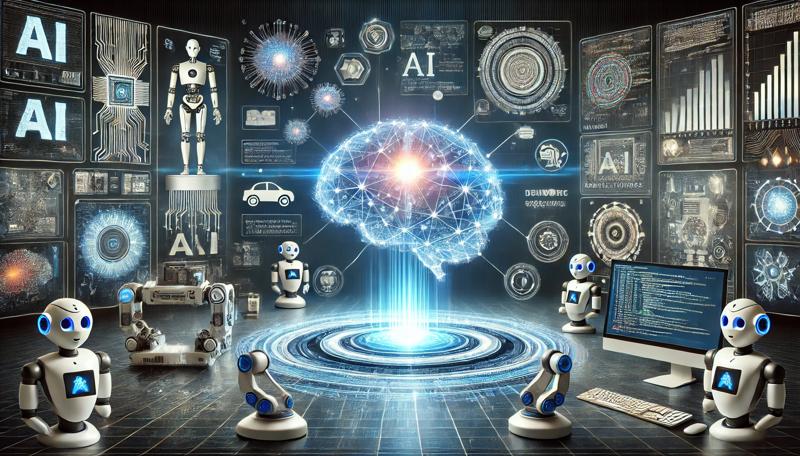
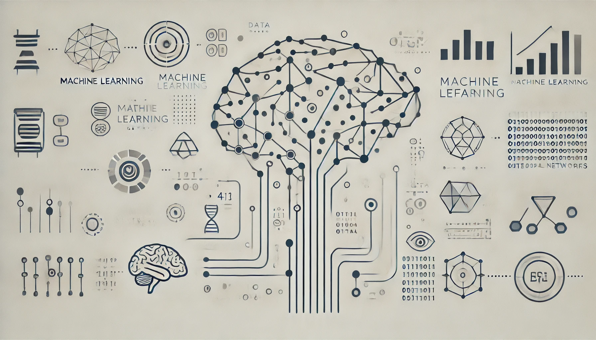
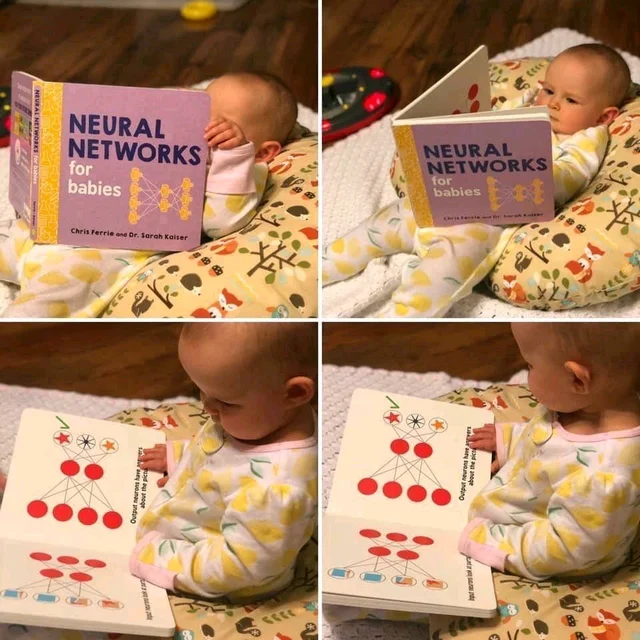
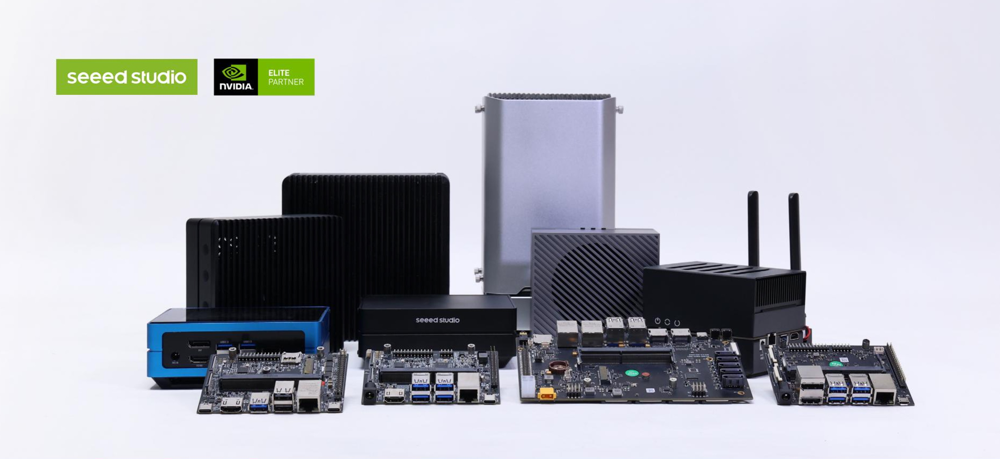

# AI and ML

Artificial Intelligence (AI) and Machine Learning (ML) are rapidly transforming the world, and Nvidia Jetson devices have become the preferred tools for AI and ML developers due to their powerful performance and flexibility. This article will provide a detailed introduction to the basics of AI and ML, the relationship and differences between them, and their practical applications. Additionally, it will delve into why Nvidia Jetson devices are recommended for AI and ML deployment, explaining their advantages and prerequisites.

  

## What is AI
Artificial Intelligence (AI) is a branch of computer science dedicated to creating systems capable of simulating and performing tasks that require human intelligence. AI encompasses a range of technologies from simple rule-based systems to complex neural networks, aiming to enable machines to learn, reason, perceive, and make decisions like humans. AI technologies include natural language processing, computer vision, robotics, and automation. Its applications are vast, from self-driving cars and smart assistants to medical diagnostic systems, AI is profoundly changing how we live and work.

Modern AI is typically categorized into the following types:
- **Weak AI (Narrow AI)**: Focuses on specific tasks such as speech recognition or image classification, exhibiting highly specialized intelligence.
- **Strong AI (General AI)**: Possesses broad intelligence, capable of understanding, learning, and adapting to different tasks and environments, similar to human intelligence.

AI systems process vast amounts of data using algorithms and models to extract patterns and regularities, enabling predictions and decision-making in new situations. Machine Learning (ML) and Deep Learning (DL) are primary methods of achieving AI. ML relies on data and statistical techniques, while DL is based on multi-layered neural networks.

With the continuous growth of computing power and data availability, AI technology has made significant advancements, offering immense transformative potential across various industries. In the future, AI will continue to evolve, driving innovation and economic growth while also presenting new challenges and ethical issues that require ongoing exploration and solutions.

  

## What is Machine Learning
Machine Learning (ML) is a subfield of Artificial Intelligence (AI) focused on developing algorithms and models that enable computer systems to learn and improve performance from data. Unlike traditional programming methods, machine learning analyzes large datasets to extract patterns and regularities, automatically generating decision rules and predictive models. This approach allows systems to perform tasks such as prediction, classification, and recognition based on data without explicit programming.

The core of machine learning includes three main categories:
- **Supervised Learning**: Involves training models using labeled datasets, allowing the system to learn from known input-output mappings. Common applications include image recognition, speech recognition, and predictive analytics.
- **Unsupervised Learning**: Involves training with unlabeled data, where the model learns by discovering patterns and structures within the data. Common applications include clustering analysis and dimensionality reduction.
- **Reinforcement Learning**: Involves learning optimal strategies through interaction with the environment and receiving feedback. It is commonly used in areas such as robotic control and game AI.

The success of machine learning depends on large amounts of high-quality data, powerful computing capabilities, and effective algorithm design. Through continuous iteration and optimization, machine learning systems can excel in handling complex tasks and are increasingly being widely applied across various industries.

  

## The Relationship and Difference Between AI and Machine Learning
Artificial Intelligence (AI) and Machine Learning (ML) are closely related but have distinct definitions and application areas. AI is a broad field aimed at creating systems capable of simulating human intelligence behaviors. These systems can perceive, reason, learn, and make decisions to solve complex problems. Machine Learning, on the other hand, is a primary method for achieving AI, focused on building intelligent systems through learning and improving performance from data.

Specifically, Machine Learning is a subset of AI that concentrates on developing algorithms and models that enable computer systems to learn from experience without explicit programming instructions. This means that Machine Learning is a crucial pathway for realizing and enhancing the intelligence of AI systems. By utilizing large-scale data and advanced algorithms, Machine Learning allows AI systems to handle complex tasks such as image recognition, speech recognition, and natural language processing.

The relationship between the two can be understood as follows: AI is an overarching framework that encompasses various technologies and methods, while Machine Learning is a key technique within this framework for achieving intelligence. As technology advances, Machine Learning plays an increasingly vital role in driving the development and application of AI.

## Applications of AI and machine learning
Artificial Intelligence (AI) and Machine Learning (ML) have extensive applications across various industries, transforming the way we work and live.

1. **Healthcare**: AI and ML are used for diagnosing diseases, predicting patient risks, personalizing treatment plans, and drug development. For example, AI can analyze medical images to detect early-stage cancer, and ML algorithms can identify potential health issues from electronic health records.

2. **Financial Services**: In finance, AI and ML are applied to risk management, fraud detection, automated trading, and customer service. AI systems can analyze market data in real time to provide investment advice, while ML models can detect unusual trading behavior to prevent fraud.

3. **Manufacturing**: AI and ML are used in manufacturing for predictive maintenance, quality control, and production optimization. By analyzing sensor data, AI can predict equipment failures, reducing downtime and increasing production efficiency.

4. **Retail**: Retailers use AI and ML for demand forecasting, personalized recommendations, and inventory management. AI algorithms can analyze consumer behavior to provide personalized product recommendations, enhancing customer satisfaction.

5. **Transportation**: Self-driving cars are a significant application of AI and ML. Using computer vision and deep learning algorithms, autonomous driving systems can perceive the environment and make driving decisions. Additionally, AI is used to optimize logistics and transportation routes, improving efficiency.

6. **Customer Service**: Chatbots and virtual assistants are typical applications of AI and ML in customer service. They can handle common inquiries and provide 24/7 support, greatly enhancing the customer experience.

7. **Entertainment and Media**: AI and ML play crucial roles in content recommendation, image and video recognition, and game development. Streaming platforms use ML algorithms to recommend movies and music that users might like, while AI can generate realistic game scenes and characters.

The rapid development of AI and ML technologies drives digital transformation across industries, enhancing efficiency and innovation capabilities. In the future, as these technologies continue to mature, AI and ML will demonstrate their immense potential in even more fields.

  

## What is the Nvidia Jetson Device
NVIDIA Jetson is a key player in the field of Artificial Intelligence (AI), representing a significant shift towards edge computing and deep learning. As a micro AI computer, it brings the powerful capabilities of modern AI into small, cost-effective, high-performance, and low-power devices, enabling enthusiasts, learners, and developers alike to easily utilize them. Developers can use Jetson devices to create innovative AI products across multiple industries.

What sets NVIDIA Jetson apart is its integration with NVIDIA JetPack, a comprehensive suite that includes the JetPack SDK, libraries, APIs, and tools for developing AI applications. This SDK is crucial as it aligns with NVIDIA's vision of democratizing AI development, ensuring that Jetson users have access to resources used throughout the entire NVIDIA ecosystem. The accessibility of these tools fosters a community of developers and learners who can innovate in fields such as computer vision, robotics, and speech processing without requiring substantial financial investment.

## Why Jetson
- **Modular Flexibility**: Whether for small businesses or large enterprises, the NVIDIA Jetson product line offers modules suited for every type of business. You can choose from a range of modules that are ideal for developing everything from entry-level AI applications to advanced, complex machines.

- **Unified Software**: NVIDIA Jetson supports a unified software architecture that simplifies the work of software developers. This unified approach eliminates the need for redundant coding when enhancing creations on different Jetson modules. The NVIDIA JetPack SDK includes the Linux operating system (OS), CUDA-accelerated libraries, and APIs for various machine learning domains, including deep learning and computer vision. It also supports machine learning frameworks like TensorFlow, PyTorch, Keras, and computer vision libraries such as OpenCV.

- **Support for Cloud-Native Technologies**: By supporting cloud-native technologies and workflows, such as orchestration and containerization, the NVIDIA Jetson platform provides developers with the flexibility to quickly develop or upgrade AI products.

- **Wide Application Scenarios**:
  - **Robotics**: Extensively used for object detection, navigation, and manipulation tasks in robotics.
  - **Smart Cities**: Applied in areas such as traffic monitoring, security surveillance, and infrastructure management.
  - **Healthcare**: Supports medical imaging and diagnostic applications.
  - **Edge AI**: Ideal for deploying AI models in resource-constrained environments for real-time inference.

## High-Performance NVIDIA Jetson Devices

  

| **Device Module** | **Description** | **Link** |
|:---------:|:---------:|:---------:|
| Jetson Orin Nano Dev Kit, Orin Nano 8GB, 40TOPS | Developer kit for NVIDIA Jetson Orin Nano | [Buy Here](https://www.seeedstudio.com/NVIDIAr-Jetson-Orintm-Nano-Developer-Kit-p-5617.html) |
| reComputer J4012, powered by Orin NX 16GB, 100 TOPS | Embedded computer powered by Orin NX| [Buy Here](https://www.seeedstudio.com/reComputer-J4012-p-5586.html) |
| reComputer J4011, powered by Orin NX 8GB, 70 TOPS | Embedded computer powered by Orin NX | [Buy Here](https://www.seeedstudio.com/reComputer-J4011-p-5585.html) |
| reComputer J3011, powered by Orin nano 8GB, 40 TOPS | Embedded computer powered by Orin Nano | [Buy Here](https://www.seeedstudio.com/reComputer-J3011-p-5590.html) |
 | reComputer J3011, powered by Orin nano 4GB, 20 TOPS | Embedded computer powered by Orin Nano | [Buy Here](https://www.seeedstudio.com/reComputer-J3010-p-5589.html) |
 
## Essential Knowledge and Prerequisites

To effectively work with NVIDIA Jetson devices and leverage their capabilities for AI and deep learning applications, you should have a solid foundation in the following areas:

1. **Mathematics Fundamentals**:
   - **Linear Algebra**: Key for understanding neural networks and optimizing algorithms through matrix and vector operations.
   - **Probability and Statistics**: Essential for model evaluation, hypothesis testing, and data analysis.
   - **Calculus**: Crucial for understanding gradient descent and optimization processes in algorithms.

2. **Programming Skills**:
   - **Python**: The most commonly used language for AI and machine learning development.
   - **Libraries and Frameworks**: Familiarity with libraries and frameworks such as TensorFlow, PyTorch, CUDA, JetPack SDK, TensorRT, and DeepStream is important for developing AI applications.

3. **Computer Science Fundamentals**:
   - **Data Structures and Algorithms**: Enhances code efficiency and helps in understanding algorithm complexity.
   - **Database Knowledge**: Essential for handling and managing large volumes of data.

4. **Machine Learning and AI Basics**:
   - **Supervised and Unsupervised Learning**: Understanding different learning methods and their applications.
   - **Deep Learning**: Knowledge of neural networks, Convolutional Neural Networks (CNNs), Recurrent Neural Networks (RNNs), and Transformer models.

5. **Hardware Knowledge**:
   - **Embedded Systems**: Understanding the principles of embedded devices and their operation.
   - **Hardware Specifications**: Familiarity with Jetson device parameters, including CPU, GPU, and memory specifications.

6. **System and Network Understanding**:
   - **Linux Systems**: Jetson devices typically run Ubuntu or other Linux distributions, so knowledge of Linux commands and system administration is crucial.

Meeting these prerequisites will help you effectively develop and deploy AI applications on NVIDIA Jetson devices and make the most of their powerful capabilities.

