# GPIO


## Introduction

The GPIO header on reComputer carrier boards is a versatile hardware interface designed to connect the AI compute module directly with external sensors and actuators. Featuring a pinout highly compatible with the Raspberry Pi ecosystem, it allows developers to easily integrate off-the-shelf electronics for rapid prototyping. Beyond basic digital input and output, these multiplexed pins can be configured to support standard communication protocols like I2C, SPI, UART, and PWM, enabling seamless hardware control for robotics and IoT projects using simple libraries such as `Jetson.GPIO`.


## reComputer J401
<details>
<summary>reComputer J401</summary>
`Jetson.GPIO` is NVIDIA's Python library for controlling the 40-pin GPIO header on Jetson devices. Its API is intentionally similar to `RPi.GPIO`, which makes it approachable for users coming from Raspberry Pi development.
### Install with `pip`

If the library is not preinstalled, the simplest method is:

```bash
sudo pip3 install Jetson.GPIO
```

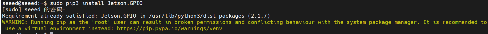

### Manual Installation

If you need to install the library from source:

```bash
mkdir -p /opt/seeed/development_guide/05_gpio
cd /opt/seeed/development_guide/05_gpio
git clone https://github.com/NVIDIA/jetson-gpio
cd jetson-gpio
sudo python3 setup.py install
```

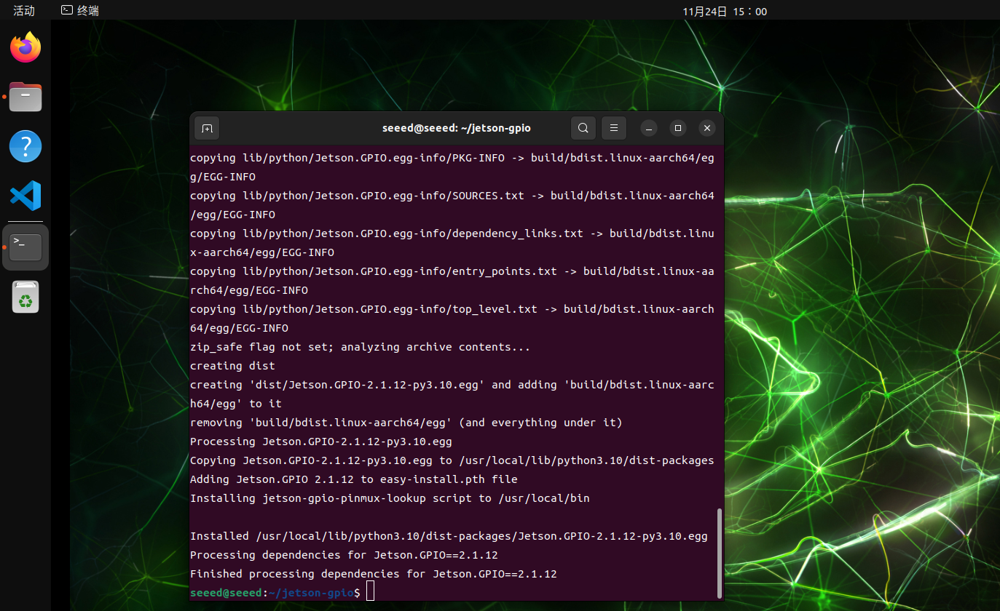

### User Permissions

Allow the current user to access GPIO:

```bash
sudo groupadd -f -r gpio
sudo usermod -a -G gpio seeed
```

Replace `seeed` with your actual username if needed.

### Udev Rule

Copy the rule file and reload udev:

```bash
cd /opt/seeed/development_guide/05_gpio/jetson-gpio
sudo cp lib/python/Jetson/GPIO/99-gpio.rules /etc/udev/rules.d/
sudo udevadm control --reload-rules
sudo udevadm trigger
```

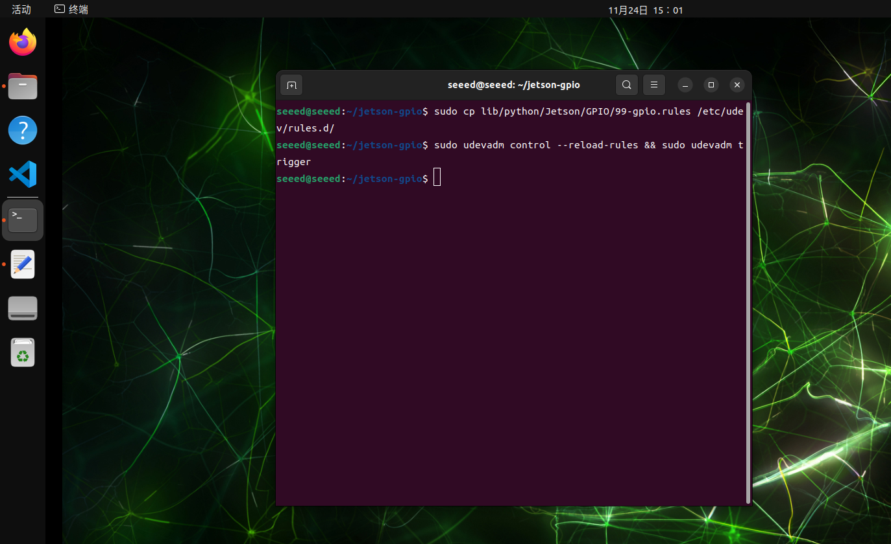

### JetPack 6.2 Compatibility Note

On some JetPack 6.2 setups, you may need to export the model name before using the library:

```bash
export JETSON_MODEL_NAME=JETSON_ORIN_NANO
```

### 40 pin 

GPIO stands for General Purpose Input/Output. These pins let software read external digital signals or drive simple peripherals such as LEDs, buttons, buzzers, and control lines.

### Numbering Modes

The `Jetson.GPIO` library supports two common numbering schemes:

| Mode    | Description                                                  | Typical Use                                                  |
| ------- | ------------------------------------------------------------ | ------------------------------------------------------------ |
| `BOARD` | Numbers pins by their physical location on the 40-pin header | Best when you are wiring directly from the header silkscreen or a pinout diagram |
| `BCM`   | Numbers pins by the GPIO mapping used by the library         | Best when you are following Python GPIO examples that refer to logical GPIO IDs |

### `GPIO.BOARD` Layout

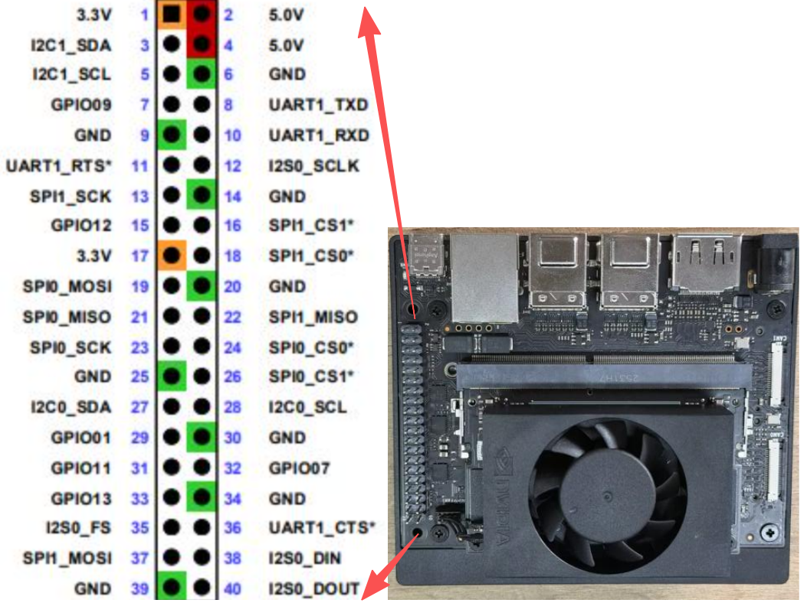

### `GPIO.BCM` Layout

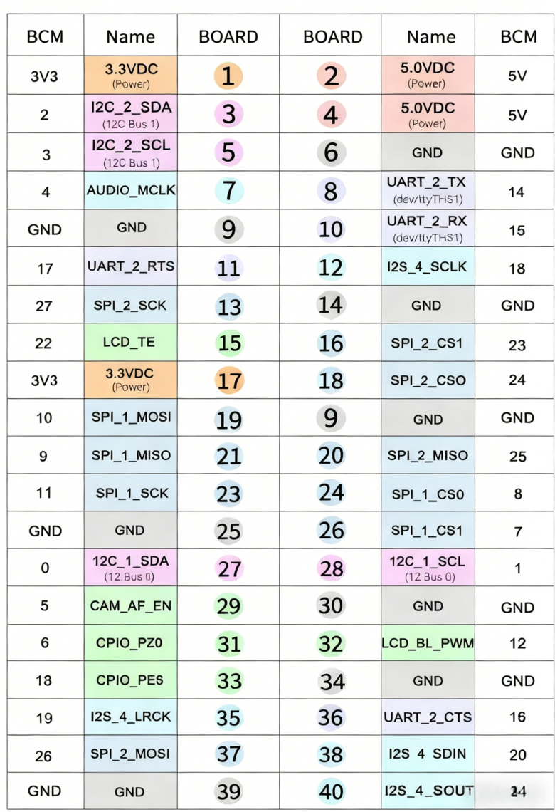

### Example Pin Reference

The image below shows an additional pin-reference example that is useful before testing input or output functions.

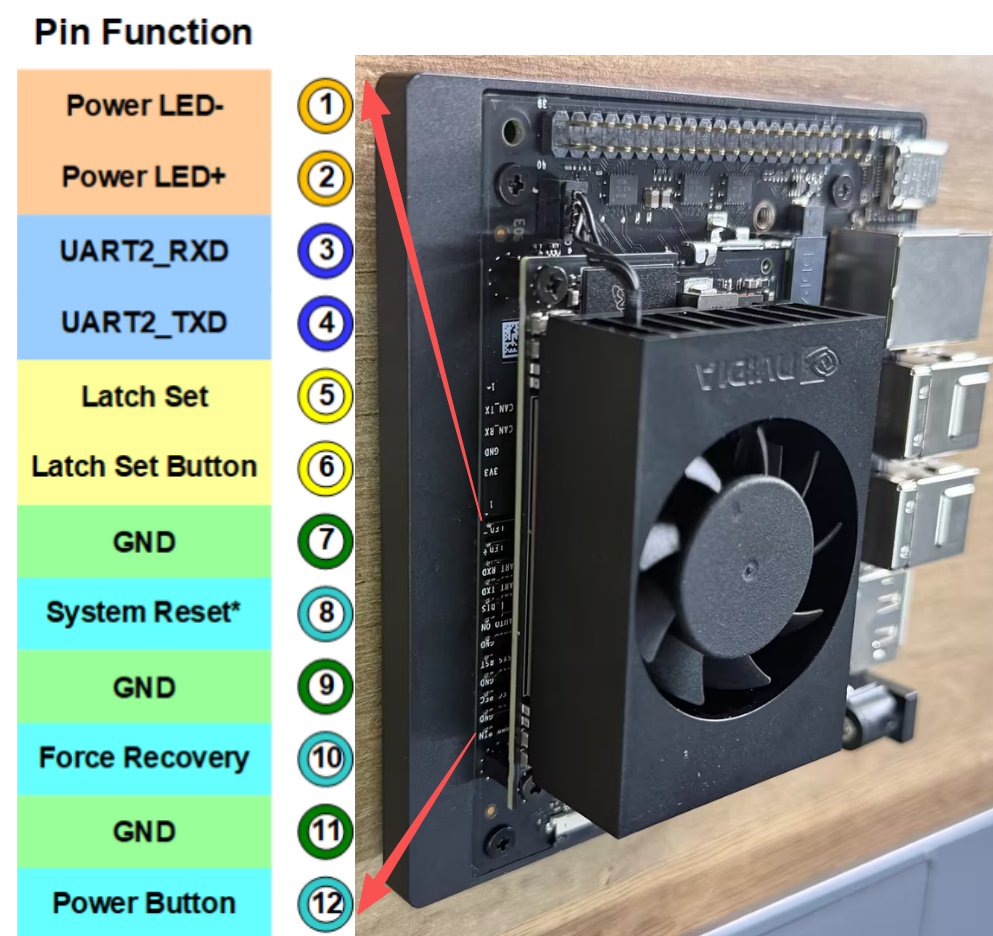

### GPIO Input

This section shows how to read a GPIO input on Jetson by connecting a test pin to `GND` and `3.3V` and observing the input state in software.

#### Hardware Connection

Use jumper wires to connect the header pins as shown below. A simple test method is to connect `GPIO.BOARD 12` to `GND` first.

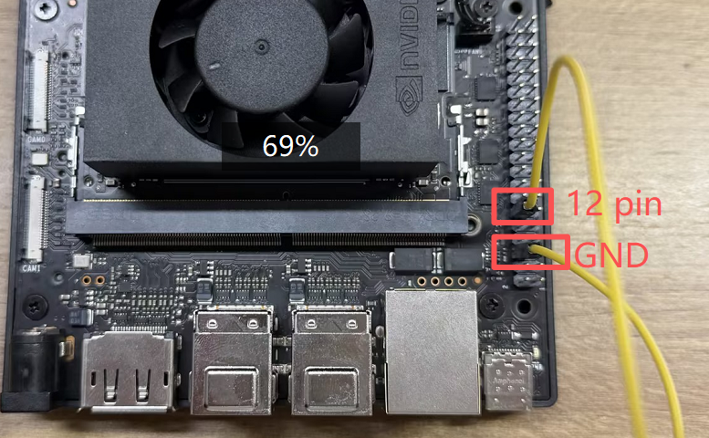

> Caution: Double-check the pin mapping before wiring. Incorrect connections can short the board.

#### Read the Signal

Run the sample script from the `jetson-gpio` examples:

```bash
cd /opt/seeed/development_guide/05_gpio/jetson-gpio/samples
sudo python3 simple_input.py
```


If the result matches the expected low level, reconnect the test pin from `GND` to `3.3V` and run the script again:

```bash
cd /opt/seeed/development_guide/05_gpio/jetson-gpio/samples
export JETSON_MODEL_NAME=JETSON_ORIN_NANO
python3 simple_input.py
```


The terminal output should now report a high-level signal.


### GPIO Output

#### Introduction

On JetPack 6.2, many pins that previously supported both input and output may behave as input-only until the pinmux is adjusted. This page introduces two practical ways to restore output behavior on supported pins:

1. A temporary `busybox devmem` method
2. A more persistent device-tree overlay method

#### Method 1: Temporary Output with `busybox`

**Step 1: Query the Pinmux Register**

Use `jetson-gpio-pinmux-lookup` to find the register address for a header pin:

```bash
jetson-gpio-pinmux-lookup 31
```

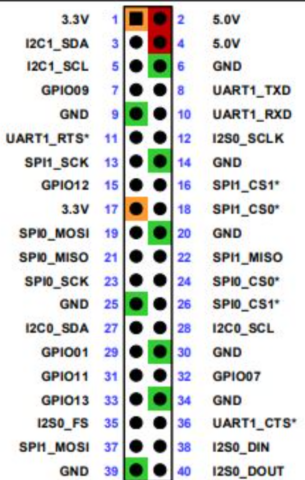

The example below shows the returned register value for pin 31.


**Step 2: Configure Output Mode**

Install `busybox` if needed:

```bash
sudo apt install busybox
```

Then write the pinmux register value:

```bash
sudo busybox devmem 0x02430070 w 0x004
```


**Step 3: Run the Output Test**

Update the sample script to use the correct BCM pin for your test case, then run it:


```bash
cd /opt/seeed/development_guide/05_gpio/jetson-gpio/samples
export JETSON_MODEL_NAME=JETSON_ORIN_NANO
python3 simple_out.py
```


You can verify the output level change with a multimeter or oscilloscope.

#### Method 2: Device-Tree Overlay

This method is better if you want the pin configuration to persist.

Clone the helper project and edit the DTS file:

```bash
cd /opt/seeed/development_guide/05_gpio/jetson-gpio
git clone https://github.com/jetsonhacks/jetson-orin-gpio-patch.git
cd jetson-orin-gpio-patch
vim pin7_as_gpio.dts
```


Adjust the pin definition for the GPIO you want to change, then build the overlay:

```bash
dtc -O dtb -o pin7_as_gpio.dtbo pin7_as_gpio.dts
sudo cp pin7_as_gpio.dtbo /boot
sudo /opt/nvidia/jetson-io/jetson-io.py
```

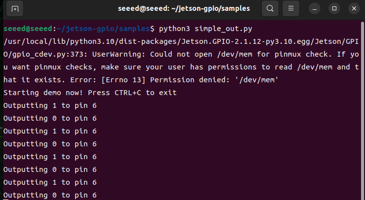

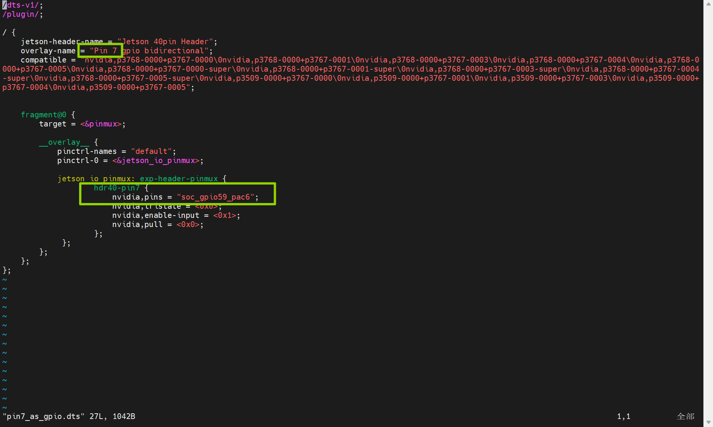

After the overlay is enabled, use the known BCM pin number in the test script.

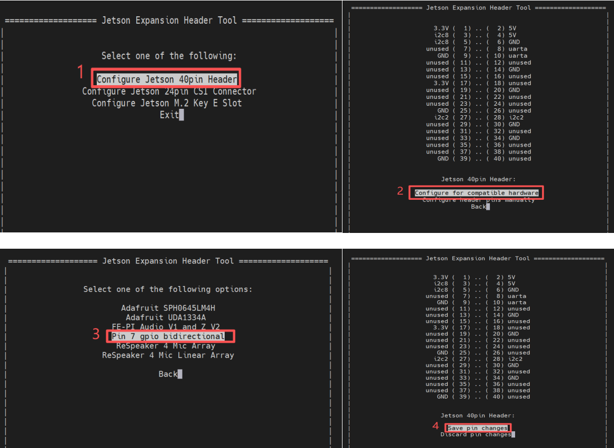

Run the output test again:

```bash
cd /opt/seeed/development_guide/05_gpio/jetson-gpio/samples
python3 simple_out.py
```


## References

- https://github.com/NVIDIA/jetson-gpio/issues/120
- https://docs.nvidia.com/jetson/archives/r36.4.3/DeveloperGuide/HR/JetsonModuleAdaptationAndBringUp/JetsonOrinNxNanoSeries.html
- https://developer.nvidia.com/embedded/downloads#?search=pinmux
- https://github.com/NVIDIA/jetson-gpio

</details>


## reComputer Super J401
<details>
<summary>reComputer Super J401</summary>

### Introduction

GPIO stands for General Purpose Input/Output. These pins let software read external digital signals or drive simple peripherals such as LEDs, buttons, buzzers, and control lines. The reComputer Super features a 40-pin extension header that provides access to GPIO pins, allowing for easy integration with external devices.

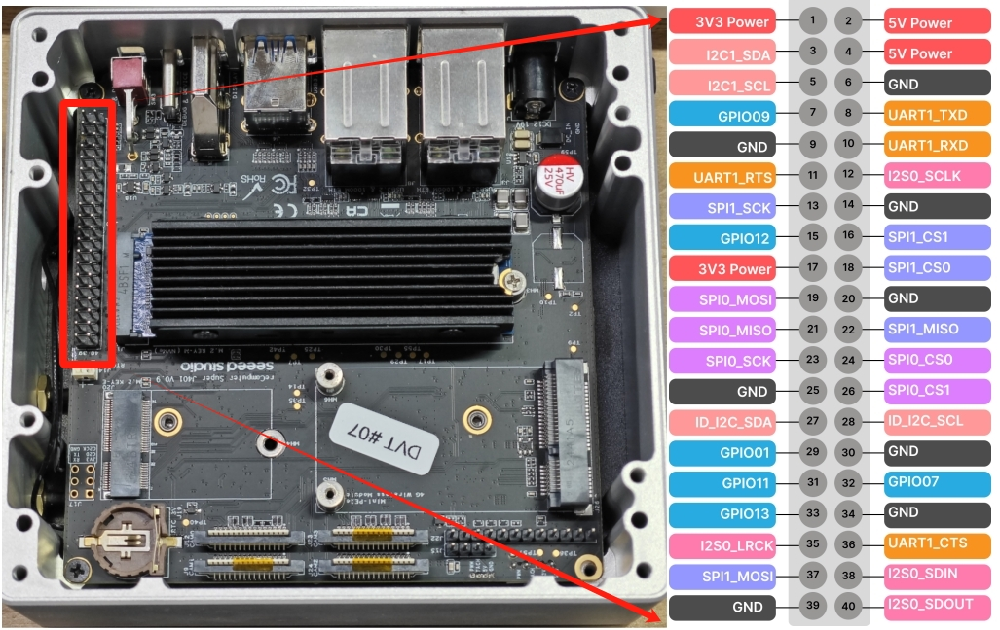

### Hardware Connection

The reComputer Super features a 40-pin extension header that provides access to GPIO pins. To use the GPIO pins, you need to connect external devices to the appropriate pins on this header.

### 40-Pin Header Pinout

The detail of 40-pin header is shown below:

<div class="table-center">
<table style={{textAlign: 'center'}}>
<thead>
<tr>
  <th>Header Pin</th>
  <th>Signal</th>
  <th>BGA Pin</th>
  <th>Default Function</th>
</tr>
</thead>
<tbody>
<tr><td>1</td><td>3.3V</td><td>-</td><td>Main 3.3V Supply</td></tr>
<tr><td>2</td><td>5V</td><td>-</td><td>Main 5V Supply</td></tr>
<tr><td>3</td><td>I2C1_SDA</td><td>PDD.02</td><td>I2C #1 Data</td></tr>
<tr><td>4</td><td>5V</td><td>-</td><td>Main 5V Supply</td></tr>
<tr><td>5</td><td>I2C1_SCL</td><td>PDD.01</td><td>I2C #1 Clock</td></tr>
<tr><td>6</td><td>GND</td><td>-</td><td>Ground</td></tr>
<tr><td>7</td><td>GPIO09</td><td>PAC.06</td><td>General Purpose I/O</td></tr>
<tr><td>8</td><td>UART1_TXD</td><td>PR.02</td><td>UART #1 Transmit</td></tr>
<tr><td>9</td><td>GND</td><td>-</td><td>Ground</td></tr>
<tr><td>10</td><td>UART1_RXD</td><td>PR.03</td><td>UART #1 Receive</td></tr>
<tr><td>11</td><td>UART1_RTS</td><td>PR.04</td><td>UART #1 Request to Send</td></tr>
<tr><td>12</td><td>I2S0_SCLK</td><td>PH.07</td><td>Audio I2S #0 Clock</td></tr>
<tr><td>13</td><td>SPI1_SCK</td><td>PY.00</td><td>SPI #1 Clock</td></tr>
<tr><td>14</td><td>GND</td><td>-</td><td>Ground</td></tr>
<tr><td>15</td><td>GPIO12</td><td>PN.01</td><td>General Purpose I/O</td></tr>
<tr><td>16</td><td>SPI1_CS1</td><td>PY.04</td><td>SPI #1 Chip Select #1</td></tr>
<tr><td>17</td><td>3.3V</td><td>-</td><td>Main 3.3V Supply</td></tr>
<tr><td>18</td><td>SPI1_CS0</td><td>PY.03</td><td>SPI #1 Chip Select #0</td></tr>
<tr><td>19</td><td>SPI0_MOSI</td><td>PZ.05</td><td>SPI #0 Master Out / Slave In</td></tr>
<tr><td>20</td><td>GND</td><td>-</td><td>Ground</td></tr>
<tr><td>21</td><td>SPI0_MISO</td><td>PZ.04</td><td>SPI #0 Master In / Slave Out</td></tr>
<tr><td>22</td><td>SPI1_MISO</td><td>PY.01</td><td>SPI #1 Master In / Slave Out</td></tr>
<tr><td>23</td><td>SPI0_SCK</td><td>PZ.03</td><td>SPI #0 Clock</td></tr>
<tr><td>24</td><td>SPI0_CS0</td><td>PZ.06</td><td>SPI #0 Chip Select #0</td></tr>
<tr><td>25</td><td>GND</td><td>-</td><td>Ground</td></tr>
<tr><td>26</td><td>SPI0_CS1</td><td>PZ.07</td><td>SPI #0 Chip Select #1</td></tr>
<tr><td>27</td><td>ID_I2C_SDA (I2C0_SDA)</td><td>PDD.00</td><td>I2C #0 Data</td></tr>
<tr><td>28</td><td>ID_I2C_SCL (I2C0_SCL)</td><td>PCC.07</td><td>I2C #0 Clock</td></tr>
<tr><td>29</td><td>GPIO01</td><td>PQ.05</td><td>General Purpose I/O</td></tr>
<tr><td>30</td><td>GND</td><td>-</td><td>Ground</td></tr>
<tr><td>31</td><td>GPIO11</td><td>PQ.06</td><td>General Purpose I/O</td></tr>
<tr><td>32</td><td>GPIO07</td><td>PG.06</td><td>General Purpose I/O</td></tr>
<tr><td>33</td><td>GPIO13</td><td>PG.00</td><td>System Reserved</td></tr>
<tr><td>34</td><td>GND</td><td>-</td><td>Ground</td></tr>
<tr><td>35</td><td>I2S0_LRCK (I2S0_FS)</td><td>PI.02</td><td>Audio I2S #0 Frame Sync</td></tr>
<tr><td>36</td><td>UART1_CTS</td><td>PR.05</td><td>UART #1 Clear to Send</td></tr>
<tr><td>37</td><td>SPI1_MOSI</td><td>PY.02</td><td>SPI #1 Master Out / Slave In</td></tr>
<tr><td>38</td><td>I2S0_SDIN (I2S0_DIN)</td><td>PI.01</td><td>Audio I2S #0 Data In</td></tr>
<tr><td>39</td><td>GND</td><td>-</td><td>Ground</td></tr>
<tr><td>40</td><td>I2S0_SDOUT (I2S0_DOUT)</td><td>PI.00</td><td>Audio I2S #0 Data Out</td></tr>
</tbody>
</table>
</div>


### GPIO Library Installation

### Numbering Modes

The `Jetson.GPIO` library supports two common numbering schemes:

| Mode    | Description                                                  | Typical Use                                                  |
| ------- | ------------------------------------------------------------ | ------------------------------------------------------------ |
| `BOARD` | Numbers pins by their physical location on the 40-pin header | Best when you are wiring directly from the header silkscreen or a pinout diagram |
| `BCM`   | Numbers pins by the GPIO mapping used by the library         | Best when you are following Python GPIO examples that refer to logical GPIO IDs |

### GPIO Usage Examples

#### Basic GPIO Output

```python
import Jetson.GPIO as GPIO
import time

# Set GPIO mode
GPIO.setmode(GPIO.BOARD)

# Define pin
output_pin = 12

# Set up the pin
GPIO.setup(output_pin, GPIO.OUT)

try:
    while True:
        # Turn on the pin
        GPIO.output(output_pin, GPIO.HIGH)
        time.sleep(1)
        # Turn off the pin
        GPIO.output(output_pin, GPIO.LOW)
        time.sleep(1)
except KeyboardInterrupt:
    # Clean up
    GPIO.cleanup()
```

#### Basic GPIO Input

```python
import Jetson.GPIO as GPIO
import time

# Set GPIO mode
GPIO.setmode(GPIO.BOARD)

# Define pin
input_pin = 11

# Set up the pin
GPIO.setup(input_pin, GPIO.IN)

try:
    while True:
        # Read the pin value
        value = GPIO.input(input_pin)
        print(f"Pin value: {value}")
        time.sleep(0.5)
except KeyboardInterrupt:
    # Clean up
    GPIO.cleanup()
```

### Super-Specific GPIO Features

The reComputer Super's 40-pin header provides access to a range of GPIO pins, allowing for flexible integration with external devices. This makes it ideal for a variety of applications, including:

- Controlling LEDs and other indicators
- Reading button presses and sensor inputs
- Controlling motors and actuators
- Interfacing with other microcontrollers and devices

### Safety Precautions

- Always double-check pin connections before applying power
- Use appropriate resistors when connecting LEDs and other components
- Avoid short-circuiting GPIO pins
- Be mindful of the maximum current rating for GPIO pins

### Further Reading

- [Jetson.GPIO Library Documentation](https://github.com/NVIDIA/jetson-gpio)
- [reComputer Super Hardware and Interfaces Usage](https://wiki.seeedstudio.com/recomputer_jetson_super_hardware_interfaces_usage/)

</details>


## Seeed Jetson AGX Orin Kit
<details>
<summary>Seeed Jetson AGX Orin Kit</summary>

## Introduction
The Seeed Jetson AGX Orin Kit includes a 40-pin (2 × 20, 2.54 mm pitch) expansion header (J30).


## 40-Pin Header Pinout

 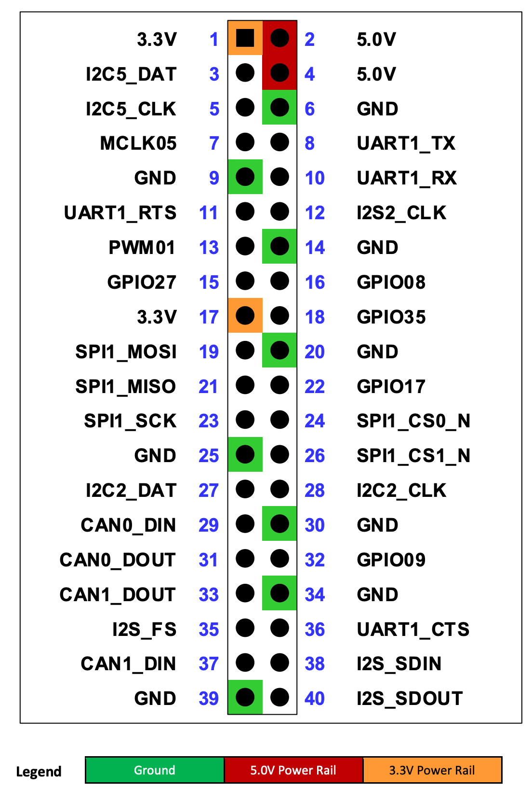


The 40-pin expansion connector includes various audio and control interfaces including:

- Audio: I2S, Digital Mic, Clock and Control

- I2C (2x), SPI, UART, CAN, and PWM (2x)
- GPIOs (dedicated as well as shared with other interface pins)

All the signal pins are 3.3V level.

> Note: Many of the signals at the 40-pin Expansion Header come from TI TXB0108 level translators. Due to the design of these devices, the output drivers are very weak so they can be overdriven by another connected device output for bidirectional support. The signals associated with these buffers have a “3” in the note column of following table. See the Jetson Nano Developer Kit 40-pin Expansion Header GPIO Usage Considerations Application Note for more information.


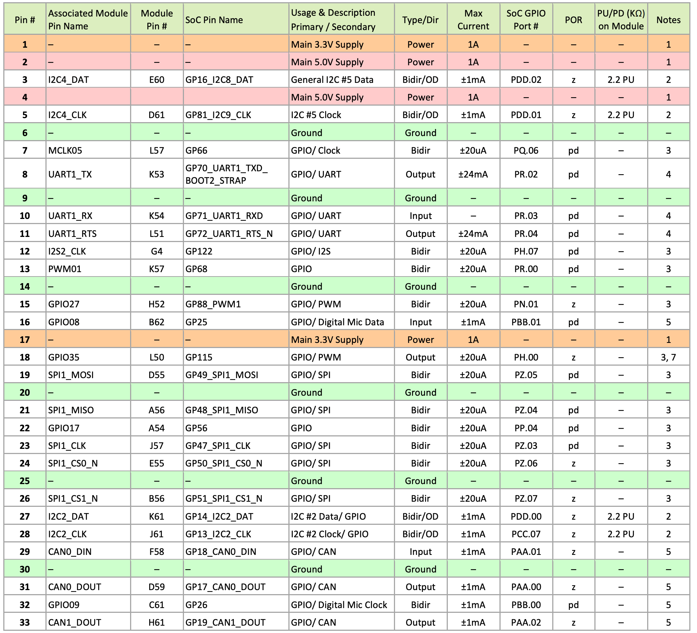

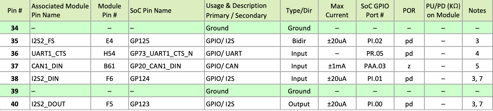

> Notes: 
>
> 1. This is current capability per power pin.
> 2. These pins connect to the SoC through a FXMA2102L8X level shifter. They are open-drain (either pulled up, or driven low by the SoC when configured as outputs). The max drive that meets the data sheet VOL is 1mA. 
> 3. See related note above table. 
> 4. These pins connect to a SN74LVC4T245 buffer. 
> 5. These pins are directly connected to the SoC. The max drive that meets full data sheet VOL/VOH is 1mA. 
> 6. For power-on default, “pd” = SoC Internal Pull-down, “pu” - SoC Internal pull-up, and “z” – Tristate 
> 7. In the Type/Dir column, Output is to expansion header. Input is from expansion header. Bidir is for bidirectional signals. 
> 8. The direction indicated matches that indicated in the reference design schematics. These signals support GPIO functionality and can be bidirectional.


## Automation Header

The Seeed Jetson AGX Orin Kit includes a 12-pin, 2.54 mm pitch header (J42) that makes accessible several critical system control signals. 

- pin #1, #12: GND
- pin #2, #3, #4: Input, same function as three buttons: Recovery, Reset, Power.
- pin #5-#6: Open: Auto Power-On disable; Short: Auto Power-On enable.
- pin #7: CVB_STBY: output, indicating module is in sleep or not.
- pin #8: SYSTEM_OC: input, to trigger Tegra throttling.
- pin #9-#10: Open: Wake(Boot) on LAN from Off state is disabled; Short: Wake(Boot) on LAN from Off state is enable.
- pin #11: JTAG_TRST, JTAG Test Reset.


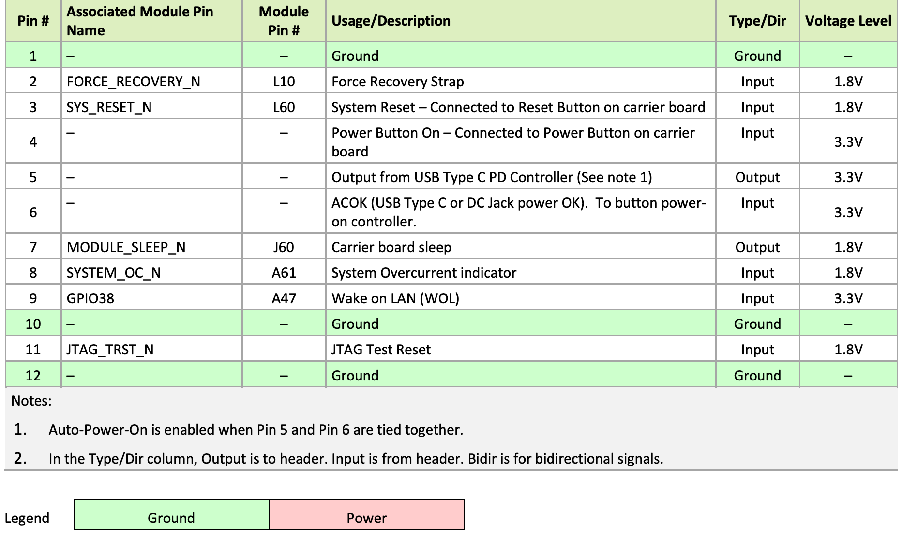

</details>