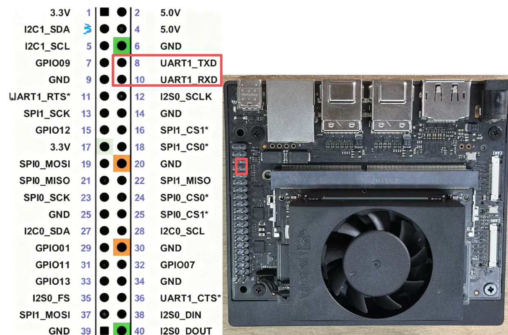
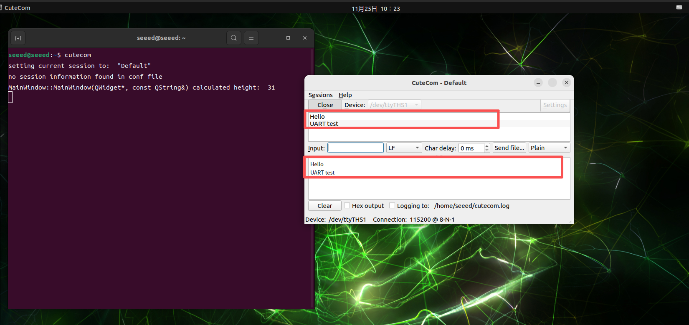

# 3.30 UART Serial Communication

> [!IMPORTANT]
> This page is intended for the Seeed `reComputer J401` carrier-board family, such as [`reComputer J4012`](https://www.seeedstudio.com/reComputer-J4012-p-5586.html). UART pin exposure and serial-device names can vary across different Jetson boards.

## Introduction

UART is a simple serial communication interface that is often used to connect MCUs, GPS modules, serial sensors, and upper-computer tools. On the 40-pin header, it is a convenient way to test point-to-point serial communication.

## Hardware Connection

For a loopback test, connect pin 8 and pin 10 with a jumper wire.



## Serial Test with `cutecom`

Install and launch `cutecom`:

```bash
sudo apt update
sudo apt install cutecom -y
sudo cutecom
```

Open `/dev/ttyTHS1` in `cutecom`, type data into the input field, and verify that the transmitted data is received back through the loopback connection.



> If `/dev/ttyTHS1` cannot be opened, you can temporarily adjust permissions with `sudo chmod 666 /dev/ttyTHS1`.
