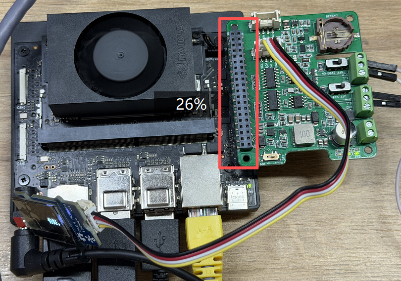
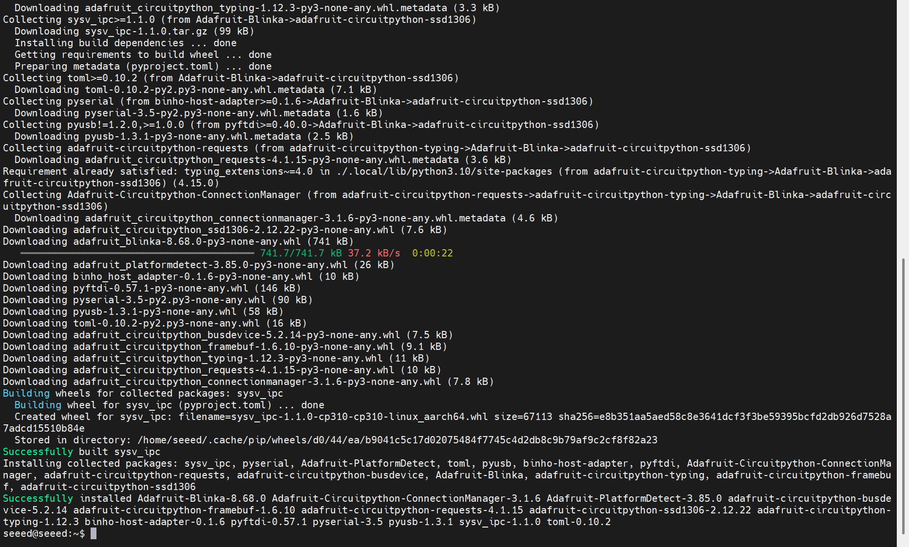
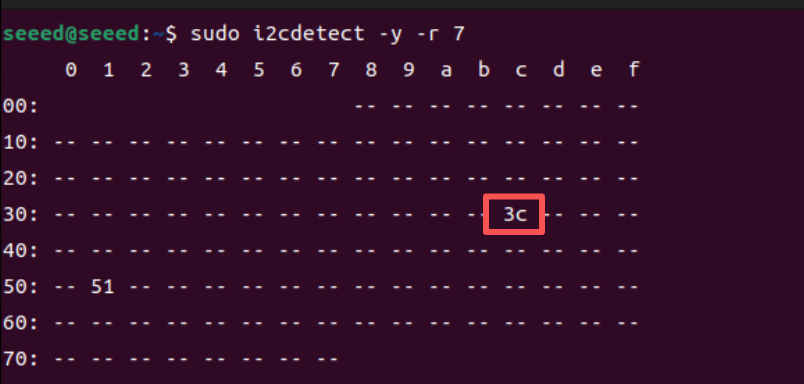

# 3.31 I2C Communication

> [!IMPORTANT]
> This page is intended for the Seeed `reComputer J401` carrier-board family, such as [`reComputer J4012`](https://www.seeedstudio.com/reComputer-J4012-p-5586.html). I2C bus numbering, header mapping, and connected accessories may differ on other Jetson carrier boards.

## Introduction

I2C is a two-wire communication bus that uses `SCL` and `SDA` for clock and data. It is widely used for displays, sensors, EEPROMs, and other low-speed peripherals.

## Hardware Requirements

- J401-based Jetson device
- Grove OLED display
- Compatible adapter board or shield
- Grove cable

## Hardware Connection

Connect the accessory to the 40-pin header or the corresponding adapter board as shown below.



## Install Dependencies

```bash
sudo apt update
sudo apt install python3-pil python3-dev fonts-noto-cjk
pip3 install luma.oled
```



## Scan the I2C Bus

Use `i2cdetect` to confirm that the peripheral is visible on the bus:

```bash
sudo i2cdetect -y -r 7
```



If the display is detected successfully, you should see its device address in the scan result, such as `0x3c`.

## Example Test Script

Create a script:

```bash
nano test_i2c.py
```

Paste the following example:

```python
import time
from luma.core.interface.serial import i2c
from luma.oled.device import ssd1306
from PIL import Image, ImageDraw, ImageFont

I2C_BUS = 7
I2C_ADDR = 0x3C
serial = i2c(port=I2C_BUS, address=I2C_ADDR)
device = ssd1306(serial)
device.clear()

FONT_PATH = "/usr/share/fonts/opentype/noto/NotoSansCJK-Regular.ttc"
font = ImageFont.truetype(FONT_PATH, 16)

text = "Jetson I2C test scrolling text    "
bbox = font.getbbox(text)
text_width = bbox[2] - bbox[0]
text_height = bbox[3] - bbox[1]
scroll_pos = device.width

while True:
    img = Image.new("1", (device.width, device.height))
    draw = ImageDraw.Draw(img)
    draw.text((scroll_pos, (device.height - text_height) // 2), text, font=font, fill=255)
    device.display(img)
    scroll_pos -= 2
    if scroll_pos + text_width < 0:
        scroll_pos = device.width
    time.sleep(0.05)
```

Run the script:

```bash
python3 test_i2c.py
```
