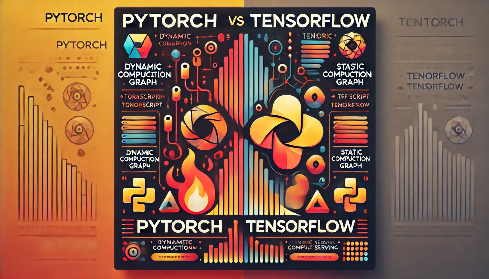
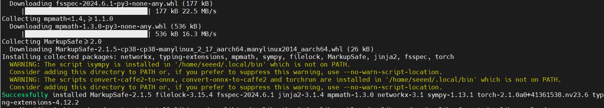
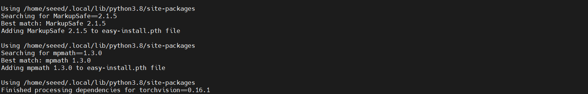
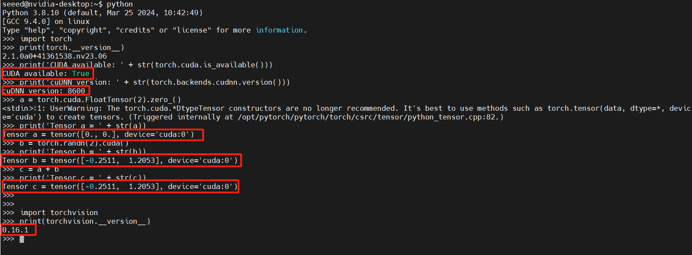

# Pytorch and Tensorflow

## Introduction
In the field of deep learning, PyTorch and TensorFlow are two of the most popular frameworks. While both are used for building and training neural networks, they have different histories and design philosophies. In this tutorial, we will explore the relationship and development history of PyTorch and TensorFlow, and delve into their features and connections. We will also provide a step-by-step guide on installing PyTorch on the [reComputer J3010](https://www.seeedstudio.com/reComputer-J3010-p-5589.html) and basic usage of PyTorch.

<p align="center">
  <a href="https://www.python.org/">
    
  </a>
</p>

## History of PyTorch

PyTorch was developed by Facebook's Artificial Intelligence Research (FAIR) lab and was officially released in 2016. Its predecessor was the Torch framework developed in the Lua language. PyTorch is an open-source deep learning library designed to provide flexibility and ease of use, making it particularly suitable for research and development. Here are some key milestones in the development of PyTorch:

- **January 2016**: PyTorch was officially released, quickly attracting researchers with its dynamic computation graph and ease of debugging.
- **December 2017**: PyTorch 0.3 was released, introducing 0-dim tensors and support for distributed training.
- **May 2018**: The preview version of PyTorch 1.0 was released, integrating features from Caffe2, making it more suitable for production environments.
- **December 2019**: PyTorch 1.4 was released, introducing the new TorchServe module for model deployment.
- **September 2020**: PyTorch 1.6 was released, further improving distributed training and quantization support.
- **May 2021**: PyTorch 1.8 was released, introducing new features for mobile deployment and performance optimization.
- **December 2021**: PyTorch 1.10 was released, enhancing distributed data parallelism and mixed precision training.
- **April 2022**: PyTorch 1.11 was released, adding support for Apple Silicon and improving automatic mixed precision (AMP) and TorchScript.
- **June 2023**: PyTorch 2.0 was released, further optimizing performance, enhancing support for training and inference of deep learning models, and introducing more advanced APIs.

## History of TensorFlow

TensorFlow, developed by Google Brain, is an open-source machine learning library that was officially released in November 2015. It is designed to facilitate the development and deployment of machine learning models, especially deep learning models. Here are some key milestones in the development of TensorFlow:

- **November 2015**: TensorFlow was officially released, providing a robust framework for machine learning and deep learning applications.
- **March 2016**: TensorFlow 0.7 was released, introducing significant improvements and additional features.
- **December 2016**: TensorFlow 1.0 was released, marking a major milestone with stability improvements and comprehensive documentation.
- **August 2017**: TensorFlow 1.4 was released, adding support for new functionalities, including TensorBoard for visualization and TensorFlow Lite for mobile and embedded devices.
- **March 2018**: TensorFlow 1.8 was released, with enhanced support for distributed training and improved performance.
- **August 2018**: TensorFlow 2.0 was introduced as a major update, featuring simplified APIs, eager execution, and better integration with Keras for easier model building and training.
- **February 2019**: TensorFlow 2.1 was released, bringing additional improvements and new features, including enhanced support for Keras and TensorFlow Hub.
- **October 2019**: TensorFlow 2.2 was released, with enhancements for deployment and new APIs for performance optimization.
- **May 2020**: TensorFlow 2.3 was released, introducing new features and optimizations for better performance and usability.
- **August 2020**: TensorFlow 2.4 was released, with improvements in compatibility, performance, and new functionalities.
- **December 2021**: TensorFlow 2.7 was released, focusing on performance enhancements and new features for model deployment and scaling.
- **June 2022**: TensorFlow 2.8 was released, with updates to improve performance, usability, and integration with other tools and libraries.
- **March 2023**: TensorFlow 2.11 was released, continuing the trend of performance optimization and adding new features for more efficient model training and deployment.

## Main Features of PyTorch and TensorFlow

**PyTorch's Main Features**

1. **Dynamic Computation Graphs**: PyTorch uses dynamic computation graphs, allowing users to change the network structure at runtime. This makes debugging and development particularly convenient.
2. **Flexibility**: Due to its dynamic nature, PyTorch excels in handling complex models and custom operations, making it well-suited for research and rapid prototyping.
3. **Community Support**: PyTorch has an active community providing numerous tutorials, examples, and third-party libraries.
4. **TorchScript**: Allows users to convert PyTorch code into a static graph for optimization and deployment.

**TensorFlow's Main Features**

1. **Static Computation Graphs**: TensorFlow uses static computation graphs, offering higher performance and optimization potential, especially suited for large-scale production environments.
2. **End-to-End Platform**: TensorFlow provides full support from training to deployment, including TensorFlow Lite, TensorFlow.js, and TensorFlow Serving.
3. **High Performance**: Through the XLA compiler and various hardware accelerators (such as TPUs), TensorFlow can achieve efficient model training and inference.
4. **Keras Integration**: Starting with TensorFlow 2.0, Keras has become its high-level API, simplifying the model building process.

**Relationship Between PyTorch and TensorFlow**

Despite being competitors, PyTorch and TensorFlow share many similarities and have influenced each other. Here are some key points of their relationship:

- **Design Philosophy**: PyTorch focuses on flexibility and dynamic computation graphs, making it suitable for research and prototyping. In contrast, TensorFlow emphasizes performance and static computation graphs, which are ideal for production environments. TensorFlow 2.0 introduced Eager Execution mode, which partially draws from PyTorch's design philosophy.

- **Community and Ecosystem**: Both frameworks boast large communities and rich ecosystems, offering numerous models and tools. TensorFlow's TensorFlow Hub and PyTorch's PyTorch Hub are excellent platforms for sharing pre-trained models.

- **Interoperability**: Both frameworks are continually improving their interoperability. For instance, the ONNX (Open Neural Network Exchange) format allows model conversion between PyTorch and TensorFlow, enhancing compatibility and collaboration between the two.

## Installing PyTorch on reComputer J3010

### Set Up Your Environment

- JetPack 5/6:
    Make sure you have NVIDIA JetPack 5 or 6 installed on your reComputer J3010. JetPack includes the necessary libraries and tools for developing on NVIDIA Jetson platforms.

- CUDA:
    Verify that CUDA is installed and properly configured. PyTorch relies on CUDA for GPU acceleration. Ensure that the CUDA version installed is compatible with the PyTorch version you plan to install. 

### Installing PyTorch Using a .whl File
To install PyTorch on your reComputer J3010 with the specified JetPack and CUDA versions, follow these steps:

#### 1. Download the PyTorch Wheel File

Choose the correct wheel file based on your JetPack and CUDA version:

- **JetPack 6.0 (L4T R36.2 / R36.3) + CUDA 12.2**:
  - [PyTorch 2.3](https://nvidia.box.com/shared/static/mp164asf3sceb570wvjsrezk1p4ftj8t.whl)

- **JetPack 6.0 (L4T R36.2 / R36.3) + CUDA 12.4**:
  - [PyTorch 2.3](https://nvidia.box.com/shared/static/zvultzsmd4iuheykxy17s4l2n91ylpl8.whl)

- **JetPack 6.0 DP (L4T R36.2.0)**:
  - [PyTorch 2.2.0](https://developer.download.nvidia.cn/compute/redist/jp/v60dp/pytorch/torch-2.2.0a0+6a974be.nv23.11-cp310-cp310-linux_aarch64.whl)
  - [PyTorch 2.1.0](https://nvidia.box.com/shared/static/0h6tk4msrl9xz3evft9t0mpwwwkw7a32.whl)

- **JetPack 5.x**:
  - **JetPack 5.1 (L4T R35.2.1) / JetPack 5.1.1 (L4T R35.3.1) / JetPack 5.1.2 (L4T R35.4.1)**:
    - [PyTorch 2.1.0](https://developer.download.nvidia.cn/compute/redist/jp/v512/pytorch/torch-2.1.0a0+41361538.nv23.06-cp38-cp38-linux_aarch64.whl)
  - **JetPack 5.1 (L4T R35.2.1) / JetPack 5.1.1 (L4T R35.3.1)**:
    - [PyTorch 2.0.0](https://nvidia.box.com/shared/static/i8pukc49h3lhak4kkn67tg9j4goqm0m7.whl)
    - [PyTorch 1.14.0](https://developer.download.nvidia.com/compute/redist/jp/v51/pytorch/torch-1.14.0a0+44dac51c.nv23.02-cp38-cp38-linux_aarch64.whl)
  - **JetPack 5.0 (L4T R34.1) / JetPack 5.0.2 (L4T R35.1) / JetPack 5.1 (L4T R35.2.1) / JetPack 5.1.1 (L4T R35.3.1)**:
    - [PyTorch 1.13.0](https://developer.download.nvidia.com/compute/redist/jp/v502/pytorch/torch-1.13.0a0+d0d6b1f2.nv22.10-cp38-cp38-linux_aarch64.whl)
    - [PyTorch 1.12.0](https://developer.download.nvidia.com/compute/redist/jp/v50/pytorch/torch-1.12.0a0+2c916ef.nv22.3-cp38-cp38-linux_aarch64.whl)
    - [PyTorch 1.11.0](https://nvidia.box.com/shared/static/ssf2v7pf5i245fk4i0q926hy4imzs2ph.whl)

#### 2. Install the Wheel File

1. **Open a Terminal**:
   - Navigate to the directory where you downloaded the `.whl` file.

2. **Install**:
   ```bash
   sudo apt-get install python3-pip libopenblas-base libopenmpi-dev libomp-dev
   pip3 install 'Cython<3'
   pip3 install numpy
   sudo pip3 install <filename>.whl
   ```
   Replace `<filename>` with the name of the downloaded `.whl` file.
    <p align="center">
    <a href="https://www.python.org/">
        
    </a>
    </p>
    
#### 3. Verify the Installation

1. **Check Installation**:
   Open Python and run the following to verify:
   ```python
   import torch
   print(torch.__version__)
   ```
   This should print the installed PyTorch version.

#### 4. Optional - Install Additional Libraries
1. **Install Torchvision**:
     - Installing Dependencies
        ```bash
        sudo apt-get install libjpeg-dev zlib1g-dev libpython3-dev libopenblas-dev libavcodec-dev libavformat-dev libswscale-dev
        ```
    - To clone the torchvision package compatible with your PyTorch version, follow these steps. Replace <version> with the version of PyTorch you have installed.
        ```bash
        git clone --branch <version> https://github.com/pytorch/vision torchvision   # see below for version of torchvision to downloa
        ```
        PyTorch and Corresponding torchvision Versions
        ```bash
        PyTorch v1.0 - torchvision v0.2.2
        PyTorch v1.1 - torchvision v0.3.0
        PyTorch v1.2 - torchvision v0.4.0
        PyTorch v1.3 - torchvision v0.4.2
        PyTorch v1.4 - torchvision v0.5.0
        PyTorch v1.5 - torchvision v0.6.0
        PyTorch v1.6 - torchvision v0.7.0
        PyTorch v1.7 - torchvision v0.8.1
        PyTorch v1.8 - torchvision v0.9.0
        PyTorch v1.9 - torchvision v0.10.0
        PyTorch v1.10 - torchvision v0.11.1
        PyTorch v1.11 - torchvision v0.12.0
        PyTorch v1.12 - torchvision v0.13.0
        PyTorch v1.13 - torchvision v0.13.0
        PyTorch v1.14 - torchvision v0.14.1
        PyTorch v2.0 - torchvision v0.15.1
        PyTorch v2.1 - torchvision v0.16.1
        PyTorch v2.2 - torchvision v0.17.1
        PyTorch v2.3 - torchvision v0.18.0
        ```
    - Install
        ```bash
        cd torchvision
        export BUILD_VERSION=0.x.0  # where 0.x.0 is the torchvision version  
        python3 setup.py install --user
        cd ../  # attempting to load torchvision from build dir will result in import error
        pip install 'pillow<7' # always needed for Python 2.7, not needed torchvision v0.5.0+ with Python 3.6
        ```

        <p align="center">
        <a href="https://www.python.org/">
            
        </a>
        </p>
2. **Install Other Libraries**:
   ```bash
   sudo pip3 install torchaudio
   ```


#### Verify Installation
- To verify that PyTorch has been installed correctly on your system, launch an interactive Python interpreter from the terminal and run the following commands:

    ```python
    import torch
    print(torch.__version__)
    print('CUDA available: ' + str(torch.cuda.is_available()))
    print('cuDNN version: ' + str(torch.backends.cudnn.version()))
    a = torch.cuda.FloatTensor(2).zero_()
    print('Tensor a = ' + str(a))
    b = torch.randn(2).cuda()
    print('Tensor b = ' + str(b))    
    c = a + b
    print('Tensor c = ' + str(c))
    ```
    ```python
    import torchvision
    print(torchvision.__version__)
    ```
    <p align="center">
    <a href="https://www.python.org/">
        
    </a>
    </p>

## More Tutorial Content

**Tutorial** | **Type** | **Description**
--- | --- | ---
[Official PyTorch Tutorial](https://pytorch.org/tutorials/beginner/basics/intro.html) | doc | An official PyTorch tutorial that provides a complete learning path.
[PyTorch Development Documentation](https://pytorch.org/docs/stable/index.html) | doc | Official PyTorch development documentation provided by PyTorch.