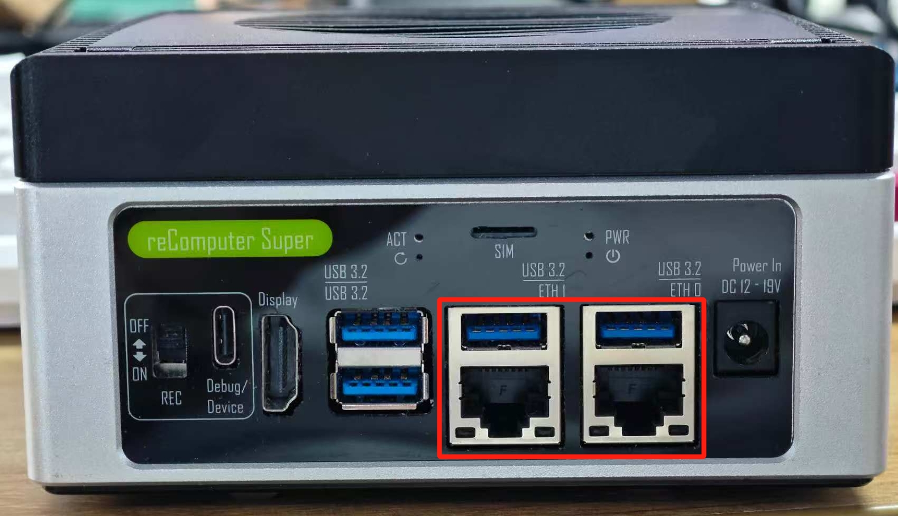
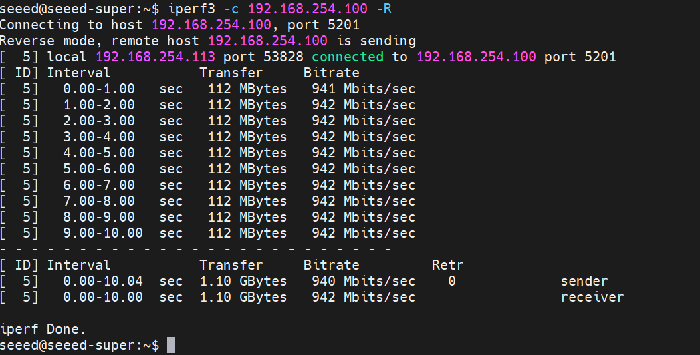

# 3.34 Super Dual Ethernet

> [!IMPORTANT]
> This page is intended for the Seeed `reComputer Super` carrier-board family, such as [`reComputer Super J4011`](https://www.seeedstudio.com/reComputer-Super-J401-Carrier-Board-p-6642.html). The dual Ethernet configuration is specific to the Super family.

## Introduction

The reComputer Super features dual RJ45 Gigabit Ethernet ports, providing high-speed networking capabilities. This dual Ethernet configuration enables a variety of advanced networking scenarios, such as network redundancy, load balancing, and segmentation.



## Hardware Overview

The reComputer Super is equipped with two Gigabit Ethernet ports, allowing for flexible network configurations:

- **Port 1**: Primary Ethernet port
- **Port 2**: Secondary Ethernet port



There are 2 LEDs (green and yellow) on each Ethernet port:

- Green LED: ON only when connected to 1000M/10G network.
- Yellow LED: Shows the network activity status.

## Basic Network Configuration

### Check Network Interfaces

To view the available network interfaces, open a terminal and run:

```bash
ifconfig
```

You should see two Ethernet interfaces, typically named `eth0` and `eth1`.

### Configure Network Settings

You can configure network settings through the Ubuntu desktop interface or via the command line.

#### Via Desktop Interface

1. Click on the network icon in the top-right corner
2. Select "Wired Settings"
3. Click on the gear icon next to each Ethernet connection to configure settings

#### Via Command Line

To configure network settings via the command line, you can edit the netplan configuration file:

```bash
sudo nano /etc/netplan/01-network-manager-all.yaml
```

## Advanced Network Scenarios

### Network Redundancy

Configure both Ethernet ports to connect to the same network for redundancy. If one port fails, the other will continue to provide network connectivity.

### Network Segmentation

Use the dual Ethernet ports to connect to different networks:

- **Port 1**: Connect to the internal network for management
- **Port 2**: Connect to an external network for data transfer

### Load Balancing

Configure both Ethernet ports to work together for increased bandwidth and load balancing.

### Network Address Translation (NAT)

Use one Ethernet port as the WAN interface and the other as the LAN interface to create a NAT gateway.

## Network Performance Testing

### Test Network Speed

Use `iperf3` to test network performance:

1. Install iperf3:

```bash
sudo apt install iperf3
```

2. On the server side:

```bash
iperf3 -s
```

3. On the client side:

```bash
iperf3 -c <server-ip>
```

## Troubleshooting

### Ethernet Port Not Detected

- Ensure the Ethernet cable is properly connected
- Check that the network cable is functional
- Verify that the network driver is installed

### Slow Network Speed

- Check for network congestion
- Verify that you're using Cat5e or Cat6 cables for Gigabit speeds
- Ensure the network switch supports Gigabit Ethernet

## Further Reading

- [reComputer Super Hardware and Interfaces Usage](https://wiki.seeedstudio.com/recomputer_jetson_super_hardware_interfaces_usage/)
- [Ubuntu Network Configuration Documentation](https://help.ubuntu.com/community/NetworkConfiguration)
