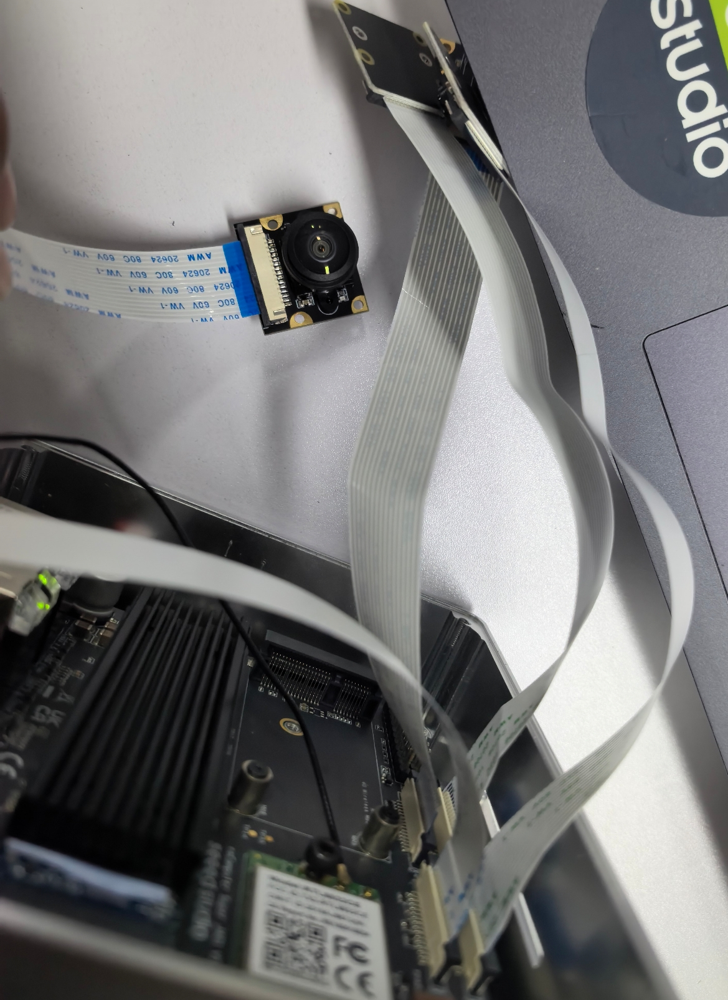
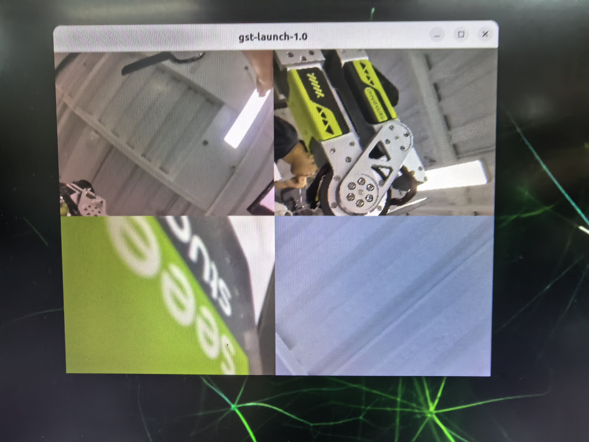
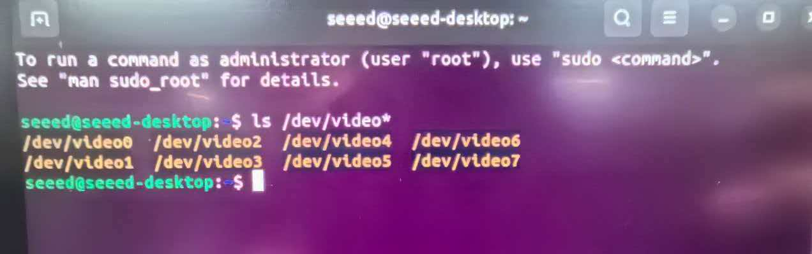

# 3.33 Super 4xMipi CSI

> [!IMPORTANT]
> This page is intended for the Seeed `reComputer Super` carrier-board family, such as [`reComputer Super J4011`](https://www.seeedstudio.com/reComputer-Super-J401-Carrier-Board-p-6642.html). The CSI connector count, camera orientation, and supported sensor overlays are specific to the Super family.

## Introduction

The reComputer Super features 4x MIPI CSI (Camera Serial Interface) ports, allowing you to connect up to 4 CSI cameras simultaneously. This makes it ideal for multi-camera applications such as 360-degree vision, stereo vision, and multi-angle object tracking.

## Hardware Requirements

- reComputer Super with JetPack 6.2 installed
- Compatible MIPI CSI cameras (up to 4)
- CSI ribbon cables

## Hardware Connection

### Step 1: Power off the Device

Before connecting or disconnecting CSI cameras, ensure the reComputer Super is powered off to avoid damage.

### Step 2: Open the Back Cover

Open the back cover of the reComputer Super to access the CSI ports.



### Step 3: Connect the Cameras

Connect the MIPI CSI cameras to the appropriate CSI ports on the reComputer Super board. Ensure the connections are firm and properly seated.

### Step 4: Secure the Cameras

Secure the cameras and ensure all connections are properly tightened.

## Enable the CSI Cameras

### Step 1: Check Camera Recognition

After powering on the device, open a terminal and check if the cameras are recognized:

```bash
ls /dev/video*
```

### Step 2: Install Video Utilities (if needed)

If not already present, install video utilities:

```bash
sudo apt install v4l-utils
```

## Preview the Cameras



### Preview a Single Camera

Use `nvgstcapture-1.0` to preview the CSI stream from a specific camera:

```bash
nvgstcapture-1.0 --sensor-id=0
```

### Preview Multiple Cameras

To preview a different camera, change the `--sensor-id` parameter:

```bash
nvgstcapture-1.0 --sensor-id=1  # For the second camera
nvgstcapture-1.0 --sensor-id=2  # For the third camera
nvgstcapture-1.0 --sensor-id=3  # For the fourth camera
```

## Common Preview Options

### Specify Resolution

You can specify a custom preview resolution:

```bash
nvgstcapture-1.0 --sensor-id=0 --cus-prev-res=1280x720
```

### Capture Images

To capture an image, press the `c` key while in the preview window.

### Record Video

To start recording video, press the `r` key while in the preview window.

## Quad CSI Cameras Setup

This section describes how to connect, configure, and test four CSI cameras simultaneously on the reComputer Super.

### Step 1: Quad CSI Connection

Connect four MIPI CSI cameras to the four CSI ports on the reComputer Super board. Ensure each camera is firmly seated and the ribbon cables are properly aligned.


### Step 2: Configure Device Tree for Quad CSI

After connecting the cameras, you need to configure the device tree to enable all four CSI ports.

1. Open a terminal and run:

```bash
sudo /opt/nvidia/jetson-io/jetson-io.py
```

2. Select **"Configure for compatible hardware"**.

3. In the list, select the camera mode that matches your cameras (e.g., IMX219).

4. Save and reboot the device.

### Step 3: Verify Camera Recognition

After rebooting, verify that all four cameras are recognized:

```bash
ls /dev/video*
```

You should see 8 video devices (4 capture devices + 4 metadata devices):

```
/dev/video0  /dev/video2  /dev/video4  /dev/video6
/dev/video1  /dev/video3  /dev/video5  /dev/video7
```



### Step 4: Quad CSI Test Script

We provide a comprehensive test script `test_quad_csi.sh` that supports multiple testing modes. The script automatically detects the camera backend (nvargus or v4l2) and provides the following commands:

| Command | Description |
|---------|-------------|
| `./test_quad_csi.sh check` | Test all 4 cameras one by one (default) |
| `./test_quad_csi.sh preview` | 2x2 grid real-time preview of all 4 cameras |
| `./test_quad_csi.sh single <0-3>` | Preview a single camera |
| `./test_quad_csi.sh capture` | Capture one JPEG from each camera |
| `./test_quad_csi.sh info` | Show device and environment information |

**Environment Variables:**

| Variable | Description | Default |
|----------|-------------|---------|
| `DISPLAY` | X11 display | Auto-detect :1 / :0 |
| `NUM_BUFFERS` | Frames to capture in check mode | 30 |
| `PREVIEW_MODE` | Preview mode: `cpu` or `nv` | `cpu` |
| `CAMERA_MODE` | Camera backend: `auto`, `nvargus`, or `v4l2` | `auto` |

**Usage Examples:**

```bash
# Test all 4 cameras
./test_quad_csi.sh check

# 2x2 grid preview (software compositor)
./test_quad_csi.sh preview

# Preview a single camera (sensor-id 2)
./test_quad_csi.sh single 2

# Capture one JPEG from each camera
./test_quad_csi.sh capture

# Use V4L2 backend explicitly
CAMERA_MODE=v4l2 ./test_quad_csi.sh check

# Use hardware nvcompositor for preview (nvargus only)
PREVIEW_MODE=nv ./test_quad_csi.sh preview

# Capture fewer frames for quick check
NUM_BUFFERS=10 ./test_quad_csi.sh check
```

The complete script source code is available at [`test_quad_csi.sh`](./test_quad_csi.sh).

### Step 5: Quad Preview

After running the test script in preview mode, you will see a 2x2 grid showing all four camera feeds simultaneously:


## Multi-Camera Applications

The reComputer Super's 4x CSI ports enable a variety of multi-camera applications:

- **360-degree vision**: Use four cameras to capture a complete view of the surroundings
- **Stereo vision**: Use two cameras for depth perception and 3D reconstruction
- **Multi-angle object tracking**: Track objects from multiple perspectives
- **Simultaneous surveillance**: Monitor multiple areas at once

## Troubleshooting

### Camera Not Recognized

- Ensure the camera is properly connected
- Check that the camera driver is installed
- Verify that the camera is compatible with JetPack 6.2

### Poor Image Quality

- Ensure the camera lens is clean
- Adjust the camera focus if necessary
- Check for proper lighting conditions

## Further Reading

- [reComputer Super Hardware and Interfaces Usage](https://wiki.seeedstudio.com/recomputer_jetson_super_hardware_interfaces_usage/)
- [NVIDIA Jetson Camera Documentation](https://developer.nvidia.com/embedded/learn/tutorials/first-picture-csi-camera)
