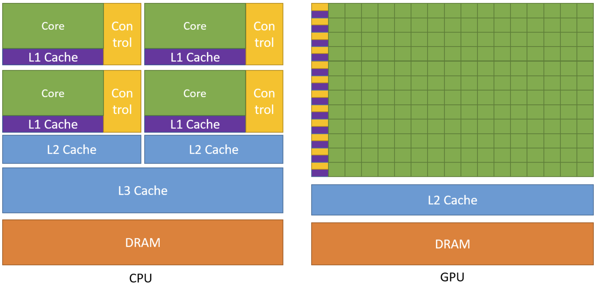
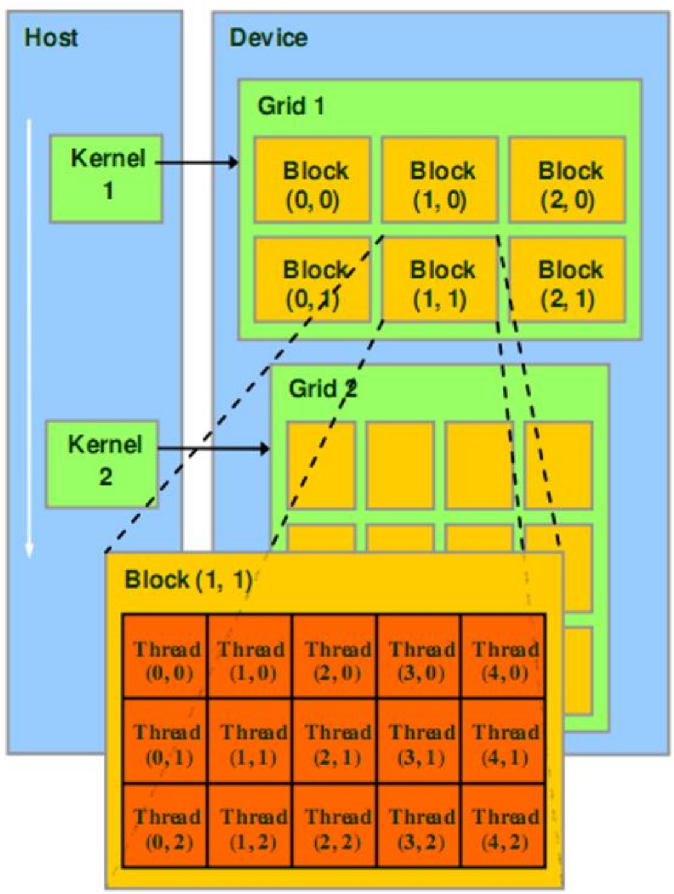
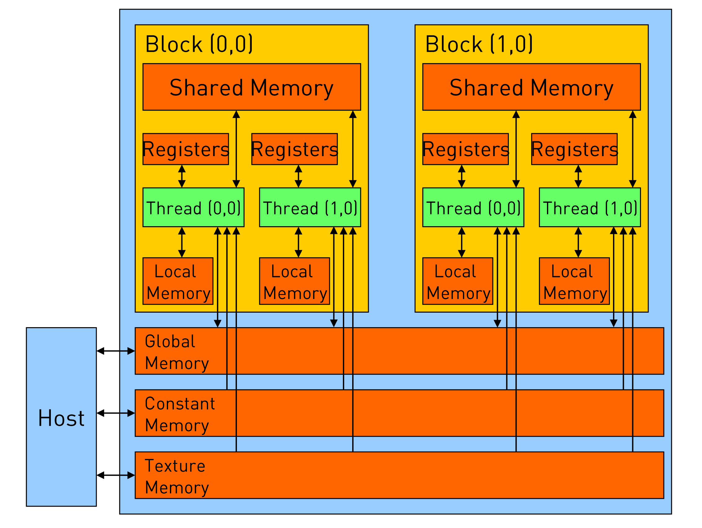
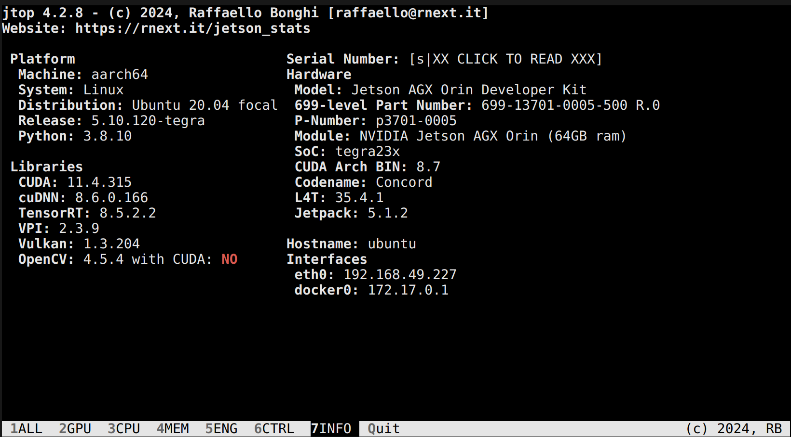
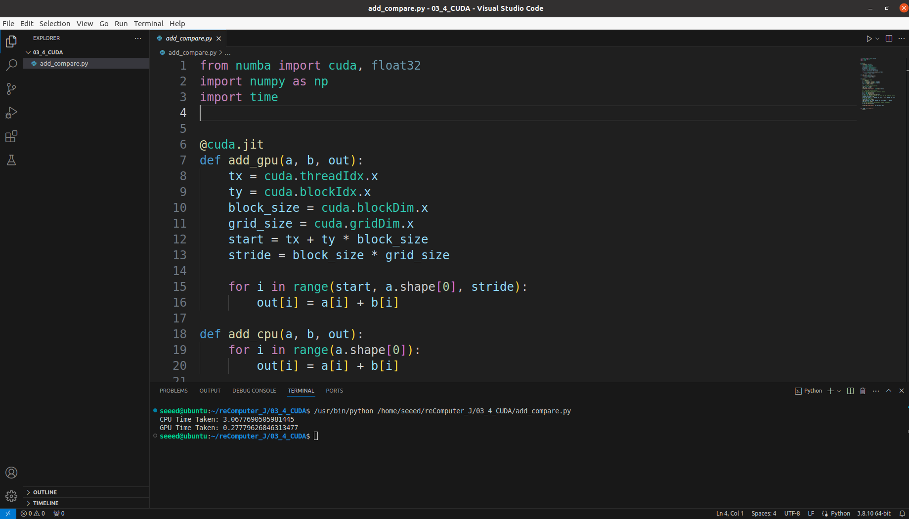

# Nvidia CUDA

NVIDIA CUDA (Compute Unified Device Architecture) is a parallel computing platform and programming model developed by NVIDIA. CUDA enables developers to use high-performance NVIDIA GPUs (Graphics Processing Units) to perform general-purpose computing tasks. Through CUDA, developers can leverage the powerful computing capabilities of GPUs for large-scale parallel computations, significantly improving application performance, especially in fields such as scientific computing, machine learning, image processing, and physical simulation. CUDA supports multiple programming languages, such as C, C++, and Python, and provides a rich set of libraries and tools to help developers easily achieve GPU-accelerated computing.

<p align="center">
  <a href="https://developer.nvidia.com/cuda-toolkit">
    
  </a>
</p>

## Basics of CUDA Programming

<!-- <p align="center">
    
</p> -->

How can we call GPU resources in a program to accelerate code execution? By using CUDA, we can easily manage thousands of computing cores within the GPU. The CUDA programming model is a heterogeneous model that requires the CPU and GPU to work together. In CUDA programming, the terms "host" and "device" are used to distinguish between the devices where the code is executed.

> - Host: CPU and host memory
> - Device: GPU and video memory

Generally, the main program loads on the CPU, then copies the initialization data to the GPU. The GPU completes the computations and copies the results back to the CPU.

<!-- need a gif here-->

We can use a kernel in a CUDA program to implement the above process. In CUDA, a `kernel` refers to a function that, when called, causes the GPU to launch many threads simultaneously to execute this kernel, thereby achieving parallelism. Each thread executes the kernel using its thread ID to correspond to the index of the input data, ensuring that every thread executes the same kernel but processes different data.

The GPU has a vast number of computing cores, and CUDA uses a two-level organizational structure to manage these cores. Here are three concepts in CUDA programming that need to be introduced: Thread, Block, and Grid.

- Thread: A CUDA parallel program is executed by many threads.
- Block: Several threads are grouped together to form a block.
- Grid: Multiple blocks are then organized into a grid.

> Note: Threads within the same block can synchronize and communicate through shared memory.

<p align="center">
    
</p>

In CUDA, each thread has a unique identifier called ThreadIdx, which changes depending on the way the Grid and Block are divided.

Additionally, here is a brief introduction to the CUDA memory model, as shown in the diagram below. Each thread has its own private local memory, while each thread block includes shared memory that can be accessed by all threads within the block, with a lifespan equal to that of the thread block. Furthermore, all threads can access global memory. There are also some read-only memory spaces: constant memory and texture memory. The memory structure involves program optimization, which will not be discussed in detail here.

<p align="center">
    
</p>

## CUDA Demonstration Case

Now, let's experience GPU acceleration through a simple example. In this example, we will compute the sum of two vectors on both the CPU and GPU, and compare the computation speeds between CPU and GPU.

### Preparing the Runtime Environment

The JetPack operating system already includes the CUDA runtime environment. We can check the CUDA version using the jtop tool. Open the terminal and run jtop.

```bash
jtop
```
<p align="center">
    
</p>

> Note: If jtop is not installed on your system, please refer to [this guide](https://github.com/rbonghi/jetson_stats).

In the following, we will use Python to write CUDA code. So we need to run the following command in the terminal to install `Numba`.

```bash
pip install numba
```

### Running the Example Code

**Step 1:** Create a Python script for this course in the root directory:

```bash
mkdir -p ~/reComputer_J/3.4_CUDA
touch ~/reComputer_J/3.4_CUDA/add_compare.py
```

**Step 2:** Open VSCode in the directory where the script is located:

```bash
cd ~/reComputer_J/3.4_CUDA
code .
```

**Step 3:** In the left navigation bar, we can see `hello_world.py`. Enter the following code in the python file:

<details>
  <summary>Click to expand code</summary>

  ```python
from numba import cuda, float32
import numpy as np
import time


@cuda.jit
def add_gpu(a, b, out):
    tx = cuda.threadIdx.x
    ty = cuda.blockIdx.x
    block_size = cuda.blockDim.x
    grid_size = cuda.gridDim.x
    start = tx + ty * block_size
    stride = block_size * grid_size

    for i in range(start, a.shape[0], stride):
        out[i] = a[i] + b[i]

def add_cpu(a, b, out):
    for i in range(a.shape[0]):    
        out[i] = a[i] + b[i]

def main():
    # Prepare test data
    n = 10000000
    a = np.arange(n).astype(np.float32)
    b = np.arange(n).astype(np.float32)
    out = np.empty_like(a)

    # 1. Test CPU computation time
    start = time.time()
    add_cpu(a, b, out)
    print("CPU Time Taken:", time.time()-start)

    # 2. Test GPU computation time
    # Copy data from host memory to device memory
    d_a = cuda.to_device(a)
    d_b = cuda.to_device(b)
    d_out = cuda.device_array_like(out)
    # Define the number of threads per block and the number of blocks
    threads_per_block = 256  
    blocks_per_grid = (n + threads_per_block - 1) // threads_per_block
    # Compute the result
    start_gpu = time.time()
    add_gpu[blocks_per_grid, threads_per_block](d_a, d_b, d_out)
    end_gpu = time.time()
    # Copy the result from device memory back to host memory
    d_out.copy_to_host(out)

    print("GPU Time Taken:", end_gpu-start_gpu)


if __name__ == "__main__":
    main()

  ```
</details>

**Step 4:** Click the run button to see the result of the Python script in the terminal. 



From the results printed in the terminal, it can be observed that the GPU's computation speed is faster.

## More CUDA Learning Tutorials

| **Tutorial** | **Type** | **Description** |
|:---------:|:---------:|:---------:|
| [Getting Started with CUDA Programming(zh)](https://zhuanlan.zhihu.com/p/34587739) | doc | A Minimalist Tutorial for Getting Started with CUDA Programming by Chinese |
| [CUDA C++ Programming Guide](https://docs.nvidia.com/cuda/cuda-c-programming-guide/index.html) | doc | The programming guide to the CUDA model and interface. |
|
