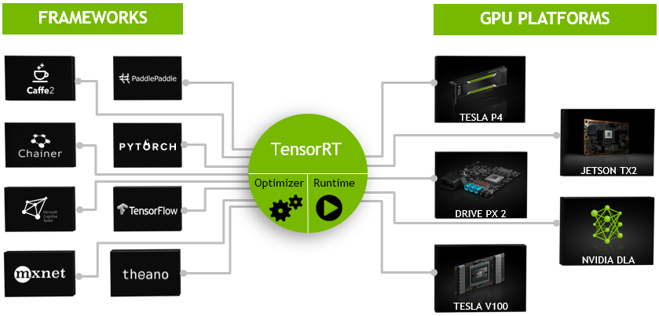
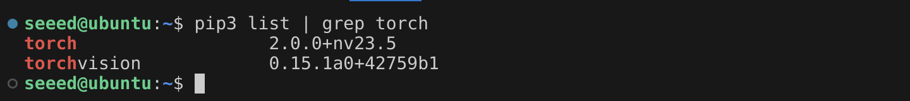

# Nvidia CUDA

NVIDIA® TensorRT™ is an ecosystem of APIs for high-performance deep learning inference. TensorRT includes an inference runtime and model optimizations that deliver low latency and high throughput for production applications. The TensorRT ecosystem includes TensorRT, TensorRT-LLM, TensorRT Model Optimizer, and TensorRT Cloud.

<p align="center">
  <a href="https://developer.nvidia.com/tensorrt">
    
  </a>
</p>

## "Hello World" for TensorRT

In this sample, we will create a neural network with classification capabilities based on PyTorch to implement handwritten digit recognition. The model will be trained and tested on the [MNIST](http://yann.lecun.com/exdb/mnist/) dataset. Finally, the model will be converted to TensorRT format to accelerate the inference speed of the neural network.

This is a test case from Nvidia. Here we attempt to deploy and run it on a Jetson device.

> Note: For more information, please refer to:
> - https://docs.nvidia.com/deeplearning/tensorrt/developer-guide/index.html#network_python
> - https://github.com/NVIDIA/TensorRT/tree/main/samples/python/network_api_pytorch_mnist

### Prepare the run environment

#### TensorRT

Jetpack has TensorRT pre-installed.

Please run the following command in the terminal. If the TensorRT version is printed in the terminal, it means that TensorRT is installed correctly.

```bash
sudo apt install nvidia-jetpack
python3 -c "import tensorrt as trt; print(f'TensorRT version: {trt.__version__}')"
```

#### Pytorch and Torchvision

Please refer to [Module 3.3](../3.3-Pytorch-and-Tensorflow/README.md) for the installation of PyTorch and Torchvision. I have installed version 2.0.0 of torch.



### Running the Sample


Download the Python scripts from the [`scripts` folder](./scripts/) and copy them to the Jetson device.

Open the terminal and run:

```bash
cd <path-of-scripts>
python3 sample.py
```

If the sample runs successfully you should see a match between the test case and the prediction.

```bash
Test Case: 4
Prediction: 4
```

> Note: Please ignore any warning messages that appear during the execution of the program.


## Learn More

| **Tutorial** | **Type** | **Description** |
|:---------:|:---------:|:---------:|
| [TensorRT Getting Started](https://developer.nvidia.com/tensorrt-getting-started) | website | Nvidia's official getting started tutorial |
