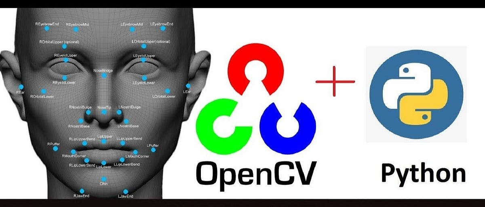
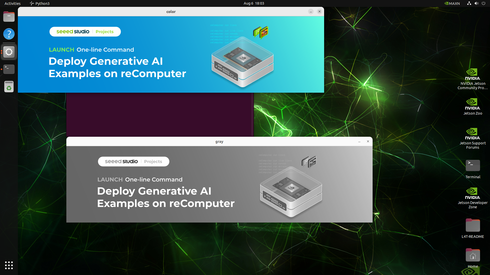
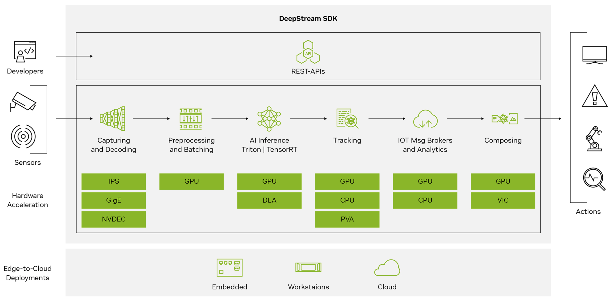
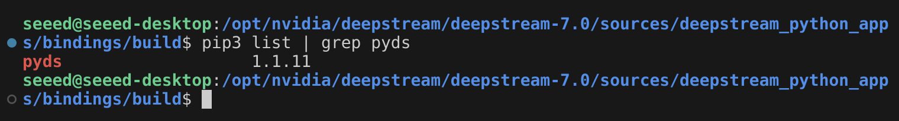
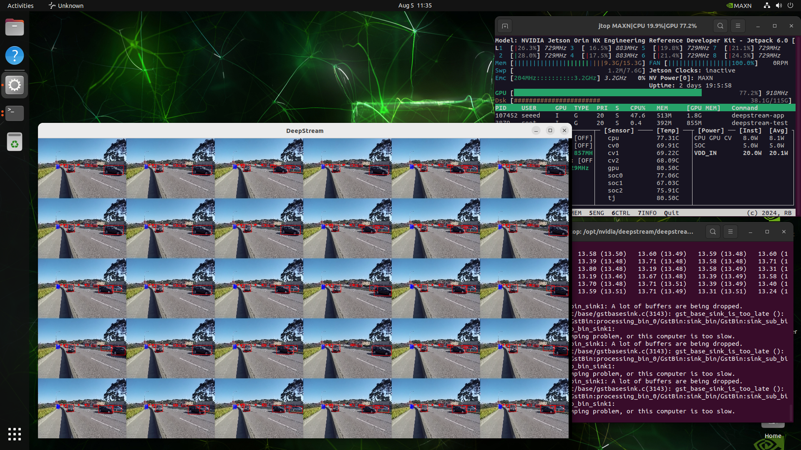

# Real-Time Video Processing

Real-time video processing refers to the technology of immediately processing and analyzing video data after it is captured, providing output with minimal delay. This processing is crucial in various fields such as security monitoring, autonomous driving, smart retail, and real-time sports analysis. The key to real-time video processing lies in the ability to quickly and accurately extract useful information from the video stream and analyze and apply this information. This not only helps improve efficiency but also provides timely data support for decision-making. This article will explore how to use OpenCV and DeepStream, two powerful tools, to achieve efficient real-time video processing. OpenCV offers rich computer vision functionalities, while DeepStream enhances processing speed and accuracy through hardware acceleration and deep learning model optimization.

## OpenCV

<p align="center">
    
</p>

OpenCV is a widely used software library for computer vision and image processing. It provides a vast array of algorithms and functions for tasks such as image and video processing, object detection, and machine learning. Additionally, OpenCV offers a wealth of [tutorials and example code](https://docs.opencv.org/4.x/index.html) for beginners, helping them quickly get started and improve their skills.

### Install OpenCV on Jetson

OpenCV is pre-installed in the Jetpack operating system. You can check its version using the following command:

```bash
python3 -c "import cv2; print(cv2.__version__)"
```

If the OpenCV version number is returned correctly, it means that OpenCV is already installed on the device.

### Reading and Displaying Image by OpenCV:

Create a new Python script, name it `test_python.py`, and enter the following code:

```python
import cv2

# read image
image_gray = cv2.imread("./jetson-examples.png", cv2.IMREAD_GRAYSCALE)
image_color = cv2.imread("./jetson-examples.png", cv2.IMREAD_COLOR)

# show image
cv2.imshow('gray', image_gray)
cv2.imshow('color', image_color)

# waitting user input and destroy windows
cv2.waitKey(0)
cv2.destroyAllWindows()
```
Here's a Python script using OpenCV:
> 1. **import cv2:** Import the OpenCV package.
> 2. **cv2.imread:** Read the image, requiring the image's file path as input.
> 3. **cv2.imshow:** Create a new window on the desktop and display the image.
> 4. **cv2.waitKey(0):** Wait for a keyboard input; otherwise, the program won't proceed to the following code.
> 5. **cv2.destroyAllWindows():** Destroy all windows created by OpenCV.

Modify the image file path and run the script:
```bash
python3 test_python.py
```
<p align="center">
    
</p>

## DeepStream
### What is NVIDIA DeepStream?

NVIDIA’s DeepStream SDK is a complete streaming analytics toolkit based on GStreamer for AI-based multi-sensor processing, video, audio, and image understanding. It’s ideal for vision AI developers, software partners, startups, and OEMs building IVA apps and services.

<p align="center">
    
</p>

You can now create stream-processing pipelines that incorporate neural networks and other complex processing tasks like tracking, video encoding/decoding, and video rendering. These pipelines enable real-time analytics on video, image, and sensor data.

### Why we need DeepStream

NVIDIA DeepStream is a powerful SDK that lets you use GPU-accelerated technology to develop end-to-end vision AI pipelines.

### Get Started with DeepStream SDK

#### Installing DeepStream

**Step1.** Prepare the dependency environment.
```bash
pip3 install meson
pip3 install ninja

pkg-config --modversion glib-2.0

sudo apt install libssl3 libssl-dev libgstreamer1.0-0 gstreamer1.0-tools gstreamer1.0-plugins-good gstreamer1.0-plugins-bad gstreamer1.0-plugins-ugly gstreamer1.0-libav libgstreamer-plugins-base1.0-dev libgstrtspserver-1.0-0 libjansson4 libyaml-cpp-dev

git clone https://github.com/confluentinc/librdkafka.git
cd librdkafka
git checkout tags/v2.2.0
./configure --enable-ssl
make
sudo make install

sudo mkdir -p /opt/nvidia/deepstream/deepstream/lib
sudo cp /usr/local/lib/librdkafka* /opt/nvidia/deepstream/deepstream/lib
sudo ldconfig
```

**Step2.** [Download](https://catalog.ngc.nvidia.com/orgs/nvidia/resources/deepstream/files) the DeepStream Debian package `deepstream-7.0_7.0.0-1_arm64.deb` to the Jetson device. Enter the following command:

```bash
sudo apt-get install ./deepstream-7.0_7.0.0-1_arm64.deb
```

**Step3.** Considering that we may need to write DeepStream-related programs in Python later, we need to install additional **Python bindings**.

```bash
# Base dependencies
sudo apt install python3-gi python3-dev python3-gst-1.0 python-gi-dev git meson python3 python3-pip python3.10-dev cmake g++ build-essential libglib2.0-dev  libglib2.0-dev-bin libgstreamer1.0-dev libtool m4 autoconf automake libgirepository1.0-dev libcairo2-dev
cd /opt/nvidia/deepstream/deepstream-7.0/sources
sudo git clone https://github.com/NVIDIA-AI-IOT/deepstream_python_apps
sudo git submodule update --init

# Installing Gst-python
sudo apt-get install -y apt-transport-https ca-certificates -y
sudo update-ca-certificates
cd 3rdparty/gstreamer/subprojects/gst-python/
sudo meson setup build
cd build
sudo ninja
sudo ninja install

# Compiling and installing the  bindings
cd /opt/nvidia/deepstream/deepstream-7.0/sources/deepstream_python_apps/bindings
sudo mkdir build
cd build
cmake .. -DPYTHON_MAJOR_VERSION=3 -DPYTHON_MINOR_VERSION=10 -DPIP_PLATFORM=linux_aarch64 -DDS_PATH=/opt/nvidia/deepstream/deepstream/
sudo make -j$(nproc)
pip3 install ./pyds-1.1.11-py3-none-linux_aarch64.whl
```

Run `pip3 list | grep pyds` in the terminal. If the terminal outputs the version information for pyds, it means the Python bindings have been successfully installed.

<p align="center">
    
</p>

#### Getting Started

DeepStream has provided us with a wealth of reference examples. We can directly navigate to the corresponding folder and run these demos.

```bash
cd /opt/nvidia/deepstream/deepstream-7.0/samples/configs/deepstream-app
deepstream-app -c source30_1080p_dec_infer-resnet_tiled_display_int8.txt
```
> Note: The first run may take 10 minutes. Please ignore any TensorRT warning messages during the process.

> Note: If you are accessing the Jetson device remotely via SSH, please enter export `DISPLAY=:0` in the terminal to set the display output.

<p align="center">
    
</p>

If your project requires implementing functionality with Python and DeepStream, these reference examples are exactly what you need:

```bash
cd /opt/nvidia/deepstream/deepstream-7.0/sources/deepstream_python_apps/apps && ls
```

We can quickly run these Python scripts with simple commands, such as:

```bash
cd /opt/nvidia/deepstream/deepstream-7.0/sources/deepstream_python_apps/apps/deepstream-test1
python3 deepstream_test_1.py
```
> Note: If your Python script shows an error importing CUDA, you can fix this issue by using `pip3 install cuda-python`.


## More Reference Materials

| **Tutorial** | **Type** | **Description** |
|:---------:|:---------:|:---------:|
| [DeepStream Official Documentation](https://docs.nvidia.com/metropolis/deepstream/dev-guide/text/DS_Overview.html) | doc | Welcome to the DeepStream Documentation. |
| [gstreamer-1.0](https://valadoc.org/gstreamer-1.0/index.htm) | doc | Powerful framework for creating multimedia applications. |
| [Develop and Optimize Edge AI apps with NVIDIA DeepStream](https://www.nvidia.cn/on-demand/session/gtcspring22-s41777/) | video | Learn how the latest features of DeepStream are making it easier than ever to achieve real-time performance even for complex video AI applications. |
