# 4.8 Real-Time Vision Pipeline Frameworks

## Why This Matters

An accurate model alone does not create a real-time vision system.

A working system also needs:

- input from cameras or files
- decode and frame transport
- inference and post-processing
- display, storage, or downstream communication

That whole chain is called a pipeline.

This section introduces the framework thinking needed to understand real-time vision systems before moving into `DeepStream` and Jetson-specific services.

## Learning Objectives

By the end of this section, you should be able to:

- explain the main stages of a real-time vision pipeline
- compare simple application pipelines with framework-based pipelines
- understand the role of `OpenCV` and `GStreamer`
- write small examples for reading and processing live video
- think in terms of end-to-end system flow instead of isolated model calls

## Core Concepts / Theory

### A Real-Time Pipeline Has Stages

A typical real-time visual pipeline includes:

1. source input
2. decode and frame acquisition
3. preprocessing
4. model inference
5. post-processing
6. rendering, storage, or transmission

### Why Pipelines Matter

If one stage is unstable or too slow, the whole system suffers.

For example:

- a bad RTSP stream can create dropped frames
- slow preprocessing can increase latency
- unnecessary display overhead can limit throughput

### OpenCV vs GStreamer

`OpenCV` is convenient for learning and application logic.

`GStreamer` is stronger when you need robust media pipelines, streaming, and real-time data flow.

Both are useful, but they serve different roles.

## Key Terms

- `Source`: where frames come from
- `Decode`: converting compressed video into frames
- `Preprocessing`: preparing frames for inference
- `Post-processing`: turning raw predictions into useful output
- `Latency`: end-to-end delay through the pipeline
- `Throughput`: total volume of processed frames or streams

## Worked Example / Code Example

> **Prerequisites:** Install the required dependencies:
>
> ```bash
> pip install opencv-python
> ```

### Simple OpenCV Live Pipeline

```python
import cv2
import time

cap = cv2.VideoCapture(0)
prev_time = time.time()

while True:
    ok, frame = cap.read()
    if not ok:
        break

    current_time = time.time()
    fps = 1.0 / (current_time - prev_time)
    prev_time = current_time

    cv2.putText(frame, f"FPS: {fps:.2f}", (20, 40), cv2.FONT_HERSHEY_SIMPLEX, 1, (0, 255, 0), 2)
    cv2.imshow("OpenCV Live Pipeline", frame)

    if cv2.waitKey(1) & 0xFF == ord("q"):
        break

cap.release()
cv2.destroyAllWindows()
```

### GStreamer Example

```bash
gst-launch-1.0 videotestsrc ! videoconvert ! autovideosink
```

### RTSP Input Example

```bash
gst-launch-1.0 rtspsrc location=rtsp://<camera-ip>/<path> latency=200 ! \
  rtph264depay ! h264parse ! avdec_h264 ! videoconvert ! autovideosink
```

## Common Misunderstandings

- "The model is the pipeline."
  - The model is only one stage inside the pipeline.
- "If I get 30 FPS in the model benchmark, the whole system runs at 30 FPS."
  - End-to-end performance depends on the entire pipeline.
- "OpenCV and GStreamer do the same thing."
  - They overlap in some areas, but they are not the same tool.

## MediaPipe

[MediaPipe](https://developers.google.com/mediapipe) is Google's open-source framework for building real-time multimodal ML perception pipelines.

### Setup

```bash
uv venv .mediapipe --python 3.10.12
source .mediapipe/bin/activate
uv pip install mediapipe opencv-python dlib
```

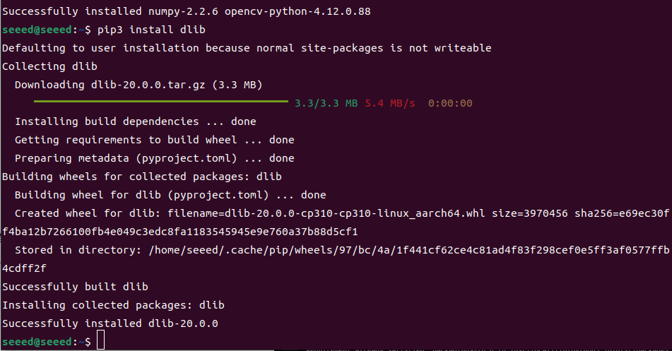
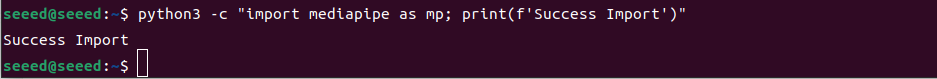

> **Note:** `dlib` compilation may take several minutes. Be patient.

### Hand Detection

Detect 21 hand keypoints in real-time:

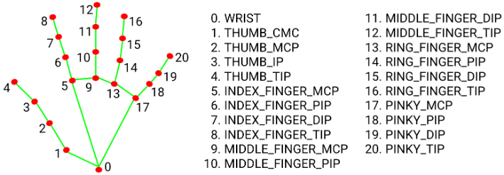
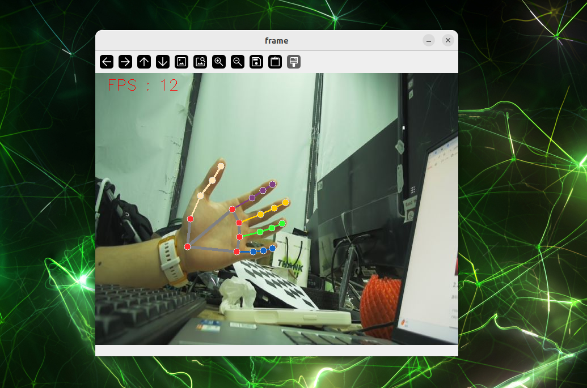

### Face Detection

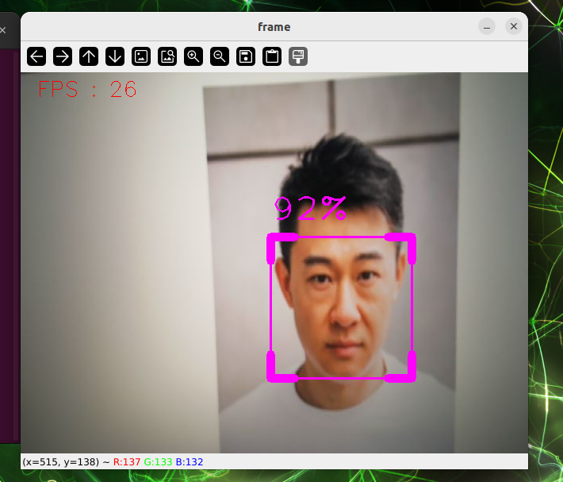

### Pose Estimation

Detect 32 body keypoints:

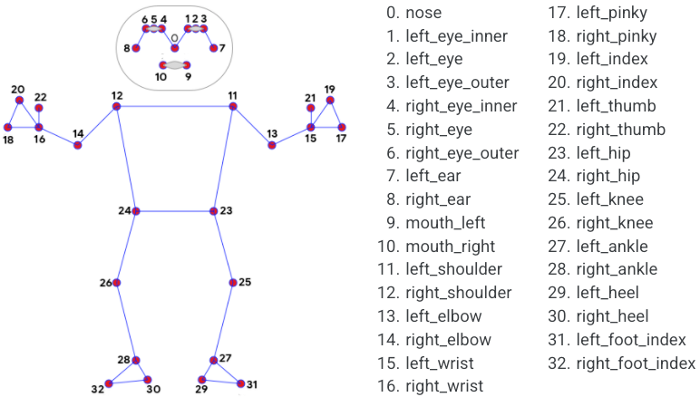
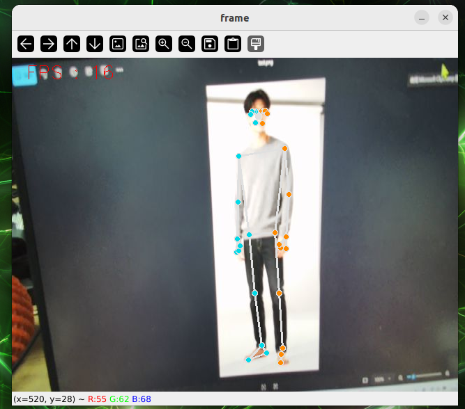

### Holistic Detection

Simultaneously detect body, hand, and face keypoints:

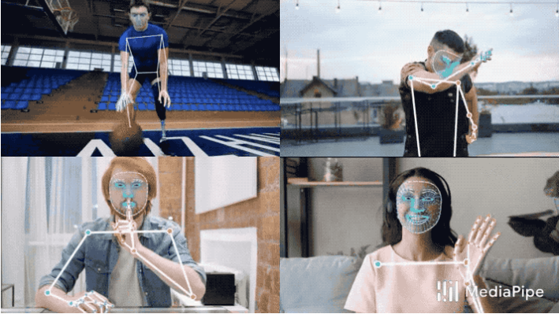
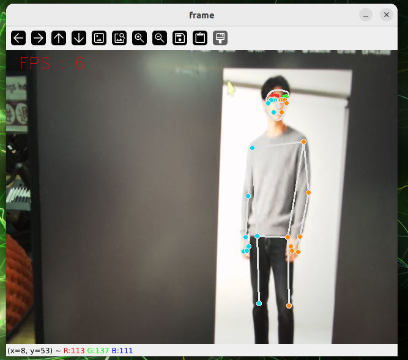

### Other MediaPipe Features

- **Face Mesh** — 3D face mesh with 468 landmarks
- **Virtual Brush** — Draw with finger gestures
- **Gesture Recognition** — Recognize 14+ hand gestures
- **Finger Control** — Control UI with finger distance
- **3D Object Detection** — Detect shoes, chairs, cameras, cups
- **Background Removal** — Segment and replace backgrounds

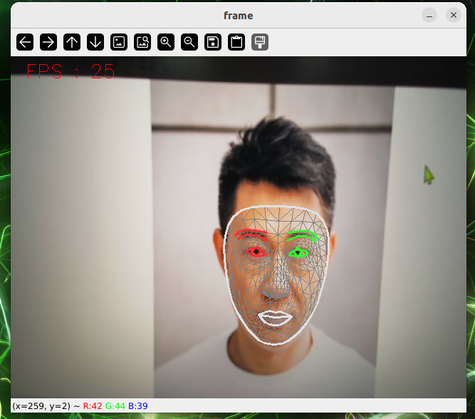
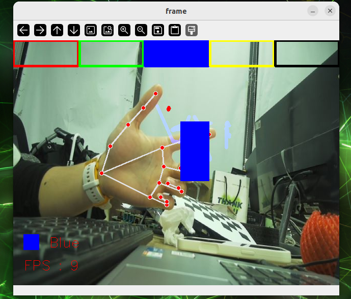
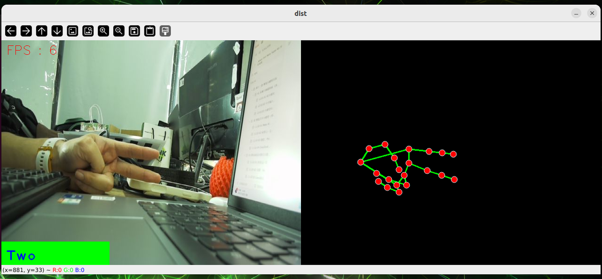
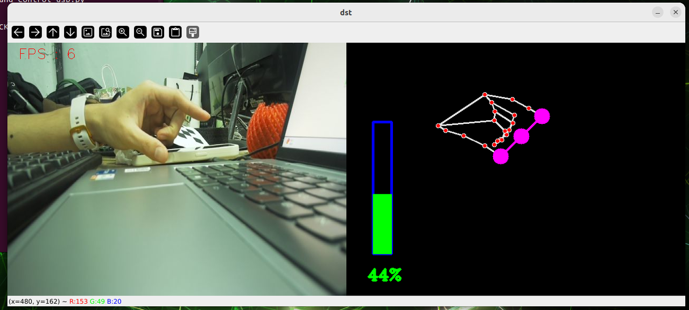
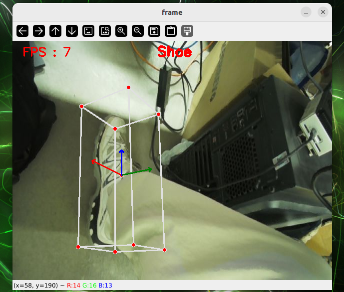
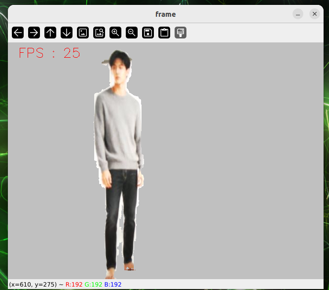

## QR Code Recognition

### Generate QR Codes

> **Prerequisites:** Install the required dependencies:
>
> ```bash
> pip install qrcode pillow opencv-python numpy pyzbar
> ```

```bash
cd 4-Computer-Vision/4.8-Real-Time-Vision-Pipeline-Frameworks/code
python qr_code_generate.py
```

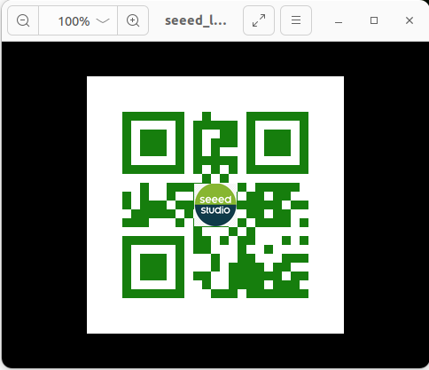

### Detect QR Codes

```bash
cd 4-Computer-Vision/4.8-Real-Time-Vision-Pipeline-Frameworks/code
python qr_code_detect.py
```

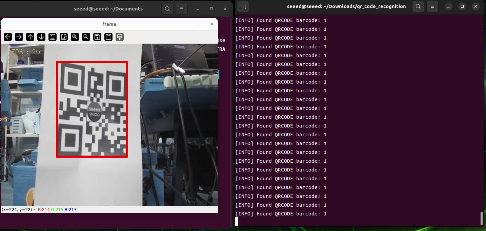

## Exercises / Reflection

1. Draw a five-stage real-time pipeline for a webcam detector.
2. Run the OpenCV example and measure approximate FPS on your machine.
3. Compare a video file input and a live camera input. What practical differences do you observe?
4. Explain why end-to-end latency is often more important than model inference time alone.

## Summary

Real-time computer vision depends on pipeline design, not only on models. Understanding input, decode, preprocessing, inference, post-processing, and output prepares the learner for more advanced edge frameworks such as `DeepStream`.

## Suggested Next Step

Continue to [4.9 DeepStream and Jetson](../4.9-DeepStream-and-Jetson/README.md).

## References

- [OpenCV Documentation](https://docs.opencv.org/4.x/index.html)
- [GStreamer Documentation](https://gstreamer.freedesktop.org/documentation/)
