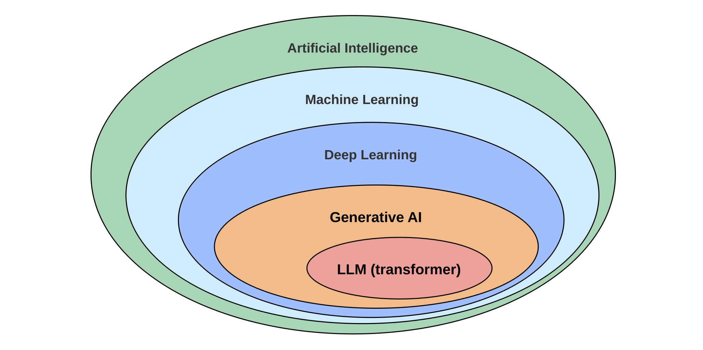
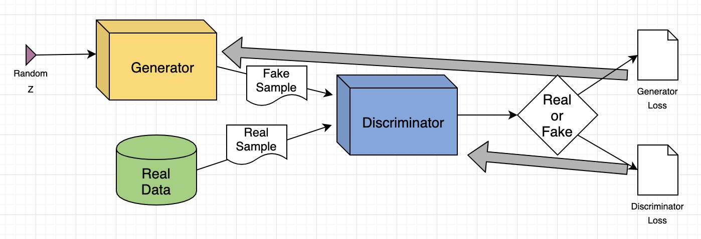
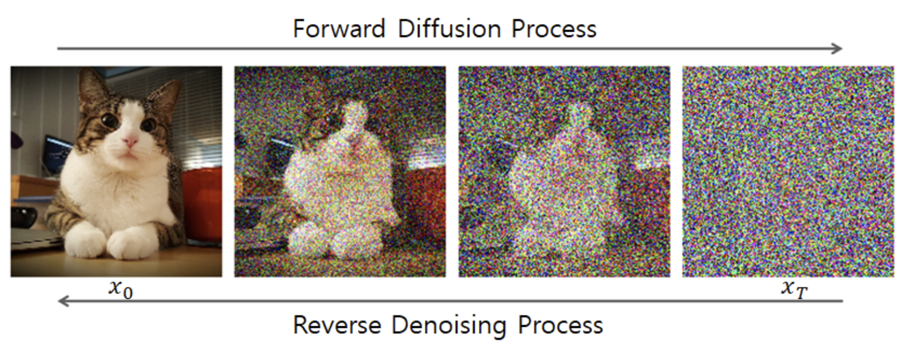
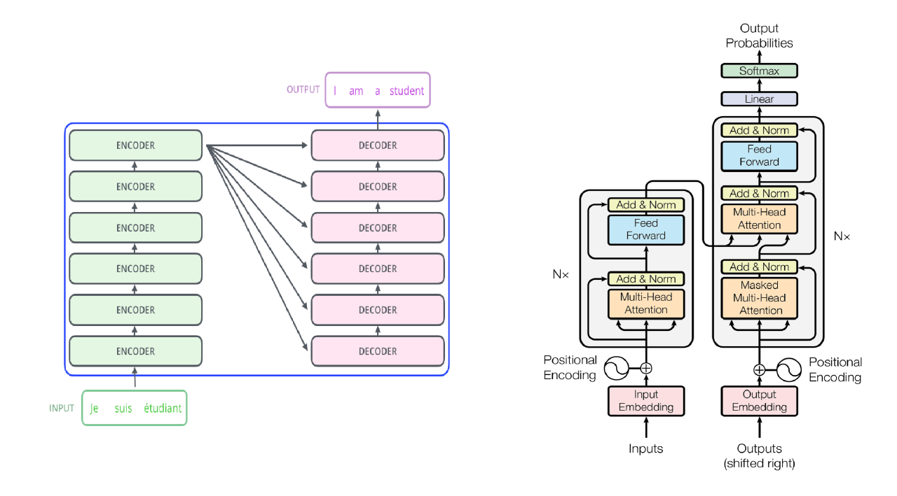

# Introduction to Generative AI

## Introduction
Generative AI is a type of artificial intelligence technology that can create entirely new content based on input. This technology generates new data by learning the distribution of existing data. In this article, we will explore the fundamental concepts, model structures, and application areas of generative AI, and discuss how it differs from traditional discriminative models.

    

## What is Generative AI?

Generative AI refers to a class of artificial intelligence systems that generate new data by learning the distribution of existing data. Generative AI can create new samples similar to the original data and demonstrates strong generative capabilities in areas such as images, audio, and text. Unlike classification models, generative models focus on creating data rather than classifying or predicting it.

## Difference Between Generative Models and Discriminative Models
Generative models and discriminative models are two different paradigms in machine learning, with distinct goals and application scenarios.

- Generative Models learn the probability distribution of data and generate new, unseen samples. Common generative models include Generative Adversarial Networks (GAN), Variational Autoencoders (VAE), and autoregressive models like GPT. These models can generate new images, text, or audio content.
- Discriminative Models learn the decision boundaries of input data to perform classification or regression tasks. Examples of discriminative models include Support Vector Machines (SVM) and logistic regression. The goal of discriminative models is to classify input samples based on existing data, rather than generating new data.

| Feature       | Generative Models                          | Discriminative Models                    |
|:---------------:|:-------------------------------------------:|:----------------------------------------:|
| **Main Function** | Generate new data similar to the training data | Classification or prediction            |
| **Learning Focus** | Data probability distribution             | Decision boundary of the data           |
| **Typical Models** | GAN, VAE, Autoregressive models (e.g., GPT) | SVM, Logistic Regression, Neural Network Classifiers |
| **Applications** | Image and text generation, data augmentation, artistic creation | Image classification, sentiment analysis, recommendation systems |

The advantage of generative models lies in their ability to not only understand the structure of data but also generate new samples. This gives them significant potential in tasks such as data augmentation, generating artistic works, and data imputation.

## Main Models and Architectures of Generative AI

Generative AI encompasses a variety of model architectures, each with its own unique mechanisms and applications. Here are some of the most common generative models:

### Generative Adversarial Networks (GANs)

    

Image Source: https://aws.amazon.com/what-is/gan/ 

Generative Adversarial Networks (GANs) are one of the most popular models in generative AI. The core idea of GANs is to train a generator and a discriminator through an "adversarial" mechanism. The generator's goal is to produce realistic data, while the discriminator's goal is to distinguish between real data and the fake data generated by the generator. Through this adversarial training, the generator gradually learns to produce more realistic samples.

### Variational Autoencoders (VAE)

VAEs are a type of probabilistic generative model. They encode input data into a probability distribution in a latent space (typically a Gaussian distribution), then sample from this distribution and use a decoder to generate new data. The advantage of VAEs is that they can generate smooth and continuous sample spaces, ensuring that the generated data exhibits continuity in the latent space.

### Diffusion Models (Stable Diffusion)

    

Image Source: https://sushant-kumar.com/blog/ddpm-denoising-diffusion-probabilistic-models 

Diffusion models work by progressively adding noise and learning to reverse the denoising process to transform random noise back into high-quality images, audio, or other data. Due to their multi-stage denoising mechanism, they perform exceptionally well in generative tasks.

### Transformer-Based Models (Transformer)

    

Image Source: https://www.linkedin.com/pulse/transformer-model-neural-network-which-uses-attention-tejas-bankar/ 

Transformer-based models are currently the most popular generative models. These models use self-attention mechanisms to capture global dependencies between words in a sequence, allowing for parallel processing. This significantly enhances training speed and the ability to handle long-range dependencies. They perform exceptionally well in fields such as natural language processing, image processing, and speech recognition.

## Main Application Areas of Generative AI

Generative AI has demonstrated remarkable potential across various fields. Here are some common application scenarios:

1. **Artistic Creation**
   
   The application of generative AI in the arts is rapidly growing, particularly in generating images, music, and videos. For example, OpenAI's DALL·E can create unique artistic images based on text descriptions, while platforms like MidJourney allow users to create art using AI tools. These models not only replicate existing styles but also generate entirely new artistic styles, providing new sources of inspiration for artists.

2. **Healthcare**

    In the healthcare field, generative AI is used to generate medical images, enhance diagnostic data, and more. Especially in cases of rare diseases or data scarcity, generative AI can create simulated case data to help doctors better understand and handle complex cases. Additionally, generative AI is used to predict drug interactions and generate drug molecule structures.

3. **Commercial Applications**

    In the commercial sector, generative AI is utilized for automating content creation, optimizing advertisements, and personalizing recommendations. For instance, AI can generate product images and write product descriptions for e-commerce platforms, as well as optimize advertising materials to improve conversion rates.

4. Intelligent Voice Assistants

    Generative AI is widely used in intelligent voice assistants to enhance conversational experiences through natural language processing. Assistants like ChatGPT and Ollama can understand voice commands, generate responses, and help with tasks such as meeting notes, email drafting, and smart home control, significantly improving efficiency.

## More Reference Materials:
- https://github.com/microsoft/generative-ai-for-beginners 
- https://www.mckinsey.com/featured-insights/mckinsey-explainers/what-is-generative-ai 
- https://www.nvidia.com/en-us/glossary/generative-ai/ 

