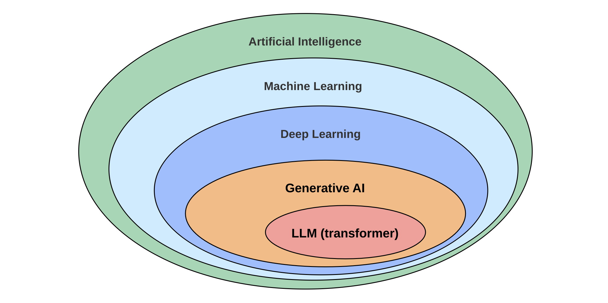
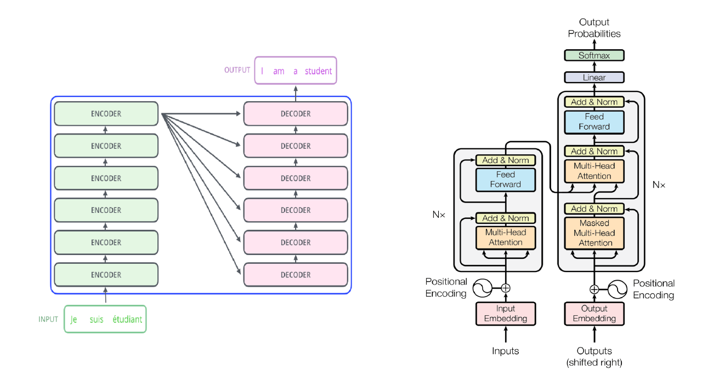

# 生成式 AI 简介

## 引言
生成式AI是一种能够根据输入创造全新内容的人工智能技术，该技术通过学习数据的分布来生成新的数据。在本文中，我们将深入探讨生成式AI的基本概念、模型结构以及应用领域，并讨论其与传统判别模型的差异。

    

## 什么是生成式AI？
生成式AI（Generative AI）是一类通过学习数据分布来生成新数据的人工智能系统。生成式AI可以生成与原始数据类似的新样本，并且在图像、声音、文本等领域展现出强大的生成能力。与分类模型不同，生成模型关注的是生成数据而非分类或预测。

## 生成模型与判别模型的区别
生成模型和判别模型是两种不同的机器学习范式，它们的目标和应用场景有所不同。

- 生成模型（Generative Models）学习数据的概率分布，生成新的、未见过的样本。常见的生成模型包括生成对抗网络（GAN）、变分自编码器（VAE）和自回归模型（如GPT）。它们能够生成新的图像、文本或音频等内容。
- 判别模型（Discriminative Models）学习输入数据的决策边界，进行分类或回归任务。例如，支持向量机（SVM）和逻辑回归属于判别模型。判别模型的任务是根据已有数据对输入样本进行分类，而不是生成新数据。

| 特征         | 生成模型                          | 判别模型                            |
|--------------|-----------------------------------|-------------------------------------|
| **主要功能** | 生成与训练数据类似的新数据         | 分类或预测                          |
| **学习对象** | 数据的概率分布                    | 数据的决策边界                      |
| **典型模型** | GAN, VAE, 自回归模型（如GPT）      | SVM, 逻辑回归, 神经网络分类器        |
| **应用场景** | 图像、文本生成，数据增强，艺术创作等 | 图像分类，情感分析，推荐系统等      |

生成模型的优势在于它不仅可以理解数据的结构，还可以生成新的样本，这使得它在数据增强、生成艺术作品和数据填充等任务中具有很大的潜力。

## 生成式AI的主要模型与架构
生成式AI有许多不同的模型架构，每种架构都有独特的工作机制和应用场景。以下是一些最常见的生成模型：
### 生成对抗网络（GAN）

    

图片来源：https://aws.amazon.com/what-is/gan/ 

生成对抗网络是生成式AI中最受欢迎的模型之一。GAN的核心思想是通过“对抗”机制来训练生成器和判别器。生成器的目标是生成逼真的数据，而判别器的目标是区分真实数据与生成器生成的假数据。通过这种对抗训练，生成器逐渐学会生成更加逼真的样本。

### 变分自编码器（VAE）

VAE是一种基于概率的生成模型。它通过将输入数据编码成一个潜在空间中的概率分布（通常是高斯分布），然后从该分布中采样，并通过解码器生成新数据。VAE的优势在于它可以生成平滑且连续的样本空间，使得生成的数据在潜在空间中具有连续性。

### 扩散模型（Stable Dissusion）

    

图片来源：https://sushant-kumar.com/blog/ddpm-denoising-diffusion-probabilistic-models 

扩散模型通过逐步添加噪声并学习反向去噪，将随机噪声还原为高质量的图像、音频等数据，因其多阶段去噪机制，在生成任务中表现出色。

### 基于 Transformer 的模型（Transformer）

    

图片来源：https://www.linkedin.com/pulse/transformer-model-neural-network-which-uses-attention-tejas-bankar/ 

基于 Transformer 的模型是目前最为流行的生成模型，该模型通过自注意力机制捕捉序列中词与词的全局依赖关系，实现并行处理，大幅提升训练速度和处理长距离依赖的能力。它在自然语言处理、图像处理和语音识别等领域表现优异。

## 生成式AI的主要应用领域

生成式 AI 已经在多个领域展现出了非凡的应用潜力。以下是一些常见的应用场景：

1. 艺术创作
生成式AI在艺术领域的应用正在迅速增长，尤其是在图像、音乐和视频生成方面。例如，OpenAI 的 DALL·E 可以根据文本描述生成独特的艺术图像，MidJourney 等平台也允许用户通过 AI 工具进行创作。这些模型不仅可以复制现有风格，还可以创造出全新的艺术风格，为艺术家们提供了新的灵感来源。
2. 医疗领域
在医疗领域，生成式AI被用于生成医学影像、增强诊断数据等。尤其是在罕见病症或数据不足的情况下，生成式AI可以生成模拟病例数据，帮助医生更好地理解和处理复杂的病例。此外，生成式 AI 也被用来预测药物相互作用，生成药物分子结构等。
3. 商业应用
在商业领域，生成式AI用于自动化内容生成、广告优化和个性化推荐等任务。比如，AI可以为电商平台生成产品图片、写作产品描述，甚至优化广告素材以提升转化率。
4. 智能语音助手
生成式AI广泛应用于智能语音助手，通过自然语言处理提升对话体验。像ChatGPT、Ollama等助手能理解语音指令、生成回答，帮助完成任务，如会议记录、邮件撰写和智能家居控制等，大大提升了效率。

更多参考内容:
- https://github.com/microsoft/generative-ai-for-beginners 
- https://www.mckinsey.com/featured-insights/mckinsey-explainers/what-is-generative-ai 
- https://www.nvidia.com/en-us/glossary/generative-ai/ 

