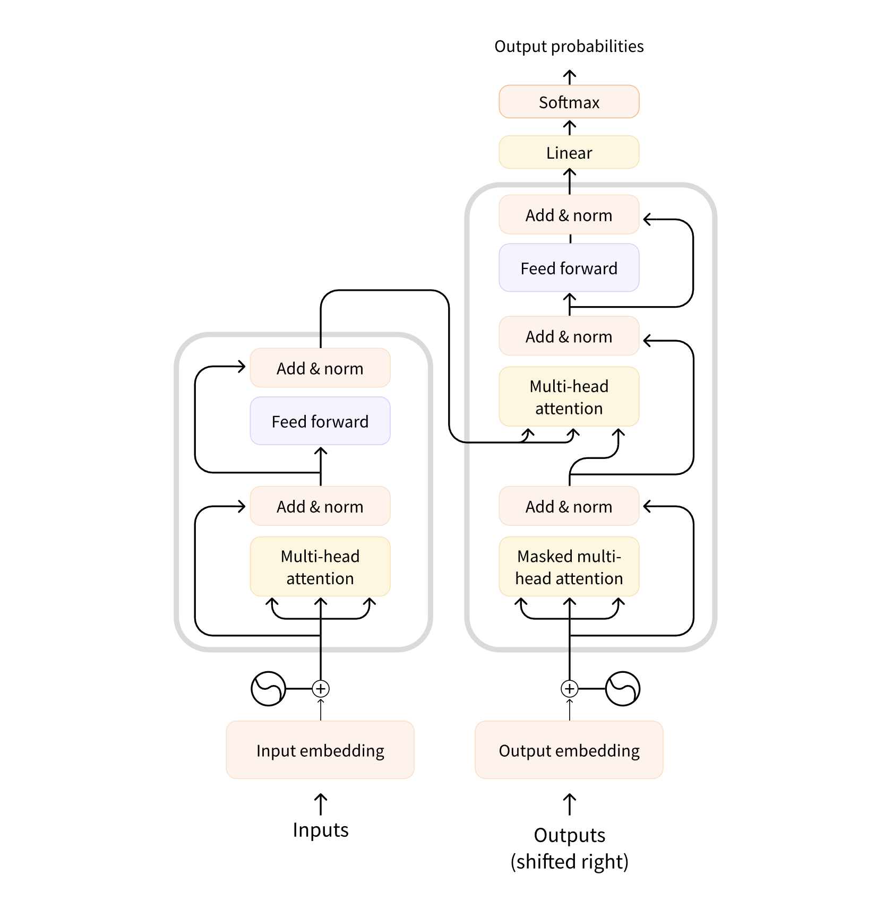
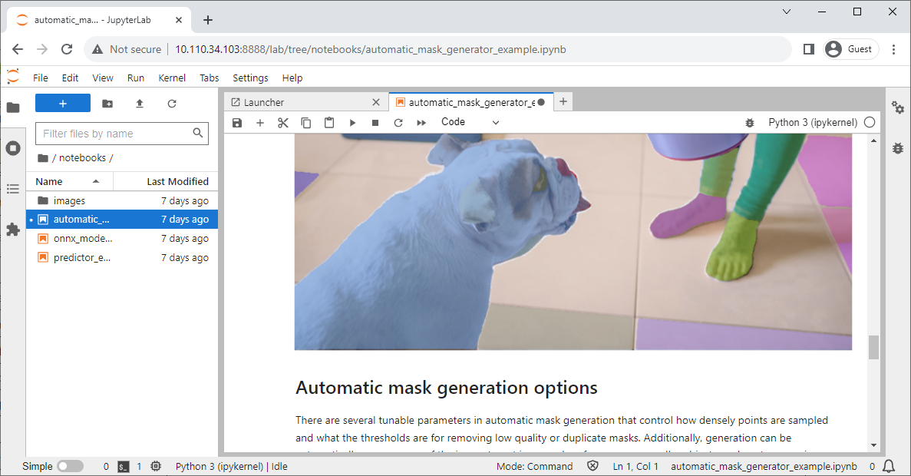
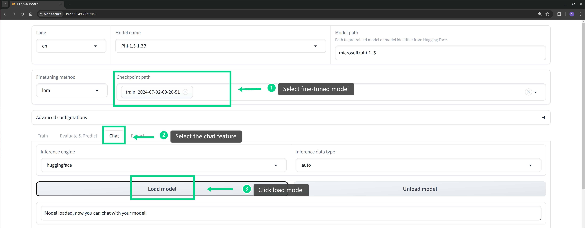
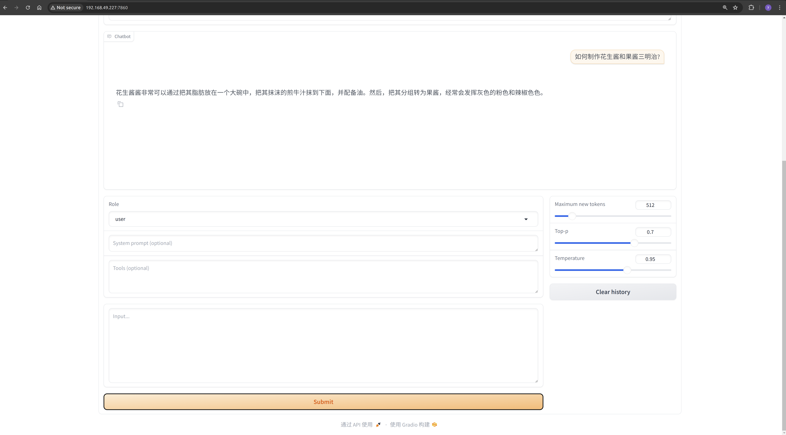

# The Evolution of Transformer Models and Generative AI

## Introduction

The emergence of Transformer models represents a significant breakthrough in natural language processing (NLP) and generative tasks. By employing an innovative Attention mechanism, Transformers address the limitations of traditional RNNs (Recurrent Neural Networks) and LSTMs (Long Short-Term Memory networks) when handling long sequences. This advancement not only enhances the accuracy of language understanding but also achieves remarkable success in generative tasks. Whether it’s text translation, summarization, or dialogue systems, Transformer models and their derivative pretrained models like ChatGPT, Llama, and T5 have laid a solid foundation for generative AI.

In this chapter, we will delve into the architecture of Transformers, the advantages of the Attention mechanism, and the applications of these models in generative tasks. We will also analyze and improve pretrained models through experimental exercises to solve specific tasks, ultimately mastering how to fine-tune models to enhance performance.

## Principles of Transformer Architecture

### Limitations of Traditional Sequence Models

Before Transformers, RNNs and LSTMs were the mainstream models in NLP tasks. However, they exhibited significant limitations when processing long sequences:

- Long-Distance Dependency Issues: RNNs and LSTMs struggle to capture long-distance dependencies as information tends to diminish over time steps, making it difficult to retain relevant context.

- Low Computational Efficiency: These models process sequences step-by-step, which prevents parallel execution, leading to lower computational efficiency.

### Innovations of Transformer

The Transformer model, proposed by Vaswani et al. in 2017, is entirely based on the Attention mechanism, eliminating the sequential dependency and enabling efficient performance when handling long sequences.

<p align="center">
    
</p>

Image source: https://transformers.run/c1/transformer/

The Transformer consists of multiple encoders (Encoder) and decoders (Decoder), each of which contains two main components:

1. Multi-Head Self-Attention mechanism: This allows the model to pay attention to all other words in the input sequence when processing a particular word, capturing long-distance dependencies.
2. Feedforward Neural Network: This is used for further processing of the output from the attention mechanism. This architecture enables highly parallelized processing of sequence data, greatly improving computational efficiency compared to RNN/LSTM.

## Introduction and Advantages of the Attention Mechanism

### The Basic Idea of the Attention Mechanism 

The introduction of the Attention mechanism addresses the issue that traditional models struggle to capture global information when processing long sequences. Attention dynamically adjusts the focus of the model by calculating the relevance of each input word to all other words. Specifically, the Attention mechanism allocates different weights to different words based on the similarity between the query (Query), key (Key), and value (Value), thereby enhancing the model’s focus on key contextual information.

### Self-Attention

Self-Attention is the core of the Transformer. In the self-attention mechanism, each word in the input sequence pays attention not only to the words around it but also establishes associations with all other words in the entire sequence. This mechanism allows the model to capture global context information simultaneously, regardless of the distance between words.

### Multi-Head Attention

The multi-head attention mechanism allows the model to perform multiple self-attention calculations in different subspaces and concatenate the results. This enables the model to capture more semantic relationships across different dimensions, making the Transformer more flexible and powerful when dealing with complex tasks.

### Advantages of the Attention Mechanism

- **Capturing Long-Distance Dependencies:** The Attention mechanism can consider all words in the entire sequence in a single operation, effectively solving the long-distance dependency problem of traditional sequence models.
- **Parallel Computation:** The Attention mechanism does not rely on step-by-step sequence processing, which can significantly improve computational efficiency.
- **Flexibility:** The Attention mechanism can dynamically adjust the focus of the model, adapting to the needs of different tasks.

## Applications of Large-Scale Pretrained Models

The Transformer architecture has provided a solid foundation for the emergence of large-scale pretrained models. These models, trained on vast amounts of data and then fine-tuned for specific tasks, have significantly improved the performance of generation tasks. Moreover, Transformer models have not only achieved tremendous success in natural language processing and generation tasks but are also widely applied in other domains. Here are some application scenarios for Transformer models:

### Dialogue Systems and Chatbots

<p align="center">
    
</p>

- **Smart Customer Service:** Generative dialogue systems can produce natural conversations based on user input, enabling businesses to offer 24/7 customer support services. Models like ChatGPT and Llama can handle common inquiries and provide real-time feedback. 
- **Virtual Assistants:** Virtual assistants such as Siri, Alexa, and Google Assistant utilize language generation technology to produce voice or text responses, helping users complete tasks or provide information.

### Image Processing and Computer Vision

<p align="center">
    
</p>

Image Source: https://www.jetson-ai-lab.com/vit/tutorial_sam.html

- **Vision Transformer (ViT):** ViT is the application of Transformer in computer vision, where the image is directly divided into patches, and these patches are treated as a sequence input for the Transformer to perform image classification. Compared to traditional Convolutional Neural Networks (CNNs), ViT demonstrates stronger performance on large-scale datasets.

- **Image Generation:** Transformers can also be used for image generation tasks, by modeling the sequence of image pixels to produce high-quality images.

### Speech Processing

<p align="center">
    
</p>

- **Speech Recognition:** Transformers have made significant advancements in speech recognition tasks. Models like Conformer, which combine the advantages of convolution and Transformer, perform well in real-time speech-to-text (ASR) systems.
- **Speech Generation:** Transformers are also widely used in text-to-speech (TTS) tasks. Models such as Tacotron 2, which integrate Attention mechanisms with RNN/Transformer, provide high-quality solutions for generating natural-sounding speech synthesis.

### Time Series Forecasting

- **Financial Market Analysis and Forecasting:** Transformers are used to process time series data in financial markets. The model can capture long-distance temporal dependencies through the Attention mechanism, leading to more accurate predictions of stock prices and market trends.
- **Energy Consumption Forecasting:** In energy management, Transformers are employed to predict future energy demands. By analyzing long-term trends in energy consumption data, they help optimize energy distribution and scheduling.

### Robot Control and Reinforcement Learning

<p align="center">
    
</p>

Image Source: https://www.jetson-ai-lab.com/lerobot.html

- **Robot Path Planning:** Transformers are applied in robot control tasks for path planning and task decision-making. By modeling the sequence of the robot’s states, they optimize the effectiveness of path planning.
- **Game AI:** In reinforcement learning tasks, Transformers are used to handle complex gaming environments, helping to train more intelligent game AI, such as excelling in board games and real-time strategy games.

### Drug Discovery

- Compound Generation and Optimization: Transformer models are used to generate and optimize the structures of chemical compounds, aiding in the discovery of potential drug molecules and improving the efficiency of drug design.


Through these examples, it is evident that the flexibility and powerful capabilities of Transformer models extend beyond natural language processing and are widely applied across various tasks and fields, driving technological advancements in each domain.


## Experiment: Analyzing and Improving Pretrained Models for Specific Tasks

In the following experiment, we will learn how to load a pretrained model and fine-tune it to complete specific generation tasks. Here, we demonstrate how to adapt an English chat model (Phi-1.5) to support Chinese.

<p align="center">
    
</p>

### Step 1: Configure the Training Environment

Choose a hardware device. Here, I am using the Nvidia Jetson AGX Orin 64GB, but you can also use a device with lower memory, such as the Jetson Orin NX 16GB. Then, use jetson-examples to install llama-factory.

> - **Nvidia Jetson AGX Orin 64GB:** A high-performance edge computing device
> - **jetson-examples:** A tool for quickly deploying popular projects to Jetson devices
> - **llama-factory:** A tool for easily training models

Open the terminal on your Jetson device and execute the following:

```bash
pip3 install jetson-examples
sudo reboot
reComputer run llama-factory
```

If all commands execute successfully, we can then use our browser to access the llama-factory WebUI.

```bash
# http://<jetson-ip>:7860
http://127.0.0.1:7860
```
### Step 2: Start Training

Configure the pre-trained model and Chinese dataset in the WebUI, and then initiate the training.

<p align="center">
    
</p>

### Step 3: Effectiveness Testing
Wait for the model to finish training. We can use the llama-factory tool to load the fine-tuned model and test its effectiveness. As seen in the screenshot below, the fine-tuned model has acquired the capability to generate Chinese text.

<p align="center">
    
    
</p>


> Note: For more detailed experimental content, please visit https://wiki.seeedstudio.com/Finetune_LLM_on_Jetson/

## Additional Reference Materials

- https://github.com/hiyouga/LLaMA-Factory
- https://github.com/Seeed-Projects/jetson-examples


