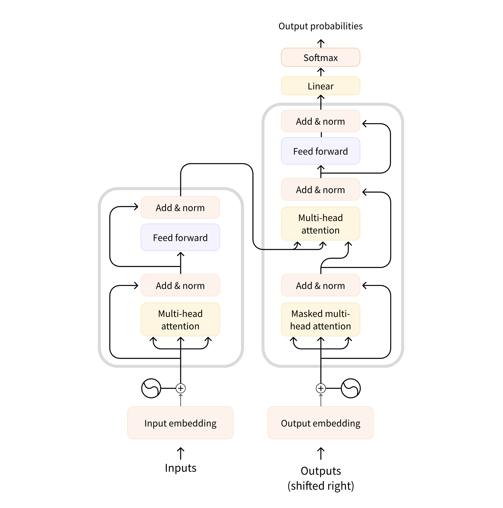
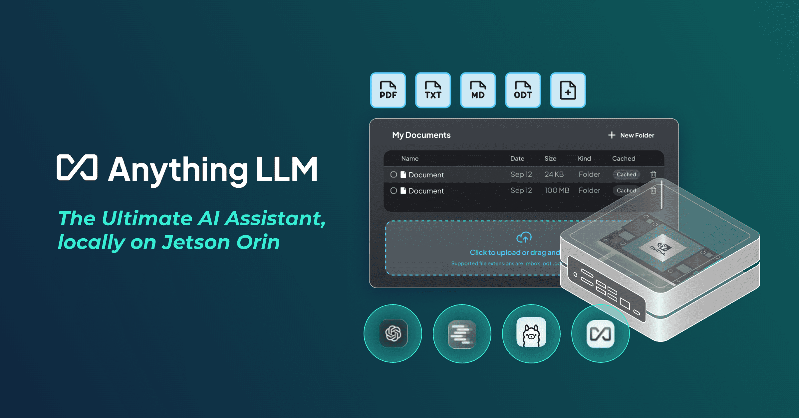
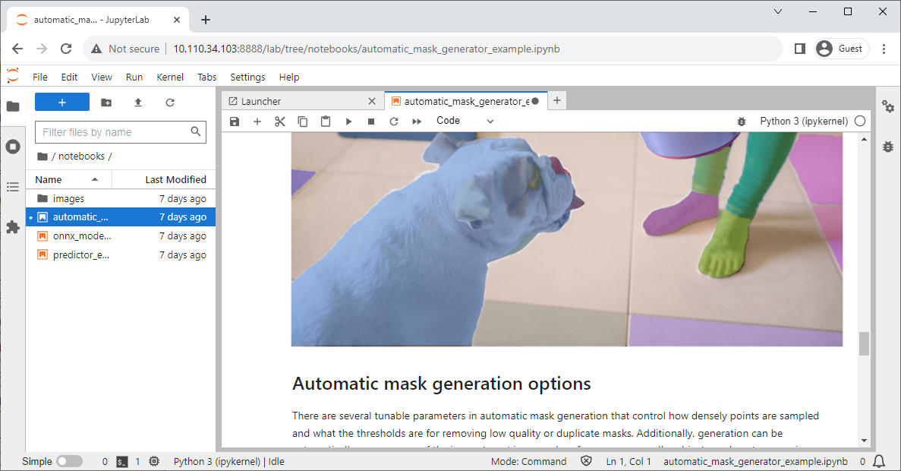
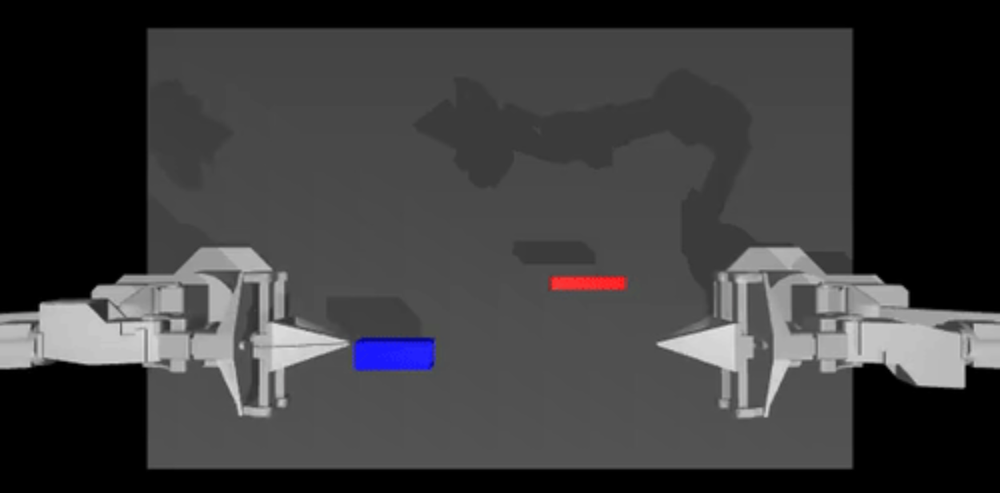
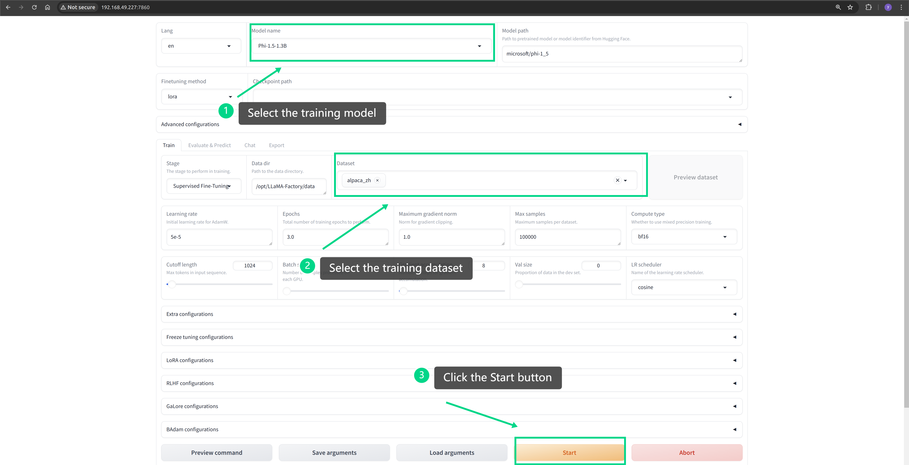
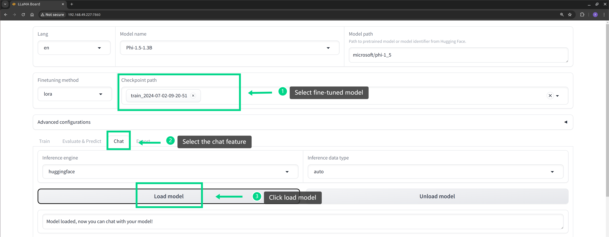
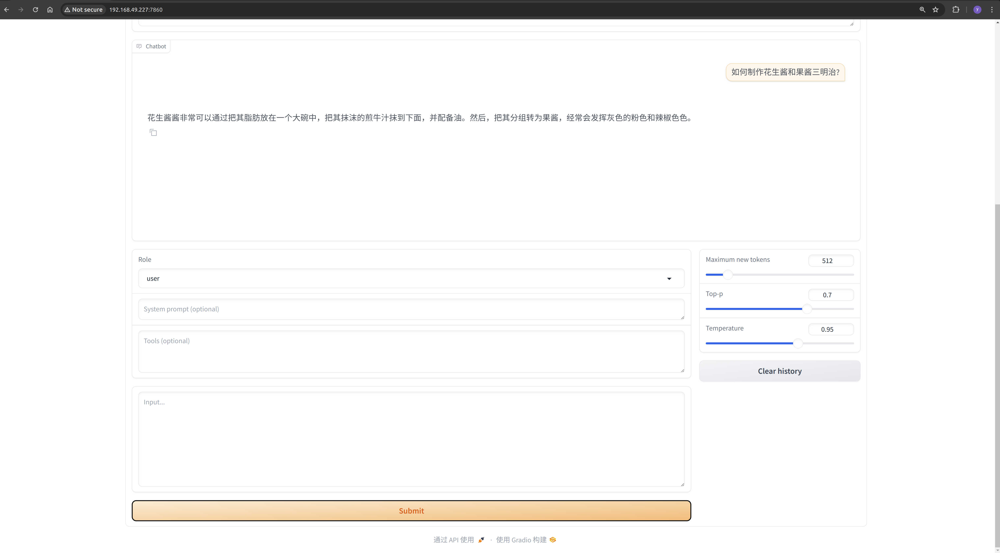

# Transformer 模型与生成式 AI 的进化

## 引言
在自然语言处理（NLP）和生成任务中，Transformer 模型的出现标志着一个巨大的突破。它通过创新的 Attention 机制解决了传统 RNN 和 LSTM 模型在处理长序列时的局限性，不仅提升了语言理解的精度，也在生成任务中取得了显著的成功。无论是文本翻译、摘要生成，还是对话系统，Transformer 模型和其衍生的预训练模型如ChatGPT、Llama、T5等，都为生成式AI奠定了坚实的基础。

在这一章中，我们将深入了解 Transformer 的架构，Attention 机制的优势，以及这些模型在生成任务中的应用。你还将通过实验课分析并改进预训练模型来解决特定任务，最终掌握如何微调模型以提升性能。

## Transformer 架构的原理

### 传统序列模型的局限性
在 Transformer 之前，RNN（循环神经网络）和 LSTM（长短期记忆网络）是NLP任务中的主流模型。然而，它们在处理长序列时表现出显著的局限性：
- 长距离依赖问题：RNN和LSTM在处理长序列时，信息随着时间步长增加而逐渐衰减，难以捕捉到远距离的依赖关系。
- 计算效率低：由于这些模型需要逐步处理序列，无法并行执行，导致计算效率较低。

### Transformer的创新

Transformer 模型在 2017 年由 Vaswani 等人提出，它的设计完全基于 Attention 机制，摆脱了序列化的依赖，可以在处理长序列时保持高效的性能。

<p align="center">
    
</p>

图片来源：https://transformers.run/c1/transformer/ 

Transformer 由多个编码器（Encoder）和解码器（Decoder）组成，每个编码器和解码器都包含两个主要部分：

1. 多头自注意力机制（Multi-Head Self-Attention）：允许模型在处理某个词时，同时关注输入序列中的所有其他词，捕捉到长距离的依赖关系。
2. 前馈神经网络：用于对注意力机制的输出进行进一步处理。
这种架构可以高度并行化处理序列数据，相比于RNN/LSTM，极大地提升了计算效率。

## Attention 机制的引入及其优势

### Attention 机制的基本思想

Attention 机制的引入解决了传统模型在处理长序列时难以捕捉全局信息的问题。Attention 通过为每个输入词计算与其他所有词的相关性，动态调整模型的关注点。具体来说，Attention 机制会根据查询（Query）、键（Key）、值（Value）三者的相似度，动态地为不同的词分配不同的权重，从而增强模型对关键上下文信息的关注。

### Self-Attention（自注意力机制）

Self-Attention 是 Transformer 的核心，在自注意力机制中，输入序列中的每个词不仅关注它周围的词，还可以与整个序列中的其他词建立关联。这种机制使得模型可以同时捕捉全局的上下文信息，无论词与词之间的距离多远。

### 多头注意力（Multi-Head Attention）

多头注意力机制允许模型在不同的子空间中进行多个自注意力的计算，并将结果拼接在一起。这样可以让模型在不同的维度上捕捉到更多的语义关系，使得Transformer在处理复杂任务时更加灵活和强大。

### Attention机制的优势

- 捕捉长距离依赖关系：Attention 机制可以在一次操作中考虑整个序列的所有词，从而有效解决传统序列模型的长距离依赖问题。
- 并行计算：Attention 机制不再依赖序列的逐步处理，可以大幅提高计算效率。
- 灵活性：Attention 机制能够动态调整模型的关注点，适应不同的任务需求。

## 大规模预训练模型的应用

Transformer 架构为大规模预训练模型的出现提供了坚实的基础，这些模型通过在海量数据上进行预训练，然后在特定任务上进行微调，从而极大提升了生成任务的性能。此外，Transformer 模型不仅在自然语言处理和生成任务中取得了巨大的成功，还被广泛应用于其他任务领域。以下是一些 Transformer 模型的应用场景：

### 对话系统与聊天机器人

<p align="center">
    
</p>

- 智能客服：生成式对话系统可以根据用户输入生成自然的对话，帮助企业提供24/7的客户支持服务。像 ChatGPT、Llama 这样的模型可以处理常见问题并提供实时反馈。
- 虚拟助手：虚拟助手如Siri、Alexa、Google Assistant 利用语言生成技术生成语音或文本响应，帮助用户完成任务或提供信息。

### 图像处理与计算机视觉

<p align="center">
    
</p>

图像来源: https://www.jetson-ai-lab.com/vit/tutorial_sam.html

- Vision Transformer (ViT)：ViT 是 Transformer 在计算机视觉中的应用，直接将图像切分为小块（Patch），然后将这些小块当作序列输入Transformer进行图像分类。ViT与传统的卷积神经网络（CNN）相比，在大规模数据集上具有更强的性能。
- 图像生成：Transformer 也可以用于图像生成任务，通过对图像像素序列进行建模，生成高质量的图像。

### 语音处理

<p align="center">
    
</p>

- 语音识别：Transformer在语音识别任务中也取得了显著进展，像 Conformer 模型结合了卷积和 Transformer 的优势，在实时语音转文本（ASR）系统中有良好表现。
- 语音生成：Transformer 在文本转语音（TTS）任务中也被广泛使用，模型如 Tacotron 2 结合 Attention 机制和 RNN/Transformer，为生成自然的语音合成提供了优质解决方案。

### 时间序列预测

- 金融市场分析与预测：Transformer被用来处理金融市场的时间序列数据，模型能够通过Attention机制捕捉到长距离的时间依赖关系，从而更准确地预测股票价格、市场趋势等。
- 能源消耗预测：在能源管理中，Transformer被用来预测未来的能源需求，通过分析长时间的能耗数据趋势，帮助优化能源分配和调度。

### 机器人控制与强化学习

<p align="center">
    
</p>

图片来源：https://www.jetson-ai-lab.com/lerobot.html 

- 机器人路径规划：Transformer在机器人控制任务中被应用于路径规划和任务决策，通过建模机器人的状态序列，优化路径规划的效果。
- 游戏AI：在强化学习任务中，Transformer被用来处理复杂的游戏环境，帮助训练出更智能的游戏AI，如在棋类游戏和实时策略游戏中表现出色。

### 药物发现

- 化合物生成与优化：Transformer 模型用于生成和优化化学化合物分子结构，帮助发现潜在的药物分子，提升药物设计的效率。

通过这些例子，可以看出 Transformer 模型的灵活性和强大能力，使其不仅限于自然语言处理，还广泛应用于多个任务和领域，并推动了各个领域的技术进步。

## 实验：分析并改进预训练模型进行特定任务

在下面的实验中，我们将学习如何通过加载预训练模型并进行微调，来完成特定的生成任务。这里我们演示的是让英文聊天模型（Phi-1.5）支持中文。

<p align="center">
    
</p>


### step1. 配置训练环境

选择一个硬件设备，这里我使用的是 Nvidia Jetson AGX Orin 64GB，你也可以使用显存更低的 Jetson Orin NX 16GB。然后使用 jetson-examples 安装 llama-factory。

> - Nvidia Jetson AGX Orin 64GB：高性能边缘计算设备
> - jetson-examples：快速部署热门项目到 Jetson 设备的工具
> - llama-factory：轻松训练模型的工具

打开 jetson 设备的终端并执行：

```bash
pip3 install jetson-examples
sudo reboot
reComputer run llama-factory
```

如果所有命令都成功执行，我们就可以使用浏览器访问 llama-factory 的 WebUI。

```bash
# http://<jetson-ip>:7860
http://127.0.0.1:7860
```

### step2. 启动训练
在 WebUI 中配置预训练模型和中文数据集，并启动训练。

<p align="center">
    
</p>

### step3. 效果测试
等待模型训练完成，可以使用 llama-factory 工具加载微调后的模型并测试其效果。从下方截图可以发现，微调后的模型以及具备中文生成的能力。

<p align="center">
    
    
</p>


> 更加详细的实验内容请查看 https://wiki.seeedstudio.com/Finetune_LLM_on_Jetson/ 

## 更多参考内容

- https://github.com/hiyouga/LLaMA-Factory 
- https://github.com/Seeed-Projects/jetson-examples 

