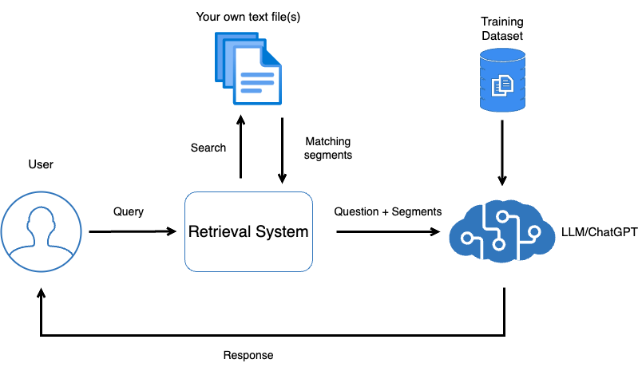
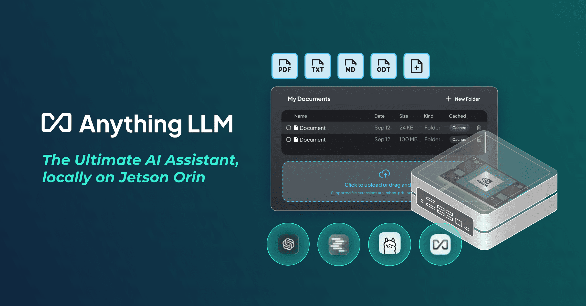
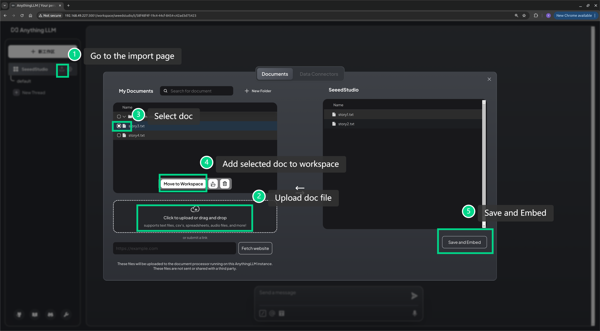
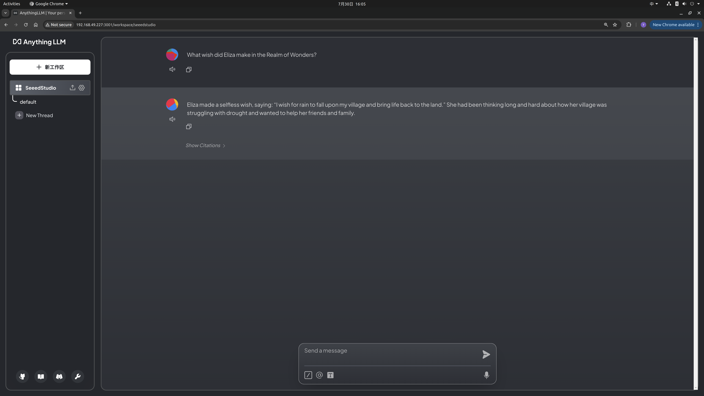

# Local Intelligent Q&A System

In the field of artificial intelligence today, general large language models (such as GPT-3, GPT-4, etc.) are widely used to build chatbots. These models possess powerful natural language processing capabilities and can handle a variety of questions, generating answers that resemble human language. However, despite their excellent performance in general scenarios, these models often lack precision in specific domain-related Q&A scenarios. This is because general large language models lack a deep understanding of specific domain knowledge; their training data is vast but not targeted, leading to inaccurate, verbose, or irrelevant answers when dealing with specific scenarios.

To address this issue, the industry has proposed a series of solutions tailored for specific scenarios to enhance the professionalism and accuracy of chatbots. This article will introduce these solutions in detail and demonstrate them with a simple example.

## Why Deploy LLM Locally?
Deploying large language models locally (localized deployment) is a choice based on different business needs and technical scenarios. Here are some of the main reasons:

### Data Privacy and Security

In scenarios with stringent requirements for data privacy and security, such as healthcare, finance, and government, localized deployment is the inevitable choice. Sensitive data in these fields may not be suitable for upload to the cloud for processing due to strict legal and compliance requirements. Deploying large language models locally ensures that data does not leave the local network environment, thus avoiding data leaks or external risks.

### Reduced Network Dependency 

Cloud deployment typically relies on internet connectivity. In situations with unstable network conditions or limited bandwidth, the performance of cloud service access may suffer. Localized deployment avoids dependency on external networks, ensuring that the system operates efficiently at all times, especially in scenarios requiring real-time responses.

### Customization and Control 

Deploying large language models locally allows developers to customize and optimize the models to better suit specific business needs. With cloud services, users can only access generic APIs, whereas local deployment enables developers to fine-tune, extend, and have greater flexibility in adjusting model behavior.

### Cost Optimization
While the cloud offers convenient scalability and maintenance services, the long-term use of large models in the cloud can incur significant costs, particularly for businesses that require continuous model invocations. Deploying models locally can save on cloud service expenses, especially for enterprises with large-scale usage.

## Solutions to the Limitations of General Models 

Facing the problem of insufficient performance of general models in specific scenarios, the following solutions have been widely applied and recognized:

### Knowledge-Enhanced Models (Retrieval-Augmented Generation, RAG) 

RAG is a technical framework that combines retrieval with generation, addressing the knowledge gaps in large language models by introducing external knowledge bases. In the RAG architecture, the user’s query is first sent to a retrieval module, which extracts relevant documents or information from a pre-built knowledge base. These pieces of information are then combined with the generation model to produce more accurate answers. This method leverages the linguistic capabilities of the generation model while ensuring the professionalism and accuracy of the answers. This approach is particularly suitable for domain-specific Q&A scenarios, such as healthcare, law, or corporate internal knowledge Q&A.

<p align="center">
    
</p>

Image source: https://transformers.run/c1/transformer/

### Fine-Tuning Models
Fine-tuning is another common method used to optimize general models for specific scenarios. By fine-tuning pre-trained language models, the models can become more adapted to specific domain data and tasks. For example, one can retrain large language models using internal company documents, technical manuals, or industry-specific Q&A data. This approach can significantly improve the model’s performance in specific domains.

The downside of fine-tuning is that it requires a substantial amount of domain-specific data, and the training process may demand considerable computational resources. However, once fine-tuning is complete, the model becomes more professional and precise in handling domain-specific issues.

Additionally, there are many other solutions such as Knowledge Graphs, Rule-Based Systems, Hybrid Systems, and more. The appropriate method can be chosen based on the actual situation.

## Building a Domain-Specific Q&A System Using RAG

We will demonstrate how to build a knowledge base-driven chatbot using RAG through a simple example. For the sake of demonstration, we will use Ollama as the inference engine to load the large language model, Anything LLM to construct the RAG knowledge base, and deploy all services to a local Jetson device.

> - **Ollama:** Inference engine for large language models
> - **Anything LLM:** AI application construction tool
> - **Jetson:** High-performance edge computing device

<p align="center">
    
</p>

### Step 1. Install and Run Ollama

Here, we use [`jetson-examples`](https://github.com/Seeed-Projects/jetson-examples) to quickly deploy the large language model to the Jetson device.

```bash
sudo apt install python3-pip
pip3 install jetson-examples
reComputer run ollama
ollama run llama3
```

> Please keep this terminal active.

### Step 2. Install and Run AnythingLLM

We can deploy AnythingLLM directly using Docker:

```bash
docker pull mintplexlabs/anythingllm

export STORAGE_LOCATION=$HOME/anythingllm 
mkdir -p $STORAGE_LOCATION 
touch "$STORAGE_LOCATION/.env" 
docker run -d -p 3001:3001 --cap-add SYS_ADMIN \
    -v ${STORAGE_LOCATION}:/app/server/storage \
    -v ${STORAGE_LOCATION}/.env:/app/server/.env \
    -e STORAGE_DIR="/app/server/storage" \
    mintplexlabs/anythingllm
```

### Step 3. Configure the Local Knowledge Base

Once AnythingLLM is successfully started, we can use a browser to open `http://<ip-jetson>:3001` to access its WebUI interface and upload the knowledge base file in the WebUI. 

Here, I have used ChatGPT to generate a few [short stories](./story1.txt) and uploaded these stories to AnythingLLM.

<p align="center">
    
</p>

### Step 4. Effectiveness Testing

<p align="center">
    
</p>


## More content

- https://docs.anythingllm.com/
- https://wiki.seeedstudio.com/local_ai_ssistant/
- https://wiki.seeedstudio.com/Local_RAG_based_on_Jetson_with_LlamaIndex/
- https://github.com/Seeed-Projects/jetson-examples