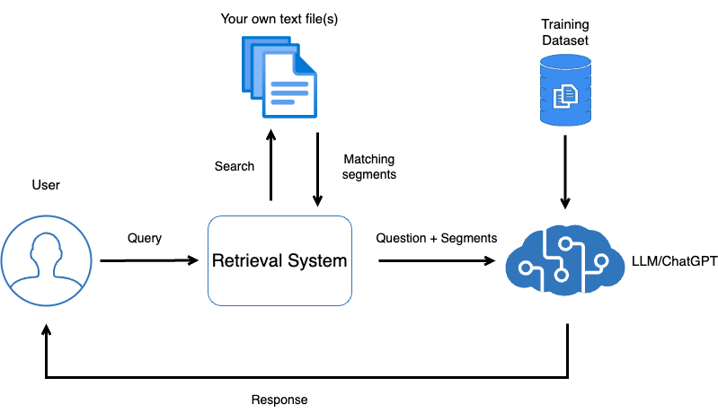
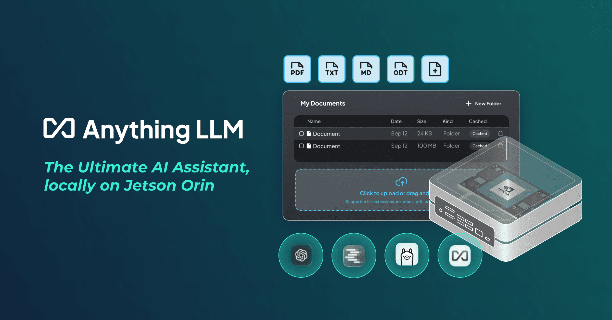
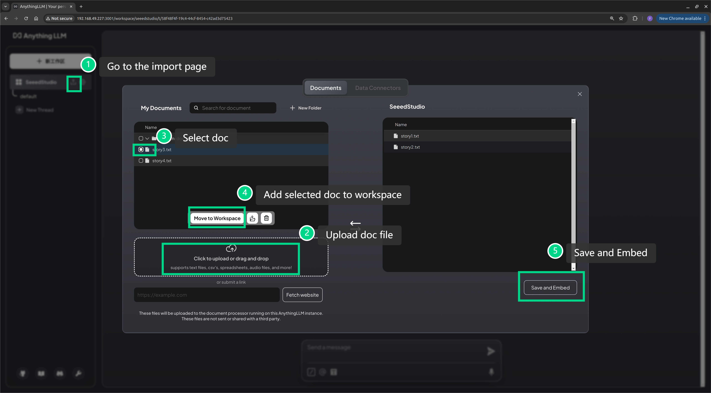

# 本地智能问答系统
在如今的人工智能领域，通用大语言模型（如GPT-3、GPT-4等）被广泛应用于构建聊天机器人。这些模型具备强大的自然语言处理能力，能够处理各种问题，并生成人类语言般的回答。然而，尽管这些模型在通用场景下表现出色，但在特定领域的问答场景中，往往显得不够精准。这是因为通用大语言模型缺乏对特定领域知识的深入理解，其训练数据虽然庞大但缺乏针对性，导致在处理特定场景下的问题时，可能会出现不准确、冗长或不相关的回答。

为了应对这一问题，业界提出了一系列针对特定场景的解决方案，以提升聊天机器人的专业性和准确性。本文将详细介绍这些解决方案，并通过一个简单的例子进行演示。

## 为何要部署在本地？

将大语言模型部署到本地（本地化部署）是针对不同业务需求和技术场景来选择的。以下是一些主要的原因：

### 1.数据隐私与安全

在一些对数据隐私和安全性要求极高的场景中，本地化部署是必然选择。例如，医疗、金融、政府等领域的敏感数据可能不适合上传到云端进行处理，因其涉及严格的法律法规和合规要求。将大语言模型部署到本地可以确保数据不会离开本地网络环境，避免了数据泄露或外部风险。

### 2.降低网络依赖

云端部署通常依赖于互联网连接，尤其在网络条件不稳定或带宽受限的情况下，访问云端服务的性能可能下降。本地化部署可以避免对外部网络的依赖，确保系统在任何时候都能高效运行，特别是在需要实时响应的场景中。

### 3.定制化与控制

在本地部署大语言模型允许开发者对模型进行定制和优化，以更好地适应特定业务需求。在云端服务中，用户只能访问通用的API，而本地部署可以让开发者对模型进行微调、扩展，并有更大的灵活性来调整模型行为。

### 4.成本优化

尽管云端提供了便利的扩展能力和维护服务，但长期使用大型模型的云服务可能会带来巨额成本，特别是对那些需要持续调用模型的业务场景。在本地部署模型可以节约云服务的费用，特别是对于大规模使用的企业。

## 针对通用模型局限性的解决方案

面对通用模型在特定场景下表现不足的问题，以下几种解决方案得到了广泛的应用和认可：

### 1.知识增强模型 (Retrieval-Augmented Generation, RAG)

RAG 是一种结合检索与生成的技术框架，它通过引入外部知识库来弥补大语言模型的知识盲区。在RAG架构中，用户输入的查询首先被送入一个检索模块，检索模块从预先构建的知识库中提取相关文档或信息，然后将这些信息与生成模型结合，生成更加精准的答案。该方法既能发挥生成模型的语言能力，又能确保回答的专业性和准确性。这种方法特别适合特定领域的问答场景，例如医疗、法律或企业内部知识问答。

<p align="center">
    
</p>

图片来源: https://transformers.run/c1/transformer/

### 2.微调模型 (Fine-Tuning)

微调是另一种针对特定场景优化通用模型的常用方法。通过对预训练语言模型进行微调，模型可以更加适应特定领域的数据和任务。例如，可以使用公司内部的文档、技术手册或行业特定的问答数据，对大语言模型进行再训练。这种方法可以极大地提高模型在特定领域的表现。
微调的缺点是需要大量的领域数据，并且训练过程可能需要强大的计算资源。然而，一旦完成微调，模型在处理特定领域问题时会变得更加专业和精确。

此外，还有知识图谱 (Knowledge Graph)、规则驱动的系统 (Rule-Based Systems)、混合系统 (Hybrid Systems)等许多解决方案，大家可以根据实际情况来选择和是的方法。

## 使用RAG模型构建领域特定的问答系统

我们将通过一个简单的例子展示如何使用 RAG 来构建一个知识库驱动的聊天机器人。为了方便演示，我们使用 Ollama 做为推理引擎来加载大语言模型，使用 Anything LLM 来构建 RAG 知识库，并将所有服务部署到本地 Jetson 设备中。

> - **Ollama：** 大语言模型推理引擎
> - **Anything LLM：** AI 应用构建工具
> - **Jetson：** 高性能边缘计算设备

<p align="center">
    
</p>

### step1. 安装并运行 Ollama 

这里，我们使用 jetson-examples 快速将大语言模型部署到 Jetson 设备中。

```bash
sudo apt install python3-pip
pip3 install jetson-examples
reComputer run ollama
ollama run llama3
```

> Note: 请不要关闭该终端窗口。

### step2. 安装并运行 AnythingLLM

我们可以直接使用 docker 来部署 AnythingLLM:

```bash
docker pull mintplexlabs/anythingllm

export STORAGE_LOCATION=$HOME/anythingllm 
mkdir -p $STORAGE_LOCATION 
touch "$STORAGE_LOCATION/.env" 
docker run -d -p 3001:3001 --cap-add SYS_ADMIN \
    -v ${STORAGE_LOCATION}:/app/server/storage \
    -v ${STORAGE_LOCATION}/.env:/app/server/.env \
    -e STORAGE_DIR="/app/server/storage" \
    mintplexlabs/anythingllm
```

### step3. 配置本地知识库
AnythingLLM 启动成功后，我们可以使用浏览器打开 `http://<jetson-ip>:3001` 来访问其 WebUI 界面，并在 WebUI 中上传知识库文件。
这里我使用 ChatGPT 生成了几个[小故事](../story1.txt)，并将这些小故事上传至 AnythingLLM 中。

<p align="center">
    
</p>

### step4. 效果测试

<p align="center">
    
</p>


## 更多内容

- https://docs.anythingllm.com/
- https://wiki.seeedstudio.com/local_ai_ssistant/
- https://wiki.seeedstudio.com/Local_RAG_based_on_Jetson_with_LlamaIndex/
- https://github.com/Seeed-Projects/jetson-examples
