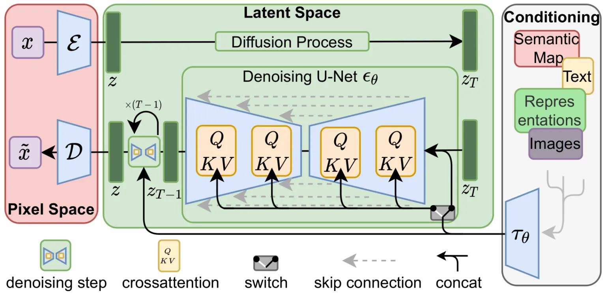
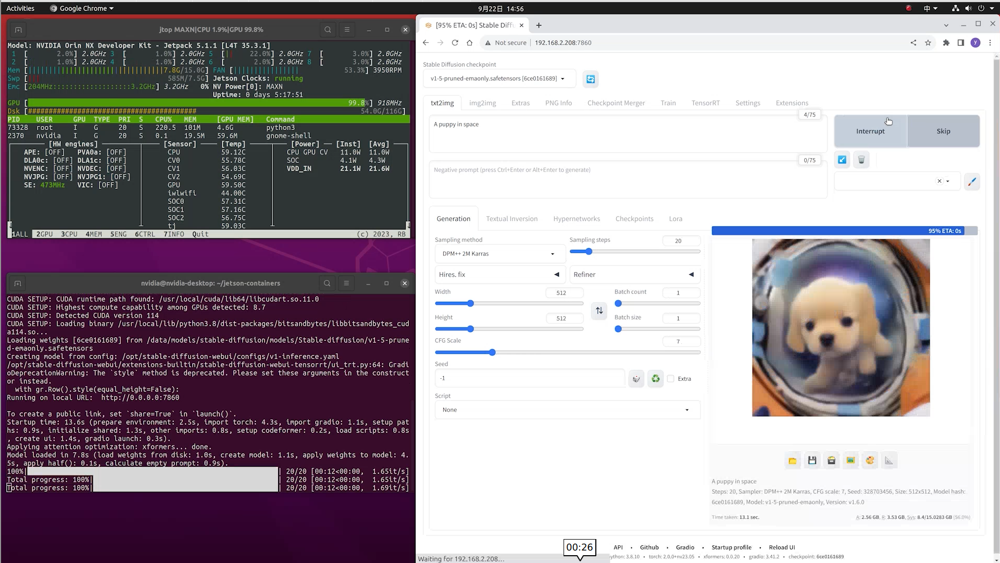

# Local Intelligent Question Answering System

This article will delve into the field of image generation, focusing on diffusion models. By integrating cutting-edge technologies such as the working principles of DALL·E and Stable Diffusion, we aim to understand their practical applications and development potential.

## Introduction to Diffusion Models in Image Generation

<p align="center">
    
</p>

Image source：https://chrislee0728.medium.com/%E5%BE%9E%E9%A0%AD%E9%96%8B%E5%A7%8B%E5%AD%B8%E7%BF%92stable-diffusion-%E4%B8%80%E5%80%8B%E5%88%9D%E5%AD%B8%E8%80%85%E6%8C%87%E5%8D%97-ec34d7726a6c 

Diffusion models are a type of generative model that creates new images through a reverse diffusion process. Starting from Gaussian noise, diffusion models progressively infer the original image. This process can be seen as simulating a gradual “denoising” procedure for image generation. It is a very powerful and efficient method of generation that has received widespread attention in recent years.

## The Mechanism of Stable Diffusion

The working principle of Stable Diffusion is based on the reverse process of diffusion models. The fundamental idea of diffusion models is to start with a completely random noise image and progressively infer a clear image. This process is divided into two stages:

1. Forward Diffusion Process During the forward diffusion process, given a real image, noise is gradually added until it becomes a completely random noise image. This process can be understood as the “destructive” step of the image. Noise is typically added incrementally through a Gaussian distribution, with each step making the image more blurred and noisy.

2. Reverse Diffusion Process The reverse diffusion process is the core functioning part of Stable Diffusion. Given a completely random noise image, the model learns how to progressively denoise it to restore the original image. The reverse process is the opposite of the forward process; it uses a pre-trained neural network model to infer a clearer image at each step. Each step of the reverse process involves the model predicting the magnitude of the current noise and subtracting it from the current image to obtain a less noisy image. Ultimately, after multiple reverse steps, the model can generate a clear and high-resolution image from pure noise.

<p align="center">
    
</p>

Image source：https://sushant-kumar.com/blog/ddpm-denoising-diffusion-probabilistic-models 

## Deploying the SD Model on Jetson Devices

We can quickly deploy Stable Diffusion WebUI on Jetson devices using the jetson-examples tool. This project allows users to load the Stable Diffusion model and configure workflows through a graphical interface.

**Step 1.** Install `jetson-examples` on your Jetson device Open a terminal on your Jetson device and enter:

```bash
pip3 install jetson-examples
```

Step 2. Use the jetson-examples tool to install the stable-diffusion-webui project with one command:

```bash
reComputer run stable-diffusion-webui
```

Step 3. Open your browser and go to `http://<ip-jetson>:7860`, and you can start generating images with Stable Diffusion.

<p align="center">
    
</p>

## More Reference Content
- https://wiki.seeedstudio.com/How_to_run_local_llm_text_to_image_on_reComputer/ 
- https://www.jetson-ai-lab.com/tutorial_stable-diffusion.html 
- https://github.com/Seeed-Projects/jetson-examples/blob/main/reComputer/scripts/comfyui/README.md 


