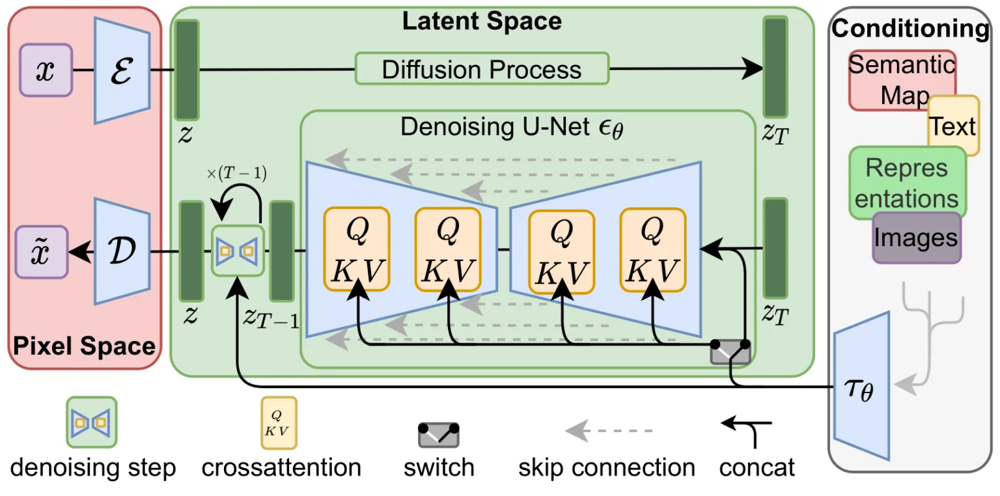
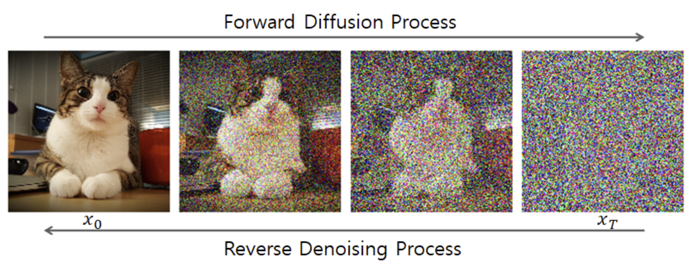
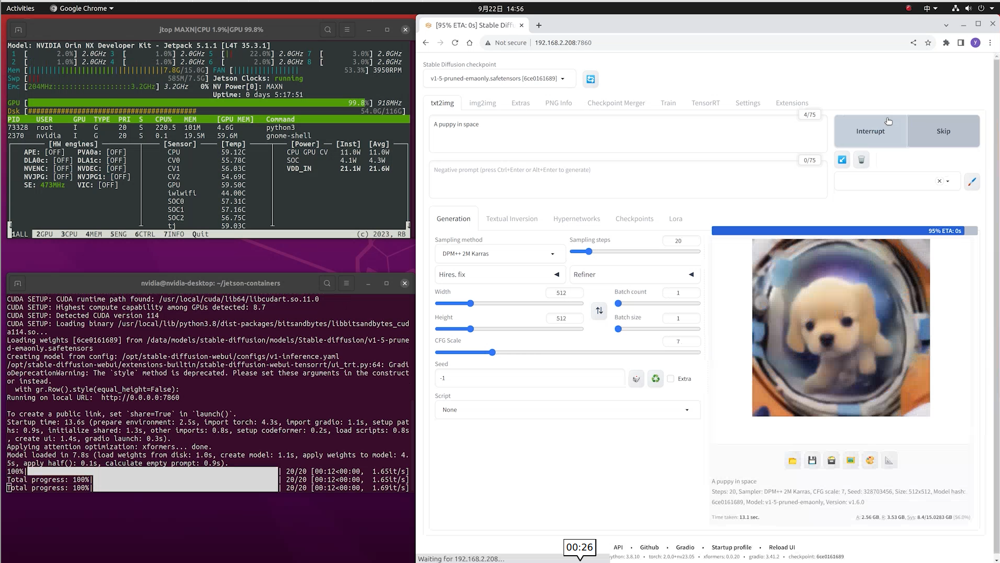

# 本地智能问答系统

本文将深入探讨图像生成领域中的扩散模型，结合前沿技术，如 DALL·E 和 Stable Diffusion 的工作原理，了解它们的实际应用与发展潜力。

## 图像生成中与扩散模型简介

<p align="center">
    
</p>

图片来源：https://chrislee0728.medium.com/%E5%BE%9E%E9%A0%AD%E9%96%8B%E5%A7%8B%E5%AD%B8%E7%BF%92stable-diffusion-%E4%B8%80%E5%80%8B%E5%88%9D%E5%AD%B8%E8%80%85%E6%8C%87%E5%8D%97-ec34d7726a6c 

扩散模型是一种生成模型，它通过反向扩散过程来生成新图像。扩散模型从高斯噪声开始，逐步推断出原始图像。这个过程可以看作是模拟图像生成的逐渐“去噪”过程。它是一种非常强大且高效的生成方式，近年来得到了广泛的关注。

## Stable Diffusion 的工作机制

Stable Diffusion 的工作原理基于扩散模型的反向过程。扩散模型的基本想法是从一幅完全随机的噪声图像开始，逐步推断出清晰的图像。这个过程分为两个阶段：

1.  正向扩散过程（Forward Diffusion Process）
在正向扩散过程中，给定一幅真实图像，它会逐步加入噪声，直到变成完全随机的噪声。这个过程可以理解为“破坏”图像的步骤。噪声通常是通过高斯分布逐步添加的，每一步都会使图像变得更加模糊和噪声化。
2. 反向扩散过程（Reverse Diffusion Process）
反向扩散过程是Stable Diffusion的核心工作部分。给定一个完全随机的噪声图像，模型通过学习如何逐步去噪，将其还原为原始图像。反向过程与正向过程相反，它通过一个预训练的神经网络模型在每一步中推断出更清晰的图像。反向过程的每一步通过模型预测当前噪声的大小，并将其从当前图像中减去，从而得到更少噪声的图像。最终，在经过多个反向步骤后，模型可以从纯噪声生成一幅清晰且高分辨率的图像。

<p align="center">
    
</p>

图片来源：https://sushant-kumar.com/blog/ddpm-denoising-diffusion-probabilistic-models 

## 在 Jetson 设备中部署SD模型

我们可以利用 jetson-examples 工具快速在 Jetson 设备中部署 Stable Diffusion WebUI。该项目允许用户通过图形界面加载 Stable Diffusion 模型并配置工作流程。

**step1.** 在 Jetson 设备中安装 jetson-examples
在 jetson 设备中打开终端并输入：

```bash
pip3 install jetson-examples
```

**step2.** 使用 `jetson-examples` 工具一键安装 stable-diffusion-webui 项目

```bash
reComputer run stable-diffusion-webui
```

**step3.** 浏览器打开 `http://<ip-jetson>:7860`，即可使用 Stable Diffusion 生成图片

<p align="center">
    
</p>

## 更多参考内容
- https://wiki.seeedstudio.com/How_to_run_local_llm_text_to_image_on_reComputer/ 
- https://www.jetson-ai-lab.com/tutorial_stable-diffusion.html 
- https://github.com/Seeed-Projects/jetson-examples/blob/main/reComputer/scripts/comfyui/README.md 
