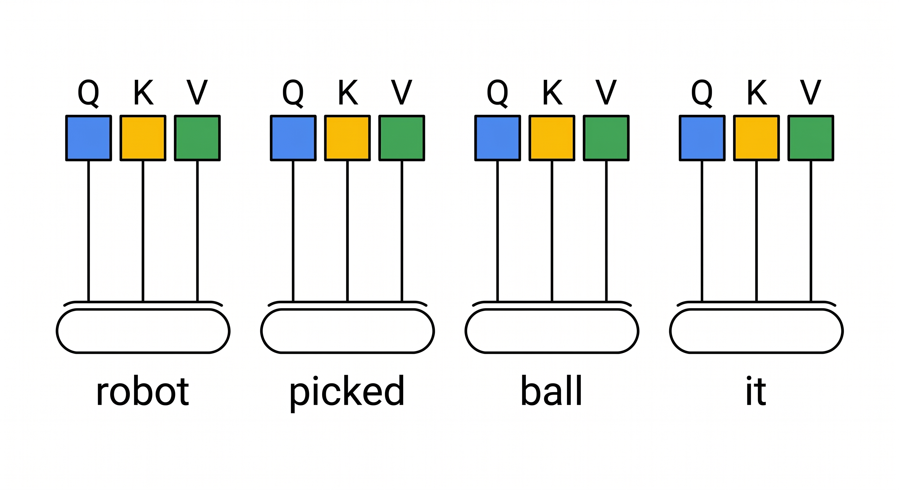
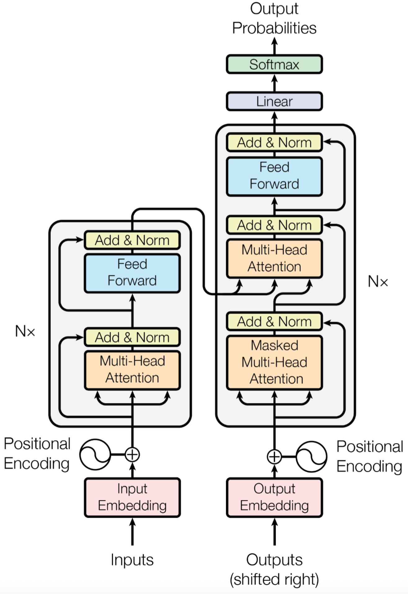

# Introduction to Large Language Models

## Introduction

What exactly is a Large Language Model? To answer that question, let's start with something familiar. Imagine you are composing a text message on your phone. After typing a few words, your phone suggests the next word—and sometimes it's accurate enough that you just tap the suggestion to keep typing. That predictive text feature is a very simple form of language model. A Large Language Model (LLM) operates on the same basic idea, but at a vastly larger scale.


An LLM is a neural network trained on enormous volumes of text—books, articles, websites, code, and more. During this training process, the model reads billions of sentences and learns the statistical relationships between words and phrases. It discovers patterns such as: when **certain words appear, what words tend to follow**; how sentences are structured; how context changes meaning; and how different pieces of information relate to each other. Once training is complete, the model can generate coherent, contextually appropriate text in response to a prompt you provide.

The "large" in Large Language Model refers to two things simultaneously. First is the scale of training data—modern LLMs are trained on datasets containing hundreds of billions to trillions of tokens (where a token is roughly a word or part of a word). Second is the model itself—these models contain billions of parameters, which are the internal numerical values that encode everything the model has learned. A model with 7 billion parameters, for example, has 7 billion tunable numbers that together represent its knowledge of language.


Why does this matter for you as a Jetson developer? Until recently, running a model of this scale required expensive cloud servers with multiple high-end GPUs. The major breakthrough in the past two years is that techniques like quantization—compressing the model's numerical precision—now make it possible to run capable LLMs on edge devices like the NVIDIA Jetson Orin Nano and Orin NX. This means you can build AI-powered applications that run entirely offline, keeping your data private and eliminating dependence on internet connectivity.

## How LLMs Work

Now that you understand what an LLM is, the natural question is: how does it actually produce text? The answer revolves around one core operation—predicting the next token in a sequence.

### Tokens: The Building Blocks

Before we discuss how the model generates text, we need to clarify what it means to process text as "tokens." An LLM does not read raw text the way humans do. Instead, a tokenizer breaks your input into smaller units called tokens. A token might be a whole word like "computer," a common word fragment like "the," or even a single character in an unfamiliar language. For example:

```
"The reComputer runs Linux"
→ ["The", " re", "Computer", " runs", " Linux"]   (5 tokens)
```

The tokenizer's vocabulary typically contains between 30,000 and 100,000 tokens. Every piece of text the model sees is converted into a sequence of these tokens before any processing happens.

### The Training Process

Training an LLM involves three key stages, each building on the previous one:


**Stage 1 — Pre-training on raw text.** The model is fed enormous quantities of text (common sources include Common Crawl, Wikipedia, GitHub repositories, and published books). During this stage, the model's task is deceptively simple: given a sequence of tokens, predict the next token. For instance, when the model sees "The Eiffel Tower is located in," it learns that "Paris" is the most likely next token. By repeating this exercise across billions of examples, the model gradually builds an internal representation of grammar, facts, reasoning patterns, and even programming logic.

**Stage 2 — Supervised Fine-Tuning (SFT).** After pre-training, the model has broad knowledge but no idea how to behave as a useful assistant. In this stage, human annotators create examples of high-quality prompt-response pairs. The model is trained on these examples to learn the format and style of helpful responses.

**Stage 3 — Alignment (RLHF or similar).** In the final stage, human evaluators rank multiple model responses from best to worst. This feedback trains a reward model, which in turn guides the LLM to produce responses that are more helpful, harmless, and honest. This is why modern chat models produce more coherent and useful answers than their pre-training stage alone would suggest.


### Inference: Generating Text One Token at a Time

Once training is complete, the model generates text through a process called inference. Here is exactly what happens when you type a prompt:

```
Prompt: "The capital of France is"
```

The tokenizer converts this into token IDs. The model processes these tokens and produces a probability distribution over all tokens in its vocabulary. The token "Paris" receives the highest probability, so it is selected and appended to the output. The updated sequence now reads "The capital of France is Paris," and the model repeats the process—predicting the next token again. This continues until the model outputs a special end-of-sequence token, or until a maximum length limit is reached.

```
Step 1: "The capital of France is"         → predict "Paris"
Step 2: "The capital of France is Paris"    → predict "and"
Step 3: "The capital of France is Paris and"→ predict " the"
Step 4: ...continues until completion
```


A critical point worth understanding: the model does not "know" the answer in the way a database lookup works. It produces text that is statistically likely given its training data. This is why LLMs can sometimes generate plausible-sounding but incorrect statements—a limitation you should keep in mind when building applications.

The entire process—from your prompt to the complete response—is what happens during every interaction with an LLM. In the next section, we will look at the specific neural network architecture that makes all of this possible.

<p align="center">
  
  <br>
  <sub>How Large Language Models Process and Generate Text</sub>
</p>


## The Transformer Architecture

Nearly all modern LLMs are based on the **Transformer architecture**, introduced in the landmark paper "**Attention Is All You Need**" (2017) by researchers at Google. This single paper fundamentally changed the trajectory of AI—and the models you'll run on Jetson (Llama, Qwen, DeepSeek, Gemma) are all direct descendants of this architecture.

The key innovation is the **self-attention mechanism**, which allows the model to weigh the importance of different words when processing text—enabling it to understand context, relationships, and meaning at an unprecedented level.

<p align="center">
  
  <br>
  <sub>The Transformer: Foundation of Modern LLMs</sub>
</p>

### From Sequential to Parallel: Why Transformers Won

Before Transformers, models like **RNNs** (Recurrent Neural Networks) and **LSTMs** processed text **one word at a time**, sequentially from left to right. This caused two major problems:

1. **Slow**: Each word depended on the previous word's computation—no parallelism possible
2. **Forgetful**: By the time the model reached the 100th word, it had largely "forgotten" the 1st word

```
RNN (Old):     "The" → "cat" → "sat" → "on" → "the" → "mat"   (slow, sequential)
Transformer:   ["The", "cat", "sat", "on", "the", "mat"] → all at once!   (fast, parallel)
```

The Transformer solved both problems by processing **all words simultaneously** through self-attention. This made training dramatically faster and enabled models to capture long-range relationships effectively.


### How Self-Attention Works

Self-attention is the **core innovation** of the Transformer. Let's understand it through a concrete example.

**A Real-World Analogy — The Interview Selection Process:**

Imagine you are hiring for a position and received 5 resumes. You need to evaluate each candidate by comparing them against a "job description" (what you're looking for). Here's how self-attention works:

- **Each resume is both a candidate and a job description** — sounds strange, but that's exactly how self-attention treats every word in a sentence
- The "job description" for evaluating candidate A is called the **Query** (Q)
- Every resume has a "job qualifications" section — these are the **Keys** (K)
- The actual resume content (experience, skills, education) is the **Value** (V)

Now imagine you want to figure out what the word **"it"** refers to in this sentence:

> *"The robot picked up the ball because **it** was heavy."*


Here's the step-by-step process:

**Step 1: Generate Q/K/V for each word**

**Each word** in the sentence generates its own Query, Key, and Value vectors. Think of it as each word preparing both a "search question" and "content to share":

| Word | Query (What I'm looking for) | Key (What I offer) | Value (My content) |
|:-----|:-----------------------------|:-------------------|:-------------------|
| "robot" | "what is heavy/weight-related?" | "I am a robot, can be heavy" | robot's actual features |
| "picked" | "what is an object?" | "I am an action" | picking action details |
| "ball" | "what is heavy?" | "I am a ball, can be heavy" | ball's features |
| "it" | "what does 'it' refer to?" | "I represent something" | — |

   

**Step 2: Compute relevance scores — the dot product**

For the word "it", we take its Query vector and compute dot products with the Key vectors of ALL other words:

```
"it" Query × "robot" Key = 0.2 (low relevance — robots aren't typically described as heavy in this context)
"it" Query × "picked" Key = 0.1 (irrelevant — "picked" has nothing to say about weight)
"it" Query × "ball" Key = 0.9 (high relevance — balls can definitely be heavy!)
```


**Step 3: Apply softmax to normalize**

These raw scores pass through softmax, which converts them to probabilities that sum to 1:

```
"ball":  0.82 (82% — "it" most likely refers to "ball")
"robot": 0.15 (15%)
"picked": 0.03 (3%)
```

**Step 4: Weighted sum of Values**

Now we combine all the Value vectors using these weights:

```bash
New "it" representation = 0.82 × ball.Value + 0.15 × robot.Value + 0.03 × picked.Value
```

The result? The word "it" now "knows" it's referring to the ball, and carries that meaning forward.

**Step 5: Repeat for EVERY word**

This exact process happens for **every word in the sentence simultaneously**. "robot" looks at "ball", "picked", etc. to understand its context. "ball" looks at "robot" and "picked". Everyone is simultaneously "looking at" everyone else through the Query-Key-Value mechanism.

**The Mathematics:**

This process can be written as:

```
Attention(Q, K, V) = softmax( Q × Kᵀ / √dₖ ) × V
```

Where `dₖ` is the vector dimension and `√dₖ` is a scaling factor that prevents numbers from getting too large during the dot product calculation. The key takeaway isn't the formula—it's this: **each word computes how relevant every other word is to itself, then gathers information accordingly.**

<p align="center">
  
  <br>
  <sub>Self-Attention: Words Paying Attention to Each Other</sub>
</p>


### Multi-Head Attention

In the previous section, you saw how self-attention lets every word look at every other word and compute relevance scores. The result is a new set of vectors where each word has already blended in context from the words it attended to. This is powerful, but it has a limitation: **a single attention pass can only capture one type of relationship at a time**.

Consider "The robot picked up the ball because it was heavy." The link between "it" and "ball" (pronoun reference) and the link between "robot" and "picked" (subject-verb) are **two fundamentally different kinds of relationships**. A single attention computation can discover one, but to capture multiple relationship types simultaneously, you need **multiple attention passes in parallel**.

**Multi-Head Attention** does exactly this. The idea is straightforward: instead of running attention once, run it **multiple times in parallel**, letting each "head" learn its own independent pattern of relationships.

Concretely, each head has its own separate set of Q, K, V weight matrices. This means that for the same word, each head maps it into **different** Q, K, V vectors, causing it to attend to **different** other words. Four heads processing the same sentence are like four observers looking through different-colored filters, each seeing a different "facet" of the sentence:

```
Sentence: [The] [robot] [picked] [up] [the] [ball] [because] [it] [was] [heavy]

Head 1 (grammar):      robot ↔ picked   picked ↔ up
Head 2 (proximity):    the ↔ robot      picked ↔ up
Head 3 (semantics):    heavy ↔ ball     robot ↔ machine
Head 4 (reference):    it ↔ ball
```


**All four heads run simultaneously**, each producing its own attention output. The four outputs are then **concatenated** and passed through a linear transformation to merge them into a single unified output:

```
   Head 1 (grammar)    Head 2 (proximity)    Head 3 (semantics)    Head 4 (reference)
        ↓                    ↓                      ↓                    ↓
   [output 1]           [output 2]             [output 3]           [output 4]
        ↓                    ↓                      ↓                    ↓
                       Concatenate + Linear Transform
                                   ↓
                    [Unified output carrying all four types of information]
```

This unified output carries all four dimensions of relationship information at once, ready for the next network layer. This is why Transformers understand language so deeply — rather than viewing a sentence from a single angle, they **analyze it from multiple dimensions in parallel**.

### The Transformer Block Structure



You now understand the core of multi-head attention: through multiple parallel attention heads, every word can simultaneously understand the sentence from grammar, semantics, and reference perspectives. But attention alone is not the whole picture. A Transformer model is built by stacking many identical **blocks** on top of each other — Llama 3.2 3B, for example, stacks **28 of them**. These building blocks are called **Transformer Blocks**, and each one follows the same internal flow.

**Stage 1 — Multi-Head Self-Attention.** As you already know, every word looks at every other word, computes relevance scores through Query-Key matching, and gathers information from its most relevant neighbors. The output is a new representation for each word that now carries contextual information from across the entire sentence.

**Stage 2 — Feed-Forward Network (FFN).** After attention enriches each word with context, the FFN processes each word **independently**. Think of it as a small two-layer neural network whose job is to ask: "Now that I know the context, what deeper features can I extract from this word?" The FFN stores a surprising amount of the model's actual "knowledge" — it acts as a per-word reasoning engine.

Between and around these two stages, two important safeguards keep the deep network trainable:

- **Residual Connection (Add):** After both the Attention and FFN stages, the original input is added back to the output. This is like installing a fuse on an appliance — even if an intermediate module produces an imperfect result, the original information is never lost. Without this mechanism, in a stack of 28 layers, the training signal (gradient) would decay to nearly zero during backpropagation, and the model would fail to learn entirely.

- **Layer Normalization:** After the residual addition, all values are rescaled to a stable range. Think of it as a voltage regulator in an electrical circuit — it prevents the signal from "exploding" after passing through 28 consecutive amplification stages.

The complete structure of one Transformer Block looks like this:

```
┌──────────────────────────────────────────────┐
│              Transformer Block                │
│                                               │
│  Input (vector representation of each word)   │
│         ↓                                     │
│  ┌────────────────────────────────────────┐  │
│  │  Multi-Head Self-Attention              │  │
│  │  (Each word gathers context from all)  │  │
│  └────────────────────────────────────────┘  │
│         ↓                                     │
│  Add original input (Residual Connection)     │
│         ↓                                     │
│  Layer Normalization                          │
│         ↓                                     │
│  ┌────────────────────────────────────────┐  │
│  │  Feed-Forward Network                   │  │
│  │  (Each word processed independently)   │  │
│  └────────────────────────────────────────┘  │
│         ↓                                     │
│  Add original input (Residual Connection)     │
│         ↓                                     │
│  Layer Normalization                          │
│         ↓                                     │
│  Output → fed into the next block             │
└──────────────────────────────────────────────┘
```

The critical insight is that **each successive block builds a deeper level of abstraction**. Early blocks capture basic syntax — which words are neighbors, which words are subjects or objects. Middle blocks begin assembling semantics — "the ball" is a noun phrase, "was heavy" is a description. By the final blocks, the model has built a rich, multi-layered understanding of the entire input, ready for accurate next-token prediction.

### Encoder vs Decoder

The original Transformer architecture described in "Attention Is All You Need" (2017) actually had **two halves**, each with a different job. Understanding this split helps explain why modern LLMs are built the way they are.

**The Encoder — the reader.** The Encoder's job is to read an entire input sentence in one pass and build a deep understanding of every word in context. It uses **bidirectional attention** — meaning each word can look at every other word, both to its left and to its right. Because it sees the full sentence at once, the Encoder excels at **comprehension tasks**: summarizing a paragraph, classifying sentiment, or extracting the main topic of a document. **BERT** is the best-known Encoder-only model, and **Qwen** and **Gemma** also offer Encoder variants.

**The Decoder — the writer.** The Decoder's job is fundamentally different: it generates text **one token at a time**, from left to right. It uses **masked self-attention**, which means when predicting the third word, it can only see the first and second words — never the future. This enforced blindness is essential: if the model could "cheat" by peeking at the answer, it would never learn to generate on its own. **GPT, Llama, and DeepSeek** all use this Decoder-only architecture.

**Encoder-Decoder — both together.** Some tasks require both understanding and generation: translating a sentence from English to Chinese, for example, requires reading the entire English sentence first (Encoder), then generating the Chinese translation word by word (Decoder). **T5** and **Whisper** (the speech recognition model you encountered earlier in this chapter) use this combined architecture.

The reason modern LLMs like Llama, GPT, Qwen, and DeepSeek settled on **Decoder-only** is elegantly simple: a Decoder trained on enough data learns to both understand and generate text. When it predicts the next token, it must implicitly understand everything that came before — and that implicit understanding turns out to be sufficient for a remarkably wide range of tasks.

### Positional Encoding: Knowing Word Order

In the previous sections, you saw how self-attention lets every word look at every other word and compute relevance scores. But there is a subtlety that is easy to miss: **attention has no idea what order the words appear in**. It computes relevance between all word pairs, but the calculation is entirely independent of position.

This means if you fed "The cat chased the dog" and "The dog chased the cat" into the model, from attention's perspective the computations would be **identical** — both sentences contain the exact same words, just in a different order. That is clearly unacceptable: rearranging the same words changes the meaning entirely.

**Positional encoding** is designed to solve exactly this problem. The idea is intuitive: before each word's vector is fed into attention, add a **position fingerprint** — a mathematically crafted vector whose sole purpose is to say "this word sits at this position." Think of it like a seat number in a movie theater: the seat number tells you nothing about the film, but it lets you always distinguish row 3 seat 5 from row 10 seat 2.

In practice, each position's fingerprint is generated using sine and cosine functions:

```
Position 0: "What"   + [0.00, 1.00, 0.00, 1.00, ...]
Position 1: "is"     + [0.84, 0.54, 0.84, 0.54, ...]
Position 2: "Jet"    + [0.91, -0.42, 0.91, -0.42, ...]
```

Why sine and cosine? Because adjacent positions always produce slightly different fingerprint values, and these values are continuous (not simple integers 0, 1, 2). This means even if the model was only trained on sentences up to 100 positions long, it can generalize to 200-position sentences — the "rhythm" of the positional encoding is predictable and regular.

Modern models like Llama and Qwen have upgraded to **RoPE** (Rotary Position Embedding). Rather than *adding* a position value, RoPE *rotates* each word's vector in high-dimensional space by an angle determined by its position. This brings an extra benefit: the **relative distance** between two words (how many positions apart they are) is directly reflected in the angle difference between their rotated vectors, not just their absolute positions. This makes the model more stable and flexible when handling text of varying lengths.

### Step-by-Step: How a Transformer Processes Text

Now that you have learned all the core components of a Transformer, let's trace through a complete example to see how they work together. We will follow the question: **"What is Jetson?"**

**Step 1 — Tokenization**
The raw input text is split into tokens (typically subword fragments):
```
"What is Jetson?" → ["What", "is", "Jet", "son", "?"]   (5 tokens)
```

**Step 2 — Embedding**
Each token is converted to a high-dimensional numerical vector. Llama 3.2 3B, for instance, produces a 3072-dimensional vector for each token:
```
"What" → [0.23, -0.45, 0.67, ..., 0.12]   (3072 numbers)
"is"   → [0.12, 0.89, -0.34, ..., 0.56]
"Jet"  → [0.78, 0.11, 0.56, ..., -0.33]
"son"  → [0.45, -0.23, 0.91, ..., 0.78]
"?"    → [0.67, 0.34, -0.12, ..., 0.45]
```

**Step 3 — Add Positional Encoding**
A positional encoding vector is added to each token's embedding, giving the model awareness of word order, as explained in detail in the previous section.

**Step 4 — Self-Attention (repeated over N layers)**
The model computes attention scores between all tokens to find relationships:
```
"What" pays most attention to:   "?" (0.5), "Jet" (0.4), "is" (0.3)
"is"  pays most attention to:   "What" (0.4), "Jetson" (0.5)
"Jet" pays most attention to:   "son" (0.8), "is" (0.3)
```
After attention, each token's representation now contains information from the words it attended to.

**Step 5 — Feed-Forward Network**
Each token's enriched representation is processed independently through a small neural network to extract higher-level features.

**Step 6 — Repeat (N layers stacked)**
Steps 4 and 5 repeat many times (28 times for Llama 3.2 3B). Each layer builds a deeper level of understanding:
- **Early layers** capture basic syntax and local relationships (word order, collocations)
- **Middle layers** assemble semantics ("Jetson" is a noun referring to a computing platform)
- **Late layers** form high-level, task-specific understanding ready for prediction

**Step 7 — Output Prediction**
The final token's representation is projected onto the entire vocabulary, and the token with the highest probability is selected as the model's prediction for the next word:
```
{"NVIDIA": 0.92, "AI": 0.03, "a": 0.02, ...}
→ Prediction: "NVIDIA" (highest probability)
```

### Key Transformer Concepts

| Concept | Description | Example |
|:--------|:------------|:--------|
| **Context Window** | Maximum number of tokens the model can process at once | Llama 3.2: 128K tokens |
| **Parameters** | The learned weights that determine the model's capabilities | Llama 3.2 3B = 3 billion parameters |
| **Layers** | Number of Transformer blocks stacked together | Llama 3.2 3B: 28 layers |
| **Hidden Size** | Dimensionality of each token's representation | Llama 3.2 3B: 3072 dimensions |
| **Attention Heads** | Number of parallel attention computations | Llama 3.2 3B: 24 heads |

### Scaling Laws: Why Bigger Models Are Smarter

One of the most striking discoveries in AI research is that Transformer performance follows **scaling laws** — predictable improvements as you increase the scale of the model, the data, or the compute budget. This discovery explains the rapid leap in AI capability over the past decade.

Scaling laws involve three key dimensions:

- **More Parameters (Model Size):** Increasing the number of parameters — from 3 billion to 70 billion, for example — significantly boosts the model's depth of understanding and expressiveness. Larger models can capture more subtle patterns and hold more knowledge.

- **More Training Data:** A larger model trained on insufficient data is like a big eater given a small meal — it cannot reach its potential. Research shows that model size and training token count should ideally scale together, roughly at a 1:1 ratio.

- **More Compute:** Training larger models demands more GPU time and budget. Major AI labs can spend hundreds of millions of dollars on a single training run, which is why their proprietary models far exceed what open-source projects can achieve.

Because all three dimensions have scaled together, the field has progressed from the original Transformer in 2017 (just 110 million parameters) to today's 70 billion+ parameter models. For your Jetson device, the more important implication is this: **even 1-billion to 3-billion parameter models possess solid understanding and generation capabilities** — more than enough to provide practical AI services at the edge.

## Model Sizes and Local Deployment

Not all LLMs are the same size. Understanding model scale is crucial for choosing the right one for your hardware — **parameter count directly determines memory requirements and inference speed**:

| Model Size | Parameters | VRAM / RAM Needed (FP16) | Quality | Speed on Jetson |
|:-----------|:-----------|:--------------------------|:--------|:----------------|
| Light | 1B–3B | 2–6GB | Basic | Very fast |
| Small-Medium | 7B–8B | 14–16GB | Good | Moderate |
| Medium | 13B–14B | 26–28GB | Excellent | Slow |
| Large | 70B+ | 140GB+ | Outstanding | Not practical locally |

**For Jetson devices**, the sweet spot is **1B to 8B**. Models in the 1B–3B range deliver very smooth interactive experiences on Orin Nano, while 7B–8B models run reliably on the 16GB Orin NX.

> Tip: After quantization (covered next), memory usage drops dramatically. A 7B model at INT4 quantization requires only about 3.5GB of memory — small enough to run on virtually any Jetson device.

## Popular Open-Source LLM Families

Here are the most prominent open-source LLM families, all of which offer variants that run well on Jetson:

### Llama (Meta)
Meta's open-source LLM — currently the most active community and the richest ecosystem.
- **Llama 3.2** comes in 1B and 3B sizes, purpose-built for edge devices with an excellent balance of performance and footprint
- Supports multiple languages; the community provides a wide range of fine-tuned variants
- Best-supported model family in both Ollama and llama.cpp ecosystems

### Qwen (Alibaba Cloud)
Alibaba's open-source LLM, leading among open models in Chinese language capability.
- **Qwen3** spans from 0.6B to 32B parameters; the 0.6B variant is ideal for resource-constrained edge scenarios
- Excellent bilingual support in both Chinese and English
- Natively supports tool use and chain-of-thought reasoning

### DeepSeek
A model family focused on reasoning, excelling in math, coding, and logical tasks.
- **DeepSeek-R1** offers distilled versions (1.5B, 7B, 8B) that significantly outperform same-sized models on reasoning benchmarks
- Well-suited for edge AI applications requiring precise logical analysis
- The 7B distilled version is one of the best value-for-performance reasoning models on Jetson

### Phi (Microsoft)
Microsoft's compact model family, built on the philosophy of "fewer parameters, higher quality."
- **Phi-4-mini** has only 3.8B parameters yet matches or exceeds many 7B models on standard benchmarks
- Designed specifically for resource-constrained environments — a natural fit for edge deployment
- Trained on high-quality "textbook-grade" data using a distinctive training methodology

### Gemma (Google)
Google's lightweight open-source model family, covering 1B to 27B parameters.
- **Gemma 3** in its 1B and 4B variants runs very well on Jetson
- Strong performance on both language understanding and code generation
- Available in both pre-trained and instruction-tuned versions

## Quantization: Making Models Smaller

To run a 7-billion-parameter model smoothly on an edge device like a Jetson, you need to apply **quantization** — reducing the numerical precision of the model's internal weights, trading "perfect but heavy" high-precision numbers for "rough but good enough" low-precision ones, dramatically shrinking memory usage.

Intuitively, it is like compressing a 4K image down to 720p: the content is fully preserved, but the file size shrinks many times over. For a 7B model, the memory savings at different precision levels are substantial:

| Precision | Bits | Memory (7B model) | Quality Impact |
|:----------|:-----|:------------------|:---------------|
| FP32 | 32-bit | ~28GB | None (reference) |
| FP16 | 16-bit | ~14GB | Minimal |
| INT8 | 8-bit | ~7GB | Small — barely perceptible |
| INT4 (GGUF Q4) | 4-bit | ~3.5GB | Acceptable — the standard choice for edge deployment |

INT4 quantization is the workhorse of edge deployment: a 7B model fits in 3.5GB of memory, small enough to run smoothly on most Jetson devices.

### Common Quantization Formats

Different inference engines support different quantized file formats, each with its own strengths:

- **GGUF** (llama.cpp ecosystem): The dominant format for local inference — supported natively by Ollama and llama.cpp, self-describing, and ready to run out of the box
- **SafeTensors** (HuggingFace ecosystem): Safer (does not execute arbitrary code on load), and the standard format for vLLM and HuggingFace-based pipelines
- **AWQ** (Activation-aware Weight Quantization): Optimized for GPU inference, commonly used with vLLM, and the best performer for high-throughput scenarios

## Inference Frameworks Overview

Once a model is trained, you need an **inference framework** to actually run it on your Jetson. This chapter covers three mainstream frameworks — each designed for a different stage of the journey, from first-timer to production deployment.

### Ollama — The Simplest Way to Start

Ollama is the fastest path to running an LLM locally. One-line installation, built-in model downloading and management — it works out of the box and is very beginner-friendly:

```bash
# Install Ollama
curl -fsSL https://ollama.com/install.sh | sh

# Run a model (first launch downloads automatically)
ollama run llama3.2:3b
```

**Best for:** First-time LLM experience, rapid prototyping, learning and exploration

### llama.cpp — The Most Precise Control

llama.cpp is a lightweight C/C++ implementation that runs models efficiently on CPU and GPU. Its strengths are minimal resource usage and broad support for quantized formats — making it the go-to choice for resource-constrained edge devices:

```bash
# Clone and build
git clone https://github.com/ggerganov/llama.cpp
cd llama.cpp && make -j$(nproc)

# Run inference
./llama-cli -m model.gguf -p "Hello, how are you?"
```

**Best for:** Scenarios that demand maximum control and performance optimization; lightweight edge deployment

### vLLM — Production-Grade Serving

vLLM is a high-performance inference serving framework designed for production deployments. It supports advanced features like PagedAttention (memory-paging management that dramatically boosts concurrency) and continuous batching, with an OpenAI-compatible API:

```bash
# Install vLLM
pip install vllm

# Start the API server
vllm serve meta-llama/Llama-3.2-3B --host 0.0.0.0 --port 8000
```

**Best for:** Production API serving, high-concurrency, high-throughput scenarios

## Comparison Table

Each framework has its strengths. The right choice depends on your specific needs:

| Feature | Ollama | llama.cpp | vLLM |
|:--------|:-------|:----------|:-----|
| **Ease of Use** | Very easy, one command | Moderate, build from source | Moderate, pip install |
| **Installation** | One-line script | Build from source | pip install |
| **Model Formats** | GGUF (built-in) | GGUF | SafeTensors, AWQ |
| **GPU Acceleration** | Yes (CUDA) | Yes (CUDA, Metal) | Yes (CUDA) |
| **Built-in API Server** | Yes | Optional (llama-server) | Yes |
| **OpenAI Compatible** | Yes | No | Yes |
| **Memory Efficiency** | Good | Excellent (lowest footprint) | Good |
| **Batch / Concurrency** | No | No | Yes (core advantage) |
| **Recommended For** | Local dev & testing | Maximum edge optimization | Production serving & API |

## What You Will Learn in This Chapter

The remainder of this chapter will walk you through setting up LLMs on your Jetson and building a complete voice-AI application:

### Module 5.2: Getting Started with Ollama
Install Ollama on your Jetson from scratch, pull your first model, and have a local conversation with an AI — entirely offline.

### Module 5.3: Running LLMs with llama.cpp
Go deeper under the hood: build llama.cpp from source, learn to load and run GGUF quantized models, and master fine-grained optimization techniques for edge devices.

### Module 5.4: High-Performance Inference with vLLM
Set up a production-grade LLM serving infrastructure with an OpenAI-compatible API, turning your Jetson into a local AI backend.

### Module 5.5: Jetson Examples Quick Start
Deploy LLMs with a single command using pre-built Docker containers from the jetson-examples repository, skipping all the tedious environment setup.

### Module 5.6: ASR + LLM + TTS Pipeline
Chain speech recognition (ASR), a large language model (LLM), and text-to-speech (TTS) into a complete **voice AI assistant** — all running offline on your Jetson.

## Practice: Assess Your Hardware

Before proceeding to the deployment modules, check your Jetson device's hardware capabilities so you can choose the right model:

```bash
# Check available memory
free -h

# Check GPU model and VRAM
nvidia-smi

# Check JetPack version (determines CUDA and TensorRT versions)
dpkg -l | grep nvidia-jetpack

# Check available storage
df -h /
```

Record your results:
- **Total RAM**: ______ GB
- **GPU VRAM**: ______ MB
- **Free Storage**: ______ GB
- **JetPack Version**: ___________

With these numbers, you can determine which model sizes will run comfortably on your device.

## Hands-On: Detecting Objects with a Vision-Language Model

Now that you understand how LLMs process text, let's see a **Vision-Language Model (VLM)** in action — one that can *see* images and describe what's in them. The example below uses Ollama to send a local image to a VLM, which returns object names and pixel coordinates. OpenCV then draws labeled bounding boxes on the image.

### Prerequisites

```bash
pip install ollama opencv-python Pillow
ollama pull llava:7b   # first time only, ~4.7GB
```

### Run

```bash
cd code/
python vlm_object_detector.py --image your_photo.jpg
python vlm_object_detector.py --image photo.jpg --model minicpm-v --output results.jpg
```

VLMs are not specialized detectors like YOLO (Chapter 4) — bounding box accuracy varies by model. The purpose of this exercise is to give you hands-on experience with the same token-based reasoning behind LLMs, extended to images through multimodal models — text and vision follow the same path inside a Transformer.

## Common Questions

### Can I run ChatGPT on Jetson?
Not exactly. ChatGPT is OpenAI's proprietary system running on massive server clusters. However, you can run open-source models that offer similar conversational abilities locally on your Jetson, with the added benefit of complete data privacy.

### Do I need internet access to use LLMs on Jetson?
After the initial model download, you can run LLMs entirely offline. This is one of the key advantages for edge deployments in areas with limited connectivity.

### How long does it take to generate a response?
Response time depends on the model size and your hardware. On a Jetson Orin NX 16GB running a 3B model, expect 10-30 tokens per second—fast enough for real-time conversations.

## References

- [Attention Is All You Need (Original Transformer Paper)](https://arxiv.org/abs/1706.03762)
- [The Illustrated Transformer](https://jalammar.github.io/illustrated-transformer/) - Visual guide by Jay Alammar
- [The LLM Course](https://fullstackdeeplearning.com/llm-bootcamp/) - Free comprehensive LLM course
- [Hugging Face LLM Course](https://huggingface.co/learn/nlp-course) - NLP and LLM fundamentals
- [Llama 3.2 Model Card](https://www.llama.com/docs/model-cards-and-prompt-formats/llama3_2/)
- [Qwen3 Documentation](https://qwenlm.github.io/)
- [NVIDIA Jetson AI Lab](https://www.jetson-ai-lab.com/) - AI development resources for Jetson

---

**Next**: Continue to [Module 5.2: Getting Started with Ollama](../5.2-Getting-Started-with-Ollama/README.md) to run your first LLM on Jetson!
