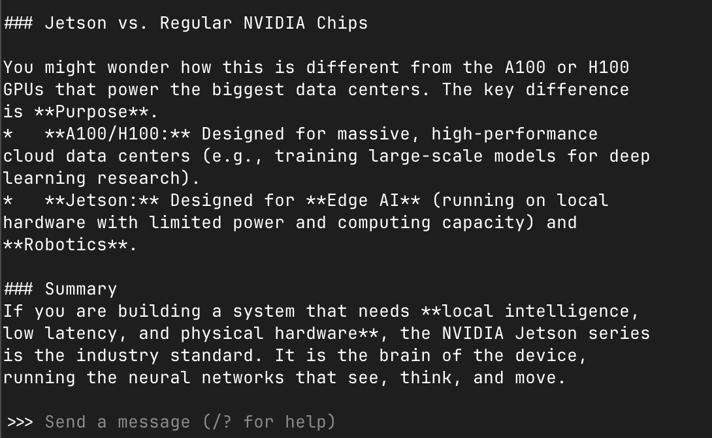
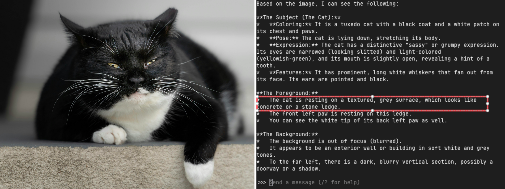
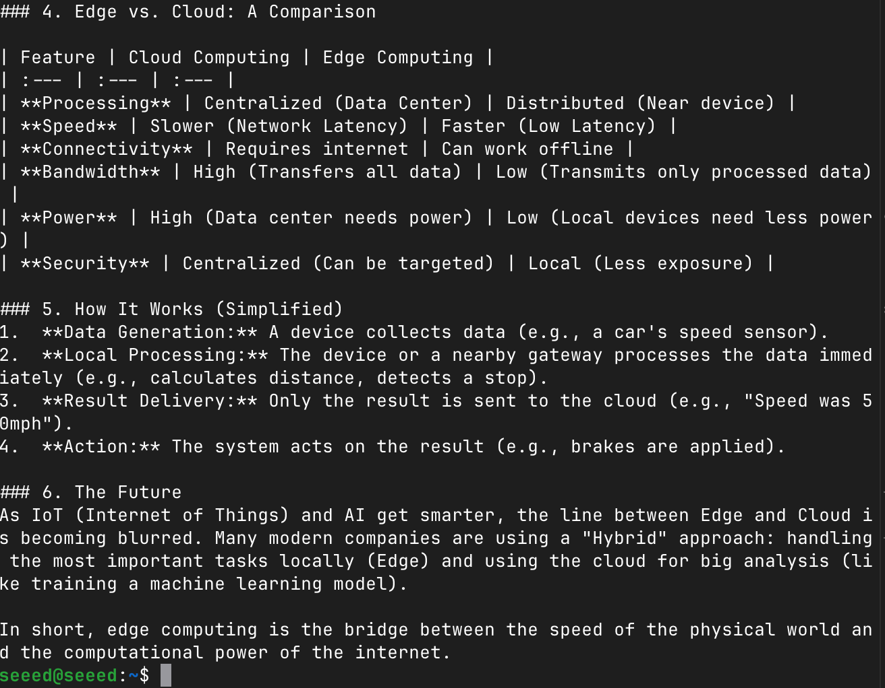
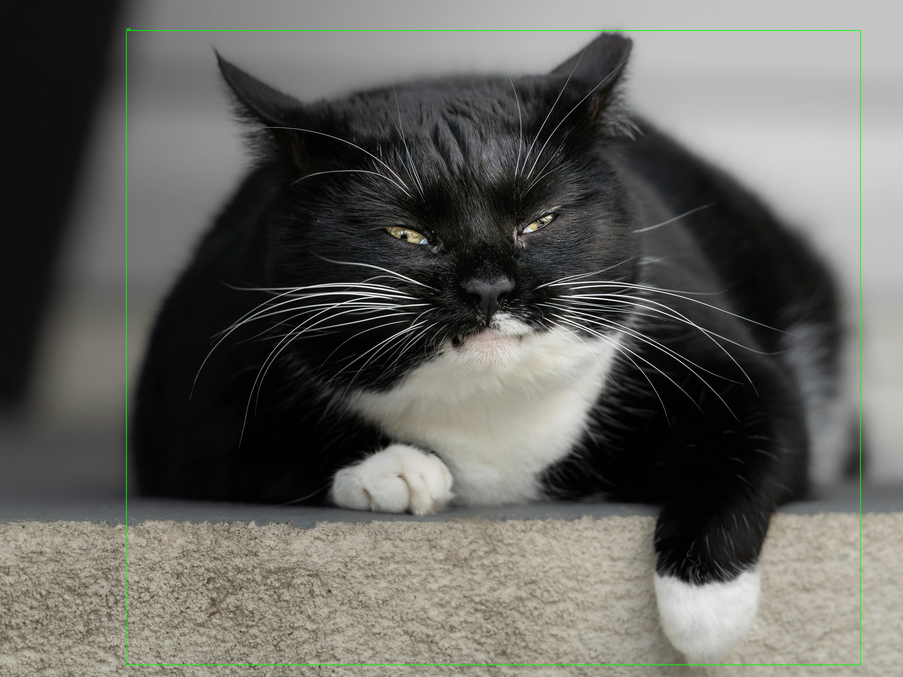
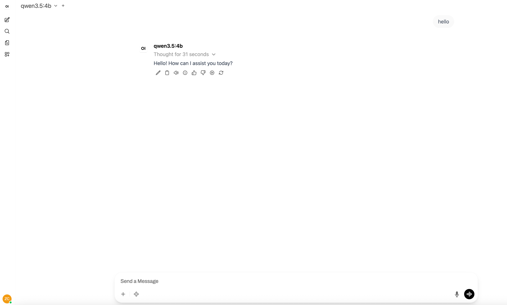

# Getting Started with Ollama

## Introduction

**Ollama** is the simplest way to run Large Language Models (LLMs) locally. Think of it as "Docker for LLMs"—it handles model downloading, storage, and inference with a clean command-line interface. No complex setup, no dependency headaches—just one command to install, and one command to start chatting.

In this module, you'll learn to:
- Install Ollama on your Jetson device
- Download and run your first LLM
- Explore different models and their capabilities
- Set up a web-based chat interface using Open WebUI

<p align="center">
  
  <br>
  <sub>Ollama - Run LLMs Locally with Ease</sub>
</p>


## Why Ollama?

| Feature | Description |
|:--------|:------------|
| **One-line Install** | Single command to get started |
| **Auto Model Management** | Automatically downloads and manages model files |
| **Simple Commands** | `ollama run modelname` to start chatting |
| **REST API** | Built-in HTTP server for integration |
| **Multiple Models** | Run different models side by side |
| **OpenAI Compatible** | API compatible with OpenAI's interface |

## System Requirements

Before installing Ollama, ensure your Jetson device meets these requirements:

| Requirement | Minimum | Recommended |
|:------------|:--------|:------------|
| **JetPack** | 5.1+ | 6.0+ |
| **RAM** | 8GB | 16GB+ |
| **Storage** | 10GB free | 50GB+ (for multiple models) |
| **Swap** | 8GB | 16GB |

> **First-time users**: If you haven't set up swap space on your Jetson, check [Chapter 3: Swap Configuration](../../3-Basic-Tools-and-Getting-Started/README.MD)

## Installing Ollama

### Method 1: Direct Installation (Recommended)

Open a terminal on your Jetson device and run:

```bash
# Download and install Ollama
curl -fsSL https://ollama.com/install.sh | sh
```

The installation script will:

1. Detect your system architecture (ARM64)
2. Download the appropriate Ollama binary
3. Set up the systemd service
4. Verify the installation

### Verify Installation

```bash
# Check Ollama version
ollama --version

# Check if the service is running
systemctl status ollama
```

## Your First LLM Interaction

Now let's run your first LLM. Ollama will automatically download the model on first run.

You can find the deployed models supported by Ollama [here](https://ollama.com/search). Select the model you wish to deploy on your device.

### Running a Model

```bash
# For example
ollama run qwen3.5:2b
```

Once downloaded, you'll see a chat prompt:

```bash
What is NVIDIA Jetson?
```

You will get the result like this:



### Useful Chat Commands

| Command | Description |
|:--------|:------------|
| `/?` | Show help |
| `/bye` | Exit the conversation |
| `Ctrl+D` | Exit the conversation |
| `/clear` | Clear conversation history |
| `/history` | Show conversation history |

## Exploring Different Models

### Vision-Language Models (Multimodal)

```bash
# Qwen3.5 - Understand images and text
ollama run qwen3.5:2b
#You can specify an image and let it describe the content within the image.
What can you see in /home/seeed/test.jpg
```



## Using the REST API

Ollama runs a local HTTP server on port 11434, making it easy to integrate with other applications.

### Send a Chat Request

```bash
# Simple text generation
curl http://localhost:11434/api/generate -d '{
  "model": "qwen3.5:2b",
  "prompt": "What is edge computing?",
  "stream": false
}'
```



### Python Integration

```python
import requests

def chat_with_ollama(prompt, model="qwen3.5:2b"):
    """Send a prompt to Ollama and get a response."""
    response = requests.post(
        "http://localhost:11434/api/generate",
        json={
            "model": model,
            "prompt": prompt,
            "stream": False
        }
    )
    return response.json()["response"]

# Example usage
response = chat_with_ollama("Write a simple Python function to calculate factorial")
print(response)
```

### OpenAI-Compatible API

```bash
#install openai sdk
pip install openai
```

Ollama provides an OpenAI-compatible endpoint, allowing you to use existing OpenAI client libraries:

```python
from openai import OpenAI

# Connect to local Ollama
client = OpenAI(
    base_url="http://localhost:11434/v1",
    api_key="not-needed"  # Ollama doesn't require an API key
)

response = client.chat.completions.create(
    model="qwen3.5:4b",
    messages=[
        {"role": "system", "content": "You are a helpful assistant."},
        {"role": "user", "content": "Explain quantum computing in simple terms."}
    ]
)

print(response.choices[0].message.content)
```


### VLM find object in image

```bash
pip install ollama
cd reComputer-Jetson-for-Beginners/5-Offline-Large-Model-Development/code
python vlm_object_detector.py
```

wait a minute you can see the result in img folder



## Setting Up Open WebUI

**Open WebUI** (formerly Ollama WebUI) provides a ChatGPT-like interface for interacting with your local models.

### Installation via Docker

```bash
# Pull the Open WebUI image
docker pull ghcr.io/open-webui/open-webui:main

# Create data directory
sudo mkdir -p /opt/seeed/open-webui/data

# Run the container
docker run -d \
  --restart always \
  --name open-webui \
  --network host \
  -v /opt/seeed/open-webui/data:/app/backend/data \
  -e OLLAMA_BASE_URL=http://127.0.0.1:11434 \
  ghcr.io/open-webui/open-webui:main

# Check container status
docker logs -f open-webui
```

### Accessing Open WebUI

Once the container is running:

1. Open a browser on your Jetson (or another device on the same network)
2. Navigate to `http://localhost:8080` (or `http://<jetson-ip>:8080`)
3. Create an admin account on first access
4. Select your model from the dropdown and start chatting!




### Features of Open WebUI

- **Model Management**: Switch between different Ollama models
- **Conversation History**: Save and search through chat histories
- **Multi-user Support**: Create accounts for different users
- **RAG Support**: Upload and chat with documents
- **Image Generation**: Integrate with image generation models
- **Plugin System**: Extend functionality with community plugins

### Tips for Better Performance

1. **Use appropriate model sizes**: Start with 1B-3B models on Jetson Orin Nano
2. **Increase swap space**: Add more swap for larger models
3. **Close unnecessary applications**: Free up GPU memory
4. **Use quantized models**: GGUF quantized models (Q4_K_M) offer the best speed/quality tradeoff
5. **Monitor temperature**: Jetson may thermal throttle under sustained load—ensure proper cooling

## Common Issues and Solutions

### Issue 1: Model Download Fails

**Problem**: `Error: pull model manifest: Get https://registry.ollama.ai/...`

**Solution**:

```bash
# Check internet connection
ping google.com

# Try again with verbose output
OLLAMA_DEBUG=1 ollama pull llama3.2:3b
```

### Issue 2: Out of Memory

**Problem**: `Error: model requires more system memory (8.0 GiB) than is available (6.0 GiB)`

**Solution**:
```bash
# Check available memory
free -h

# Increase swap (if not already configured)
sudo fallocate -l 16G /swapfile
sudo chmod 600 /swapfile
sudo mkswap /swapfile
sudo swapon /swapfile

# Use a smaller model
ollama run qwen3.5:2b
```

### Issue 3: Slow Response Times

**Problem**: Very slow token generation (< 5 tokens/second)

**Solution**:
```bash
# Use a smaller model
ollama run qwen3.5:0.8b

# Reduce context window
ollama run qwen3.5:0.8b --num-ctx 2048

# Ensure GPU is being used (check nvidia-smi during inference)
```

### Issue 4: Ollama Service Not Starting

**Problem**: `System has not been booted with systemd as init system`

**Solution** (for Docker environments):

```bash
# Start Ollama manually
ollama serve &

# Or run in background
nohup ollama serve > ollama.log 2>&1 &
```

## Practice Exercise

Complete these steps to verify your setup:

1. **Install Ollama** and verify the installation
2. **Run a model**: `ollama run qwen3.5:2b`
3. **Have a conversation**: Ask it about Jetson platforms
4. **Try a different model**: Switch to `qwen3:4b`
5. **Use the API**: Send a request via curl
6. **Optional**: Set up Open WebUI and access it from a browser

## References

- [Ollama Official Documentation](https://ollama.com/docs)
- [Ollama GitHub Repository](https://github.com/ollama/ollama)
- [Ollama Model Library](https://ollama.com/library)
- [Open WebUI Documentation](https://docs.openwebui.com/)

---

**Next**: Continue to [Module 5.3: Running LLMs with llama.cpp](../5.3-Running-LLMs-with-llama.cpp/README.md) to explore lightweight LLM inference!
