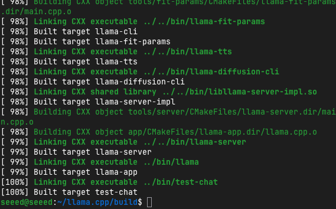
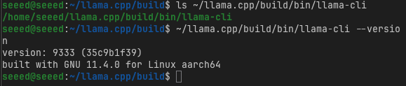
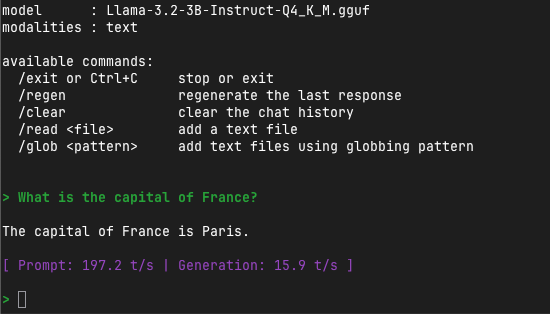

# Running LLMs with llama.cpp

## Introduction

**llama.cpp** is a lightweight, high-performance C/C++ implementation for running LLMs. It enables efficient LLM inference on consumer-grade hardware including ARM64 devices like NVIDIA Jetson. It has become the default standard for local LLM inference due to its efficiency and wide format support.

While Ollama provides a user-friendly wrapper around llama.cpp, understanding llama.cpp directly gives you:
- Maximum control over inference parameters
- Better understanding of how LLMs work under the hood
- Ability to optimize for specific use cases
- Support for custom quantization formats

<p align="center">
  
  <br>
  <sub>llama.cpp - Efficient LLM Inference in C/C++</sub>
</p>


## Why llama.cpp?

| Feature | Description |
|:--------|:------------|
| **Pure C/C++** | No heavy dependencies, minimal footprint |
| **Multiple Backends** | CPU, CUDA, Metal, OpenCL, Vulkan support |
| **GGUF Format** | Native support for quantized models |
| **Embeddable** | Easy to integrate into applications |
| **CPU Fallback** | Works even without GPU |
| **Streaming** | Real-time token streaming |

## Installation on Jetson

### Prerequisites

Ensure you have build tools installed:

```bash
# Update package list
sudo apt-get update

# Install build essentials
sudo apt-get install -y build-essential git cmake

# Add CUDA environment variables to .bashrc
echo '
# CUDA Environment
export CUDA_HOME=/usr/local/cuda
export PATH=$CUDA_HOME/bin:$PATH
export LD_LIBRARY_PATH=$CUDA_HOME/lib64:$LD_LIBRARY_PATH
export CUDACXX=$CUDA_HOME/bin/nvcc
' >> ~/.bashrc

# Reload shell configuration
source ~/.bashrc

# Verify CUDA installation
nvcc --version
```

### Clone and Build llama.cpp

```bash
# Clone the repository
cd ~
git clone https://github.com/ggerganov/llama.cpp.git
cd llama.cpp

# Build with CUDA support for Jetson
#make -j$(nproc) GGML_CUDA=1

# Alternative: Use CMake
mkdir build && cd build
cmake .. -DGGML_CUDA=ON
cmake --build . --config Release -j$(nproc)
```



### Verify Installation

```bash
# Check if binaries were built
ls ~/llama.cpp/build/bin/llama-cli

# Test version
~/llama.cpp/build/bin/llama-cli --version
```



## Getting Your First Model

llama.cpp uses the **GGUF format** (GGML Universal Format)—an efficient binary format for storing quantized models.

### Download a Model

```bash
# Create a models directory
mkdir -p ~/llama.cpp/models
cd ~/llama.cpp/models

# Download Llama 3.2 3B (Q4_K_M quantization - 4-bit)
wget https://huggingface.co/bartowski/Llama-3.2-3B-Instruct-GGUF/resolve/main/Llama-3.2-3B-Instruct-Q4_K_M.gguf

# Or download from Hugging Face using curl
huggingface-cli download bartowski/Llama-3.2-3B-Instruct-GGUF Llama-3.2-3B-Instruct-Q4_K_M.gguf --local-dir ./models
```

### Understanding GGUF Quantization

| Quantization | Bits | File Size | Quality | Speed |
|:-------------|:-----|:----------|:--------|:------|
| Q2_K | 2-bit | Very Small | Lower | Fastest |
| Q3_K_M | 3-bit | Small | Acceptable | Very Fast |
| Q4_K_M | 4-bit | Medium | Good | Fast |
| Q5_K_M | 5-bit | Medium-Large | Very Good | Moderate |
| Q6_K | 6-bit | Large | Excellent | Slower |
| Q8_0 | 8-bit | Very Large | Near-original | Slowest |

For Jetson devices:
- **Orin Nano 4GB**: Use Q2_K or Q3_K_M
- **Orin Nano 8GB**: Use Q3_K_M or Q4_K_M
- **Orin NX 16GB+**: Use Q4_K_M or Q5_K_M

### Recommended Models for Jetson

```bash
# Download Qwen3 4B (excellent multilingual support)
wget https://huggingface.co/bartowski/Qwen3-4B-Instruct-GGUF/resolve/main/Qwen3-4B-Instruct-Q4_K_M.gguf

# Download DeepSeek-R1 1.5B (distilled reasoning model)
wget https://huggingface.co/bartowski/DeepSeek-R1-Distill-Qwen-1.5B-GGUF/resolve/main/DeepSeek-R1-Distill-Qwen-1.5B-Q4_K_M.gguf

# Download Gemma3 4B
wget https://huggingface.co/bartowski/gemma-3-4b-it-GGUF/resolve/main/gemma-3-4b-it-Q4_K_M.gguf
```

## Basic Usage

### Simple Text Generation

```bash
cd ~/llama.cpp

# Basic inference
./build/bin/llama-cli \
  -m models/Llama-3.2-3B-Instruct-Q4_K_M.gguf \
  -p "The future of edge AI is"
```

### Chat Mode (Conversational)

```bash
# Start an interactive chat session
./build/bin/llama-cli \
  -m models/Llama-3.2-3B-Instruct-Q4_K_M.gguf \
  -cnv \
  --chat-template llama3
```

> **Note**: The `-cnv` flag enables conversational mode, and `--chat-template` specifies how to format the conversation.

### Common llama-cli Flags

| Flag | Description | Example |
|:-----|:------------|:--------|
| `-m, --model` | Model file path | `-m models/model.gguf` |
| `-p, --prompt` | Initial prompt | `-p "Hello world"` |
| `-cnv` | Conversation mode | `-cnv` |
| `-n, --n-predict` | Number of tokens to generate | `-n 256` |
| `-c, --ctx-size` | Context size (in tokens) | `-c 4096` |
| `--temp` | Temperature (creativity) | `--temp 0.7` |
| `--top-p` | Nucleus sampling | `--top-p 0.9` |
| `-ngl, --n-gpu-layers` | GPU layers to offload | `-ngl 35` |
| `-t, --threads` | Number of CPU threads | `-t 4` |

## Optimizing for Jetson GPU

### GPU Offloading

Offloading model layers to GPU dramatically improves performance:

```bash
# Determine optimal GPU layers
# Start with -ngl 999 (offload all layers)
./build/bin/llama-cli \
  -m models/Llama-3.2-3B-Instruct-Q4_K_M.gguf \
  -p "Explain quantum computing" \
  -ngl 35 \
  -n 256
```

> **Tip**: Use `-ngl 999` to automatically offload all possible layers to GPU.

### Measuring Performance

```bash
# Run with performance stats
./build/bin/llama-cli \
  -m models/Llama-3.2-3B-Instruct-Q4_K_M.gguf \
  -p "What is the capital of France?" \
  -n 50 \
  -ngl 35 \
  --perf
```

You'll see:



Key metric: **eval time per token** should be under 100ms for good real-time performance.

## Advanced Features

### Running the API Server

llama.cpp includes a server mode for REST API access:

```bash
# Start the server
./llama-server \
  -m models/Llama-3.2-3B-Instruct-Q4_K_M.gguf \
  --host 0.0.0.0 \
  --port 8000 \
  -ngl 35 \
  -c 4096
```

Access the server:
```bash
# Simple query
curl -X POST http://localhost:8000/completion \
  -H "Content-Type: application/json" \
  -d '{
    "prompt": "Once upon a time",
    "n_predict": 100
  }'

# Chat completion
curl -X POST http://localhost:8000/v1/chat/completions \
  -H "Content-Type: application/json" \
  -d '{
    "messages": [
      {"role": "user", "content": "What is machine learning?"}
    ],
    "max_tokens": 256
  }'
```

### System Prompts

Set the model's behavior with system prompts:

```bash
./llama-cli \
  -m models/Llama-3.2-3B-Instruct-Q4_K_M.gguf \
  -p "You are a helpful coding assistant. Explain Python list comprehensions." \
  --system "You are an expert Python programmer. Provide concise, practical code examples."
```

### Batch Processing

Process multiple prompts efficiently:

```python
# batch_inference.py
import subprocess
import json

prompts = [
    "Explain neural networks",
    "What is GPU acceleration?",
    "Describe edge computing"
]

model_path = "~/llama.cpp/models/Llama-3.2-3B-Instruct-Q4_K_M.gguf"

for prompt in prompts:
    result = subprocess.run(
        ["./llama-cli", "-m", model_path, "-p", prompt, "-n", "100", "--temp", "0.7"],
        capture_output=True,
        text=True
    )
    print(f"Prompt: {prompt}")
    print(f"Response: {result.stdout}\n")
```

## Converting Models to GGUF

If you have a model in Hugging Face format (PyTorch/SafeTensors), convert it to GGUF:

```bash
cd ~/llama.cpp

# Install Python requirements
pip install -r requirements.txt

# Convert Hugging Face model to GGUF
python convert_hf_to_gguf.py \
  /path/to/model \
  --outfile output-model.gguf \
  --outtype q4_k_m
```

Available output types:
- `f16`: 16-bit float (no quantization)
- `q8_0`: 8-bit quantization
- `q6_k`: 6-bit quantization
- `q5_k_m`: 5-bit quantization
- `q4_k_m`: 4-bit quantization (recommended balance)
- `q3_k_m`: 3-bit quantization
- `q2_k`: 2-bit quantization (most compressed)

## Integration Examples

### Python Binding

```bash
# Install Python bindings
pip install llama-cpp-python

# For CUDA support (Jetson)
CMAKE_ARGS="-DGGML_CUDA=on" pip install llama-cpp-python --upgrade --force-reinstall --no-cache-dir
```

```python
from llama_cpp import Llama

# Load model
llm = Llama(
    model_path="/path/to/model-Q4_K_M.gguf",
    n_gpu_layers=35,
    n_ctx=4096
)

# Generate text
output = llm(
    "Q: What is the capital of France?\nA:",
    max_tokens=50,
    temperature=0.7
)
print(output["choices"][0]["text"])

# Chat completion
output = llm.create_chat_completion(
    messages=[
        {"role": "user", "content": "Tell me a joke"}
    ],
    max_tokens=100
)
print(output["choices"][0]["message"]["content"])
```

## Performance Benchmarking

### Jetson-Specific Optimizations

```bash
# Optimal settings for Jetson Orin Nano 8GB
./llama-cli \
  -m models/Llama-3.2-3B-Instruct-Q4_K_M.gguf \
  -p "Explain transformers in machine learning" \
  -ngl 35 \
  -t 6 \
  -c 4096 \
  -n 200 \
  --temp 0.7
```

### Benchmark Script

```bash
#!/bin/bash
# benchmark.sh

MODEL="models/Llama-3.2-3B-Instruct-Q4_K_M.gguf"
PROMPT="Explain the concept of artificial intelligence and its applications."

echo "Benchmarking llama.cpp on Jetson"
echo "Model: $MODEL"
echo "Prompt: $PROMPT"
echo ""

for gpu_layers in 0 10 20 30 35; do
    echo "Testing with $gpu_layers GPU layers..."
    timeout 120 ./llama-cli \
        -m $MODEL \
        -p "$PROMPT" \
        -ngl $gpu_layers \
        -n 100 \
        --per-test 2>&1 | grep "eval time"
done
```

## Common Issues and Solutions

### Issue 1: CUDA Not Detected

**Problem**: GPU offloading doesn't work

**Solution**:
```bash
# Rebuild with CUDA
make clean
make -j$(nproc) GGML_CUDA=1

# Verify CUDA installation
nvidia-smi
nvcc --version
```

### Issue 2: Out of Memory

**Problem**: Model loading fails with OOM

**Solution**:
```bash
# Reduce GPU layers
./llama-cli -m model.gguf -ngl 10  # Instead of -ngl 35

# Use smaller context
./llama-cli -m model.gguf -c 2048  # Instead of default 4096

# Use more aggressive quantization
# Switch from Q5_K_M to Q4_K_M or Q3_K_M
```

### Issue 3: Slow CPU-Only Performance

**Problem**: Generation is too slow without GPU

**Solution**:
```bash
# Enable more threads
./llama-cli -m model.gguf -t 8  # Use 8 CPU threads

# Use smaller model or more aggressive quantization

# Ensure CPU governor is set to performance
sudo apt-get install cpufrequtils
sudo cpufreq-set -g performance
```

## Practice Exercise

Complete these tasks:

1. **Build llama.cpp** with CUDA support
2. **Download 3 different models** and compare their sizes
3. **Run inference** on each model with `-ngl 35`
4. **Measure performance** using `--per-test` flag
5. **Start the server** and test API requests
6. **Create a Python script** that batches 5 different prompts

## References

- [llama.cpp GitHub](https://github.com/ggerganov/llama.cpp)
- [GGUF Format Specification](https://github.com/ggerganov/ggml/blob/master/docs/gguf.md)
- [TheBloke's GGUF Models](https://huggingface.co/TheBloke) - Pre-converted models
- [bartowski's GGUF Models](https://huggingface.co/bartowski) - Updated model conversions
- [Jetson AI Lab](https://www.jetson-ai-lab.com/) - NVIDIA's Jetson resources

---

**Next**: Continue to [Module 5.4: High-Performance Inference with vLLM](../5.4-High-Performance-Inference-with-vLLM/README.md) for production-grade LLM serving!
