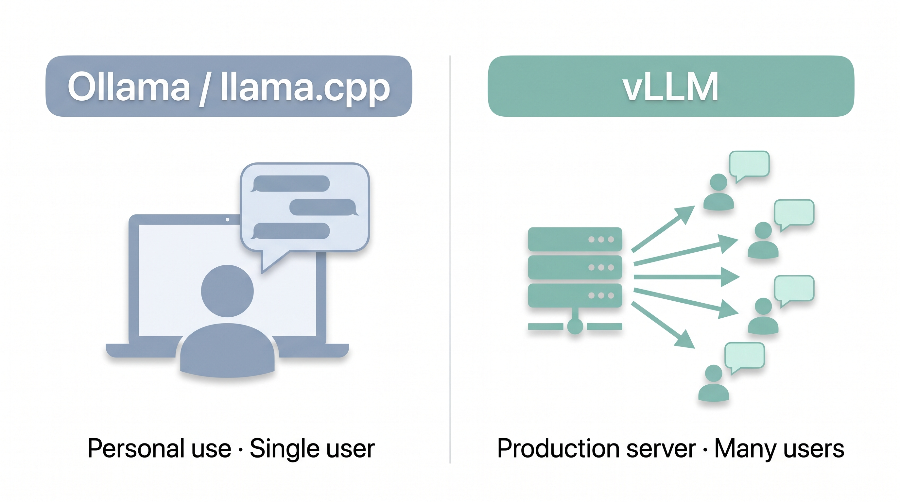

# High-Performance Inference with vLLM

## Introduction

**vLLM** is a high-throughput LLM serving engine designed for production deployments. While Ollama and llama.cpp are excellent for individual use, vLLM shines when you need to serve LLMs as an API backend with high throughput and efficient memory management.

Think of the difference this way:
- **Ollama/llama.cpp** = personal development tools (single user)
- **vLLM** = production server (multiple users, high throughput)

<p align="center">
  
  <br>
  <sub>vLLM - High-Throughput LLM Serving</sub>
</p>


## Key Features of vLLM

| Feature | Description |
|:--------|:------------|
| **PagedAttention** | Efficient memory management for concurrent requests |
| **Continuous Batching** | Process multiple requests simultaneously |
| **OpenAI-Compatible API** | Drop-in replacement for OpenAI's API |
| **Tensor Parallelism** | Split models across multiple GPUs |
| **Wide Model Support** | Supports Llama, Qwen, Mistral, and many more |
| **Speculative Decoding** | Accelerate inference with draft models |

## System Requirements

| Component | Minimum | Recommended |
|:----------|:--------|:------------|
| **RAM** | 16GB | 32GB+ |
| **GPU Memory** | 16GB VRAM | 24GB+ VRAM |
| **Storage** | 20GB free | 50GB+ |
| **JetPack** | 6.0+ | Latest |
| **CUDA** | 12.0+ | 12.4+ |

> **Note**: vLLM is more memory-hungry than Ollama or llama.cpp. It's designed for higher performance but requires more resources.

## Installation

### Method 1: Direct Installation

```bash
# Update pip
pip install --upgrade pip

# Install vLLM (Jetson-optimized version)
# For JetPack 6.x with CUDA 12.x
pip install vllm
```

If you encounter issues with pre-built wheels:

```bash
# Build from source (takes longer but more reliable)
git clone https://github.com/vllm-project/vllm.git
cd vllm

# For Jetson ARM64 with CUDA support
VLLM_TARGET_DEVICE=cuda pip install -e .
```

### Method 2: Using Docker (Recommended for Jetson)

```bash
# Pull the NVIDIA vLLM container
docker pull nvcr.io/nvidia/pytorch:24.01-py3

# Or use the official vLLM image
docker pull vllm/vllm-openai:latest
```

### Verify Installation

```bash
# Check if vLLM is installed correctly
python3 -c "import vllm; print(vllm.__version__)"

# Check GPU compatibility
python3 -c "import torch; print(f'CUDA available: {torch.cuda.is_available()}')"
```

## Getting Started

### Running a Model with vLLM

```bash
# Start vLLM server with a Llama model
python3 -m vllm.entrypoints.openai.api_server \
  --model meta-llama/Llama-3.2-3B-Instruct \
  --host 0.0.0.0 \
  --port 8000 \
  --gpu-memory-utilization 0.9 \
  --max-model-len 4096
```

### Downloading Models from Hugging Face

vLLM downloads models automatically from Hugging Face on first run:

```bash
# Run Llama 3.2 3B
python3 -m vllm.entrypoints.openai.api_server \
  --model meta-llama/Llama-3.2-3B-Instruct \
  --port 8000

# Run Qwen3 4B
python3 -m vllm.entrypoints.openai.api_server \
  --model Qwen/Qwen3-4B \
  --port 8000

# Run Gemma3 4B
python3 -m vllm.entrypoints.openai.api_server \
  --model google/gemma-3-4b-it \
  --port 8000
```

> **First run**: Model weights are downloaded from Hugging Face (~2-8GB depending on model). Downloads are cached for subsequent runs.

### Quick Test

```bash
# In another terminal, test the API
curl http://localhost:8000/v1/models

# Send a chat request
curl http://localhost:8000/v1/chat/completions \
  -H "Content-Type: application/json" \
  -d '{
    "model": "meta-llama/Llama-3.2-3B-Instruct",
    "messages": [{"role": "user", "content": "Hello!"}],
    "max_tokens": 100
  }'
```

## Configuration Options

### Essential Parameters

```bash
python3 -m vllm.entrypoints.openai.api_server \
  --model meta-llama/Llama-3.2-3B-Instruct \
  --host 0.0.0.0 \
  --port 8000 \
  --tensor-parallel-size 1 \           # Number of GPUs (1 for single Jetson)
  --max-model-len 4096 \               # Maximum context length
  --gpu-memory-utilization 0.9 \       # Use 90% of GPU memory
  --dtype auto \                       # Auto-select precision (fp16/bf16)
  --quantization awq \                 # Use AWQ quantized model
  --enforce-eager                      # Disable CUDA graphs (saves memory)
```

### Memory Optimization for Jetson

```bash
# For Jetson Orin Nano 8GB
python3 -m vllm.entrypoints.openai.api_server \
  --model meta-llama/Llama-3.2-3B-Instruct \
  --gpu-memory-utilization 0.85 \
  --max-model-len 2048 \
  --enforce-eager \
  --swap-space 8 \                     # Use 8GB swap
  --block-size 8                       # Smaller blocks for less memory waste
```

### Batch Processing Configuration

```bash
# Enable continuous batching for multiple concurrent requests
python3 -m vllm.entrypoints.openai.api_server \
  --model meta-llama/Llama-3.2-3B-Instruct \
  --max-num-seqs 16 \                  # Max concurrent sequences
  --max-num-batched-tokens 4096        # Max tokens per batch
```

## Using the OpenAI-Compatible API

vLLM provides a drop-in replacement for OpenAI's API. Any code that works with OpenAI's client will work with vLLM.

### Python with OpenAI Client

```python
from openai import OpenAI

# Connect to your vLLM server
client = OpenAI(
    base_url="http://localhost:8000/v1",
    api_key="not-needed"  # vLLM doesn't require API keys
)

# Chat completion
response = client.chat.completions.create(
    model="meta-llama/Llama-3.2-3B-Instruct",
    messages=[
        {"role": "system", "content": "You are a helpful assistant."},
        {"role": "user", "content": "Explain edge computing in 3 sentences."}
    ],
    temperature=0.7,
    max_tokens=150
)

print(response.choices[0].message.content)
```

### Streaming Responses

```python
from openai import OpenAI

client = OpenAI(
    base_url="http://localhost:8000/v1",
    api_key="not-needed"
)

# Stream response token by token
stream = client.chat.completions.create(
    model="meta-llama/Llama-3.2-3B-Instruct",
    messages=[{"role": "user", "content": "Write a haiku about robots."}],
    stream=True,
    max_tokens=100
)

for chunk in stream:
    if chunk.choices[0].delta.content:
        print(chunk.choices[0].delta.content, end="", flush=True)
print()
```

### Text Completion

```python
response = client.completions.create(
    model="meta-llama/Llama-3.2-3B-Instruct",
    prompt="def fibonacci(n):",
    max_tokens=150,
    temperature=0.1
)

print(response.choices[0].text)
```

## Performance Optimization

### Benchmarking

```bash
# Install vLLM benchmarks
pip install vllm[benchmarks]

# Run a throughput benchmark
python3 -m vllm.entrypoints.openai.api_server \
  --model meta-llama/Llama-3.2-3B-Instruct \
  --port 8000 &

# In another terminal
python3 -m vllm.benchmarks.benchmark_serving \
  --model meta-llama/Llama-3.2-3B-Instruct \
  --endpoint /v1/chat/completions \
  --dataset ShareGPT_V3_unfiltered_cleaned_split.json \
  --num-prompts 100
```

### Jetson-Specific Optimizations

```bash
# Optimal settings for Jetson Orin NX 16GB
python3 -m vllm.entrypoints.openai.api_server \
  --model meta-llama/Llama-3.2-3B-Instruct \
  --gpu-memory-utilization 0.92 \
  --max-model-len 4096 \
  --enforce-eager \
  --num_scheduler-steps 8 \
  --disable-log-requests  # Reduce logging overhead
```

### Monitoring Performance

```bash
# Monitor GPU usage during inference
watch -n 1 nvidia-smi

# Check vLLM logs
# Logs are printed to stdout/stderr
# For production, redirect to a file:
python3 -m vllm.entrypoints.openai.api_server \
  --model meta-llama/Llama-3.2-3B-Instruct \
  --log-file /tmp/vllm.log
```

## Common Issues and Solutions

### Issue 1: Out of GPU Memory

**Problem**: `torch.cuda.OutOfMemoryError: CUDA out of memory`

**Solution**:
```bash
# Reduce max model length
--max-model-len 2048  # Instead of default 4096

# Lower GPU memory utilization
--gpu-memory-utilization 0.8  # Instead of 0.9

# Use enforce-eager to save memory
--enforce-eager

# Use a smaller quantized model
--quantization awq
```

### Issue 2: Slow Startup

**Problem**: Model loading takes too long

**Solution**:
```bash
# Pre-download the model
python3 -c "from huggingface_hub import snapshot_download; snapshot_download('meta-llama/Llama-3.2-3B-Instruct')"

# Then run vllm with --download-dir pointing to the cache
--download-dir /home/user/.cache/huggingface/hub
```

### Issue 3: Connection Refused

**Problem**: Cannot connect to vLLM server

**Solution**:
```bash
# Check if server is running
curl http://localhost:8000/health

# Check listening ports
netstat -tlnp | grep 8000

# Ensure the server is listening on all interfaces
--host 0.0.0.0  # Not just 127.0.0.1
```

## Comparison: vLLM vs Other Frameworks

| Aspect | vLLM | Ollama | llama.cpp |
|:-------|:-----|:-------|:----------|
| **Use Case** | Production serving | Personal use | Personal use |
| **Concurrent Users** | Many | 1-2 | 1 |
| **Memory Efficiency** | High (PagedAttention) | Good | Excellent |
| **Setup Complexity** | Moderate | Easy | Easy |
| **API Compatibility** | OpenAI standard | OpenAI standard | Custom |
| **Model Formats** | SafeTensors, AWQ | GGUF | GGUF |
| **Best For** | API servers | Chat/development | Edge deployment |

## Practice Exercise

1. **Install vLLM** on your Jetson device
2. **Start a server** with Llama 3.2 3B
3. **Test the API** using curl from another terminal
4. **Write a Python script** that streams responses
5. **Benchmark** the throughput with the built-in benchmark tool
6. **Compare** the response speed with Ollama (Module 5.2)

## References

- [vLLM Documentation](https://docs.vllm.ai/)
- [vLLM GitHub Repository](https://github.com/vllm-project/vllm)
- [PagedAttention Paper](https://arxiv.org/abs/2309.06180)
- [OpenAI API Specification](https://platform.openai.com/docs/api-reference)
- [Jetson Optimization Guide](https://developer.nvidia.com/embedded/jetson)

---

**Next**: Continue to [Module 5.5: Jetson Examples Quick Start](../5.5-Jetson-Examples-Quick-Start/README.md) to deploy LLMs with a single command!
