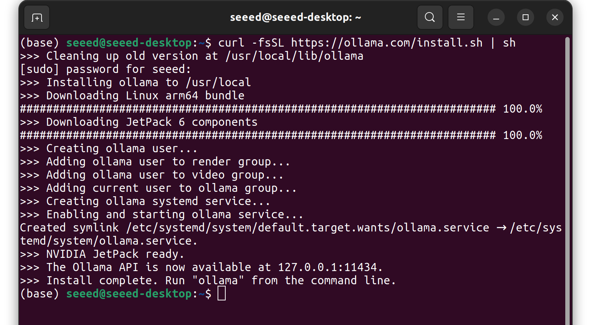
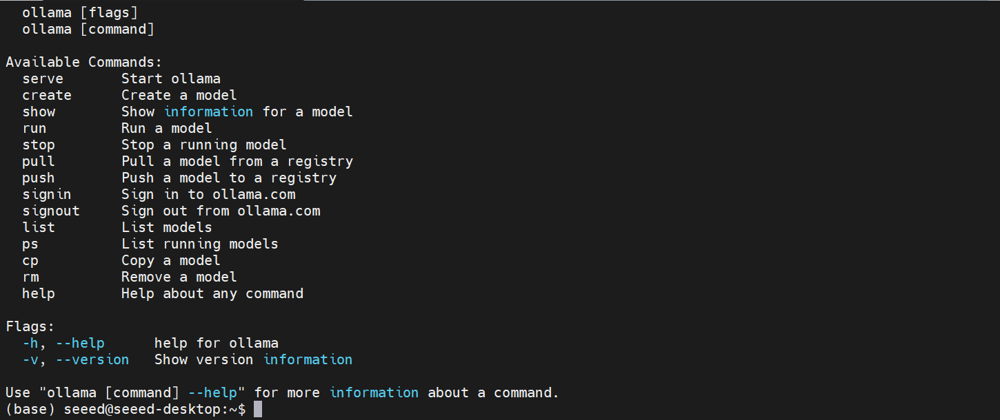
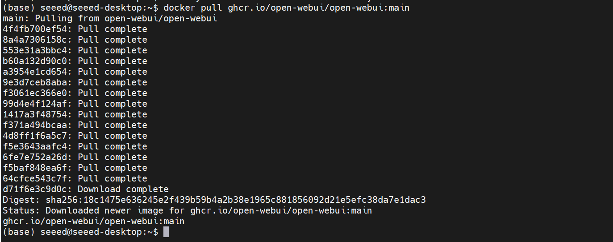
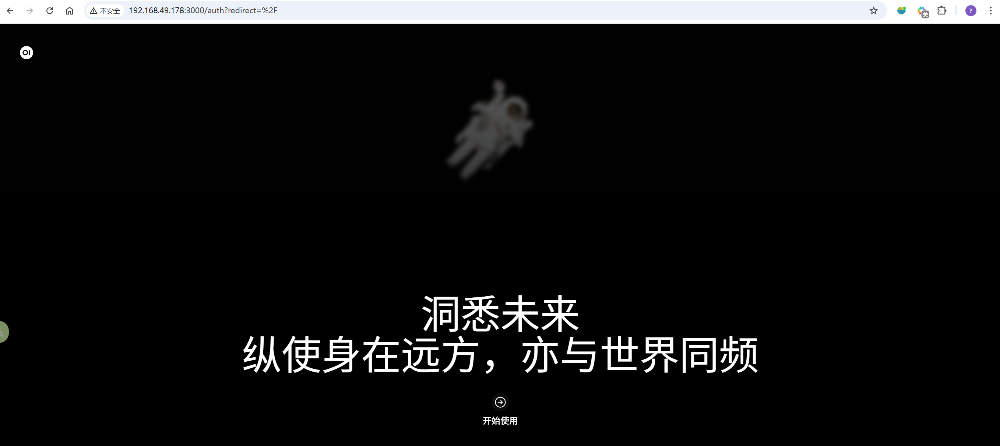

# Environment and Basics with Ollama

## 01 Environment and basic preparedness (Ollama)

| Name | Owner | Modified | Created |
| --- | --- | --- | --- |
| 12.01.01 AI Large Model Environmental Deployment | Yujiang! | 2026-01-09 14:48 | 2026-01-09 14:48 |
| 12.02.02 Toggle Chinese Input Method | Yujiang! | 2026-01-12:40 | 2026-01-09 14:48 |
| 12.03. Installation of a large model dialogue platform | Yujiang! | 2026-01-16:20 | 2026-01-09 14:49 |

### 12.02.02 Toggle Chinese Input Method

Please refer to chapter III, subsection 10 Installation of the Chinese input method Configure the Chinese input method.

### 12.03. Installation of a large model dialogue platform

### Open WebUI Profile

Open WebUI (formerly Ollama WebUI) is an open-source, self-serving Web interface designed for locally run LLMs. It provides a user experience similar to ChatGPT, supports advanced functions such as multimodel management, dialogue history, plugin systems, and is well suited to build a privatization AI assistant on the Jetson platform.

## Core characteristics

🎨 Intuitive interface: Modern UI, chat experience like ChatGPT

Local priority: all data stored locally without network connection

🔌 Multi-backend support: native support Ollama, compatible with OpenAI API



:: Dialogue management: complete historical record of dialogue and search function

Plugin system: Support functional extension and customisation

Multi-user support: enable user authentication and permission management



## Install Open WebUI

Run the following commands in the terminal window of the Jetson device to fetch the docker image of Open WebUI:

https://ollama.com/

```python
# Pull the Open WebUI image (ARM64 version)
docker pull ghcr.io/open-webui/open-webui:main
```

> If the docker environment of the jetson device is abnormal, refer to 13 for installation of Docker and base use Configure the docker environment.

## Start Open WebUI

Runs the command to create and start a docker container in the terminal of the Jetson device.

```python
# Create the data directory
mkdir -p /opt/seeed/development_guide/12_llm_offline/open-webui/data

# Run the container
docker run -d --restart always --name open-webui \
  --network host \
  -v /opt/seeed/development_guide/12_llm_offline/open-webui/data:/app/backend/data \
  -e OLLAMA_BASE_URL=http://127.0.0.1:11434 \
  ghcr.io/open-webui/open-webui:main


# Check the container status
docker logs -f open-webui
```

> The first launch container may download some basic models, ensuring that the network of jetson equipment is smooth.

When the container is activated, you can enter the https://download.docker.com/linux/ubuntu/dists/ access to WebUI in the browser. If you want to access WebUI via other devices in the local area network, you need to replace the localhost in url with the ip address of the Jetson device.

Run the following command in a terminal on the Jetson device to pull the Open WebUI Docker image:

```python
# Pull the Open WebUI image (ARM64 version)
docker pull ghcr.io/open-webui/open-webui:main
```

```
If the Docker environment on the Jetson device is not working properly, refer to 13 Install Docker and Basic Use to configure Docker.
```



### Start Open WebUI

Run the following commands in a terminal on the Jetson device to create and start the Docker container.

```python
# Create the data directory
mkdir -p /opt/seeed/development_guide/12_llm_offline/open-webui/data
# Run the container
docker run -d --restart always --name open-webui \
--network host \
-v /opt/seeed/development_guide/12_llm_offline/open-webui/data:/app/backend/data \
-e OLLAMA_BASE_URL=http://127.0.0.1:11434 \
ghcr.io/open-webui/open-webui:main
# Check the container status
docker logs -f open-webui
```

```
The first container startup may download some base models, so make sure the Jetson device has a stable network connection.
```

After the container starts, open `http://localhost:8080/` in a browser to access WebUI. To access it from another device on the same LAN, replace `localhost` in the URL with the Jetson device IP address.


