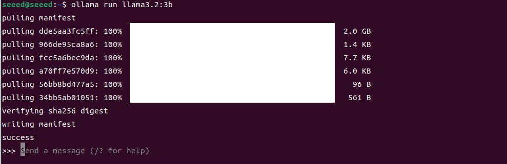
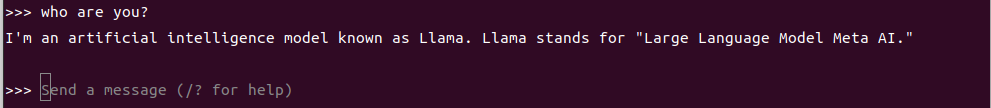
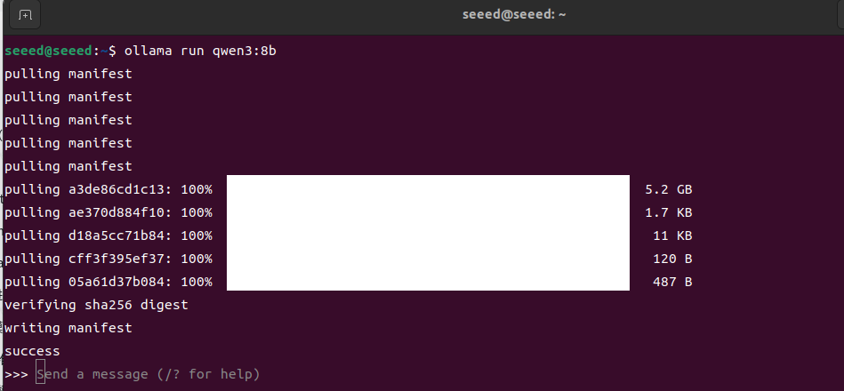
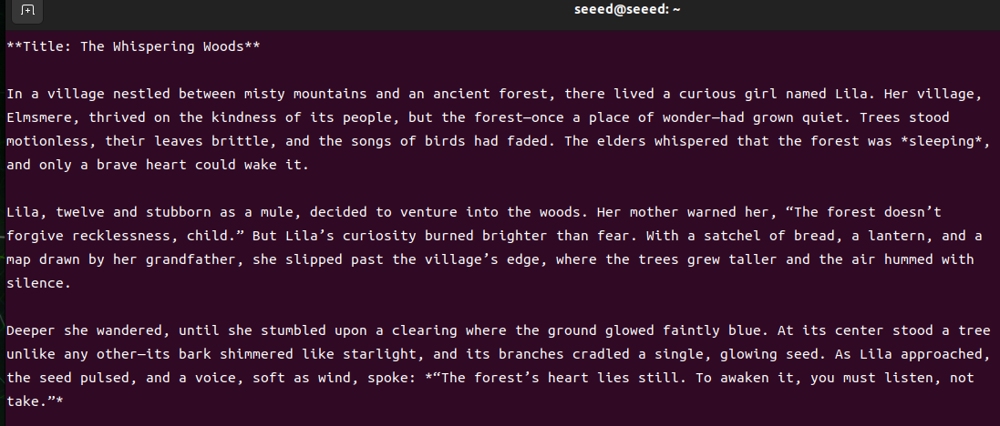
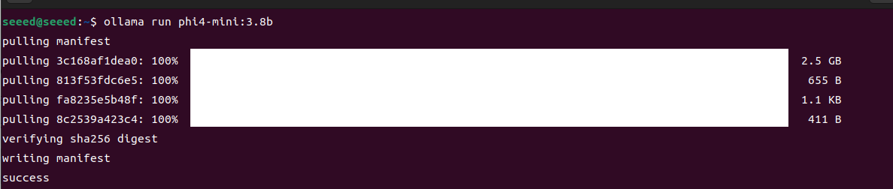
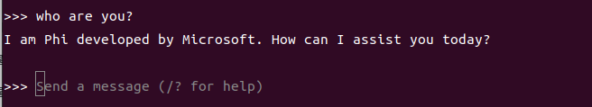
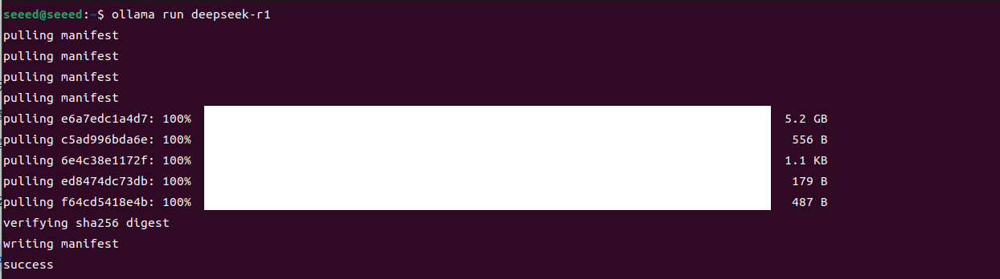
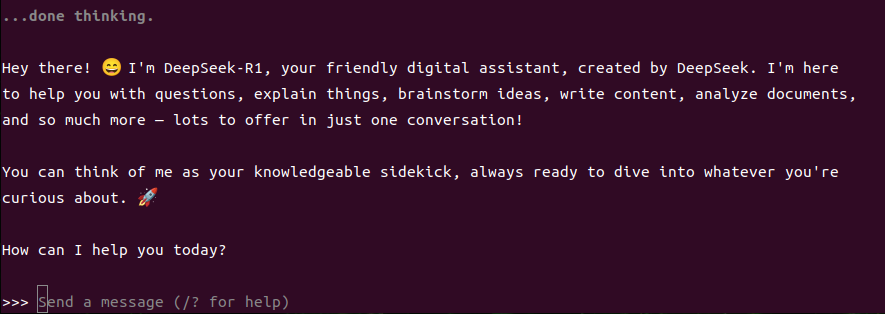

# Offline Text LLMs

## 02 Large offline text model (unimodal)

| Name | Owner | Modified | Created |
| --- | --- | --- | --- |
| 11.02-01 Meta AI: Llama3.2 model | Yujiang! | 2026-01-09 14:51 | 2026-01-09 14:51 |
| 11.02-02 Aliyun: Qwen3 model | Yujiang! | 2026-01-09 14:51 | 2026-01-09 14:51 |
| 11.02-03 Microsoft: Phi-4-mini model | Yujiang! | 2026-01-09 14:52 | 2026-01-09 14:51 |
| 11.02-04 DeepSeek: DeepSeek-R1 model | Yujiang! | 2026-01-09 14:52 | 2026-01-09 14:52 |

### 11.02-01 Meta AI: Llama3.2 model

## Introduction

Meta Llama 3.2, the latest generation of large-scale linguistic models launched by Meta, has been structured to build on Llama 3.1 and has introduced a true multi-modular capability: not only to process and generate text, but also to understand image content, which makes it both linguistic understanding and visual reasoning.


#### Model size

| Variant | Modality | Typical fit |
| --- | --- | --- |
| Llama 3.2 1B | Text | Smallest local text-only option |
| Llama 3.2 3B | Text | Practical local deployment on Jetson |
| Llama 3.2 11B Vision | Vision-language | Image understanding with higher compute demand |
| Llama 3.2 90B Vision | Vision-language | Server-class deployment rather than single-device use |

### Performance

## Use Llama3.2

Run a model using a run-off command, and if not downloaded locally, olama will download the model before running



```bash
ollama run llama3.2:3b
```

### Dialogue Test



```bash
who are you?
```

### Closure of the dialogue

Use the Ctrl+d shortcut or XIAITOKEN0 to end the conversation!

## References

> Ollama.

Official: https://ollama.com/

GitHub: https://github.com/ollama/ollama

> Llama 3.2

Official: https://www.llama.com/docs/model-cards-and-prompt-formats/llama3_2/

Ollama Correlation Model: https://ollama.com/library/llama3.2

### 11.02-02 Aliyun: Qwen3 model

## Introduction

Qwen3 is a new generation of large-scale, open-source language model families, launched by the Ali Yun Tun-yu team in 2025, representing an important upgrading of the series in size, reasoning and multilingualism. Qwen3 consists of six dense (Dense) models and two hybrid (MoE) models, ranging from 0.6 B to 235 B parameters, supporting a long context (up to 128 K tokens) and introducing a “mixed reasoning” model that allows for a smart switch between in-depth thinking (complex task) and rapid response (common task), thus demonstrating greater capability in complex tasks such as logical reasoning, mathematics, coding, etc.


#### Model size

| Variant | Family type | Notes |
| --- | --- | --- |
| Qwen3 0.6B | Dense | Smallest local deployment option |
| Qwen3 1.7B / 4B / 8B | Dense | Common edge and workstation sizes |
| Qwen3 14B / 32B | Dense | Larger local or server deployment |
| Qwen3 30B-A3B | MoE | Mixture-of-experts model with lighter active parameters |
| Qwen3 235B-A22B | MoE | Largest flagship model for server-scale deployment |

### Performance

## Use Qwen3

Run a model using a run-off command, and if not downloaded locally, olama will download the model before running



```bash
ollama run qwen3:8b
```

## Dialogue Test



```bash
please tell me a story.
```

### Closure of the dialogue

Use the Ctrl+d shortcut or XIAITOKEN0 to end the conversation!

> Ollama.

Official: https://ollama.com/

GitHub: https://github.com/ollama/ollama

> Qwen3

GitHub: https://github.com/QwenLM/Qwen3

Ollama Correlation Model: https://ollama.com/library/qwen3

### 11.02-03 Microsoft: Phi-4-mini model

## Introduction

Phi-4-mini is a small, lightweight and efficient language model (Small Language Model) in the Microsoft Phi model series, in a compact version of the Phi-4 family, with approximately 3.8 B parameters, using a decoder-only Transformer structure, and introducing technical designs such as 200 K vocabulary, grouped-query attestation and shared input-output embedded, so that it can also be efficiently reasoned in computing and memory restricted environments, while at the same time supporting super-long contexts (up to 128 K tokens).


#### Model size

| Variant | Parameters | Notes |
| --- | --- | --- |
| Phi-4-mini | ~3.8B | Compact reasoning-focused model with long-context support |

### Model performance

## Use the Phi-4-mini model

Run a model using a run-off command, and if not downloaded locally, olama will download the model before running



```bash
ollama run phi4-mini:3.8b
```

## Dialogue Test



```bash
who are you?
```

### Closure of the dialogue

Use the Ctrl+d shortcut or XIAITOKEN0 to end the conversation!

## References

> Ollama.

Official: https://ollama.com/

GitHub: https://github.com/ollama/ollama

> Phi4-mini

Ollama Correlation Model: https://ollama.com/library/phi4-mini

### 11.02-04 DeepSeek: DeepSeek-R1 model

## Introduction

DeepSeek – R1 is a large-scale LLM of open reasoning (LLLM), developed by the Chinese AI Laboratory DeepSeek, which, unlike traditional models based on the generation of fluid text, focuses on thinking and solving complex logic, mathematics, programming, and so forth, enhancing “thinking skills” through intensive learning (RL) training, rather than simply imitating language outputs.


#### Model size

| Variant | Typical scale | Notes |
| --- | --- | --- |
| DeepSeek-R1 1.5B / 7B / 8B | Small distilled variants | Easiest to test locally |
| DeepSeek-R1 14B / 32B | Medium distilled variants | Better reasoning quality with higher memory demand |
| DeepSeek-R1 70B and above | Large variants | Better suited to server-class hardware than a single Jetson |

### Model performance

## Use DeepSeek-R1 model

Run a model using a run-off command, and if not downloaded locally, olama will download the model before running



```bash
ollama run deepseek-r1
```

## Dialogue Test



```bash
who are you?
```

### Closure of the dialogue

Use the Ctrl+d shortcut or XIAITOKEN0 to end the conversation!

## References

> Ollama.

Official: https://ollama.com/

GitHub: https://github.com/ollama/ollama

> DeepSeek-R1

Ollama Correlation Model: https://ollama.com/library/deepseek-r1
