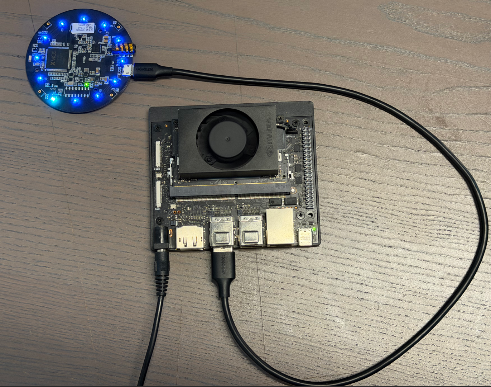
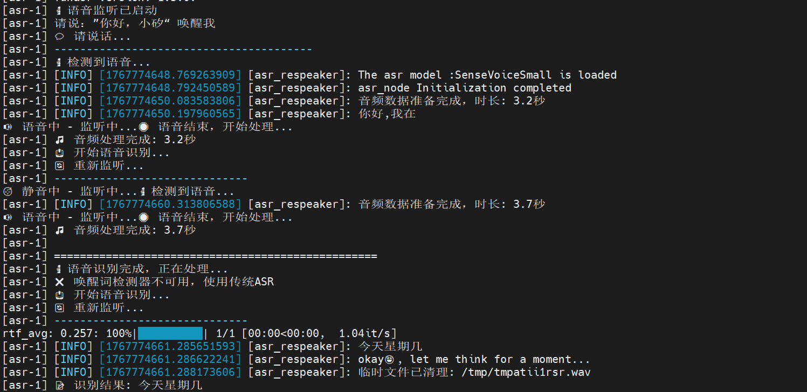
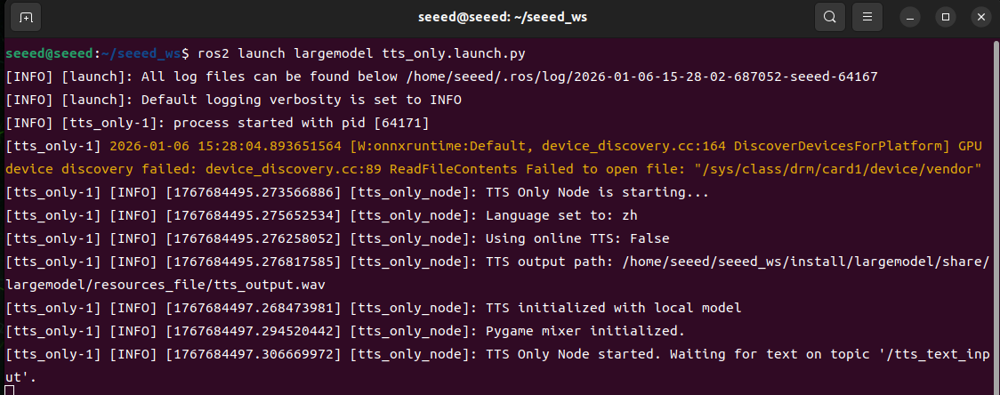
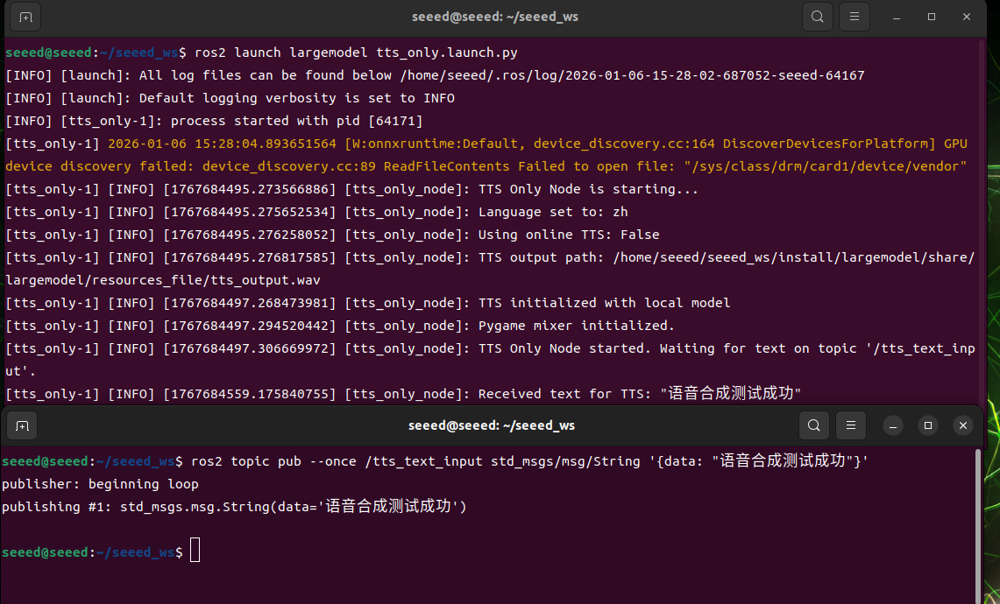
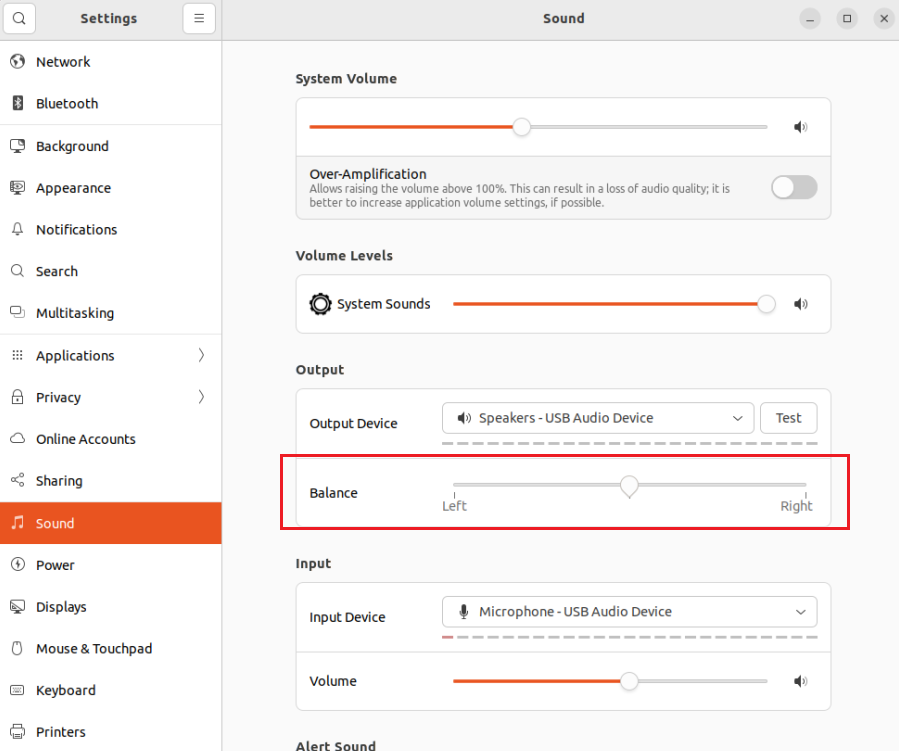
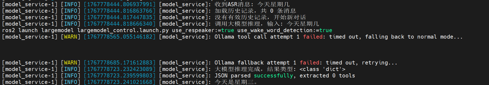

# Offline Speech Pipeline Basics

## 04 Offline voice link base (ASR/TTS/ dialogue)

| Name | Owner | Modified | Created |
| --- | --- | --- | --- |
| 11.04-01 Voice interactive hardware connection | Yujiang! | 2026-01-09 14:57 | 2026-01-09 14:57 |
| 11.04-02 Offline Voice-Text (ASR) | Yujiang! | 2026-01-16:10 | 2026-01-09 14:58 |
| 11.04-03 Offline TTS | Yujiang! | 2026-01-14:51 | 2026-01-09 14:58 |
| 11.04-04 AI Large Model Voice Interactive | Yujiang! | 2026-01-14:51 | 2026-01-09 14:58 |

# 11.04-01 Voice interactive hardware connection



> Note: The following text on voice interaction will match our microphone array ReSpeaker Mic Array v3.0 for audio recognition!

### 11.04-02 Offline Voice-Text (ASR)

### Concept introduction

### What is ASR?

ASR (Automatic Speech Recognition, Automatic Voice Recognition) is a technique for converting human voice signals into editable, processable texts. Through acoustic models, language models and signal processing algorithms, it analyses, decodes and maps the corresponding textual content, enabling computers to " understand " the voice. ASR technology is widely used in speech assistants, telephone passenger service, real-time subtitles, minutes of meetings and human interaction.

### ASR system realization rationale

The achievement of the modern automated voice recognition (ASR) system relies mainly on the following key components:

Acoustic Model

The acoustic model is responsible for mapping the voice signals entered into the acoustic or sub-word units.

In this process, audio characterization is first required, and commonly used methods include Mel frequency respectral coefficients (MFCCs) and filter groups (Filter Banks) to express audio acoustic features.

The extracting features were then entered into the deep neural network (DNN), the contours neural network (CNN), the circular neural network (RNN) or the more advanced Transformer structure to be trained in mapping relationships from audio features to acoustics or text.

Language Model (Language Mode)

Language models are used to predict the next most likely term under given context conditions, thus improving the accuracy of identification.

It is based on large-scale text language training, which captures the probability distribution of the vocabulary series and helps the system to determine which combinations are more rational.

Common language models include the n-gram model, the RNN-based LM and the Transformer-based LM popular in recent years.

Pronunciation Lexicon

The Dictionary provides a correspondence between words and their standard pronunciation and a bridge between acoustic and linguistic models.

It allows the system to match the audio sequences heard to the correct word according to the known pronunciation rules, thereby increasing the accuracy of the recognition.

Decoder

The decodor is responsible for finding the most possible word series as the final output, supported by acoustic models, language models and pronunciation dictionaries.

This process usually uses complex search algorithms, such as Viterbi algorithms or graphic search methods, in order to solve the optimal path and obtain text corresponding to the voice.

End-to-End ASR

With the development of in-depth learning, the end-to-end ASR system has begun to emerge, attempting to generate text output directly from the original audio signal, without the need for visible split acoustic models, language models and pronunciations.

Such systems are often based on a sequence-to-sequence (Seq2Seq) framework, combining the Attention Mechanism or Transformer architecture, which greatly simplifys the design complexity of traditional ASR systems while maintaining high performance.

In sum, the modern ASR system has achieved efficient and accurate human voice-to-text conversion through acoustic modelling, language modelling, sound rules and decodering strategies, combined with large-scale training of data and powerful computing. As algorithms and computational capabilities have improved, ASR's recognition accuracy has increased and its applications have become more extensive, including voice assistants, real-time subtitles, minutes of meetings and smart guest clothes.

### Code Parsing

### Key Code



```bash
cd /opt/seeed/development_guide/12_llm_offline/seeed_ws/src/largemodel/MODELS/asr/wake_word_detect/porcupine/binding/python && python setup.py install --user
```

### Voice processing and identification core (largemodel/largemodel/asr.py)

```bash
#From largemodel/largemodel/asr.py
def kws_handler(self)->None:
  if self.stop_event.is_set():
  return

  if self.listen_for_speech(self.mic_index):
  asr_text = self.ASR_conversion(self.user_speechdir)  # Perform ASR conversion
  if asr_text =='error':  # Check if ASR result length is less than 4 characters
  self.get_logger().warn("I still don't understand what you mean. Please try again")
  playsound(self.audio_dict[self.error_response])  # Error response
  else:
  self.get_logger().info(asr_text)
  self.get_logger().info("okay😀, let me think for a moment...")
  self.asr_pub_result(asr_text)  # Publish ASR result
  else:
  return

def ASR_conversion(self, input_file:str)->str:
  if self.use_oline_asr:
  result=self.modelinterface.oline_asr(input_file)
  if result[0] == 'ok' and len(result[1]) > 4:
  return result[1]
  else:
  self.get_logger().error(f'ASR Error:{result[1]}')  # ASR error.
  return 'error'
  else:
  result=self.modelinterface.SenseVoiceSmall_ASR(input_file)
  if result[0] == 'ok' and len(result[1]) > 4:
  return result[1]
  else:
  self.get_logger().error(f'ASR Error:{result[1]}')  # ASR error.
  return 'error'
```

### VAD smart recording (largemodel /largemodel/asr.py)

```bash
#From largemodel/largemodel/asr.py
def listen_for_speech(self,mic_index=0):
  p = pyaudio.PyAudio()  # Create PyAudio instance.
  audio_buffer = []  # Store audio data.
  silence_counter = 0  # Silence counter.
  MAX_SILENCE_FRAMES = 90  # Stop after 900ms of silence (30 frames * 30ms)
  speaking = False  # Flag indicating speech activity.
  frame_counter = 0  # Frame counter.
  stream_kwargs = {
  'format': pyaudio.paInt16,
  'channels': 1,
  'rate': self.sample_rate,
  'input': True,
  'frames_per_buffer': self.frame_bytes,
  }
  if mic_index != 0:
  stream_kwargs['input_device_index'] = mic_index

  # Prompt the user to speak via the buzzer.
  self.pub_beep.publish(UInt16(data = 1))
  time.sleep(0.5)
  self.pub_beep.publish(UInt16(data = 0))

  try:
  # Open audio stream.
  stream = p.open(**stream_kwargs)
  while True:
  if self.stop_event.is_set():
  return False

  frame = stream.read(self.frame_bytes, exception_on_overflow=False)  # Read audio data.
  is_speech = self.vad.is_speech(frame, self.sample_rate)  # VAD detection.

  if is_speech:
  # Detected speech activity.
  speaking = True
  audio_buffer.append(frame)
  silence_counter = 0
  else:
  if speaking:
  # Detect silence after speech activity.
  silence_counter += 1
  audio_buffer.append(frame)  # Continue recording buffer.

  # End recording when silence duration meets the threshold.
  if silence_counter >= MAX_SILENCE_FRAMES:
  break
  frame_counter += 1
  if frame_counter % 2 == 0:
  self.get_logger().info('1' if is_speech else '-')
  # Real-time status display.
  finally:
  stream.stop_stream()
  stream.close()
  p.terminate()

  # Save valid recording (remove trailing silence).
  if speaking and len(audio_buffer) > 0:
  # Trim the last silent part.
  clean_buffer = audio_buffer[:-MAX_SILENCE_FRAMES] if len(audio_buffer) > MAX_SILENCE_FRAMES else audio_buffer

  with wave.open(self.user_speechdir, 'wb') as wf:
  wf.setnchannels(1)
  wf.setsampwidth(p.get_sample_size(pyaudio.paInt16))
  wf.setframerate(self.sample_rate)
  wf.writeframes(b''.join(clean_buffer))
  return True
```

### Code Parsing

The ASR (speaks text) function is provided by the ASRNode Node (asr.py). This node is responsible for recording, converting and publishing audio.

Audio recording (listen for speech):

This function uses the pyaudio library to capture audio streams from the microphone.

It's a webtcvad library for voice activity testing (VAD). Function loops to read audio frames and uses vad.is speech() to determine whether each frame contains a human voice.

When voice is detected, data is written into a buffer zone. When continuous silence (defined by MAX SILENCE FRAMES) is detected, the recording is stopped.

Eventually, audio data in the buffer zone was written into a .wav file with a path to self.user speechdir.

Backend Selection and Execution (ASR conversion):

The kws handler function calls the ASR conversion function after a successful recording.

This function determines which backend to call by reading ROS parameteruse oline asr (a boolean value).

If false, call self.modelinterface. SenseVoiceSmall ASR for local identification.

If true, call self.modelinterface.oline asr, corresponding to online recognition.

This function transmits the audio file path as a parameter to the selected method and processes the return result.

Result published (asr pub result):

When ASR conversion returns the valid text, kws handler calls the asr pub result function.

This function encapsulates the text string in a std msgs.msg.String message and posts it through the ROS publisher to the /asr topic.

## Practice

#### Configure Offline ASR

To enable offline ASR, you need to correctly configure the Seeed.yaml file and ensure that local models are correctly placed.

Open profile:

```bash
# vim /opt/seeed/development_guide/12_llm_offline/seeed_ws/src/largemodel/config/seeed.yaml
```

Modify/confirm the following key configurations:

```bash
asr:  #speech node parameters
  ros__parameters:
  # ...
  use_oline_asr: False  # Key: set this to `False` to enable offline ASR
  mic_serial_port: "/dev/ttyUSB0"  # microphone serial-port alias
  mic_index: 0  # microphone device index
  language: 'zh'  # ASR language, 'zh' or 'en'
  regional_setting : "China"
```



Here's to make sure it's False to use the local model.



Enter the ls /dev/ttyUSB* at the terminal to see if the USB device number assigned to the voice module is USB0, and if not, to change 0 from the configuration file to its own number.

Language choice zh is Chinese and en English.

At the same time, you need to specify the path of the offline model in large_model_interface.yaml.

Open file in terminal



```bash
# vim /opt/seeed/development_guide/12_llm_offline/seeed_ws/src/largemodel/config/large_model_interface.yaml
```

Local asr model profile found

```bash
# large_model_interface.yaml
## Offline ASR (Offline ASR)
local_asr_model: "/opt/seeed/development_guide/12_llm_offline/seeed_ws/src/largemodel/MODELS/asr/SenseVoiceSmall"  # local ASR model path
```

### Activate and test functionality

Start command:

```bash
ros2 launch largemodel asr_respeaker.launch.py use_respeaker:=true use_wake_word_detection:=true
```

Test: Say to the microphone, "Hello, calcium, it'll answer: Hello, I'm here, and then I can start talking, and finally I'll show that the voice it recorded is printed in the end.

### 11.04-03 Offline TTS

#### Concept introduction

### What's "TTS"?

TTS (Text-to-Speech, Text-to-Speech) is a technology that converts text information to natural hearing. It analyses the contents of the text entered into the voice unit through a speech synthesis model and generates voice signals with rhythm, tone and speed that enable the computer to "talk". TTS technology is widely used in such settings as voice assistants, navigational bulletins, reading software, passenger-service systems and accessibility aids, providing a visual presentation of text messages.

## TTS system realization rationale

The achievement of the TTS system consists mainly of the following core steps:

Text Analysis (Text Analysis)

First, pre-processing of input text, including removal of irrelevant characters, uniform phrasing and case writing, semiwords, and conversion of numbers, abbreviations or other special symbols to readable text forms.

At the same time, linguistic analysis is carried out, such as identifying standard pronunciation of each word (usually by means of pronunciation dictionaries), marking accents and tone, analysing sentence structures and paused information to provide the necessary linguistic characteristics for subsequent voice generation.

Language Processing

At this stage, the system adjusts the pronunciation and tone of words to the context. For example, "read" has a different pronunciation in different times (external/external pronunciation of /red/ and other cases of /riːd/) and the system needs to understand these semantic nuances.

This phase also involves rhythm modelling, including accent location, speed control and emotional colours, to ensure that sound sounds natural and fluid.

Speech Syrnthesis

Characteristics obtained through text analysis and language processing are entered into a speech synthesis engine to generate actual voice signals.

Traditional method: Based on adhesive synthesis, a full sentence is selected and combined from a pre-recorded voice unit, with a better sound quality but limited to database samples.

Modern method: Based on parameter synthesis or neural network (e.g. WaveNet, Tacotron, etc.), directly predict acoustic features from text and generate continuous voice. In-depth learning methods capture voice details and make the generation of voice more natural.

Waveform Generation


