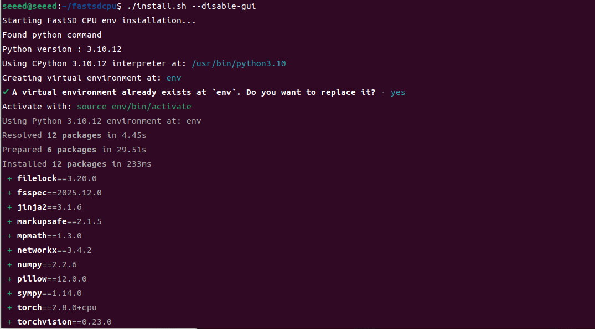
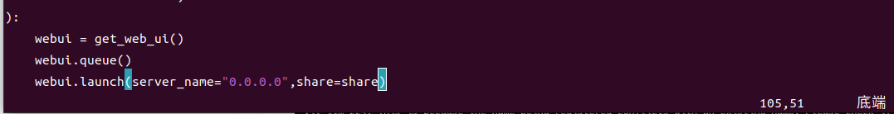
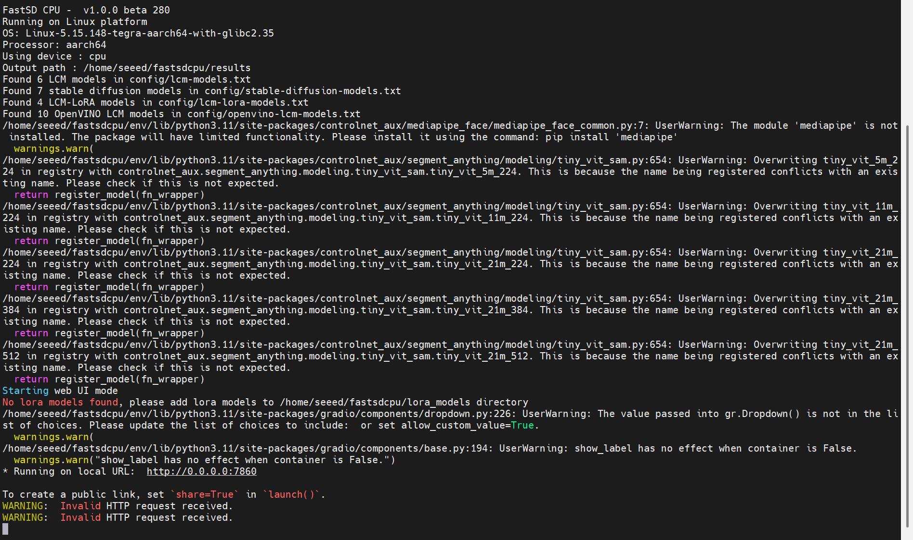
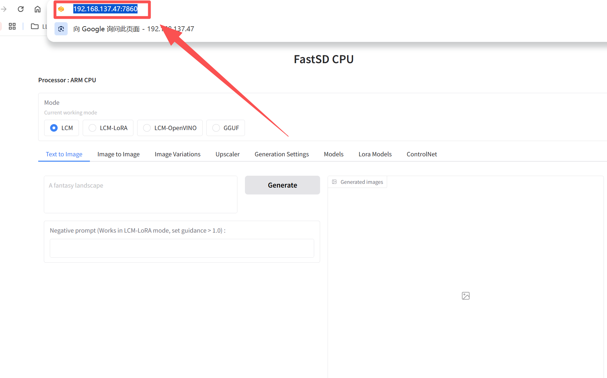
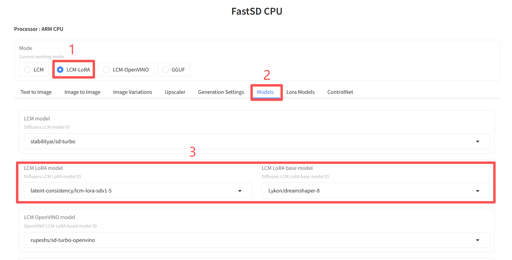
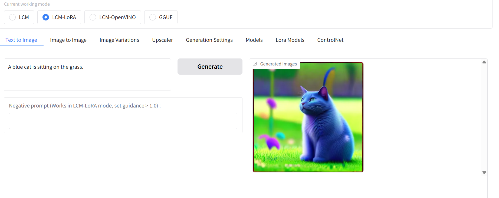

# Offline Multimodal Voice Applications

## 05 Offline multimodular voice application (speak + visual/table/agent)

| Name | Owner | Modified | Created |
| --- | --- | --- | --- |
| 11.05-01 Multimodal Visual Understanding Voice Interactive | Yujiang! | 2026-01-14 16:52 | 2026-01-09 14:59 |
| 11.05-02 Multimodal Texture Applications | Yujiang! | 2026-01-14:53 | 2026-01-09 14:59 |
| 11.05-03 Multimodal Video Analysis Application | Yujiang! | 2026-01-14 16:54 | 2026-01-09 15:00 |
| 11.05-04 Multimodal Visual Positioning Application | Yujiang! | 2026-01-14 16:55 | 2026-01-09 15:00 |
| 11.05-05 Multimodal Table Scan Application | Yujiang! | 2026-01-14 17:05 | 2026-01-09 15:01 |
| 11.05-06 Multi-mode autonomous proxy application | Yujiang! | 2026-01-14 17:05 | 2026-01-09 15:01 |
| 11.05-07 AI Large Model Offline Voice Assistant | Yujiang! | 2026-01-14:07 | 2026-01-09 15:01 |

### 11.05-01 Multimodal Visual Understanding Voice Interactive

### Concept introduction

### What is visual understanding?

Visual understanding means giving computers the same ability as humans to understand images or video content, not only to identify objects and scenes that appear in the images, but also to further understand the relationship between those objects, their state and the behaviour or events that are taking place. It is concerned with semantics and logic behind visual information, not just simple classification or testing. By combining visual information with language information, models can describe images, answer questions, reason and even support decision-making, so visual understanding has become one of the key technical capabilities in areas such as large multimodular models, autopilot, smart surveillance and human interaction.

### Principle of realization

The achievement of visual understanding depends mainly on the processing of visual and linguistic input into large models, the process of which can be divided into the following steps:

Image Encoding: Conversion of input images into digital vectors through visual encoders, which include characteristics such as colour, shape, texture, etc. of the images, which are easily understood by the computer.

Text encoding: user questions or descriptions (e.g. " What is the current scene? ) is also converted to text vectors to match image information.

Cross-modular integration: In the Attention Layer, the model integrates the image vector with the text vector to enable the model to focus on the desktop area according to the most relevant area of the problem-based "concern" image, such as the reference to the "desk" in questions.

Generate an answer: The integration information is transmitted to the Large Language Model (LLM), based on which descriptive text is generated or questions answered.

#### Code Parsing

### Key Code

### Tool Layer Entry (largemodel/utils/tools_manager.py)

The seewhat function in this document defines the process of executing the tool.

```bash
#From largemodel/utils/tools_manager.py
class ToolsManager:
  # ...

  def seewhat(self):
  """
  Capture camera frame and analyze environment with AI model.
  Capture a camera frame and analyse the environment with an AI model.

  :return: Dictionary with scene description and image path, or None if failed.
  """
  self.node.get_logger().info("Executing seewhat() tool")
  image_path = self.capture_frame()
  if image_path:
  # Use isolated context for image analysis.
  analysis_text = self._get_actual_scene_description(image_path)

  # Return structured data for the tool chain.
  return {
  "description": analysis_text,
  "image_path": image_path
  }
  else:
  # ... (Error handling)
  return None

  def _get_actual_scene_description(self, image_path, message_context=None):
  """
  Get AI-generated scene description for captured image.
  Get an AI-generated scene description for the captured image.

  :param image_path: Path to captured image file.
  :return: Plain text description of scene.
  """
  try:
  # ... (Build the prompt)
  result = self.node.model_client.infer_with_image(image_path, scene_prompt, message=simple_context)
  # ... (Process the result)
  return description
  except Exception as e:
  # ...
```

### Model interface layer (largemodel/utils/large_model_interface.py)

The infer with image function in this file is the unified access point for all images to understand the task, and it is to be performed using specific models according to configuration.

```bash
#From largemodel/utils/large_model_interface.py
class model_interface:
  # ...
  def infer_with_image(self, image_path, text=None, message=None):
  """Unified image inference interface.
  # ... (prepare messages)
  try:
  # choose the concrete implementation based on `self.llm_platform`
  if self.llm_platform == 'ollama':
  response_content = self.ollama_infer(self.messages, image_path=image_path)
  elif self.llm_platform == 'tongyi':
  # ... logic for calling the Tongyi model
  pass
  # ... (logic for other platforms)
  # ...
  return {'response': response_content, 'messages': self.messages.copy()}
```

### Code Parsing

The functionality was achieved using a stratification architecture, consisting mainly of two components: the tool layer and the model interface. Clear and mutually deconstructed responsibilities are the core foundation for the platform ' s interoperability and scalability.

Tool Layer (tools_manager.py):

The tool layer is responsible for carrying business logic, in which seewhat functions are at the core of the whole visual understanding process.

The act of "visual understanding" is completely sealed. Its execution process first captures current image data via Capture frame;

get actual scene description to generate Prompt to guide large-linguistic models for image analysis;

Upon completion of the above preparatory work, Seewhat reasoned the image data along with the analytical instructions to the model by calling on the harmonized method provided by the model interface layer;

It is important to emphasize that Seewhat does not care which model or platform is specifically used at the bottom, but only relies on a stable interface to make the call;

Ultimately, the tool layer collates and encapsulates the results of the text analysis returned by the model into a structured dictionary for direct use by the upper application.

In this way, the tool layer focuses on the business process itself without being disturbed by the details of the model ' s realization.

Model interface layer (large_model_interface.py):

The model interface layer is responsible for model adaptation and movement, and its core function is infer with image.

Infer with image is equivalent to a single entry or dispatch centre, which will be achieved by dynamic selection of the corresponding reasoning based on the current platform configuration item self.llm platform;

Parameter formats, data coding methods and API call logic required for different model platforms (e.g. Ollama, Thongyi infer) are encapsulated in their respective independent reasoning functions (e.g. ollama infer, toongyi infer);

This way of encapsulating the platform-related differences is confined to the model interface layer, which is fully transparent to the upper layer.

As a result, the tool layer code is free to switch between the back end of different large models, without any modifications, thereby significantly increasing the portability and expansion of the system.

The implementation process of the Seewhat tool reflects a typical design model for segregation of duties:

ToolsManager defines "do what" — obtains images and requests analysis;

Model Interface decides how to do it - selects the appropriate model platform according to configuration and completes the actual interaction.

This structure allows the core business logic to be fully aligned in an online or offline mode, with the need to switch the configuration of the model to fit different operating environments and greatly enhances the interoperability and reuse of tutorials and codes.

## Configure Large Offline Model

### Configure LLM platform (seeed.yaml)

This document determines which large model platform to load at the model service node as its main language model.

Open file in terminal:

```bash
Code Block
vim /opt/seeed/development_guide/12_llm_offline/seeed_ws/src/largemodel/config/seeed.yaml
```

Modify/confirm llm platform:

```bash
model_service:  #model server node parameters
  ros__parameters:
  language: 'zh'  #LLM interface language
  useolinetts: True  #Not used in text-only mode; can be ignored

  # LLM configuration
  llm_platform: 'ollama'  # Key: make sure this is set to 'ollama'
  regional_setting : "China"
```

### Configure Model Interface (large_model_interface.yaml)

This document defines which visual model is used when the platform is selected as olama.

Open file in terminal

```bash
# vim /opt/seeed/development_guide/12_llm_offline/seeed_ws/src/largemodel/config/large_model_interface.yaml
```

Find the configuration of olama

```bash
#.....
#Offline Large Language Models
#Ollama configuration
ollama_host: "http://127.0.0.1:11434"  # Ollama server address
ollama_model: "qwen2.5vl:3b"  # Key: change this to a multimodal model you have already downloaded
#.....
```

> Note: Make sure that the model specified in the configuration parameters (e.g. qwen2.5vl) handles multi-modular input.

#### Activate and test functionality

Start the largemodel master: open a terminal and then run the following command:

```bash
# Install dependencies if they are not installed yet
sudo apt update
sudo apt install -y portaudio19-dev libasound2-dev
pip install pyaudio playsound==1.2.2 webrtcvad

ros2 launch largemodel largemodel_control.launch.py
```

After the initialization was successful, a wake-up call was made and the question began: What did you see? Or describe the current environment.

Observation result: In the first terminal where the main program is run, you will see log output, show the system receiving text commands, call the Seewhat tool, and eventually print text descriptions generated by large models. Then the speaker will broadcast the results.

## Common problems and solutions

### Very slow response.

Question: It takes a long time after the question is answered by voice. Solutions: The reasoning cost of a multi-mode model is much higher than that of a pure text model and therefore the higher delay is normal.

Use smaller models: Inlarge model interface.yaml, try to use a lighter version of the llava model.

# 11.05-02 Multimodal Texture Applications

Concept introduction

### What is Text-to-Image?

Text-to-Image is an artificial intelligence generation technique that refers to the automatic generation of images that match the semantics of the text according to the natural language description entered by the user. It understands not only what is in the picture, but also style, scene, emotion and detail requirements, such as the "blue cat in the grass, cartoon style, soft light". It is usually based on large-scale visual-linguistic models and diffusion models, which translate abstract words into concrete, visualized images by learning the correspondence of big graphics, and have been widely applied in areas such as artistic creation, content generation, product design and education.

### Core principles


Text encoding: Converts a text description to a vector, captures semantic information.



Submarine means that images are mapd into low-dimensional spaces and easily generated.

Conditional generation: Image generation based on text vector using proliferation models or PAN.

Multi-modular alignment: ensure that the image content and text semantics are consistent (common CLIP).

Sampling and denocation: gradually generating clear images while following the semantics of the text.

Post-processing: Increase image quality or adjust style.



> The olama framework does not support the functions of the graphics, and this chapter provides us with other tools to achieve the functions of the local drawings.

### What's FastSDCPU?



FastSD CPU is a lightweight Stable Diffusion reasoning framework running on CPU, designed to generate high-quality images without GPU. It achieves the rapid generation of text to image (Text-to-Image) by optimizing model loading, reasoning processes and multi-line calculations, while supporting extended modules such as LoRA, ControlNet. FastSD CPU is particularly suited to environments with limited hardware resources, such as ordinary PCs or embedded devices, allowing more users to experience AI image generation without high performance graphic cards.

### Core characteristics

CPU Optimizing reasoning: Designed exclusively for GPU-free environments, making full use of CPU multi-line and quantitative calculations, and increasing the speed of reasoning.

Light Quantification and Quick Start: Models and relying on optimized, fast-starting, low-resource, hardware-limited equipment.



Text to image (Text-to-Image) supports: high-quality images can be generated according to natural language descriptions, compatible with Stable Diffusion standard lines.

Extension function support: Supports extensions such as the LoRA fine-tuning model, ControlNet condition control, etc., with flexibility to enhance the generation of effects.



Multi-wire and batch processing: multiple images can be generated at the same time, increasing overall throughput capacity on CPU.


Offline and light model compatibility: Supporting offline model and light quantitative model (e.g. GGF format) without frequent network downloads to improve safety and stability.


Wide scope of application: Fits to a common PC, embedded device, or an ARM platform such as Jetson, and can experience AI image generation without a high performance graphic card.


### Apply scene



Images can be generated quickly for conceptual validation, product design or creative sketches.

Display AI image generation techniques in classroom or laboratory environments to reduce hardware costs.

Support local models that are suitable for scenarios that limit data privacy or the network environment.

Common CPU computer, notebook or embedded device (e. g. Jetson) AI creation tool

## Project deployment

### Deployment environment

> N.B. If we use our off-site mirrors without the need to deploy the environment, we can skip the deployment steps. Take a direct look at the bottom of the list.

Open a terminal and execute the following code:

```bash
# If Git is not installed yet, run this first
sudo apt update
sudo apt install git -y
sudo apt install python3.10-venv -y

# Add environment variables
echo 'export PATH="$HOME/.local/bin:$PATH"' >> ~/.bashrc
source ~/.bashrc
```

Cloning project

```bash
cd /opt/seeed/development_guide/12_llm_offline
git clone https://github.com/rupeshs/fastsdcpu.git
cd fastsdcpu
```

Create virtual environments and install dependency

```bash
python -m venv venv
source venv/bin/activate
#Installuv
curl -Ls https://astral.sh/uv/install.sh | sh
```

> This step may not be successful if there is no hanging agent in China, and if this step is not exceeded, the following orders will be executed:

```bash
wget https://mirrors.huaweicloud.com/astral/uv/0.8.4/uv-aarch64-unknown-linux-gnu -O ~/.local/bin/uv
chmod +x ~/.local/bin/uv
```

Install Environment

```bash
chmod +x install.sh start-webui.sh
#Install
./install.sh --disable-gui
```

Installed successfully, exit by any key:

### LAN access

Prior to startup, a document needs to be modified to support LAN access, otherwise webui can only be accessed locally:

```bash
# vim /opt/seeed/development_guide/12_llm_offline/fastsdcpu/src/frontend/webui/ui.py
```

After opening the ui.py file, turn to the last line and find the code webui.launch (share=share) and change it to webui.launch (server name= "0.0.0.0", share=share)

And save it.

Start:

```bash
# ./start-webui.sh
```

Then you can enter your master board IP:7860 on the browser to access this webui.

### Use Vincent function

Use ifconfig command to view the IP of Jetson at the end, for example, mine is 192.168.137.47.

Then we turn on the browser and enter your master panel ip:7860. For example, I will enter 192.168.137.47:7860 and then get into webui.

And then we click on LCM-LoRA, and this model is relatively small on memory, and if you want to use another model, you can study it yourself.

And then you click on Models, you can see the LCM LoRA model set, you can change the model you want, you can choose the default as I do.

Then click on General Settings, and pull up the Inference Steps, which improves the quality of the images produced.

And then you go back to our Text to Image, and you enter what we want to generate in the dialogue box, and then press Generate, and you can start generating pictures.

When first used, the model needs to be downloaded, and it can be seen at the terminal that the model that was selected by default is being downloaded, and once it is downloaded, it will begin to function as a graphic.

Result generated:

> Note: The English hint supports better, and the resulting pictures are more amenable to description. It is suggested that the English description be used to generate pictures.

### Method for start-up after successful deployment

```bash
cd fastsdcpu #enter the `fastsdcpu` directory
source venv/bin/activate #enter the virtual environment
./start-webui.sh #start the WebUI
```

When webui starts successfully, enter your master plate IP:7860 on the browser, so you can start the vernacular function.

# 11.05-03 Multimodal Video Analysis Application

## Concept introduction

### What's video analysis?

Video analysis refers to the automatic understanding and processing of image sequences in the video stream using computer visual and artificial intelligence techniques. By analysing each frame in the video and its time relationship, it achieves the detection, identification, tracking, and understanding of the behaviour and events of the target, thus translating raw video data into interpretable and decision-making information, and is widely used in security surveillance, intelligent transport, industrial testing and intelligent interaction.

### Brief description of the rationale for realization

The core of offline video analysis is the efficient processing of a large number of frames, while maintaining key content and time-series information for the video, the process of achieving which can be divided into the following steps:

Key frame extraction: The system does not process video on a frame-by-frame basis, but extracts the most representative key frame from a scenario change test or from a fixed time interval, thus significantly reducing the amount of data to be processed.

Image Encoding: Each frame key frame is sent into the visual encoder and converted to a digital vector containing image characteristics, similar to the treatment in a single frame visual understanding.

Time-series information integration: To understand the time sequence between key frames, models usually use circular neural networks (RNNs) or Transformer to integrate all key frame vectors into a " video memory vector " , representing the dynamic content of the entire video.

Questions and answers and generation: After the user's text is coded, cross-mode integration with video memory vectors. The Big Language Model (LLM) is then based on integrating information to generate summaries of videos or answers to specific questions.

Summary: It can be understood that the video is "condensed" into several key images and their sequences, with models that understand the content of the story as they look at comics and then generate answers or descriptions in language.

### Code Parsing

### Key Code

### Tool Layer Entry (largemodel/utils/tools_manager.py)

The analyze video function in this document defines the process of executing the tool.

```bash
#From largemodel/utils/tools_manager.py
class ToolsManager:
  # ...
  def analyze_video(self, args):
  """
  Analyze video file and provide content description.
  Analyse a video file and provide a content description.

  :param args: Arguments containing video path.
  :return: Dictionary with video description and path.
  """
  self.node.get_logger().info(f"Executing analyze_video() tool with args: {args}")
  try:
  video_path = args.get("video_path")
  # ... (smart path fallback mechanism)

  if video_path and os.path.exists(video_path):
  # ... (Build the prompt)

  # Use a fully isolated, one-time context for video analysis to ensure a plain text description.
  simple_context = [{
  "role": "system",
  "content": "You are a video description assistant. ..."
  }]

  result = self.node.model_client.infer_with_video(video_path, prompt, message=simple_context)

  # ... (Process the result)
  return {
  "description": description,
  "video_path": video_path
  }
  # ... (Error handling)
```

#### Model interface layer and frame extraction (largemodel/utils/large_model_interface.py)

The function in this file handles video files and transmits them to the bottom model.

```bash
#From largemodel/utils/large_model_interface.py
class model_interface:
  # ...
  def infer_with_video(self, video_path, text=None, message=None):
  """Unified video inference interface. / Unified video inference interface."""
  # ... (prepare messages)
  try:
  # choose the concrete implementation based on `self.llm_platform`
  if self.llm_platform == 'ollama':
  response_content = self.ollama_infer(self.messages, video_path=video_path)
  # ... (logic for other online platforms)
  # ...
  return {'response': response_content, 'messages': self.messages.copy()}

  def _extract_video_frames(self, video_path, max_frames=5):
  """Extract keyframes from a video for analysis.
  try:
  import cv2
  # ... (video reading and frame interval calculation)
  while extracted_count < max_frames:
  # ... (loop through the video frames)
  if frame_count % frame_interval == 0:
  # ... (save frames as temporary images)
  frame_base64 = self.encode_file_to_base64(temp_path)
  frame_images.append(frame_base64)
  # ...
  return frame_images
  # ... (exception handling)
```

#### Code Parsing

Compared to a single image analysis, video analysis has achieved a critical step in processing — video frame extraction. The logic is deliberately placed in a model interface to ensure simplicity and interoperability of the upper levels of business codes.

### Tool Layer (tools_manager.py)

The tool layer is the business portal for video analysis with the core function of analize video.

The main functions of analize video are to receive video file paths and construct analytical instructions (Prompt) for requesting video content interpretation in models;

It then launched the full video analysis process by calling self.node.model client.infer with video;

Consistent with the image analysis tool, the tool layer is not concerned with how the bottom model will be achieved, nor does it need to process any video resolution details, but is responsible only for sending down video resources and analytical instructions.

This design keeps the tool layer focused on "expression of business intent" rather than "realization of technical details".

#### Model interface layer (large_model_interface.py)

The model interface level is the core processing module for video analysis, with responsibility for mission movement and data pre-processing.

Infer with video as a unified portal will distribute video analysis requests to the corresponding specific realization function based on the currently configured model platform (self.llm platform);

Unlike a single photo reasoning, video data require additional pre-processing steps before being sent to the model.  extract video frames reflects this common realization logic;

This method is based on the cv2 library to read video files and extract key frames from them (default 5 frames) in accordance with the set policy;

Each frame is considered to be a stand-alone image and is usually converted to the Base64 code format for uniform transmission to large model interfaces;

Ultimately, requests consisting of multiple frame image data together with analytical instructions are sent to large language models that synthesize reasoning based on these continuous visual information and generate an overall description of the entire video content. It is worth noting that the frame extraction and coding process of the Video Multigraph is completely enclosed within the model interface and is fully transparent to the tool layer.

Overall, the generic implementation process for video analysis can be summarized as follows:

ToolsManager initiates the analysis request → model interface takes over the request and dismantles the video as a key frame  model interface by  extract video frames  model interface sends frame data and analysis instructions to the corresponding model platform → model returns the comprehensive description of the video content according to configuration → and returns to ToolsManager to the top.

This stratification effectively isolates video processing details from business logic, ensures stability of the upper application interface and provides a good common basis for subsequent expansion of different models or platforms.

## Practice

#### Configure Large Offline Model

### Configure LLM platform (seeed.yaml)

This document determines which large model platform to load at the model service node as its main language model.

Open file in terminal:

```bash
Code Block
vim /opt/seeed/development_guide/12_llm_offline/seeed_ws/src/largemodel/config/seeed.yaml
```

Modify/confirm llm platform:

```bash
model_service:  #model server node parameters
  ros__parameters:
  language: 'zh'  #LLM interface language
  useolinetts: True  #Not used in text-only mode; can be ignored

  # LLM configuration
  llm_platform: 'ollama'  # Key: make sure this is set to 'ollama'
  regional_setting : "China"
```

### Configure Model Interface (large_model_interface.yaml)

This document defines which visual model is used when the platform is selected as olama.

Open file in terminal

```bash
# vim /opt/seeed/development_guide/12_llm_offline/seeed_ws/src/largemodel/config/large_model_interface.yaml
```

Find the configuration of olama

```bash
#.....
Offline Large Language Models
Ollama configuration
ollama_host: "http://127.0.0.1:11434"  # Ollama server address
ollama_model: "qwen2.5vl:3b"  # Key: change this to a multimodal model you have already downloaded, such as "llava"
#.....
```

> Note: Ensure that the model specified in the configuration parameters (e.g. qwen2.5vl) handles multi-modular input.

### 3.2 Activate and test functionality

> Note: Jetson Orin Nano 4GB cannot run the case due to performance constraints. If you need to experience this function, refer to the corresponding section of <Big Model Online (Voice Interactive)>

Prepare video files:

Place a video file to test in the following path:

And then the video is named test video.mp4.

Start largemodel master:

Open a terminal and then run the following command:

```bash
# ros2 launch largemodel largemodel_control.launch.py
```

Test:

Wake up: To the microphone, say, "Hello, calf. It's not like it's gonna happen.

After the speaker's response, you can say, "analyze the video."

Observation log: In the terminal where the launch file is run, you should see:

ASR nodes identify your problems and print them out.

Model service received text, called LLM and printed LLM responses.

You should be able to hear it from the speaker later.

# 11.05-04 Multimodal Visual Positioning Application

### Concept introduction

### What's multi-modular visual positioning?

Multimodal visual positioning means the integration of data from different sensors or information mosaics (e.g. RGB images, depth information, laser radar, IMU or semantic information) to achieve an accurate estimate of the location and attitude of the equipment or target in space through uniform modelling and synergetic reasoning. Compared to single visual positioning, multi-modular visual positioning can take full advantage of the complementary advantages of the various modulations, significantly increasing the stability, scalability and accuracy of positioning in complex contexts such as photo-change, texture thinness or dynamic environments, often in the areas of robotic navigation, autopilot and enhancement of reality.

### Brief description of the rationale for realization

Cross-temporal means learning: the system needs to "read" visual information for the large language model. To this end, the visualization of images or videos is usually carried out through visual networks such as CNN and ViT, and visual features are mapped into embedded spaces consistent with the text semantics through projection or adaptation layers, thus achieving visual-linguistic alignment at the expression level so that models can handle different mosaics of information in a unified semantic space.

Joint training mechanism: Introduction of visual and text data in the same learning framework, and design of loss functions for cross-modular alignment or matching to enable models to develop links between image content and language semantics in the course of training. For example, in visual questions and answers or in graphic interpretation missions, models need to integrate image information and text input to learn how to work together on the reasoning between the two modes.

Visually-led language understanding and generation: At this point, visual information is no longer just a supporting input, but rather an important basis for driving language model reasoning, which not only describes visual content but also allows for questions and answers, reasoning and even implementation of directives based on images, thereby achieving a true multi-modular intelligence understanding and decision-making.

## Code Parsing

#### Key Code

### Tool Layer Entry (largemodel/utils/tools_manager.py)

The visual propositioning function in this document defines the process of implementing the tool, in particular how it constructs a Prompt that contains the name and format requirements of the target object.

```bash
#From largemodel/utils/tools_manager.py
class ToolsManager:
  # ...
  def visual_positioning(self, args):
  """
  Locate object coordinates in image and save results to MD file.
  Locate object coordinates in the image and save the result to a Markdown file.

  :param args: Arguments containing image path and object name.
  :return: Dictionary with file path and coordinate data.
  """
  self.node.get_logger().info(f"Executing visual_positioning() tool with args: {args}")
  try:
  image_path = args.get("image_path")
  object_name = args.get("object_name")
  # ... (path fallback mechanism and parameter checks)

  # Construct a prompt asking the large model to identify the coordinates of the specified object.
  if self.node.language == 'zh':
  prompt = f"Please analyze this image carefully and locate each `{object_name}` in the image with separate bounding boxes."
  else:
  prompt = f"Please carefully analyze this image and find the position of all {object_name}..."

  # ... (build an independent message context)

  result = self.node.model_client.infer_with_image(image_path, prompt, message=message_to_use)

  # ... (process and parse the returned coordinate text)

  return {
  "file_path": md_file_path,
  "coordinates_content": coordinates_content,
  "explanation_content": explanation_content
  }
  # ... (Error handling)
```

### Model interface layer (largemodel/utils/large_model_interface.py)

The infer with image function in this file is the unified entry for all image-related tasks.

```bash
#From largemodel/utils/large_model_interface.py
class model_interface:
  # ...
  def infer_with_image(self, image_path, text=None, message=None):
  """Unified image inference interface.
  # ... (prepare messages)
  try:
  # choose the concrete implementation based on `self.llm_platform`
  if self.llm_platform == 'ollama':
  response_content = self.ollama_infer(self.messages, image_path=image_path)
  elif self.llm_platform == 'tongyi':
  # ... logic for calling the Tongyi model
  pass
  # ... (logic for other platforms)
  # ...
  return {'response': response_content, 'messages': self.messages.copy()}
```

### Code Parsing

The core idea of the visual positioning function is to direct the output of the decryptionable structural results of large-language models through precise command design. In the overall architecture, this function follows the stratification design principles for the decoupling of the tool layer with the model interface.

### Tool Layer (tools_manager.py)

In the tool layer, the visual positioning function performs the main business logic of visual positioning tasks.

This function receives two key input parameters: image path (the path of the image to be analysed) and object name (the name of the object to be located in the image);

The core operation is to build a highly customized Prompt. Unlike a normal image description, the Prompt will embed object name dynamically into a pre-designed command template, clearly requiring the model to locate all specified targets in the image;

At the same time, Prompt will implicitly or visibly bind the model to return the result to a specific structure, such as coordinates of arrays or position information in fixed format, thus creating conditions for subsequent analysis;

After completing the Prompt construction, visual propositioning sends image data to the model with customised commands by using the model interface method;

When the model returns the result, the tool layer also has to perform the necessary reprocessing operations, usually extracting precise coordinates from the natural language output by means such as regular expressions;

Ultimately, the structured coordinate data obtained by resolution will be consolidated and returned to the upper application.

In this way, the tool layer is responsible for both the definition of tasks and the structuralization of results.

#### Model interface layer (large_model_interface.py)

The infer with image function in the model interface continues to play the role of the Movement Center in the visual positioning scene.

This function receives image data and positioning instructions from the visual positioning and delivers requests to the corresponding backend model according to the currently configured model platform type (self.llm platform);

For visual positioning missions, the processing process at the model interface level is largely consistent with visual understanding tasks, with responsibilities focused mainly on data containment and platform compatibility;

All details of realization related to a specific model platform (e.g., request format, coding method, interface call method, etc.) are isolated within the layer;

The model interface level does not perform any operational-level analysis of the text results returned by the model, but returns them to the tool-level.

The generic implementation process for visual positioning can be summarized as follows:

ToolsManager receives the name of the target object and constructs a precise request to return coordinate information Prompt → ToolsManager calls model interface → model interface packs images with Prompt and returns text with location information according to the configuration sent to the corresponding model platform → Model → model interface returns the result to ToolsManager to parsing text, extracts structured coordinates data and returns to upper application.

The process provides ample evidence of how to use Prompt Engineering technology to achieve more specific, manageable and structured visual positioning tasks for generic large visual models.

#### Practice

### Configure Large Offline Model

### Configure LLM platform (seeed.yaml)

This document determines which large model platform to load at the model service node as its main language model.

Open file in terminal:

```bash
Code Block
vim /opt/seeed/development_guide/12_llm_offline/seeed_ws/src/largemodel/config/seeed.yaml
```

Modify/confirm llm platform:

```bash
model_service:  #model server node parameters
  ros__parameters:
  language: 'zh'  #LLM interface language
  useolinetts: True  #Not used in text-only mode; can be ignored

  # LLM configuration
  llm_platform: 'ollama'  # Key: make sure this is set to 'ollama'
  regional_setting : "China"
```

### Configure Model Interface (large_model_interface.yaml)

This document defines which visual model is used when the platform is selected as olama.

Open file in terminal

```bash
# vim /opt/seeed/development_guide/12_llm_offline/seeed_ws/src/largemodel/config/large_model_interface.yaml
```

Find the configuration of olama

```bash
#.....
Offline Large Language Models
Ollama configuration
ollama_host: "http://127.0.0.1:11434"  # Ollama server address
ollama_model: "qwen2.5vl:3b"  # Key: change this to a multimodal model you have already downloaded
#.....
```

> Note: Make sure that the model specified in the configuration parameters (e.g. qwen2.5vl) handles multi-modular input.

#### Activate and test functionality

> Note: Jetson Orin Nano 4GB cannot run the case due to performance constraints. If you need to experience this function, refer to the corresponding section of <Big Model Online (Voice Interactive)>

Prepare photo files:

Place a photo file to test with the following path:

And then name the picture "test image.jpg"

Start largemodel master:

Open a terminal and then run the following command:

```bash
# ros2 launch largemodel largemodel_control.launch.py
```

Test:

Wake up: To the microphone, say, "Hello, calf. It's not like it's gonna happen.

After the speaker's response, you can say, "Analyze the location of the cat in the picture."

Observation log: In the terminal where the launch file is run, you should see:

ASR nodes identify your problems and print them out.

Model service received text, called LLM and printed LLM responses.

Answer: Later, you should be able to hear from the speaker and find a md document with coordinates and location information under the path of /opt/seeed/development_guide/12_llm_offline/seeed_ws/src/largemodel/resources_file/visual_positioning.

# 11.05-05 Multimodal Table Scan Application

## Concept introduction

#### What's a multi-mode form scan?

Multi-modular table scanning is the technology for automatic identification, understanding and structured reconstruction of table contents in paper-based or electronic documents in combination with multiple information modulations such as images, text, etc. It not only detects table ranges, identifies cell structure and text content from images, but also integrates semantic context to understand header, field meanings and data relationships, thereby converting unstructured or semi-structured table information into editable, calculable structured data, which is widely used in document digitization, financial statement processing and intelligent office settings.

### Principle of realization

Table location and information recognition
First, the system automatically detects the table range in the document by computer visual means and identifies and transliterates the text content in the table in conjunction with OCR technology. The table structure was then analysed using an in-depth learning model, including column division, cell boundaries and merging relationships, thus converting the original table into a digitalized representation with a clear structure.

2. Multi-modular information integration and understanding
Once the visual structure of the table is obtained with the text content, the system further integrates a variety of modular information, such as table layout features, OCR results and related metadata, and constructs a uniform multi-modular input expression. Improves the overall accuracy of table resolution and structural restoration by introducing a multi-modular model (e.g. LayoutLM) that is specific to document interpretation, by joint modelling of information on different mosaics in order to understand more accurately the semantic meaning of table data and their context.

### Code Parsing

### Key Code

### Tool Layer Entry (largemodel/utils/tools_manager.py)

The scan table function in this document defines the process of implementing the tool, in particular how it constructs a Prompt that requires returns to the Markdown format.

```bash
#From largemodel/utils/tools_manager.py
class ToolsManager:
  # ...
  def scan_table(self, args):
  """
  Scan a table from an image and save the content as a Markdown file.
  Scan a table from the image and save the content as a Markdown file.

  :param args: Arguments containing the image path.
  :return: Dictionary with file path and content.
  """
  self.node.get_logger().info(f"Executing scan_table() tool with args: {args}")
  try:
  image_path = args.get("image_path")
  # ... (path checks and fallback)

  # Construct a prompt asking the large model to recognize the table and return it in Markdown format.
  # Build a prompt asking the large model to recognise the table and return it in Markdown format.
  if self.node.language == 'zh':
  prompt = "Please analyze this image carefully, identify the table in it, and return its contents in Markdown format."
  else:
  prompt = "Please carefully analyze this image, identify the table within it, and return its content in Markdown format."

  result = self.node.model_client.infer_with_image(image_path, prompt)

  # ... (extract Markdown text from the result)

  # Save the recognized content to a Markdown file. / Save the recognized content to a Markdown file.
  md_file_path = os.path.join(self.node.pkg_path, "resources_file", "scanned_tables", f"table_{timestamp}.md")
  with open(md_file_path, 'w', encoding='utf-8') as f:
  f.write(table_content)

  return {
  "file_path": md_file_path,
  "table_content": table_content
  }
  # ... (Error handling)
```

### Model interface layer (largemodel/utils/large_model_interface.py)

The infer with image function in this file is the unified entry for all image-related tasks.

```bash
#From largemodel/utils/large_model_interface.py

class model_interface:
  # ...
  def infer_with_image(self, image_path, text=None, message=None):
  """Unified image inference interface.
  # ... (prepare messages)
  try:
  # choose the concrete implementation based on `self.llm_platform`
  if self.llm_platform == 'ollama':
  response_content = self.ollama_infer(self.messages, image_path=image_path)
  elif self.llm_platform == 'tongyi':
  # ... logic for calling the Tongyi model
  pass
  # ... (logic for other platforms)
  # ...
  return {'response': response_content, 'messages': self.messages.copy()}
```

### Code Parsing

Table scanning is a typical application for converting unstructured image data into structured text data. Its core technology continues to guide model behaviour through Prompt Engineering.

Tool Layer (tools_manager.py):

The scan table function is the business process controller for this function. It receives an image containing a table as input.

The most critical operation of this function is to construct a targeted Prompt. This Prompt directs the large model to perform two tasks: 1. Identify the tables in the image. The identified content will be returned in the Markdown format. This mandatory requirement for output formats is key to achieving unstructured to structured conversion.

Upon construction of Prompt, it uses the infer with image method of the model interface to pass the image along with this formatting command.

Once it has the returned Markdown text from the model interface level, it will perform a file operation: write this text to a new.md file.

Finally, it returns structured data containing the path and table contents of the new file.

Model interface layer (large_model_interface.py):

The infer with image function continues as the unified Movement Control Centre. It receives images and Prompt from scan table and assigns tasks to the correct backend model according to the current system configuration (self.llm platform).

Regardless of the back end of the model, the task of this layer is to process communication details with specific platforms to ensure that the image and text data are sent correctly and then to return the pure text returned by the model (in this case the text in Markdown format) to the tool layer.

In summary, the common process for scanned tables is: ToolsManager receives images and constructs a command "to convert the table from this chart to Markdown" - >ToolsManager calls the model interface - >Model interface packs the images and the instructions and returns the text in the Markdown format according to the configuration sent to the corresponding model platform - >Model interface returns the text to ToolsManager - > ToolsManager saves the text as .md files and returns the result. The process demonstrates how the format of a large model can be used as a powerful OCR (optic character recognition) and data structure tool.

## Practice
