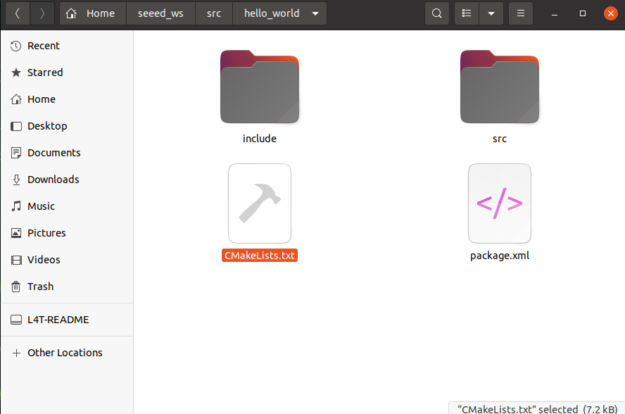
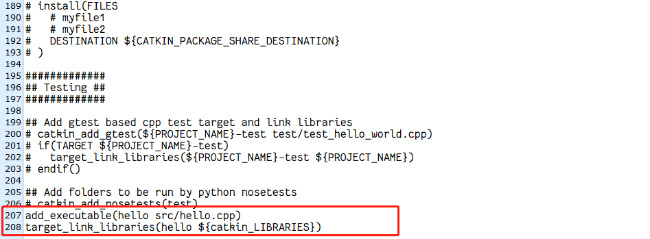
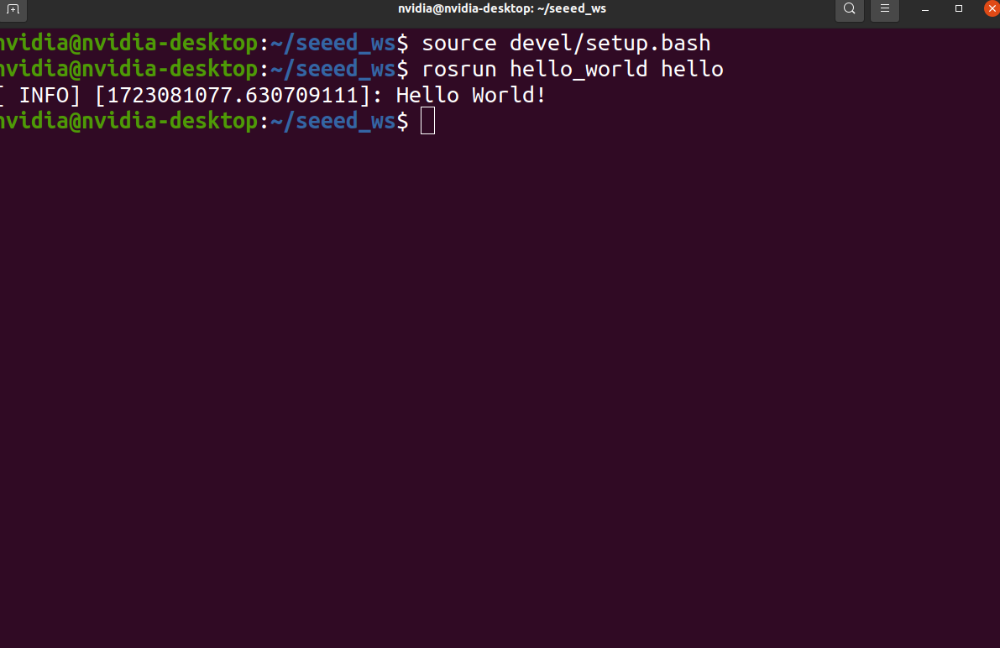

# HelloWorld Implementation Overview

ROS programming primarily uses C++ and Python. Most programs can be implemented in both languages. Each tutorial will demonstrate examples in both C++ and Python, allowing users to choose the implementation that suits them best.

The general implementation process in ROS is similar across different languages. Taking the HelloWorld program as an example, the steps are:

1. Create a workspace.
2. Create a package.
3. Edit source files.
4. Edit configuration files.
5. Compile and execute.

The main difference between C++ and Python lies in steps 3 and 4. The following sections detail the common steps for both implementations, with specific sections for C++ and Python.

## HelloWorld (C++ Version)

1. **Create and Initialize Workspace**
    ```bash
    mkdir -p <workspace_name>/src
    cd <workspace_name>
    catkin_make
    ```
    For example:
    ```bash
    mkdir -p seeed_ws/src
    cd seeed_ws
    catkin_make
    ```

2. **Create ROS Package and Add Dependencies**
      ```bash
      cd src
      catkin_create_pkg <package_name> roscpp rospy std_msgs
      ```
    For example:
      ```bash
      cd src
      catkin_create_pkg hello_world roscpp rospy std_msgs
      ```
3. **Edit Source File**

    Navigate to your package’s `src` directory and create a new C++ source file (e.g., `hello.cpp`):
    ```bash
    cd ~/<workspace_name>/src/<package_name>/src
    touch hello.cpp
    ```
    for example:
    ```bash
    cd ~/seeed_ws/src/hello_world/src
    touch hello.cpp
    ```
    copy flowing code into `hello.cpp`:
    ```cpp
    #include "ros/ros.h"

    int main(int argc, char *argv[])
    {
        ros::init(argc, argv, "hello");
        ros::NodeHandle n;
        ROS_INFO("Hello World!");

        return 0;
    }
    ```
      <p align="center">
      <a href="https://wiki.seeedstudio.com/reComputer_Intro/">
      
      </a>
      </p>

4. **Edit `CMakeLists.txt`**
      
      Add the following in the end your package's `CMakeLists.txt`:
      ```cmake
      add_executable(<node_name> src/hello.cpp)
      target_link_libraries(<node_name> ${catkin_LIBRARIES})
      ```
      for example:
      ```cmake
      add_executable(hello src/hello.cpp)
      target_link_libraries(hello ${catkin_LIBRARIES})
      ```
      <p align="center">
      <a href="https://wiki.seeedstudio.com/reComputer_Intro/">
      
      </a>
      </p>

      <p align="center">
      <a href="https://wiki.seeedstudio.com/reComputer_Intro/">
      
      </a>
      </p>

      **Note:The `CMakeLists.txt` file mentioned here is located in the created package directory, not in the workspace directory.**

5. **Compile the Workspace**
      ```bash
      cd <workspace_name>
      catkin_make
      ```
      for example:
      ```bash
        cd ~/seeed_ws
        catkin_make
      ```
6. **Run the Program**
    
    Open one terminal and start ROS core:
    ```bash
    roscore
    ```
    Open another terminal, source the workspace, and run the node:
    ```bash
    cd <workspace_name>
    source devel/setup.bash
    rosrun <package_name> hello
    ```
    for example:
    ```bash
    cd ~/seeed_ws
    source devel/setup.bash
    rosrun hello_world hello
    ```
    <p align="center">
      <a href="https://wiki.seeedstudio.com/reComputer_Intro/">
      
      </a>
    </p>

You should see the output: `Hello World!`

## HelloWorld (Python Version)

1. **Create and Initialize Workspace**
    ```bash
    mkdir -p <workspace_name>/src
    cd <workspace_name>
    catkin_make
    ```

2. **Create ROS Package and Add Dependencies**
    ```bash
    cd src
    catkin_create_pkg <package_name> roscpp rospy std_msgs
    ```

3. **Add `scripts` Directory and Create Python File**

    Navigate to your package directory, create a `scripts` directory, and a new Python file (e.g., `hello.py`):
    ```python
    #!/usr/bin/env python

    import rospy

    if __name__ == "__main__":
        rospy.init_node("hello")
        rospy.loginfo("Hello World!")
    ```

4. **Add Executable Permissions**
    ```bash
    chmod +x scripts/hello.py
    ```

5. **Edit `CMakeLists.txt`**
    
    Add the following to your package's `CMakeLists.txt`:
    ```cmake
    catkin_install_python(PROGRAMS scripts/hello.py
      DESTINATION ${CATKIN_PACKAGE_BIN_DESTINATION}
    )
    ```
6. **Compile the Workspace**
    ```bash
    cd <workspace_name>
    catkin_make
    ```

7. **Run the Program**
    Open one terminal and start ROS core:
    ```bash
    roscore
    ```
    Open another terminal, source the workspace, and run the node:
    ```bash
    cd <workspace_name>
    source devel/setup.bash
    rosrun <package_name> hello.py
    ```
    You should see the output: `Hello World!`

## Note
To make sourcing the workspace setup file more convenient, add it to your `.bashrc`:
```bash
echo "source ~/workspace_name/devel/setup.bash" >> ~/.bashrc
```
This ensures that the workspace is sourced automatically whenever a new terminal is opened.