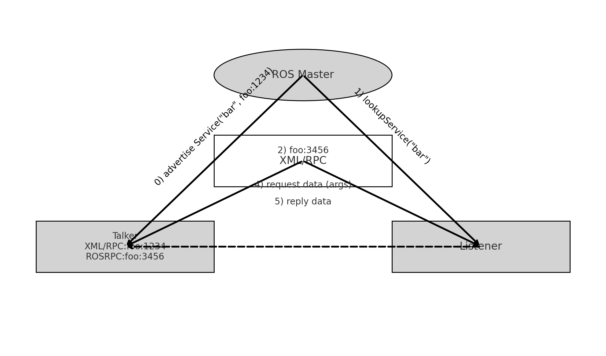

# 6.1.4-ROS Communication Mechanism: 

## Topic Communication Tutorial

### Introduction to Topic Communication

In ROS, topic communication is one of the fundamental ways for nodes to exchange information. This tutorial will guide you through the process of setting up basic topic communication using both C++ and Python. We will implement a simple publisher-subscriber model where the publisher sends text messages at a frequency of 10Hz, and the subscriber receives and prints these messages.

  <p align="center">
    <a href="https://wiki.seeedstudio.com/reComputer_Intro/">
    
  </a>

#### 1. Theoretical Model

Topic communication involves three main components:
-  **ROS Master**: Manages the registration and connection of nodes.
-  **Talker** (Publisher): Sends messages.
-  **Listener** (Subscriber): Receives messages.

The ROS Master helps establish connections between Talkers and Listeners. Here's a step-by-step breakdown of how the communication happens:

-  **Talker Registration**: The Talker registers itself with the ROS Master, including the topic name of its messages.
-  **Listener Registration**: The Listener registers itself with the ROS Master, specifying the topic it wants to subscribe to.
-  **Matching**: The ROS Master matches the Talker and Listener based on the topic name and sends the necessary connection information.
-  **Connection Establishment**: The Listener requests a connection to the Talker, and the Talker confirms it.
-  **Message Exchange**: Once connected, the Talker starts sending messages to the Listener.

**Key Points**:
- The ROS Master is only needed for establishing the connection.
- The communication continues even if the ROS Master is shut down after the connection is established.
- Multiple Talkers and Listeners can exist, and they can start in any order.

#### 2. Basic Topic Communication Operations (C++)

**Objective**: Create a publisher node that sends text messages at 10Hz and a subscriber node that prints the received messages.

**Steps**:

0. **[Create package](../6.1.2-Quick%20Experience%20with%20HelloWorld%20for%20ROS/README.md)**
    ```bash
    cd ~/seeed_ws/src/
    catkin_create_pkg listener_and_talker roscpp rospy std_msgs
    cd ~/seeed_ws/src/listener_and_talker/src
    touch listener.cpp talker.cpp
    ```

1. **Publisher Implementation**:
  
    `talker.cpp`
   ```cpp
   #include "ros/ros.h"
   #include "std_msgs/String.h"
   #include <sstream>

   int main(int argc, char *argv[]) {
       // Set locale for printing messages in the local language
       setlocale(LC_ALL, "");
       // Initialize the ROS node with a unique name
       ros::init(argc, argv, "talker");
       // Create a ROS node handle
       ros::NodeHandle nh;
       // Create a publisher object
       ros::Publisher pub = nh.advertise<std_msgs::String>("chatter", 10);

       std_msgs::String msg;
       std::string msg_front = "Hello Seeed";
       int count = 0;
       ros::Rate r(10); // 10Hz

       while (ros::ok()) {
           std::stringstream ss;
           ss << msg_front << count;
           msg.data = ss.str();
           pub.publish(msg);
           ROS_INFO("Sent message: %s", msg.data.c_str());
           r.sleep();
           count++;
       }
       return 0;
   }
   ```

2. **Subscriber Implementation**:

    `listener.cpp`
   ```cpp
   #include "ros/ros.h"
   #include "std_msgs/String.h"

   void doMsg(const std_msgs::String::ConstPtr& msg_p) {
       ROS_INFO("Heard: %s", msg_p->data.c_str());
   }

   int main(int argc, char *argv[]) {
       setlocale(LC_ALL, "");
       ros::init(argc, argv, "listener");
       ros::NodeHandle nh;
       ros::Subscriber sub = nh.subscribe<std_msgs::String>("chatter", 10, doMsg);
       ros::spin();
       return 0;
   }
   ```

3. **CMakeLists.txt Configuration**:
  
    Add flowing code in the end of your packages's `CMakeLists.txt`:
    ```cmake
    add_executable(listener src/listener.cpp)
    add_executable(talker src/talker.cpp)

    target_link_libraries(listener ${catkin_LIBRARIES})
    target_link_libraries(talker ${catkin_LIBRARIES})
    ```
    <p align="center">
      <a href="https://wiki.seeedstudio.com/reComputer_Intro/">
      
      </a>
    </p>

4. **Running the Code**:
  - Open a terminal and start `roscore`:
    ```bash
    roscore
    ```
  - In a new terminal, navigate to your workspace and run the publisher node:
    ```bash
    rosrun listener_and_talker listener
    ```
  - In another terminal, run the subscriber node:
    ```bash
    rosrun listener_and_talker talker
    ```
    <p align="center">
      <a href="https://wiki.seeedstudio.com/reComputer_Intro/">
      
      </a>
    </p>

      <p align="center">
      <a href="https://wiki.seeedstudio.com/reComputer_Intro/">
      
      </a>
    </p>
    
You should see messages being published and received, displayed in the terminal.

#### 3. Basic Topic Communication Operations (Python)

**Objective**: Create a publisher node that sends text messages at 10Hz and a subscriber node that prints the received messages.

**Steps**:

0. **[Create package](../6.1.2-Quick%20Experience%20with%20HelloWorld%20for%20ROS/README.md)**
    ```bash
    cd ~/seeed_ws/src/
    catkin_create_pkg listener_and_talker roscpp rospy std_msgs
    mkdir ~/seeed_ws/src/listener_and_talker/script
    cd ~/seeed_ws/src/listener_and_talker/script
    touch listener.py talker.py
    ```

1. **Publisher Implementation**:

    `talker.py`
   ```python
   #!/usr/bin/env python
   import rospy
   from std_msgs.msg import String

   if __name__ == "__main__":
       rospy.init_node("talker_p")
       pub = rospy.Publisher("chatter", String, queue_size=10)
       msg = String()
       msg_front = "hello 你好"
       count = 0
       rate = rospy.Rate(10)  # 10Hz

       while not rospy.is_shutdown():
           msg.data = msg_front + str(count)
           pub.publish(msg)
           rospy.loginfo("Sent message: %s", msg.data)
           rate.sleep()
           count += 1
   ```

2. **Subscriber Implementation**:

    `listener.py`
   ```python
   #!/usr/bin/env python
   import rospy
   from std_msgs.msg import String

   def doMsg(msg):
       rospy.loginfo("Heard: %s", msg.data)

   if __name__ == "__main__":
       rospy.init_node("listener_p")
       sub = rospy.Subscriber("chatter", String, doMsg, queue_size=10)
       rospy.spin()
   ```

3. **Add Executable Permissions**:
   ```bash
    sudo chmod +x *.py
   ```

4. **CMakeLists.txt Configuration**:

    Add flowing code in the end of your packages's `CMakeLists.txt`:
   ```cmake
   catkin_install_python(PROGRAMS
     scripts/talker.py
     scripts/listener.py
     DESTINATION ${CATKIN_PACKAGE_BIN_DESTINATION}
   )
   ```

5. **Running the Code**:
   - Open a terminal and start `roscore`:
     ```bash
     roscore
     ```
   - In a new terminal, navigate to your workspace and run the publisher node:
     ```bash
     rosrun listener_and_talker talker.py
     ```
   - In another terminal, run the subscriber node:
     ```bash
     rosrun listener_and_talker listener.py
     ```

You should see messages being published and received, displayed in the terminal.

### ROS Topic Common Commands

- `rostopic bw`: Display bandwidth usage of a topic
- `rostopic delay`: Display delay of a topic with a header
- `rostopic echo`: Print messages to the screen
- `rostopic find`: Find topics by type
- `rostopic hz`: Display publishing frequency of a topic
- `rostopic info`: Display information about a topic
- `rostopic list`: List all active topics
- `rostopic pub`: Publish data to a topic
- `rostopic type`: Print the type of a topic

----
## Introduction to Service Communication

Service communication in ROS differs from topic communication by being bidirectional. It allows not only the sending of messages but also receiving feedback. This model consists of two main parts:
1. **Client**: The entity that sends a request.
2. **Server**: The entity that processes the request and sends back a response.

When a client sends a request to a server, it waits for the server to process the request and return a response. This mechanism follows a "request-reply" structure, completing the communication.

#### How it work?
- **Node B** (the server) provides a service interface, usually named something like `/service_name`.
- **Node A** (the client) sends a request to Node B.
- Node B processes the request and sends back a response.
  
The communication process can be illustrated as follows:

1. **Talker Node advertises a service via ROS Master:**
   - The Talker node advertises a service (e.g., `advertiseService("bar", foo:1234)`) via the ROS Master, indicating its availability.

2. **Listener Node looks up the service via ROS Master:**
   - The Listener node sends a request to the ROS Master to find the service (e.g., `lookupService("bar")`).

3. **ROS Master returns the service address:**
   - The ROS Master responds with the service address (e.g., `foo:3456`) for the Listener node to connect.

4. **Listener Node requests data from Talker Node:**
   - The Listener node sends a service request to the Talker node, using XML/RPC for communication.

5. **Talker Node replies with the requested data:**
   - The Talker node processes the request and sends back the reply data over TCP.

    <p align="center">
      <a href="https://wiki.seeedstudio.com/reComputer_Intro/">
      
    </a>

**Key Points**:
- The client is blocked until it receives a response from the server.
- Service communication is efficient, as it only consumes resources when needed (i.e., when a request is made).

#### Theoretical Model

The service communication model involves three key components:

1. **ROS Master**: Manages the registration of both servers and clients, helping to establish connections based on matching service names.
2. **Server**: Provides the service.
3. **Client**: Requests the service.

**Process Overview**:

1. **Server Registration**: 
   - The server registers itself with the ROS Master, including the service name it provides.
   
2. **Client Registration**:
   - The client registers itself with the ROS Master, specifying the service it wants to use.

3. **Matching and Connection**:
   - The ROS Master matches the client and server based on the service name and facilitates the connection.

4. **Request-Response Cycle**:
   - The client sends a request to the server, which processes the request and returns a response.

####  Topic vs. Service Communication

Let's compare these two most common ROS communication methods to deepen our understanding:

| **Aspect**         | **Topic Communication** | **Service Communication** |
|--------------------|-------------------------|---------------------------|
| Communication Type | Asynchronous            | Synchronous               |
| Protocol           | TCP/IP                  | TCP/IP                    |
| Communication Model| Publish-Subscribe       | Request-Reply             |
| Relationship       | Many-to-Many            | One-to-Many               |
| Characteristics    | Callback-based          | Remote Procedure Call (RPC)|
| Use Cases          | Continuous, high-frequency data | Low-frequency, specific tasks |
| Example            | Publishing LiDAR data   | Triggering a sensor or taking a photo |

**Note**: Remote Procedure Call (RPC) refers to executing a function on a different process as if it were local.

#### 5. Creating a Custom Service (srv) in ROS

Let's dive into a hands-on example where we create a custom service that sums two integers sent by the client. The server will process this request and return the sum to the client.

**Steps to Implement**:
1. **Create a New Package**
    ```bash
    cd ~/seeed_ws/src
    catkin_create_pkg service_communication roscpp rospy std_msgs
    cd ~/seeed_ws
    catkin_make
    ```
1. **Define the srv File**:
   The `srv` file defines the structure of the request and response. In this case, the request will contain two integers, and the response will contain their sum.
   Create a new directory called `srv` in your package and add a file named `AddInts.srv`:
   ```bash
    mkdir ~/seeed_ws/src/service_communication/srv
    cd ~/seeed_ws/src/service_communication/srv
    touch AddInts.srv
   ```
   Copy flowing to `AddInts.srv`:
     ```srv
     int32 num1
     int32 num2
     ---
     int32 sum
     ```
      <p align="center">
        <a href="https://wiki.seeedstudio.com/reComputer_Intro/">
        
        </a>
      </p>

2. **Update the package.xml**:
   Add the necessary dependencies for generating message files in package's `package.xml`:
    ```xml
    <build_depend>message_generation</build_depend>
    <exec_depend>message_runtime</exec_depend>
    ```
    <p align="center">
      <a href="https://wiki.seeedstudio.com/reComputer_Intro/">
      
    </a>

3. **Update CMakeLists.txt**:
   - Include the necessary configurations to generate the service files in package's `CMakeLists.txt`:
     ```cmake
     find_package(catkin REQUIRED COMPONENTS
       roscpp
       rospy
       std_msgs
       message_generation
     )

     add_service_files(
       FILES
       AddInts.srv
     )

     generate_messages(
       DEPENDENCIES
       std_msgs
     )
     ```
      <p align="center">
        <a href="https://wiki.seeedstudio.com/reComputer_Intro/">
        
        </a>
      </p>


4. **Compile Your Package**:
   - Compile your package to generate the service message headers:
     ```bash
     cd ~/seeed_ws
     catkin_make
     source devel/setup.bash
     ```

### Implementing Service Communication (C++)

This example demonstrates how to implement service communication in ROS using C++. We will create a simple service where the server adds two integers provided by the client and returns the sum.

**1. Server Implementation:**

`add_two_ints_server.cpp`
```cpp
#include "ros/ros.h"
#include "service_communication/AddInts.h"

// Callback function to handle the client's request
bool add(service_communication::AddInts::Request &req,
         service_communication::AddInts::Response &res) {
    res.sum = req.num1 + req.num2;  // Compute the sum
    ROS_INFO("Request: a=%ld, b=%ld", (long int)req.num1, (long int)req.num2);
    ROS_INFO("Sending back response: [%ld]", (long int)res.sum);
    return true;
}

int main(int argc, char **argv) {
    ros::init(argc, argv, "add_two_ints_server");
    ros::NodeHandle nh;

    // Advertise the service to the ROS master
    ros::ServiceServer service = nh.advertiseService("add_two_ints", add);
    ROS_INFO("Ready to add two integers.");
    ros::spin();

    return 0;
}
```

**2. Client Implementation:**

`add_two_ints_client.cpp`
```cpp
#include "ros/ros.h"
#include "service_communication/AddInts.h"
#include <cstdlib>

int main(int argc, char **argv) {
    ros::init(argc, argv, "add_two_ints_client");
    if (argc != 3) {
        ROS_INFO("Usage: add_two_ints_client X Y");
        return 1;
    }

    ros::NodeHandle nh;
    ros::ServiceClient client = nh.serviceClient<service_communication::AddInts>("add_two_ints");

    // Prepare the service request
    service_communication::AddInts srv;
    srv.request.num1 = atoll(argv[1]);
    srv.request.num2 = atoll(argv[2]);

    // Call the service and check if it was successful
    if (client.call(srv)) {
        ROS_INFO("Sum: %ld", (long int)srv.response.sum);
    } else {
        ROS_ERROR("Failed to call service add_two_ints");
        return 1;
    }

    return 0;
}
```

**CMakeLists.txt Configuration:**

Make sure to add the following lines in the end of `CMakeLists.txt` to compile both the server and client:

```cmake
add_executable(add_two_ints_server src/add_two_ints_server.cpp)
add_executable(add_two_ints_client src/add_two_ints_client.cpp)

add_dependencies(add_two_ints_server ${${PROJECT_NAME}_EXPORTED_TARGETS} ${catkin_EXPORTED_TARGETS})
add_dependencies(add_two_ints_client ${${PROJECT_NAME}_EXPORTED_TARGETS} ${catkin_EXPORTED_TARGETS})

target_link_libraries(add_two_ints_server ${catkin_LIBRARIES})
target_link_libraries(add_two_ints_client ${catkin_LIBRARIES})
```

#### Compile and run demo
Open one terminal:
```bash
cd ~/seeed_ws
catkin_make
roscore
```
Open another terminal:
```bash
cd ~/seeed_ws
source devel/setup.bash
 rosrun service_communication server
```

Open another terminal:
```bash
cd ~/seeed_ws
source devel/setup.bash
rosrun service_communication client 1 5
```

<p align="center">
  <a href="https://wiki.seeedstudio.com/reComputer_Intro/">
  
  </a>
</p>

#### Implementing Service Communication (Python)

This Python example achieves the same functionality as the C++ example, where a service is used to add two integers.

Create a `scripts` folder under the package and create `add_two_ints_server.py` and `add_two_ints_client.py` files inside it.
```bash
cd ~/seeed/src/service_communication/
mkdir scripts
cd scripts
touch add_two_ints_server.py add_two_ints_client.py
```

**1. Server Implementation:**

`add_two_ints_server.py`
```python
#!/usr/bin/env python
import rospy
from service_communication.srv import AddInts,AddIntsRequest, AddIntsResponse
def doReq(req):
    sum = req.num1 + req.num2
    rospy.loginfo("data:num1 = %d, num2 = %d, sum = %d",req.num1, req.num2, sum)
    resp = AddIntsResponse(sum)
    return resp
if __name__ == "__main__":
    rospy.init_node("addints_server_p")
    server = rospy.Service("AddInts",AddInts,doReq)
    rospy.spin()
```

**2. Client Implementation:**

`add_two_ints_client.py`
```python
#!/usr/bin/env python

import sys
import rospy
from service_communication.srv import *

if __name__ == "__main__":
    if len(sys.argv) != 3:
        rospy.logerr("error")
        sys.exit(1)
    rospy.init_node("AddInts_Client_p")
    client = rospy.ServiceProxy("AddInts",AddInts)
    client.wait_for_service()
    req = AddIntsRequest()
    req.num1 = int(sys.argv[1])
    req.num2 = int(sys.argv[2]) 
    resp = client.call(req)
    rospy.loginfo("result:%d",resp.sum)
```

**CMakeLists.txt Configuration:**

Add the following lines in your `CMakeLists.txt` for the Python scripts:

```cmake
catkin_install_python(PROGRAMS
  scripts/add_two_ints_server.py 
  scripts/add_two_ints_client.py
  DESTINATION ${CATKIN_PACKAGE_BIN_DESTINATION}
)
```

#### Compile and run demo
Open one terminal:
```bash
cd ~/seeed_ws
catkin_make
roscore
```
Open another terminal:
```bash
cd ~/seeed_ws
source devel/setup.bash
rosrun service_communication add_two_ints_server.py
```

Open another terminal:
```bash
cd ~/seeed_ws
source devel/setup.bash
rosrun service_communication add_two_ints_client.py 1 5
```
 
 
#### Service Communication Commands

To work with services in ROS, you'll use the `rosservice` command. Here's a list of common `rosservice` commands and their functions:

- `rosservice args`: Print the arguments required by a service
- `rosservice call`: Call a service with the provided arguments
- `rosservice find`: Find services by type
- `rosservice info`: Print information about a service
- `rosservice list`: List all active services
- `rosservice type`: Print the type of a service
- `rosservice uri`: Print the ROSRPC URI of a service


---
## Introduction to the ROS Parameter Server

The ROS Parameter Server is a shared, multi-user, network-accessible storage space for parameters. It provides a way to store and retrieve parameters at runtime, which can be used to configure nodes or share data between them. Parameters on the server can be of various data types, including integers, booleans, strings, doubles, lists, and dictionaries. The Parameter Server is managed by the **ROS Master**, and nodes interact with it by setting, retrieving, or deleting parameters.

### Theoretical Model of the Parameter Server


The Parameter Server involves three main roles:
1. **ROS Master**: Manages the Parameter Server, acting as a central storage for parameters.
2. **Talker**: A node that sets parameters on the server.
3. **Listener**: A node that retrieves parameters from the server.


The process of interacting with the Parameter Server typically involves the following steps:

1. **Setting Parameters (Talker)**:
   - The Talker node sends a parameter to the Parameter Server via RPC (Remote Procedure Call), including the parameter's name and value. The ROS Master stores this parameter in its list.

2. **Retrieving Parameters (Listener)**:
   - The Listener node requests a parameter from the Parameter Server by sending a query with the parameter's name.

3. **Returning Parameters (ROS Master)**:
   - The ROS Master searches for the requested parameter in its storage and returns the corresponding value to the Listener.

    <p align="center">
      <a href="https://wiki.seeedstudio.com/reComputer_Intro/">
      
    </a>

**Supported Data Types**:
- 32-bit integers
- Booleans
- Strings
- Doubles
- ISO8601 dates
- Lists
- Base64-encoded binary data
- Dictionaries

### C++ Implementation

**Setting Parameters (C++):**

We'll start by setting various types of parameters on the Parameter Server using two different APIs: `ros::NodeHandle` and `ros::param`.

`set_parameters.cpp`
```cpp
#include "ros/ros.h"

int main(int argc, char *argv[]) {
    ros::init(argc, argv, "set_parameters");

    std::vector<std::string> students = {"Alice", "Bob", "Charlie", "David"};
    std::map<std::string, std::string> friends = {{"John", "Doe"}, {"Jane", "Smith"}};

    // Using ros::NodeHandle to set parameters
    ros::NodeHandle nh;
    nh.setParam("int_param", 42);
    nh.setParam("double_param", 3.14159);
    nh.setParam("bool_param", true);
    nh.setParam("string_param", "Hello ROS");
    nh.setParam("vector_param", students);
    nh.setParam("map_param", friends);

    // Using ros::param to set parameters
    ros::param::set("int_param_param", 84);
    ros::param::set("double_param_param", 6.28318);
    ros::param::set("bool_param_param", false);
    ros::param::set("string_param_param", "Goodbye ROS");
    ros::param::set("vector_param_param", students);
    ros::param::set("map_param_param", friends);

    return 0;
}
```
  Add flowing code in end of your package's `CMakeLists.txt`:

  ```cmake
  add_executable(set_parameters src/set_parameters.cpp)
  target_link_libraries(set_parameters ${catkin_LIBRARIES})
  ```

In this example:
- We set various types of parameters on the Parameter Server, including integers, doubles, booleans, strings, vectors, and maps.
- We used both `ros::NodeHandle` and `ros::param` APIs to set the parameters.

**Retrieving Parameters (C++):**

Next, we'll retrieve the parameters that we previously set on the Parameter Server.

`get_parameters.cpp`
```cpp
#include "ros/ros.h"

int main(int argc, char *argv[]) {
    ros::init(argc, argv, "get_parameters");

    // Using ros::NodeHandle to retrieve parameters
    ros::NodeHandle nh;
    int int_value;
    double double_value;
    bool bool_value;
    std::string string_value;
    std::vector<std::string> students;
    std::map<std::string, std::string> friends;

    nh.getParam("int_param", int_value);
    nh.getParam("double_param", double_value);
    nh.getParam("bool_param", bool_value);
    nh.getParam("string_param", string_value);
    nh.getParam("vector_param", students);
    nh.getParam("map_param", friends);

    ROS_INFO("Retrieved values:");
    ROS_INFO("int_param: %d", int_value);
    ROS_INFO("double_param: %.5f", double_value);
    ROS_INFO("bool_param: %d", bool_value);
    ROS_INFO("string_param: %s", string_value.c_str());

    for (const auto &student : students) {
        ROS_INFO("Student: %s", student.c_str());
    }

    for (const auto &friend_pair : friends) {
        ROS_INFO("Friend: %s = %s", friend_pair.first.c_str(), friend_pair.second.c_str());
    }

    return 0;
}
```

Add flowing code in end of your package's `CMakeLists.txt`:

```cmake
add_executable(get_parameters src/get_parameters.cpp)
target_link_libraries(get_parameters ${catkin_LIBRARIES})
```

In this example:
- We retrieve the parameters set on the server using the `ros::NodeHandle` API.
- The retrieved parameters are then printed to the ROS log for verification.

**Deleting Parameters (C++):**

Finally, let's see how to delete parameters from the Parameter Server.

``delete_parameters.cpp``
```cpp
#include "ros/ros.h"

int main(int argc, char *argv[]) {
    ros::init(argc, argv, "delete_parameters");

    ros::NodeHandle nh;
    bool success;

    // Using ros::NodeHandle to delete parameters
    success = nh.deleteParam("int_param");
    ROS_INFO("Delete int_param: %s", success ? "Success" : "Failure");

    // Using ros::param to delete parameters
    success = ros::param::del("int_param_param");
    ROS_INFO("Delete int_param_param: %s", success ? "Success" : "Failure");

    return 0;
}
```
Add flowing code in end of your package's `CMakeLists.txt`:

```cmake
add_executable(delete_parameters src/delete_parameters.cpp)
target_link_libraries(delete_parameters ${catkin_LIBRARIES})
```

In this example:
- We use both `ros::NodeHandle` and `ros::param` APIs to delete parameters from the server.
- The success of the deletion is logged.

### 2.2 Python Implementation

**Setting Parameters (Python):**

Let's now set parameters using Python. The process is very similar to the C++ version.

```python
#!/usr/bin/env python

import rospy

if __name__ == "__main__":
    rospy.init_node("set_parameters_py")

    # Setting various types of parameters
    rospy.set_param("int_param", 42)
    rospy.set_param("double_param", 3.14159)
    rospy.set_param("bool_param", True)
    rospy.set_param("string_param", "Hello ROS")
    rospy.set_param("list_param", ["apple", "banana", "cherry"])
    rospy.set_param("dict_param", {"first_name": "John", "last_name": "Doe"})

    # Modifying a parameter
    rospy.set_param("int_param", 84)
```

Add flowing code in end of your package's `CMakeLists.txt`:

```cmake
catkin_install_python(PROGRAMS
  scripts/set_parameters_py.py
  DESTINATION ${CATKIN_PACKAGE_BIN_DESTINATION}
)
```

In this example:
- We set various types of parameters, including integers, doubles, booleans, strings, lists, and dictionaries.
- We also demonstrate modifying an existing parameter.

**Retrieving Parameters (Python):**

Next, we'll retrieve the parameters that we set.

```python
#!/usr/bin/env python

import rospy

if __name__ == "__main__":
    rospy.init_node("get_parameters_py")

    # Retrieving parameters
    int_value = rospy.get_param("int_param", 0)
    double_value = rospy.get_param("double_param", 0.0)
    bool_value = rospy.get_param("bool_param", False)
    string_value = rospy.get_param("string_param", "")
    list_value = rospy.get_param("list_param", [])
    dict_value = rospy.get_param("dict_param", {})

    rospy.loginfo("Retrieved values:")
    rospy.loginfo("int_param: %d", int_value)
    rospy.loginfo("double_param: %.5f", double_value)
    rospy.loginfo("bool_param: %s", bool_value)
    rospy.loginfo("string_param: %s", string_value)
    rospy.loginfo("list_param: %s", list_value)
    rospy.loginfo("dict_param: %s", dict_value)
```

Add flowing code in end of your package's `CMakeLists.txt`:
```cmake
catkin_install_python(PROGRAMS
  scripts/set_parameters_py.py
  scripts/get_parameters_py.py
  DESTINATION ${CATKIN_PACKAGE_BIN_DESTINATION}
)
```


In this example:
- We use `rospy.get_param` to retrieve parameters set on the server.
- The retrieved values are logged using `rospy.loginfo`.

**Deleting Parameters (Python):**

Finally, let's delete parameters from the Parameter Server using Python.

```python
#!/usr/bin/env python

import rospy

if __name__ == "__main__":
    rospy.init_node("delete_parameters_py")

    try:
        rospy.delete_param("int_param")
        rospy.loginfo("int_param deleted successfully.")
    except KeyError:
        rospy.logwarn("int_param does not exist.")

    try:
        rospy.delete_param("non_existent_param")
        rospy.loginfo("non_existent_param deleted successfully.")
    except KeyError:
        rospy.logwarn("non_existent_param does not exist.")
```

Add flowing code in end of your package's `CMakeLists.txt`:
```cmake
catkin_install_python(PROGRAMS
  scripts/set_parameters_py.py
  scripts/get_parameters_py.py
  scripts/delete_parameters_py.py
  DESTINATION ${CATKIN_PACKAGE_BIN_DESTINATION}
)
```

In this example:
- We attempt to delete a parameter and handle the case where the parameter does not exist using exception handling (`KeyError`).

### ROS Parameter Server Common Commands
`rosparam` includes command-line tools for getting and setting ROS parameters on the parameter server, using YAML-encoded files.

- `rosparam set`: Set a parameter
- `rosparam get`: Get a parameter
- `rosparam load`: Load parameters from an external file
- `rosparam dump`: Dump parameters to an external file
- `rosparam delete`: Delete a parameter
- `rosparam list`: List all parameters

Examples:

- `rosparam list`: List all parameters on the parameter server.
- `rosparam set <param_name> <value>`: Set a parameter with a specific value.
- `rosparam get <param_name>`: Get the value of a specific parameter.
- `rosparam delete <param_name>`: Delete a specific parameter.
- `rosparam load <file_name.yaml>`: Load parameters from a YAML file.
- `rosparam dump <file_name.yaml>`: Dump the current parameters to a YAML file.


