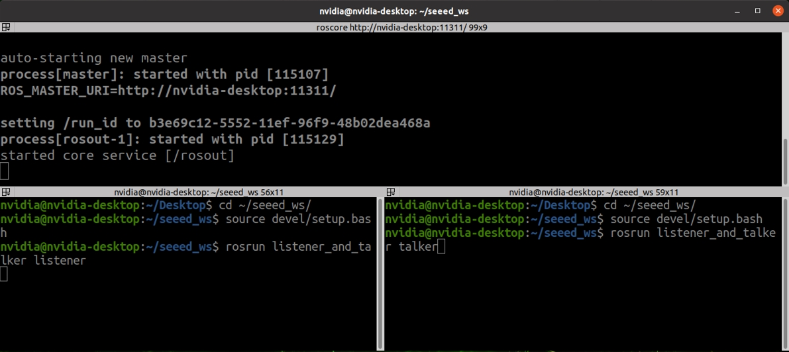

# 6.1.4-ROS Communication Mechanism: 

## Topic Communication Tutorial

### Introduction to Topic Communication

In ROS, topic communication is one of the fundamental ways for nodes to exchange information. This tutorial will guide you through the process of setting up basic topic communication using both C++ and Python. We will implement a simple publisher-subscriber model where the publisher sends text messages at a frequency of 10Hz, and the subscriber receives and prints these messages.

#### 1. Theoretical Model

Topic communication involves three main components:
-  **ROS Master**: Manages the registration and connection of nodes.
-  **Talker** (Publisher): Sends messages.
-  **Listener** (Subscriber): Receives messages.

The ROS Master helps establish connections between Talkers and Listeners. Here's a step-by-step breakdown of how the communication happens:

-  **Talker Registration**: The Talker registers itself with the ROS Master, including the topic name of its messages.
-  **Listener Registration**: The Listener registers itself with the ROS Master, specifying the topic it wants to subscribe to.
-  **Matching**: The ROS Master matches the Talker and Listener based on the topic name and sends the necessary connection information.
-  **Connection Establishment**: The Listener requests a connection to the Talker, and the Talker confirms it.
-  **Message Exchange**: Once connected, the Talker starts sending messages to the Listener.

**Key Points**:
- The ROS Master is only needed for establishing the connection.
- The communication continues even if the ROS Master is shut down after the connection is established.
- Multiple Talkers and Listeners can exist, and they can start in any order.

#### 2. Basic Topic Communication Operations (C++)

**Objective**: Create a publisher node that sends text messages at 10Hz and a subscriber node that prints the received messages.

**Steps**:

0. **[Create package](../6.1.2-Quick%20Experience%20with%20HelloWorld%20for%20ROS/README.md)**
    ```bash
    cd ~/seeed_ws/src/
    catkin_create_pkg listener_and_talker roscpp rospy std_msgs
    cd ~/seeed_ws/src/listener_and_talker/src
    touch listener.cpp talker.cpp
    ```

1. **Publisher Implementation**:
  
    `talker.cpp`
   ```cpp
   #include "ros/ros.h"
   #include "std_msgs/String.h"
   #include <sstream>

   int main(int argc, char *argv[]) {
       // Set locale for printing messages in the local language
       setlocale(LC_ALL, "");
       // Initialize the ROS node with a unique name
       ros::init(argc, argv, "talker");
       // Create a ROS node handle
       ros::NodeHandle nh;
       // Create a publisher object
       ros::Publisher pub = nh.advertise<std_msgs::String>("chatter", 10);

       std_msgs::String msg;
       std::string msg_front = "Hello Seeed";
       int count = 0;
       ros::Rate r(10); // 10Hz

       while (ros::ok()) {
           std::stringstream ss;
           ss << msg_front << count;
           msg.data = ss.str();
           pub.publish(msg);
           ROS_INFO("Sent message: %s", msg.data.c_str());
           r.sleep();
           count++;
       }
       return 0;
   }
   ```

2. **Subscriber Implementation**:

    `listener.cpp`
   ```cpp
   #include "ros/ros.h"
   #include "std_msgs/String.h"

   void doMsg(const std_msgs::String::ConstPtr& msg_p) {
       ROS_INFO("Heard: %s", msg_p->data.c_str());
   }

   int main(int argc, char *argv[]) {
       setlocale(LC_ALL, "");
       ros::init(argc, argv, "listener");
       ros::NodeHandle nh;
       ros::Subscriber sub = nh.subscribe<std_msgs::String>("chatter", 10, doMsg);
       ros::spin();
       return 0;
   }
   ```

3. **CMakeLists.txt Configuration**:
  
    Add flowing code in the end of your packages's `CMakeLists.txt`:
    ```cmake
    add_executable(listener src/listener.cpp)
    add_executable(talker src/talker.cpp)

    target_link_libraries(listener ${catkin_LIBRARIES})
    target_link_libraries(talker ${catkin_LIBRARIES})
    ```
    <p align="center">
      <a href="https://wiki.seeedstudio.com/reComputer_Intro/">
      
      </a>
    </p>

4. **Running the Code**:
  - Open a terminal and start `roscore`:
    ```bash
    roscore
    ```
  - In a new terminal, navigate to your workspace and run the publisher node:
    ```bash
    rosrun listener_and_talker listener
    ```
  - In another terminal, run the subscriber node:
    ```bash
    rosrun listener_and_talker talker
    ```
    <p align="center">
      <a href="https://wiki.seeedstudio.com/reComputer_Intro/">
      
      </a>
    </p>

      <p align="center">
      <a href="https://wiki.seeedstudio.com/reComputer_Intro/">
      
      </a>
    </p>
    
You should see messages being published and received, displayed in the terminal.

#### 3. Basic Topic Communication Operations (Python)

**Objective**: Create a publisher node that sends text messages at 10Hz and a subscriber node that prints the received messages.

**Steps**:

0. **[Create package](../6.1.2-Quick%20Experience%20with%20HelloWorld%20for%20ROS/README.md)**
    ```bash
    cd ~/seeed_ws/src/
    catkin_create_pkg listener_and_talker roscpp rospy std_msgs
    mkdir ~/seeed_ws/src/listener_and_talker/script
    cd ~/seeed_ws/src/listener_and_talker/script
    touch listener.py talker.py
    ```

1. **Publisher Implementation**:

    `talker.py`
   ```python
   #!/usr/bin/env python
   import rospy
   from std_msgs.msg import String

   if __name__ == "__main__":
       rospy.init_node("talker_p")
       pub = rospy.Publisher("chatter", String, queue_size=10)
       msg = String()
       msg_front = "hello 你好"
       count = 0
       rate = rospy.Rate(10)  # 10Hz

       while not rospy.is_shutdown():
           msg.data = msg_front + str(count)
           pub.publish(msg)
           rospy.loginfo("Sent message: %s", msg.data)
           rate.sleep()
           count += 1
   ```

2. **Subscriber Implementation**:

    `listener.py`
   ```python
   #!/usr/bin/env python
   import rospy
   from std_msgs.msg import String

   def doMsg(msg):
       rospy.loginfo("Heard: %s", msg.data)

   if __name__ == "__main__":
       rospy.init_node("listener_p")
       sub = rospy.Subscriber("chatter", String, doMsg, queue_size=10)
       rospy.spin()
   ```

3. **Add Executable Permissions**:
   ```bash
    sudo chmod +x *.py
   ```

4. **CMakeLists.txt Configuration**:

    Add flowing code in the end of your packages's `CMakeLists.txt`:
   ```cmake
   catkin_install_python(PROGRAMS
     scripts/talker.py
     scripts/listener.py
     DESTINATION ${CATKIN_PACKAGE_BIN_DESTINATION}
   )
   ```

5. **Running the Code**:
   - Open a terminal and start `roscore`:
     ```bash
     roscore
     ```
   - In a new terminal, navigate to your workspace and run the publisher node:
     ```bash
     rosrun listener_and_talker talker.py
     ```
   - In another terminal, run the subscriber node:
     ```bash
     rosrun listener_and_talker listener.py
     ```

You should see messages being published and received, displayed in the terminal.


### Introduction to Service Communication

Service communication in ROS differs from topic communication by being bidirectional. It allows not only the sending of messages but also receiving feedback. This model consists of two main parts:
1. **Client**: The entity that sends a request.
2. **Server**: The entity that processes the request and sends back a response.

When a client sends a request to a server, it waits for the server to process the request and return a response. This mechanism follows a "request-reply" structure, completing the communication.

#### How it work?
- **Node B** (the server) provides a service interface, usually named something like `/service_name`.
- **Node A** (the client) sends a request to Node B.
- Node B processes the request and sends back a response.
  
The communication process can be illustrated as follows:

1. **Client Sends a Request**: The client sends a request and waits.
2. **Server Processes the Request**: The server processes the request and generates a response.
3. **Server Sends the Response**: The server sends the response back to the client.
4. **Client Receives the Response**: The client continues its execution after receiving the response.

**Key Points**:
- The client is blocked until it receives a response from the server.
- Service communication is efficient, as it only consumes resources when needed (i.e., when a request is made).

#### Theoretical Model

The service communication model involves three key components:

1. **ROS Master**: Manages the registration of both servers and clients, helping to establish connections based on matching service names.
2. **Server**: Provides the service.
3. **Client**: Requests the service.

**Process Overview**:

1. **Server Registration**: 
   - The server registers itself with the ROS Master, including the service name it provides.
   
2. **Client Registration**:
   - The client registers itself with the ROS Master, specifying the service it wants to use.

3. **Matching and Connection**:
   - The ROS Master matches the client and server based on the service name and facilitates the connection.

4. **Request-Response Cycle**:
   - The client sends a request to the server, which processes the request and returns a response.

####  Topic vs. Service Communication

Let's compare these two most common ROS communication methods to deepen our understanding:

| **Aspect**         | **Topic Communication** | **Service Communication** |
|--------------------|-------------------------|---------------------------|
| Communication Type | Asynchronous            | Synchronous               |
| Protocol           | TCP/IP                  | TCP/IP                    |
| Communication Model| Publish-Subscribe       | Request-Reply             |
| Relationship       | Many-to-Many            | One-to-Many               |
| Characteristics    | Callback-based          | Remote Procedure Call (RPC)|
| Use Cases          | Continuous, high-frequency data | Low-frequency, specific tasks |
| Example            | Publishing LiDAR data   | Triggering a sensor or taking a photo |

**Note**: Remote Procedure Call (RPC) refers to executing a function on a different process as if it were local.

#### 5. Creating a Custom Service (srv) in ROS

Let's dive into a hands-on example where we create a custom service that sums two integers sent by the client. The server will process this request and return the sum to the client.

**Steps to Implement**:
1. **Create a New Package**
    ```bash
    cd ~/seeed_ws/src
    catkin_create_pkg service_communication roscpp rospy std_msgs
    cd ~/seeed_ws
    catkin_make
    ```
1. **Define the srv File**:
   The `srv` file defines the structure of the request and response. In this case, the request will contain two integers, and the response will contain their sum.
   Create a new directory called `srv` in your package and add a file named `AddInts.srv`:
   ```bash
    mkdir ~/seeed_ws/src/service_communication/srv
    cd ~/seeed_ws/src/service_communication/srv
    touch AddInts.srv
   ```
   Copy flowing to `AddInts.srv`:
     ```srv
     int32 num1
     int32 num2
     ---
     int32 sum
     ```

2. **Update the package.xml**:
   Add the necessary dependencies for generating message files in package's `package.xml`:
    ```xml
    <build_depend>message_generation</build_depend>
    <exec_depend>message_runtime</exec_depend>
  

3. **Update CMakeLists.txt**:
   - Include the necessary configurations to generate the service files in package's `CMakeLists.txt`:
     ```cmake
     catkin_package(
       CATKIN_DEPENDS roscpp rospy std_msgs
      )
     find_package(catkin REQUIRED COMPONENTS
       roscpp
       rospy
       std_msgs
       message_generation
     )

     add_service_files(
       FILES
       AddInts.srv
     )

     generate_messages(
       DEPENDENCIES
       std_msgs
     )
     ```

4. **Compile Your Package**:
   - Compile your package to generate the service message headers:
     ```bash
     cd ~/seeed_ws
     catkin_make
     source devel/setup.bash
     ```

#### Implementing Service Communication (C++)

This example demonstrates how to implement service communication in ROS using C++. We will create a simple service where the server adds two integers provided by the client and returns the sum.

**1. Server Implementation:**
`add_two_ints_server`
```cpp
#include "ros/ros.h"
#include "service_communication/AddInts.h"

// Callback function to handle the client's request
bool add(service_communication::AddInts::Request &req,
         service_communication::AddInts::Response &res) {
    res.sum = req.num1 + req.num2;  // Compute the sum
    ROS_INFO("Request: a=%ld, b=%ld", (long int)req.num1, (long int)req.num2);
    ROS_INFO("Sending back response: [%ld]", (long int)res.sum);
    return true;
}

int main(int argc, char **argv) {
    ros::init(argc, argv, "add_two_ints_server");
    ros::NodeHandle nh;

    // Advertise the service to the ROS master
    ros::ServiceServer service = nh.advertiseService("add_two_ints", add);
    ROS_INFO("Ready to add two integers.");
    ros::spin();

    return 0;
}
```

In this code:
- We define a service callback function `add` that takes the request (two integers) and computes their sum, which is then returned in the response.
- The service is advertised under the name `"add_two_ints"`, and the server waits for incoming requests using `ros::spin()`.

**2. Client Implementation:**
`add_two_ints_client`
```cpp
#include "ros/ros.h"
#include "service_communication/AddInts.h"
#include <cstdlib>

int main(int argc, char **argv) {
    ros::init(argc, argv, "add_two_ints_client");
    if (argc != 3) {
        ROS_INFO("Usage: add_two_ints_client X Y");
        return 1;
    }

    ros::NodeHandle nh;
    ros::ServiceClient client = nh.serviceClient<service_communication::AddInts>("add_two_ints");

    // Prepare the service request
    service_communication::AddInts srv;
    srv.request.num1 = atoll(argv[1]);
    srv.request.num2 = atoll(argv[2]);

    // Call the service and check if it was successful
    if (client.call(srv)) {
        ROS_INFO("Sum: %ld", (long int)srv.response.sum);
    } else {
        ROS_ERROR("Failed to call service add_two_ints");
        return 1;
    }

    return 0;
}
```

In this client code:
- The client sends two integers to the server as a request. 
- The service client is created and used to call the `"add_two_ints"` service. 
- If the call is successful, the client prints the sum returned by the server.

**CMakeLists.txt Configuration:**

Make sure to add the following lines in the end of `CMakeLists.txt` to compile both the server and client:

```cmake
add_executable(add_two_ints_server src/add_two_ints_server.cpp)
add_executable(add_two_ints_client src/add_two_ints_client.cpp)

add_dependencies(add_two_ints_server ${${PROJECT_NAME}_EXPORTED_TARGETS} ${catkin_EXPORTED_TARGETS})
add_dependencies(add_two_ints_client ${${PROJECT_NAME}_EXPORTED_TARGETS} ${catkin_EXPORTED_TARGETS})

target_link_libraries(add_two_ints_server ${catkin_LIBRARIES})
target_link_libraries(add_two_ints_client ${catkin_LIBRARIES})
```

#### Python Demo

This Python example achieves the same functionality as the C++ example, where a service is used to add two integers.

**1. Server Implementation:**

```python
#!/usr/bin/env python

import rospy
from your_package_name.srv import AddTwoInts, AddTwoIntsResponse

def handle_add_two_ints(req):
    sum_result = req.a + req.b
    rospy.loginfo("Request: a=%d, b=%d", req.a, req.b)
    rospy.loginfo("Sending back response: [%d]", sum_result)
    return AddTwoIntsResponse(sum_result)

def add_two_ints_server():
    rospy.init_node('add_two_ints_server')
    s = rospy.Service('add_two_ints', AddTwoInts, handle_add_two_ints)
    rospy.loginfo("Ready to add two integers.")
    rospy.spin()

if __name__ == "__main__":
    add_two_ints_server()
```

In this Python code:
- The server is implemented with a callback function `handle_add_two_ints`, which adds two integers and returns the sum.
- The service is named `"add_two_ints"` and is advertised to the ROS master.

**2. Client Implementation:**

```python
#!/usr/bin/env python

import sys
import rospy
from your_package_name.srv import AddTwoInts

def add_two_ints_client(x, y):
    rospy.wait_for_service('add_two_ints')
    try:
        add_two_ints = rospy.ServiceProxy('add_two_ints', AddTwoInts)
        resp = add_two_ints(x, y)
        return resp.sum
    except rospy.ServiceException as e:
        rospy.logerr("Service call failed: %s", e)

if __name__ == "__main__":
    if len(sys.argv) != 3:
        rospy.logerr("Usage: add_two_ints_client X Y")
        sys.exit(1)

    x = int(sys.argv[1])
    y = int(sys.argv[2])
    rospy.init_node('add_two_ints_client')
    result = add_two_ints_client(x, y)
    rospy.loginfo("Sum: %d", result)
```

In the Python client:
- The client node waits for the `"add_two_ints"` service to be available.
- Once available, it sends two integers as a request and receives the sum in response.

**CMakeLists.txt Configuration:**

Add the following lines in your `CMakeLists.txt` for the Python scripts:

```cmake
catkin_install_python(PROGRAMS
  scripts/add_two_ints_server.py 
  scripts/add_two_ints_client.py
  DESTINATION ${CATKIN_PACKAGE_BIN_DESTINATION}
)
```

#### Service Communication Commands

To work with services in ROS, you'll use the `rosservice` command. Here's a list of common `rosservice` commands and their functions:

| **Command**         | **Function** |
|---------------------|--------------|
| `rosservice list`   | Displays a list of available services. |
| `rosservice info`   | Prints information about a specific service. |
| `rosservice type`   | Prints the type of the service. |
| `rosservice uri`    | Prints the ROSRPC URI of the service. |
| `rosservice find`   | Finds services by type. |
| `rosservice call`   | Calls a service with provided arguments. |
| `rosservice args`   | Prints the arguments required for a service. |

For more details, visit the [ROS Services Documentation](http://wiki.ros.org/Services).

### Summary

These demos illustrate how to implement basic service communication in ROS using both C++ and Python. The server provides a service that adds two integers, and the client sends requests to use this service. This foundational example can be extended to more complex operations as needed for your specific ROS application.