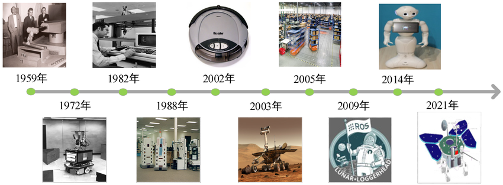
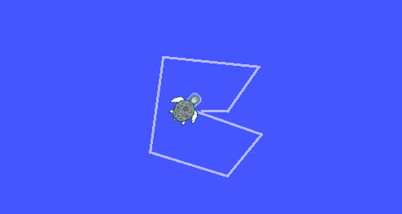

# Overview of ROS and Environment Setup

## Introduction

This tutorial provides a concise overview of ROS (Robot Operating System) and guides you through the quick installation and experience of ROS on the [reComputer J3010 Nvidia Jetson Orin Nano](https://www.seeedstudio.com/reComputer-J3010-w-o-power-adapter-p-5631.html). By the end of this tutorial, you will have a working ROS environment and will be able to run a simple ROS demo.

### Prerequisites

To follow this tutorial, you will need the following hardware and software:
- **Hardware:** [reComputer J3010 (Nvidia Jetson Orin Nano)]((https://www.seeedstudio.com/reComputer-J3010-w-o-power-adapter-p-5631.html)), display, keyboard, and mouse.
- **Software:** Jetpack 5.1.1, Ubuntu 20.04, ROS Noetic, Python and C++.

<div align="center">
    
</div>


## Introduction to the Development of ROS

### [What is ROS?](https://vimeo.com/639236696)

ROS (Robot Operating System) is an open-source framework for robot software development. It provides a structured communications layer above the host operating systems of a heterogeneous compute cluster. ROS is designed to be as thin as possible and consists of two parts:

- **ROS system (ROS):** The plumbing system that handles communication between processes. It is the middleware that allows different robot parts to communicate with each other.
- **ROS packages:** Libraries and tools needed to write robot applications.

<div align="center">
    
</div>

### [Why ROS?](https://www.ros.org/blog/why-ros/)

ROS simplifies the process of creating complex and robust robot behavior across a wide variety of robotic platforms. Some of the key objectives and advantages of using ROS include:

- **Rapid Development:** Provides a standard platform that accelerates development from research to production.
- **Global Community:** Supported by a large, active community contributing to and improving the software.
- **Proven Track Record:** Widely used in academic and commercial robotics.
- **Time to Market:** Helps reduce product development time with comprehensive tools and libraries.
- **Versatility:** Supports multiple domains and platforms, including embedded systems.
- **Open Source:** Free to use, modify, and extend, promoting innovation and collaboration.
- **Commercial Friendly:** Distributed under permissive licenses like Apache 2.0.

### History and Development of ROS

The history of ROS (Robot Operating System) is intertwined with the broader evolution of robotics:

  <div align="center">
      
  </div>

#### Early Robotics Developments
- **1959:** The journey of robotics began with the development of the first automated robot.
- **1972:** Emergence of robots capable of interacting with their environment.
- **1982:** Integration of robots into computer systems for complex tasks.
- **1988:** Advances in robotic automation and control systems.
- **2002:** Introduction of consumer robots like the Roomba for household chores.
- **2003:** Expansion of robotic exploration to Mars with rovers.
- **2005:** Crucial roles in industrial automation, exemplified by warehouse robots.

### History and Development of ROS

#### Early Robotics Developments
- **1959:** The journey of robotics began with the development of the first automated robot.
- **1972:** Emergence of robots capable of interacting with their environment.
- **1982:** Integration of robots into computer systems for complex tasks.
- **1988:** Advances in robotic automation and control systems.
- **2002:** Introduction of consumer robots like the Roomba for household chores.
- **2003:** Expansion of robotic exploration to Mars with rovers.
- **2005:** Crucial roles in industrial automation, exemplified by warehouse robots.

#### The Birth of ROS
- **2007:** Development of ROS began under the name "Switchyard" at the Stanford Artificial Intelligence Laboratory by Morgan Quigley, Eric Berger, and Andrew Ng. It aimed to address the lack of shared software infrastructure in robotics research.
- **2008:** Development continued at Willow Garage, a robotics research lab.
- **2009:** Official establishment of ROS, marked by its first version release.

#### Growth and Evolution
- **2010:** Release of ROS 1.0, with Willow Garage playing a crucial role in its development and community growth.
- **2014:** Introduction of social and service robots like Pepper, highlighting advancements in human-robot interaction.
- **2021:** ROS evolves to support sophisticated and versatile robotic systems for various applications.

### [ROS Releases Timeline](https://docs.ros.org/en/rolling/Releases.html)

| Release Name | Distribution | Release Date | EOL Date       |
|--------------|--------------|--------------|----------------|
| Boxturtle    | ROS 1        | March 2010   | March 2011     |
| C Turtle     | ROS 1        | August 2010  | August 2011    |
| Diamondback  | ROS 1        | March 2011   | November 2012  |
| Electric Emys| ROS 1        | August 2011  | January 2013   |
| Fuerte       | ROS 1        | April 2012   | July 2013      |
| Groovy Galapagos| ROS 1     | December 2012| May 2014       |
| Hydro Medusa | ROS 1        | September 2013| May 2015      |
| Indigo Igloo | ROS 1        | July 2014    | April 2019     |
| Jade Turtle  | ROS 1        | May 2015     | May 2017       |
| Kinetic Kame | ROS 1        | May 2016     | April 2021     |
| Lunar Loggerhead | ROS 1    | May 2017     | May 2019       |
| Melodic Morenia| ROS 1      | May 2018     | May 2023       |
| Noetic Ninjemys | ROS 1     | May 2020     | May 2025       |
| Foxy Fitzroy | ROS 2        | June 2020    | June 2023      |
| Galactic Geochelone | ROS 2 | May 2021     | November 2022  |
| Humble Hawksbill | ROS 2    | May 2022     | May 2027       |
| Rolling Ridley | ROS 2      | Ongoing      | Ongoing        |

Today, ROS is maintained by Open Robotics, a non-profit organization dedicated to developing the core ROS system, including ROS 2.0, which incorporates improvements for real-time and embedded systems, along with other tools and libraries.


## ROS Environment Installation and Quick Experience

### Install ROS1
- **Step 1:** Open Terminal and Update System Packages.
  ```bash
  sudo apt update 
  sudo apt upgrade
  ```
- **Step 2:** Install Basic Tools.
  ```bash
  sudo apt install curl gnupg2 lsb-release
  ```
- **Step 3:** Add ROS repository key.
  ```bash
  sudo curl -sSL https://raw.githubusercontent.com/ros/rosdistro/master/ros.asc | sudo apt-key add -
  ```
- **Step 4:** Add ROS repository.
  ```bash
  sudo sh -c 'echo "deb http://packages.ros.org/ros/ubuntu $(lsb_release -sc) main" > /etc/apt/sources.list.d/ros-latest.list'
  ```
- **Step 5:** Update package list.
  ```bash
  sudo apt update
  ```
- **Step 6:** Install ros-noetic-desktop-full.
  ```bash
  sudo apt install ros-noetic-desktop-full
  sudo apt-get install python3-rosdep
  ```
- **Step 7:** Initialize rosdep.
  ```bash
  sudo rosdep init
  rosdep update
  ```
- **Step 8:** Set Up ROS Environment Variables.
  ```bash
  echo "source /opt/ros/noetic/setup.bash">> ~/.bashrc &&
  source ~/.bashrc
  ```
- **Step 9:** Install Dependency Tools.
  ```bash
  sudo apt install python3-rosinstall python3-rosinstall-generator python3-wstool build-essential
  ```
- **Step 10:** Test the Installation.
  ```bash
  roscore
  ```
  <div align="center">
      
  </div>

### Quick Start with ROS

To quickly experience ROS, let's create a ROS workspace and run a simple demo.

1. **Create a ROS workspace**
   ```bash
   mkdir -p ~/catkin_ws/src
   cd ~/catkin_ws/
   catkin_make
   ```

2. **Source the setup file**
   ```bash
   source devel/setup.bash
   ```

3. **Run a demo**
   ```bash
   roscore
   ```
   Open another terminal and run:
   ```bash
   rosrun turtlesim turtlesim_node
   ```
   Open yet another terminal and run:
   ```bash
   rosrun turtlesim turtle_teleop_key
   ```
  <div align="center">
      
  </div>

This quick demo shows a graphical turtle robot that you can control using the keyboard.
