# ROS 1 Noetic Basics

This chapter introduces the ROS 1 Noetic development workflow on reComputer Jetson, including workspaces, packages, common tools, topic/service communication, custom messages, and TF.

> Long runnable examples are saved under `./code/`, and related figures are saved under `./images/`.

# Contents

- [7.2.1.1 Introduction to ROS 1](#7211-introduction-to-ros-1)

- [7.2.1.2 Preparing the Workspace](#7212-preparing-the-workspace)

- [7.2.1.3 Common Commands and Tools](#7213-common-commands-and-tools)

- [7.2.1.4 Publisher](#7214-publisher)

- [7.2.1.5 Subscriber](#7215-subscriber)

- [7.2.1.6 Custom Topic Messages and Usage](#7216-custom-topic-messages-and-usage)

- [7.2.1.7 Client](#7217-client)

- [7.2.1.8 Server](#7218-server)

- [7.2.1.9 Custom Service Messages and Usage](#7219-custom-service-messages-and-usage)

- [7.2.1.10 Publishing and Listening with TF](#72110-publishing-and-listening-with-tf)

# 7.2.1.1 Introduction to ROS 1

ROS 1 (Robot Operation System 1) is an open-source robotic software framework, which is maintained by Open Robotics. It is not an operating system in the traditional sense, but rather provides robotic applications with communication mechanisms, tool chains and a common functionality library, significantly reducing the difficulty of robotic software development. It provides the services required by the operating system, including hardware abstraction, bottom equipment control, the realization of commonly used functions, inter-process messaging and package management. It also provides tools and library functions needed to acquire, compile, prepare, and cross-computer running codes.

## ROS 1 Release

Common ROS 1 edition as follows:

| Version Name | Ubuntu | Maintenance status |
| --- | --- | --- |
| Kinetic | 16.04 | Stopped |
| Melodic | 18.04 | Stopped |
| Noetic | 20.04 | Last ROS 1 Version (LTS) |


> Subsequent examples of this chapter will be based on the noetic version of ROS 1.

The main objective of ROS is to provide code reuse support for robotic research and development. ROS is a distributed framework of processes (i.e. “nodes”) that are sealed in packages and packages that are easily shared and published. ROS also supports a joint system similar to the code repository, which can also achieve engineering collaboration and dissemination. This design allows for the development of an engineering project and the achievement of complete independent decision-making (without ROS restrictions) from the file system to the user interface. At the same time, all works can be integrated into the basic ROS tools.

## Main features of ROS 1

(1) A distributed structure (each work process is considered as a node, managed using a node manager),

(2) Multilingual support (e.g. C++, Python, etc.),

(3) Good elasticity (which can either write a node or organize many nodes into a larger project through roselaunch),

(4) Open source code (ROS follows the BSD agreement and is completely free of charge for individual and commercial applications and modifications).

## Overall architecture for ROS 1

Open-source community level: This includes, inter alia, knowledge-sharing among developers, codes, algorithms.

File System Level: A description of the code and the executable that can be found on the hard drive.

Calculating scale: Reflects communication between process and process, process and system.

## Start ROS 1 development environment

SeeedStudio Jetson Orin Nano Super DevKit, a local system version of ubuntu22.04, is not supported for ROS 1 use, but pre-assessed in the solid, but if you are using the BSP solids that we have provided, you can use the following command to start the Docker container containing ROS 1 in the terminal window of the Jetson device, using ubuntu22.04:

```bash
xhost +
sudo docker run -it \
  --net=host \
  --privileged \
  -v /dev:/dev \
  -v /tmp/.X11-unix:/tmp/.X11-unix \
  -e DISPLAY=$DISPLAY \
  -e QT_X11_NO_MITSHM=1 \
  ros:noetic
```


> If you purchase a Jetson device without pre-assessing the ROS 1 development environment, refer to here for installation.

## Compute chart profile

### Nodes

The node is the most basic computing implementation module in ROS 1 and usually corresponds to an independently run process.
A ROS system is not a single program but a distributed system of multiple nodes working together.

In ROS 1, each node usually has a relatively single and distinct function, such as:

Sensor data acquisition (cam, radar, IMU)

Algorithmic processing (positioning, building, road planning)

Control output (velocity control, electric control)

Data forwarding and debugging (logs, visualization)

### Characteristics of ROS 1 nodes

Independence process
Each node is usually an independent Linux process, with interaction between nodes through ROS communication mechanisms.

Untie Design
The function is not directly called between nodes, but rather communicates through Topic, Service, Action, Parameter, etc., to facilitate system extension and maintenance.

Name Unique
Each node must have a unique name in the ROS calculator, e. g. /turtle_velocity_publisher

Distributable Run
Node can run on different hosts as long as they are connected to the same ROS Master.

Life cycle managed by ROS Master
Node registers its own information (name, release/subscription, etc.) with ROS Master on start-up, and runs by each node.

### Common means of communication for the ROS 1 midpoint

Topic.
Node is used for off-the-shelf communication through the release/subscription model for high frequency data streams.

Service
Synchronized communication based on request-response.

Action
Applicable to time-consuming tasks, supporting feedback and cancellation.

Parameter Server (parameter server)
For storage system running parameters.


Node is the main computational implementation process. ROS is made up of many nodes.

> Just fill in with [Tab] when you enter a part.

The following is an example of a nodal chart:


When we enter [rosnode] in the command line, and double-click Tab, we find these keywords below the command line.


ROS command line toolrosnode:

The current node and node information are often needed to develop debugging, so remember these commonly used commands. If that is not possible, the use of the rosenode order can also be viewed through the rosnode help.

Message

Logical links and data exchanges between nodes are achieved through messages.

When we enter [rosmsg] in the command line and double-click the Tab key, we find these keywords below the command line.


ROS command line toolrosmsg:

Topic

The topic is a way of delivering information (publishing/subscription). Every message is published on the corresponding theme, and every topic is of a strong type.

ROS's topic message can be transmitted using TCP/IP or UDP, and ROS defaults to TCP/IP. Based on TCP transmission as TCPROS, it is a long-term connection; UDP-based into UDPROS is a low-delay, efficient mode of transmission, but easy to lose data and suitable for remote operation.

When we enter [rostopic] in the command line, and then double-click the Tab key, we find these keywords below the command line.


ROS command line toolrostopic:

Services

The service must also have a unique name for the request response model. When a service is provided by a node, all nodes can communicate with it by using codes developed by the ROS client.

When we enter [rosservice] in the command line, and then double-click the Tab key, we find these keywords below the command line.


ROS command line toolrosservice:

Message Log Package

The message recording package is a file format for saving and replaying ROS message data and is stored in the.bag file. It is an important mechanism for storing data.

When we enter [rosbag] in the command line and double-click Tab, we find these keywords below the command line.


ROS command line toolrosbag:

Parameter Server

The parameter server is a shared multivariant dictionary accessible online and stored on the node manager by keyword.

When we enter [rosparam] in the command line and double-click the Tab key, we find these keywords below the command line.


ROS command line toolrosparam:

Node Manager (Master)

Node Manager is used for themes, registration of service names and finding, etc. There will be no communication between nodes without no nodes manager throughout the ROS system.


### File System Level

The dependencies between packages can be configured. If package A relies on package B, B must be older than A in the ROS build system and A can use the head and library files in B.

The concept of the documentation system level is as follows:

Functional package list:

This list indicates the dependency of the package, the documentation of the source document, etc. The package's package.xml file is a list of packages.

Function package:

The package is the basic form of software organization in the ROS system and contains running nodes and configuration files, etc.

ROS package associated command

Integrated functional kit

A combination of several packages can be formed.

Message Type

A prior information note is required to send the message between the nodes of ROS. Standard type messages are provided in the ROS and can also be defined. The message type description is stored in the msg file under the package.

Type of service

The data structure on service requests and responses provided by each process in ROS is defined.

### Open source community level

Distribution: The ROS release is a series of integrated packages that can be installed independently with a version number. The ROS release plays a similar role as the Linux release. This makes it easier to install the ROS software and enables consistent versions to be maintained through a software pool.

Repository: ROS relies on shared open source and software repository websites or host services where different agencies are able to publish and share their own robotic software and programs.

ROSWiki: ROSWiki is the main forum for recording information on ROS systems. Anyone may register accounts, contribute their own documents, provide corrections or updates, prepare curricula and other acts.

Bug Ticket System: If you find a problem or want to propose a new feature, ROS provides the resources to do this.

Mailing list (Mailing list): ROS user mailing list is the main channel of communication for ROS, allowing for the exchange of questions or information from ROS software updates to ROS software usage, as is the case for the forum.

ROS Answer: Users can use this resource to ask questions.

### Overview of communication mechanisms

### Topic

Public-subscribe communication mode is widely used in ros. Topic is generally used for one-way, streaming communications. Topic generally has a strong type definition: a type of topic can only accept/ send message for a specific data type. Publisher was not asked for type consistency, but the subscriber checked the type of md5 at the time of acceptance, and then made a mistake.


### Service

Service is used to process synchronous communications in ros communications, using the semantic server/client. Each service type has two parts: reQuest and response. For serviceserver, the roses do not check the aliases, only the last registered server will be valid and connected to the client.


### Action

Action uses multiple topics to define tasks, which include goal (Goal), feedback (feedback) and results (result). The compilation of action will automatically produce seven structures: Action, ActionGoal, ActionFeedback, ActionResult, Goal, Feedback and Result.


Characteristics of action:

A question-and-answer communication mechanism

With continuous feedback

Could be terminated in the mission.

ROS-based information mechanism achieved

Interface for Action:

Goal: posting mission objectives

Cancel: Request for cancellation

Status: notify client of current status

Feedback: Control data for periodic feedback on task running

Result: Send the results of the assignment to the client, only once.

Comparison of communication patterns

### Common Component

The launch launch document; TF coordinates conversion; Rviz; Gazebo; QT toolbox; (a) Navigation; Movelt!

Launch: The Launch File is a way for multiple nodes to be activated simultaneously in ROS. It also automatically activates the ROS Master Node Manager, and enables the configuration of each node, which greatly facilitates the operation of multiple nodes.

TF-coordinate conversion: robotics often have a large number of components in their working environment, and the position and attitude of different components are involved in robotic design and robotic applications. TF is a package that allows users to track multiple coordinates over time, using tree-shaped data structures, buffering time and maintaining coordinate-to-peer relationships between multiple coordinates, which can assist developers in changing coordinates at any time, at completion points between coordinates, vectors, etc.

QT Toolbox: To facilitate visual debugging and display, ROS provides a back-office graphic tool package for Qt architecture - rqt common plugins, which contains a number of practical tools: Log Output Tool (rqt console), Computer Visualization Tool (rqt graph), Data Mapping Tool (rqt plot), Parameter Dynamic Configuration Tool (rqt reconfigure)

Rviz:rviz is a three-dimensional visualization tool that is well compatible with various robotic platforms based on the ROS software framework. In rviz, XML can be used to describe the dimensions, mass, location, material, joints, etc. of robots, surrounding objects, etc., and present in interfaces. At the same time, rviz can graphically display in real time information on robot sensors, robotic state of motion, changes in the surrounding environment, etc.

Gazebo: Gazebo is a powerful three-dimensional physical simulation platform with powerful physical engines, high-quality graphic rendering, convenient programming and graphic interfaces and, most importantly, open source free of charge. Although robotic models in Gazebo are the same as those used in rviz, physical properties of robots and the surrounding environment, such as mass, friction factors, elasticity factors, etc., need to be added to the models. The robot's sensor information can also be presented in visual form by adding analogue environments through plugins.

Navigation: navigation is the ROS 2D navigation kit, which, in simple terms, calculates a safe and reliable robotic velocity control command based on the flow of information and the overall position of robotics, such as the input mileage meter.

Moviet: Moviet! The functional kit is the most commonly used tool kit and is primarily used for trajectory planning. Moveit! It is critical that assistants be configured for some documents that need to be used in planning.

### All ROS 1 releases

Reference link: http://wiki.ros.org/Distributions


The ROS release (ROS publication) refers to the ROS software package, similar to the Linux release (e.g. Ubuntu). The roll-out of the ROS version is intended to allow developers to use a relatively stable code repository until they are ready to upgrade all content. As a result, the ROS developers usually repair this version of the bug only after each release is rolled out, while providing a small amount of core package improvements. As of October 2019, the name of the main distribution version of ROS, the date of publication and its life cycle are shown in the table below:


## Reference Connection

ROS Official wiki:

ROS Official guidance: http://wiki.ros.org/ROS/Tutorials

ROS installation: https://wiki.ros.org/noetic/Installation/Ubuntu (skip this if ROS is already preinstalled)

## Figures


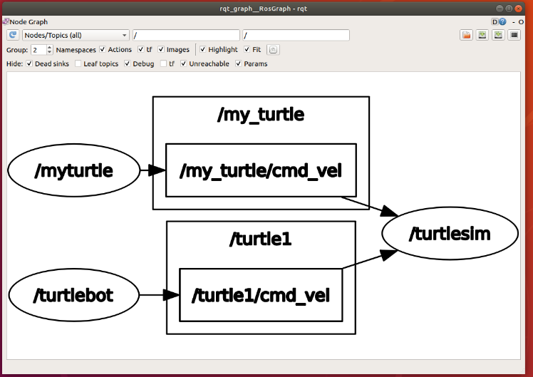

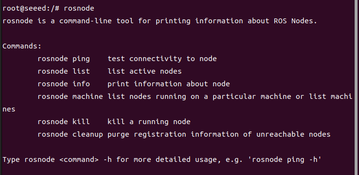

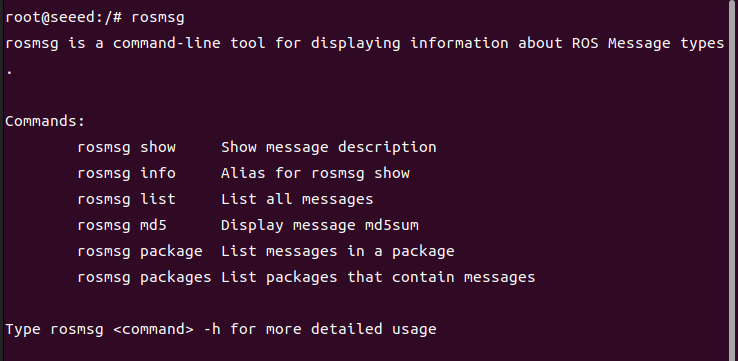

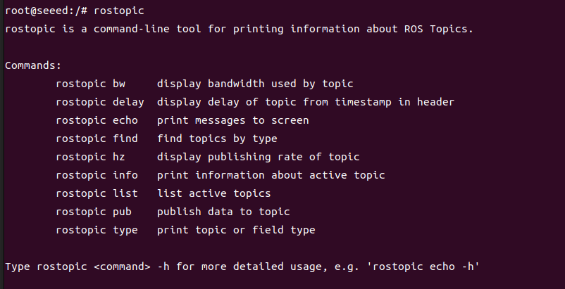

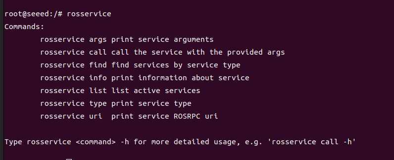

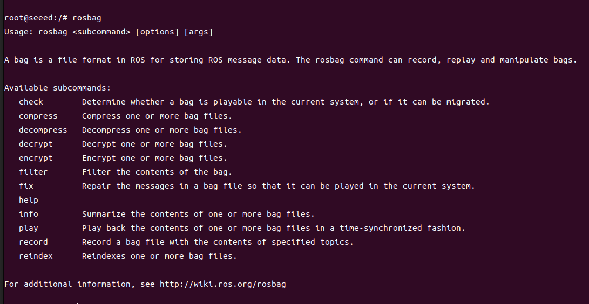

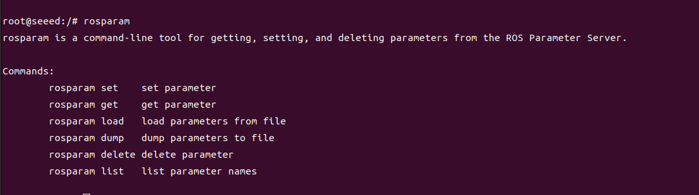

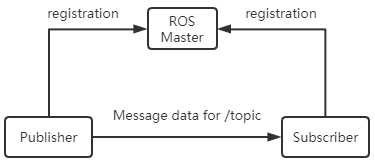

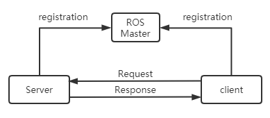

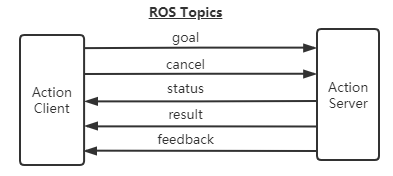

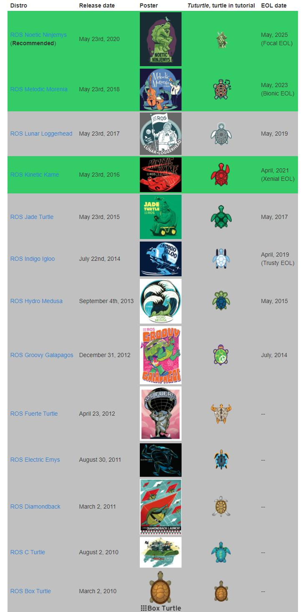


# 7.2.1.2 Preparing the Workspace

### Workspace directory

The document structure of ROS, not every folder, is mandatory and designed according to business needs.


### Concerning work space

The working space is the place where the ROS project documents are managed and organized. The visual description is a warehouse containing various project works for ROS, which facilitates the management of the system. is a folder in a visual graphical interface. Our own ROS codes are usually in the workspace. There are four main tier I directorys below:

src: source space; ROS Catkin package (source package)

bueld: Compiled space; Catkin (CMake) cache information and intermediate files

Development of space; Output of target files (including headers, dynamic links library, static links library, implementable documents, etc.), environment variables

install: installation space

The top-level workspace (which can be named at random) and src (must be src) folders need to be created by themselves;

bueld and devel folders are created automatically by the catkin make command;

Install folders are created automatically by a Catkin make install command, which is hardly used, and is not usually created.

Note: Workspace must be returned to the top floor before using catkin make. (a) The existence of packages under the same workspace is not permitted; The package of the same name is allowed in different workspaces.

```bash
mkdir -p ~/catkin_ws/src  # create
cd catkin_ws/             # enter the workspace
catkin_make               # build
source devel/setup.bash   # source the workspace environment
```


### Packages

Package is a specific file structure and folder combination. The program code that achieves the same function is usually placed in a package. Only CMakeLists.txt and package.xml are [required], and the rest of the path depends on whether the package is needed.

Create functionality package

```bash
cd ~/catkin_ws/src
catkin_create_pkg my_pkg rospy rosmsg roscpp
```

[Rospy], [rosmsg], [roscpp] is a relying library that can be added according to business needs, or add others, without reconfiguring when created, forgetting that additions need to be configured.


File Structure

```bash
|-- CMakeLists.txt  # (required) build rules for the current package.
|—— package.xml     # (required) package metadata and ROS dependencies.
|—— include directory    # stores C++ header files
|—— config directory     # stores parameter files
|—— launch directory     # stores launch files (.launch or .xml)
|—— meshes directory     # stores robot or simulation 3D models (.sda, .stl, .dae, etc.)
|—— urdf directory       # stores robot model descriptions (.urdf or .xacro)
|—— rviz directory       # rviz files
|—— src directory        # C++ source code
|—— scripts directory    # executable scripts, such as shell scripts (.sh) and Python scripts (.py)
|—— srv directory        # custom services
|—— msg directory        # custom topics
|—— action directory     # custom actions
```


### Introduction to CMakeLists.txt

### General

The CMakeLists.txt was originally a rule-based document for the CMake Build System, while Catkin Builds largely followed the CMake style of Builds, but added some macro definitions to the ROS project. So in writing, Catkin's CMakeLists.txt is basically the same as CMake.

This document directly defines the process by which the package depends, which goals it compiles, how it compiles, etc. So CMakeLists.txt is very important because it specifies the rules from the source code to the target file, and the catkin builds first find the CMakeLists.txt under each package and then compile and build it according to the rules.

### Format

The basic syntax of CMakeLists.txt is the same as that of CMake, in which Catkin added a small number of macros, the overall structure being as follows:

A typical catkin `CMakeLists.txt` includes these parts:

```cmake
cmake_minimum_required(VERSION 3.0.2)
project(package_name)
find_package(catkin REQUIRED COMPONENTS roscpp rospy std_msgs)
catkin_package()
include_directories(${catkin_INCLUDE_DIRS})
add_executable(node_name src/node_name.cpp)
target_link_libraries(node_name ${catkin_LIBRARIES})
```

Packages that define custom messages, services, or actions also use `add_message_files()`, `add_service_files()`, `add_action_files()`, and `generate_messages()`.


### Boost enabled

If you use C ++ and Boost, you need to call Find package() on Boost and specify which aspects of Boost are used as components. For example, if you wanted to use the Boost thread, you would say:

Find package


### catkin package()

Catkin package() is a CMake macro provided by catkin. This is necessary to assign catkin specific information for the construction of the system, which is used to generate pkg-config and CMake files.

This function must be called before any object is declared using add library() or add executable(). This function has five optional parameters:

INCLUDE DIRS - Export Include Paths

LIBRARIES - Exported Library from Project

CATKIN DEPENDS - Other catkin projects on which the project is based

DEPENDS - Non-catkin CMake project on which the project relies. For better understanding, look at this explanation.

CFG EXTRAS - Other Configuration Options

The complete macro document can be found here.

For example:

```bash
catkin_package(
   INCLUDE_DIRS include
   LIBRARIES ${PROJECT_NAME}
   CATKIN_DEPENDS roscpp nodelet
   DEPENDS eigen opencv)
```

This indicates that the folder "include" in the package folder is the point where the header file is exported. The CMake Environment Variable $ {PROJECT NAME} assesses anything previously passed to the project() function, in which case it will be “robot brain”. "roscpp"+ "nodelet" is a software package that needs to exist to build/run this package, and "eigen"+ "opencv" is a system dependent entry that needs to exist to build/run this package.

### including pathways and libraries

Before specifying a target, you need to specify the location where resources can be found for the stated goal, in particular header files and library:

Includes path - where the head file (most commonly C / C ++) can be found

Library Path - Which libraries are located with the active target?

Include directors

link directors

Include directors()

The parameters for include directories should be the figure package call and any other directory that needs to be included. If you use catkin and Boost, your include directors() should be as follows:

Include directors

The first parameter "include " means include/directory in the package is also part of the path.

link directors()

Example:

link directors (~)

The CMake link directors() function can be used to add additional library paths, but this is not recommended. All catkin and CMake packages automatically add link information to the library in taget target_link_libraries() when you find packaged.

See the lineup at cmake for a detailed example of the use of target target_link_libraries() in Link directories().

### Executable objectives

To specify the executable that must be built, we must use the add executable()CMake function.

```bash
edd executeable
```

This will build a target executable called MyProgram, which is built from three source files: src /main.cpp, src / some file.cpp and src /other file.cpp.

### Library Targets

Use `add_library()` when the package needs to build a reusable library target. Many simple tutorial packages only need executables.

```cmake
add_library(${PROJECT_NAME} src/library_file.cpp)
```

### target_link_libraries

Use `target_link_libraries()` after `add_executable()` or `add_library()` to link the target against catkin and other required libraries.

```cmake
target_link_libraries(node_name ${catkin_LIBRARIES})
```

Example:

```bash
(foo src/foo.cpp)
Add library (moo src/moo.cpp)
This links fly against libmoo.so
```

Please note that in most cases the use of link directories() is not required, as information is automatically introduced through find package().

### Information, services and actions

Message (.msg), service (.srv) and action (.action) files require a special preprocessor builder before ROS packages are constructed and used. The key elements of these macros are the generation of programming language-specific documents, so that they can use information, services and actions in the programming language of their choice. The construction system will be bound using all available generators (e.g. gencpp, genpy, genlisp, etc.).

Three macros were provided to handle messages, services and actions separately:

`add_message_files()`

`add_service_files()`

`add_action_files()`

These macros must be followed by the resulting macro:

`generate_messages()`

Read CMake Practice: https://github.com/Akagi201/learning-cmake/blob/master/docs/cmake-practice.pdf if you have never had contact with the syntax of CMake. The mastery of the CMake is very helpful in understanding the ROS project.

### Package.xml Introduction

Overview

The package list is a root folder in an XML file named Package.xml that must include any compatibility package. Package.xml is also a required package for catkin's package, a description of the package, which in an earlier ROS version (Rosbuild build system) is called "manfect.xml" to describe basic information about pacakge. If you see some ROS projects on the Internet that contain the best.xml, it's probably before the hydro version. The pacakge.xml contains information on the name, version number, description of content, maintenance staff, software licences, compilation construction tools, build dependence, and operation dependence of the package.

Package.xml files must contain message generation, run depend must contain message runtime.

Format

A typical `package.xml` contains the package metadata and dependency declarations:

```xml
<package format="2">
  <name>package_name</name>
  <version>0.0.0</version>
  <description>Package description</description>
  <maintainer email="user@example.com">Maintainer Name</maintainer>
  <license>BSD</license>
  <buildtool_depend>catkin</buildtool_depend>
  <depend>roscpp</depend>
  <depend>rospy</depend>
  <depend>std_msgs</depend>
</package>
```


Dependency relationships

The list of packages with minimum labels does not specify any dependency on other packages. The package has six dependencies:

Builds a dependency <build depend> specifies the package that is needed to build this package. This is the case when any files in these packages are required for construction. This could include the front file at the time of compilation, a link to the library file of these packages or any other resources needed for construction (especially when the packages are found package() in CMake). In the cross-compilation scenario, a dependency relationship is structured towards the target system.

Builds a dependencies <build export depend> specifies the package that is needed to build the library on this package. This is the case when you include this header in the public header file in this package (especially when the catkin package in CMake is declared (CATKIN DEPENDS)).

Executing the dependency <exec depend> specifies the software package required to run the code in this package. This is the case when you rely on the shared library in this package (especially when Catkin package() is declared in CMake).

Test dependency <test depend> specifies only additional dependencies for unit testing. They should not duplicate any dependency already mentioned as building or running dependency.

The build tool dependencies <buildtool depend> specify that this package needs to build its own build system tool. Usually the only builder is catkin. In the cross-compilation scenario, construction tools rely on relationships to implement the compilation architecture.

The document tool depends on <doc depend> to specify the document tool for the package to generate the document.

Attach Tabs

<url> - URL for information about the package, usually the wiki page on ros.org.

- Author of the package

For example:

"Website"

Seed.


## Workspace to prepare official examples

> Note that ROS 1 operations need to be carried out in existing docker containers.

After entering the docker container, download the official ROS example (if available):

```bash
git clone https://github.com/ros/ros_tutorials.git -b noetic-devel
```


This is a case of ROS 1 based on C++:

```bash
cd ros_tutorials/
mkdir  src
cp roscpp_tutorials/ src/ -r
catkin_make # start building
```

The compilation was completed as follows:


Upon completion of the compilation, initialization is required before the workspace can be followed up:

```bash
source devel/setup.bash
```

## Figures

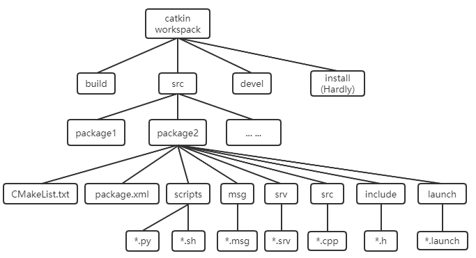

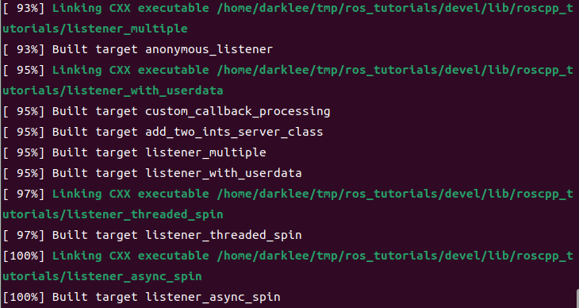


# 7.2.1.3 Common Commands and Tools

## Commencement node approach

### launch documents

There are at least two ways to start a lanch file with a roslanch command:

1) Start with ros package path

The format is as follows:

```bash
roslaunch package_name launch_file_name
roslaunch pkg_name launchfile_name.launch
```

2. Absolute path to the launch file

The format is as follows:

```bash
roslaunch path_to_launchfile
```

Either way you start the lanch file, you can add parameters to the back, which are more common.

--screen: make it easier to debug the information of rose Node (if any) to output on the screen instead of saving it in a log file

arg: =value: if the variable to be given in the lanch file is given, the value can be given in this way, e.g.:

```bash
roslaunch pkg_name launchfile_name model:=urdf/myfile.urdf # the launch file has a `model` argument that must be set
```

or

```bash
roslaunch pkg_name launchfile_name model:='$(find urdf_pkg)/urdf/myfile.urdf' # use `find` to provide the path
```

The roslaunch command is run to first detect whether the rosmaster of the system is running or, if started, to use the existing rosmaster; If you don't start, you can start the rosemaster first, then you can run the settings in the launch file, and you can start multiple nodes at our pre-configuration.

It should be noted that the launch file does not need to be compiled and can be run directly as described above.

### roserun

The node manager (master) must be activated, and master is used for many processes in the management system, and every node starts by registering and managing communication between node and node. After the master starts, he goes through the master to register every node node. Enter command in Ubuntu terminal:

```bash
roscore
```

Node start, roserun+packname+ nodename; The rosrun method only runs one node at a time.

```bash
rosrun [--prefix cmd] [--debug] pkg_name node_name [ARGS]
```

Rosrun will look for an executable program called Package, which will bring in optional ArGS.

### Python

If Python is the code, you can start directly under the directory where the py file is located, paying attention to the difference between Python2 and python3.

### Start a little turtle

```bash
roscore    # start roscore in the first terminal
rosrun turtlesim turtlesim_node     # start the turtlesim node in the second terminal
rosrun turtlesim turtle_teleop_key  # start keyboard teleoperation in the third terminal
```

After the startup is complete, you can manipulate the movement of small turtles through keyboard input, and the cursor must control the movement of small turtles by clicking on the keyboard [top], [down], [left], [right] under the command of [rosrun turtlesim turtle teleop key].


And the rosrun turtlesim turtlesim node terminal will print some little turtle logs.

```bash
[ INFO] [1607648666.226328691]: Starting turtlesim with node name /turtlesim
[ INFO] [1607648666.229275030]: Spawning turtle [turtle1] at x=[5.544445], y=[5.544445], theta=[0.000000]
```

### Launch of the second turtle

In the first terminal, start node through the launch file:

```bash
roslaunch turtle_tf turtle_tf_demo.launch
```

Keep previous keyboard control node as active


At this point, press the keyboard [up], [down], [left], [right] drive the little turtle movement; A small turtle can be observed following another movement.

### launch documents

### General

A node program in the ROS usually performs only a single function, but a full ROS robot typically operates simultaneously with many node programs and collaborates with each other to perform complex tasks, and this requires a lot of node programs to be initiated when a robot is activated, which is more troublesome if a node a node starts. The launch file and the roslaunch command enable multiple nodes to be activated once, facilitate " one-key " and set rich parameters.

### Format of documentation

The launch file is essentially an xml file, which can be highlighted in some editors, readable, added to the head or not added

What? "0"? >

Similar to other files in xml format, launch files are written by tags (tag), the main tags are as follows:

Code file: [7-2-1-3-common-commands-and-tools-example-01.xml](./code/7-2-1-3-common-commands-and-tools-example-01.xml)
```xml
<launch>                <!-- root tag -->
<node>                  <!-- node and parameters to start -->
<include>               <!-- include another launch file -->
<machine>               <!-- target machine -->
<env-loader>            <!-- set environment variables -->
<param>                 <!-- define a parameter on the parameter server -->
<rosparam>              <!-- load YAML parameters into the parameter server -->
<arg>                   <!-- define an argument -->
<remap>                 <!-- set topic remapping -->
<group>                 <!-- set a group -->
</launch>               <!-- root tag -->
```


1. Label [node]

The tag [node] is the core part of the launch file.

Code file: [7-2-1-3-common-commands-and-tools-example-02.xml](./code/7-2-1-3-common-commands-and-tools-example-02.xml)
```xml
<launch>
    <node pkg="package_name" type="executable_file" name="node_name"/>
    <node pkg="another_package" type="another_executable" name="another_node"></node>...
</launch>
```

of which

pkg is the package name of the node

type is the actionable document in the package, which, if prepared by Python, may be.py or, if prepared by C++, the name of the enforceable document after the source file has been compiled.

The name is the name after the node starts, and each node has its own unique name.

Note: roslaunch cannot guarantee the start order of the node, so all node in the launch file should be as good as the start order.

More parameters can be set, as follows:

Code file: [7-2-1-3-common-commands-and-tools-example-03.xml](./code/7-2-1-3-common-commands-and-tools-example-03.xml)
```xml
<launch>
    <node
        pkg=""
        type=""
        name=""
        respawn="true"
        required="true"
        launch-prefix="xterm -e"
        output="screen"
        ns="namespace"
    />
</launch>
```

In the above order,

respawn: If this node is closed, is it automatically restarted?

required: if this node is closed, whether all other nodes are closed

launch-prefix: Whether to open a new window for execution. For example, a new window should be opened for the control of node when robotic movement controls are required through windows; Or when node has some information output that doesn't want to mix with other node information.

output: by default, launch starts node information in the following log file, which can be displayed on screen by setting parameters here

ns: Integrate node into a different namespace, i. e. add an ns prefix before node name. To achieve this type of operation, node name and topic name are defined in the node source file using relative name, i. e. without symbol/.

The name of the calculation source is divided into:

1) Base name, e.g. topic

2) Global name, e.g.: /A/topic

3) relative name, e.g. A/topic

4) Private names, e.g. ~topic

There's this line of code at the time of publication or booking.

```bash
 ros::init(argc, argv, "publish_node");
 ros::NodeHandle nh;
 ros::Publisher pub = nh.advertise<std_msgs::string>("topic",1000);
```

2. Label [remap]

Often appears as a sub-label for a node label to modify topic. In many rosnode files, the receiving or sending topic may not have been specified, but only replaced by input topic and output topic, so that abstract topic names are used instead of topic names in specific scenes.

In short, the function of remap is to facilitate the application of the same node file to a different environment, using remap topic from the outside without changing the source file.

Common usage formats for remap are as follows:

Code file: [7-2-1-3-common-commands-and-tools-example-04.xml](./code/7-2-1-3-common-commands-and-tools-example-04.xml)
```xml
<node pkg="some" type="some" name="some">
    <remap from="origin" to="new" />
</node>
```

3. Include

This label is used to add another launch file to this launch file, similar to the launch file nest. Basic format:

"Path-to-launch-file"

The top file path can be given to a specific path, but generally for program portability, it is best to give the file path with a find command:

<include file=$(find package-name)"/>

For the above command, the value of $ (find package-name) is equal to the path of the corresponding package in this machine. This allows the corresponding path to be found even if the other master is replaced by the same package.

Sometimes, another nonde introduced by launch may need a uniform name or a node name with similar characteristics, such as /my/gps, /my/lidar, /my/imu, or node has a uniform prefix that is easy to search for. This can be achieved by setting the ns (namespace) properties, with the following commands:

<include file=$(find package-name) "ns= "my"/>

4. Label

Repetition of parameters by [arg] is possible and can be easily modified in multiple places. Three common methods:

<arg name= "foo": a statement [arg] but not a value. At a later stage, you can assign value by command line or by [include] label.

<arg name= "foo" default= "1": default value.: A fixed value.

Grant value by command line

Roslaunch pack name file name.launch arg1:=value1 arg2:=value2

5. Replacement of variables

There are two variant replacements commonly used in launch files

`$(find pkg)`: for example, `$(find rospy)/manifest.xml`. Package-based paths are strongly recommended when possible.

`$(arg arg_name)： set a default value; use it when no override is provided`

For example:

Code file: [7-2-1-3-common-commands-and-tools-manifest.xml](./code/7-2-1-3-common-commands-and-tools-manifest.xml)
```xml
<arg name="gui" default="true" />
<!-- set a default value; use it when no override is provided -->
<param name="use_gui" value="$(arg gui)"/>
```

Another example:

```cpp
<node pkg="package_name" type="executable_file" name="node_name" args="$(arg a) $(arg b)" />
```

After setting this value can be given to args parameters when the roslaunch is started

```bash
roslaunch package_name file_name.launch a:=1 b:=5
```

6. Label

Unlike [arg], [param] is shared, and its value is not limited to value, it can be a file, even a line of command.

Format

Code file: [7-2-1-3-common-commands-and-tools-example-06.xml](./code/7-2-1-3-common-commands-and-tools-example-06.xml)
```bash
<param name="param_name" type="type1" value="val"/>                         # type can be omitted; ROS infers it
<param name="param_name" textfile="$(find pkg)/path/file"/>                 # read file content as a string
<param name="param_name" command="$(find pkg)/exe '$(find pkg)/arg.txt'"/>
Example:
<param name="param" type="yaml" command="cat '$(find pkg)/*.yaml'"/>        # store command output in the parameter
```

[Param] can be in the global context, its name is the original name, or in a smaller range, like Node, and its overall name is node/param.

For example, in the global context, define as follows:

```bash
<param name="publish_frequency" type="double" value="10.0" />
```

Define the following in the node range

Code file: [7-2-1-3-common-commands-and-tools-example-07.xml](./code/7-2-1-3-common-commands-and-tools-example-07.xml)
```xml
 <node name="node1" pkg="pkg1" type="exe1">
    <param name="param1" value="False"/>
 </node>
```

If list [param] of servicers with rosepam list, yes

```bash
/publish_frequency
/node1/param1   # namespace prefix is added automatically
```

Note: Although the namespace was added to the name [param], it is still global.

[Rosparam]

[Param] can only operate on a single [Param] and only in three forms: value, textfile, common, returns individual [Param] content. [Rosparam] allows batch operations and includes commands for parameter setting, e. g. dump, delete, etc.

load: Load a batch of params from the YamL file in the following format:

```bash
<rosparam command="load" file="$(find rosparam)/example.yaml" />
```

Delete: Delete some param

```bash
<rosparam command="delete" param="my_param" />
```

[param]-like grant operation

```bash
<rosparam param="my_param">[1,2,3,4]</rosparam>
```

Or...

Code file: [7-2-1-3-common-commands-and-tools-example-08.xml](./code/7-2-1-3-common-commands-and-tools-example-08.xml)
```bash
<rosparam>
a: 1
b: 2
</rosparam>
```

[Rosparam] can also be placed in [node], at which point node namespace.

8. Group

If you want the same setup for multiple nodes, for example, in the same namespace, remap the same topic, you can use [group]. All common labels can be used in [group], for example

Code file: [7-2-1-3-common-commands-and-tools-example-09.xml](./code/7-2-1-3-common-commands-and-tools-example-09.xml)
```xml
<group ns="rosbot">
    <remap from="chatter" to="talker"/>       # applies to following nodes in this group
    <node... />
    <node... >
        <remap from="chatter" to="talker1"/>  # each node can override the remap
    </node>
</group>
```

### TF coordinates conversion

tf is a package that allows users to track multiple coordinates at any time. tf maintains the relationship between the coordinates in the structure of a real-time buffer and allows users to convert points, vectors, etc. at any point of time between any two frames.

The Tf package is the one that converts the coordinates of one point in one coordinate system to the coordinates of another. The sensor can see a coordinate system, the machine can see a coordinate system and the barrier can see a point.

Following the activation of two small turtles, perform the following operations.

### tf common tools

1. View frames tool

It is capable of listening to all the tf coordinates broadcast through ROS at the current time and drawing tree maps to indicate the connection between the coordinates, generating a file called frame.pdf and saving it to its current local position.

```bash
rosrun tf view_frames
```

2.rqt tf tree tool

Although the view frames can save the current coordinate relationship in an offline file, it cannot reflect the coordinate relationship in real time, so it is possible to update the coordinate relationship in real time with rqt tf tree

```bash
rosrun rqt_tf_tree rqt_tf_tree
```

3.tf echo tool

Using the tf echo tool, you can see the relationship between the two radio reference systems.

```bash
rosrun tf tf_echo <source_frame> <target_frame>
```

Prints the rotational transformation from source frame to target frame; For example:

```bash
rosrun tf tf_echo turtle1 turtle2
```


4. Static transform publisher

Releases static coordinates between the two coordinates, which do not change relative positions. Command format:

```bash
static_transform_publisher x y z yaw pitch roll frame_id child_frame_id period_in_ms
static_transform_publisher x y z qx qy qz qw frame_id child_frame_id period_in_ms
```

Use in launch:

Code file: [7-2-1-3-common-commands-and-tools-example-10.xml](./code/7-2-1-3-common-commands-and-tools-example-10.xml)
```xml
<launch>
<node pkg="tf" type="static_transform_publisher" name="link1_broadcaster" args="1 0 0 0 0 0 1 link1_parent link1 100" />
</launch>
```


5. Roswtf plugin

A plugin to analyze your current tf configuration and try to identify common problems.

```bash
roswtf
```

### Common system of coordinates

The usual coordinates are the frame id, with map, odom, base link, base footprint, base laser, etc.


World Coordinate (map)

The Map coordinates are a fixed-coordinate system of the world with an Z axis pointing above. The posture of the mobile platform vis-à-vis the Map system should not move significantly over time. Map coordinates are not continuous, which means that the attitude of the moving platform in the Map system can be separated at any time. Typical settings, positioning modules are based on sensor monitoring, constantly recalculating the position of robots in world coordinates, thus eliminating deviations, but may jump when new sensor information arrives. Map coordinates are useful as a long-term global reference, but jumps make them a bad reference for local sensors and sensors.

odom

Odom is a global coordinate system that records the robot ' s current motion posture through a mileage meter. The position of the moving platform in the odom coordinates is free to move without any boundaries, which prevents the odom coordinates from serving as a long-term global reference. This is to distinguish between the concepts of coordinates and mileage calculated on the basis of encoder (or visual etc.). But there's also a relationship, and the odom topic transformation matrix is the tf relationship of odom->base link. The odom and map coordinates coincide at the beginning of the robotic movement. However, over time, there is no overlap, and the deviation is the cumulative error of the mileage meter. A position estimate (localization) is given in some co-correction packages such as amcl, which can be obtained by the tf of Map->base link, so the difference between the position and the mileage position is the difference between the coordinates of the odom and the Map. If your odom calculation is not wrong, the map-odom tf is zero. The odom coordinate system is useful as a short-term local reference, but the deviation prevents it from being a long-term reference.

Base coordinates (base link)

The robotic home system (matrix) coordinates overlap with the robotic centre, which is typically the centre of robotic rotation.

Base footprint: Origin is the projection of base link origin on the ground, with some difference (z values).

Relationship between coordinates

In robotic systems, we use a tree to connect all the coordinates, so each has a patrilineal and random sub-coordinate, as follows: Map-> odom-> base link-world-coordinate is the father of the odom-coordinate and odom-coordinate is the father of base link. Although, intuitively, Map and odom should be connected to base link, this is not permitted, as only one parent can be found in each system.

Coordinate System Permissions

The conversion from odom to base link is calculated and published by the mileage meter source. However, the locator module does not publish the transfer (transform) of the Map to base link. Instead, the locator module receives odom to base link's transform, and uses this information to publish map to odom's transform.

### rqt (QT tool)

Opens the command line window and enters a rosrun rqt and double-clicks the Tab key to view what is contained in the QT tool in ROS, as shown in the figure below:


So let's take the example of little turtles and give a brief introduction to some of the QT tools used:

1.rqt graph calculator visualization

Opens the command line window and enters the following command and pops up a dialogue window.

Rosrun rqt gram rqt gram


It is clear from the images that the /teleop_turtle node is transmitted via the /turtle1/cmd_vel topic to the /turtlesim node.

/teleop_turtle is the node with Publisher function.

/turtlesim is the node with subscriber function.

This post is part of our special coverage Zambia.

2.rqt topic View Topics


rosrun rqt topic rqt topic


Through this tool, we can clearly see some real-time information about changes in small turtles.

3.rqt publisher

rqt publisher provided a GUI plugin to publish any message with fixed or calculated field values. Opens the command line window and enters the following command and pops up a dialogue window.

```bash
rosrun rqt_publisher rqt_publisher
```

Click on the selection box to the right of Topic to find the /turtle1/cmd_vel topic we need and click on the right to add the number as follows:


4.rqt plot data mapping

The reference instructions are as follows:

```bash
rosrun rqt_plot rqt_plot
```


6.rqt console log output

The RS Log (log) system functions to generate log messages that are displayed on screen, sent to specific topic or stored in a specific log file to facilitate debugging, recording, alarming, etc.

The log message in ROS can be divided into 5 levels according to severity: DEBUG, INFO, WARD, ERRO, FATL. As long as the program can run, no attention needs to be paid, but the presence of ERRO and FATAL indicates that there are serious problems with the program which make it impossible to run.

```bash
rosrun rqt_console rqt_console
```


The log output tool is part of the ROS Loging frame, which shows output information for nodes, and we can see it on the map that the turtle has hit the wall.

Commonly API

7. rqt reconfigure dynamic parameter configuration

The reference instructions are as follows:

```bash
rosrun rqt_reconfigure rqt_reconfigure
```

Image source ROS wiki:


### Rviz

rviz is a graphical tool that can easily graphically perform the ros program. It is also simpler to use.


[Set initial poste], [Set target poste]

The rviz interface consists mainly of:

1:3D view area for visual display data, which is currently not available and therefore black.

2: Toolbar, which provides tools such as perspective control, target setting, distribution location, etc.

3: Shows a list of items to display the currently selected display plugin, which can configure the properties of each plugin.

4: Perspective setting, with multiple observations available.

5: Time display area showing current system time and ROS time.

Add Display


Step 1: Click on [Add] button. A box will pop up.

Step 2: Add by display type [By display type], although the coordinates can be shown only if they modify the corresponding topic; You can also add directly by selecting the topic [by topic] so you can display it properly.

Step 3: Click on [OK].

### Common ROS commands

## Figures

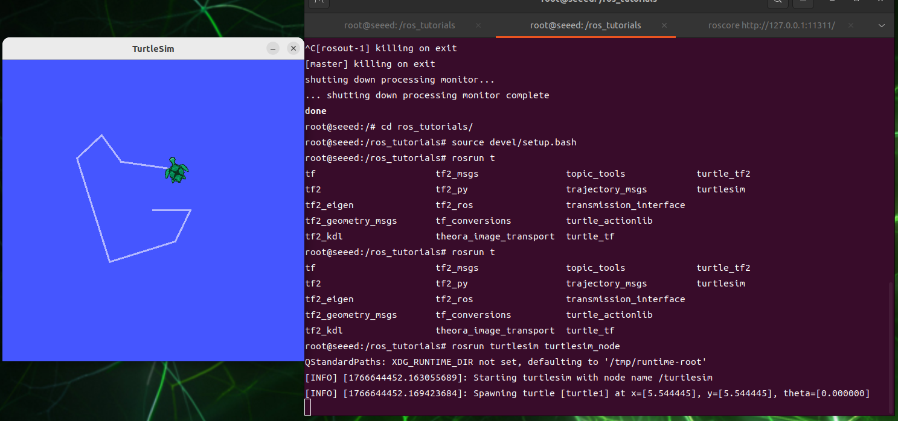

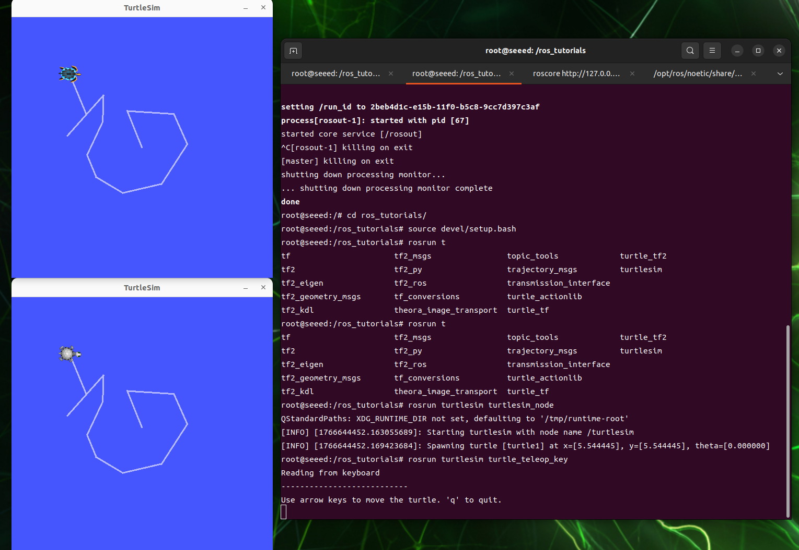

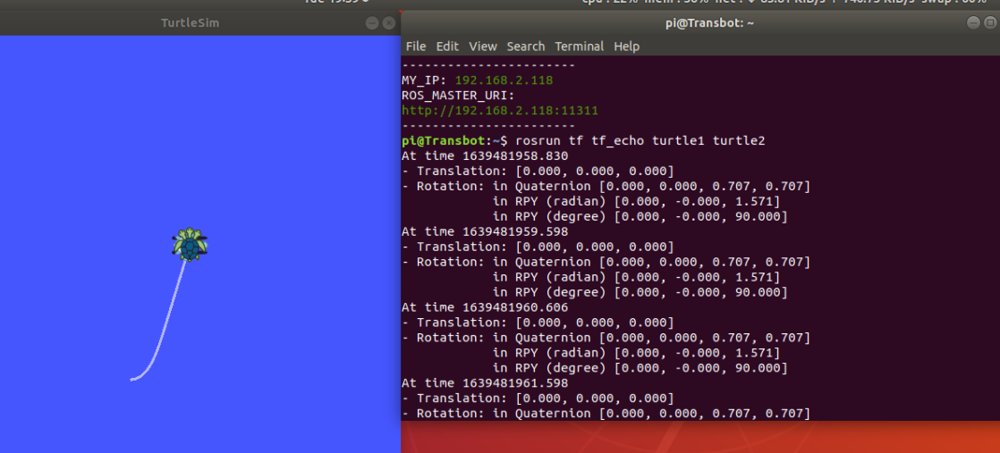

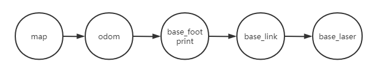

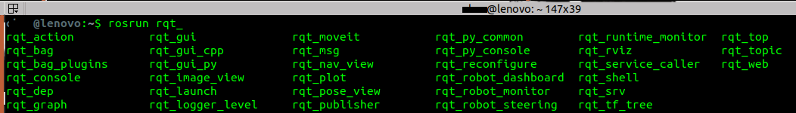

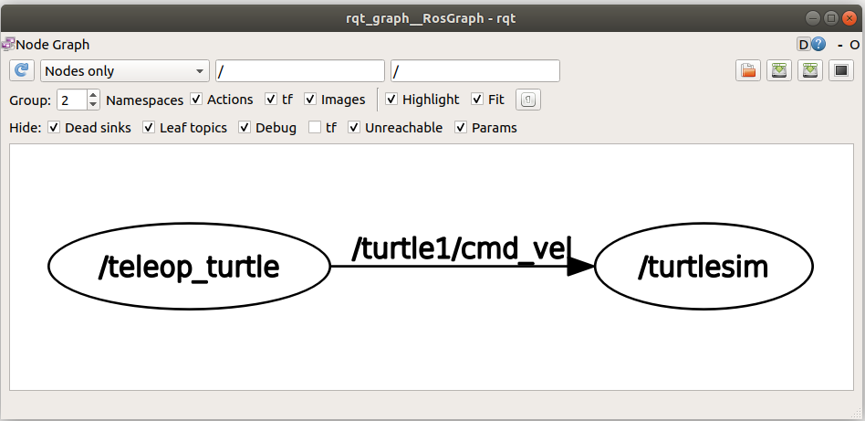

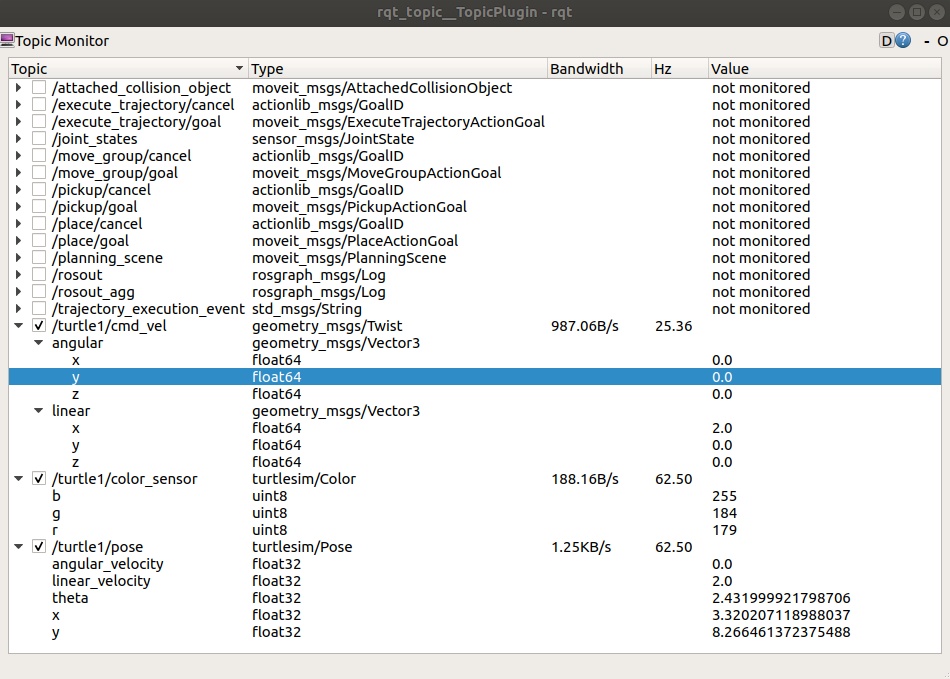

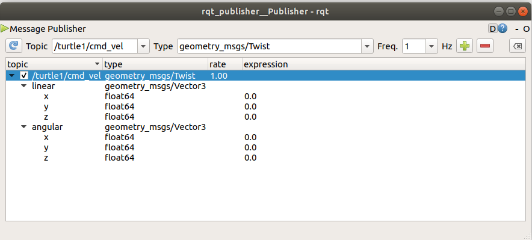

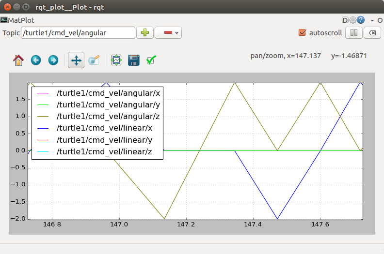

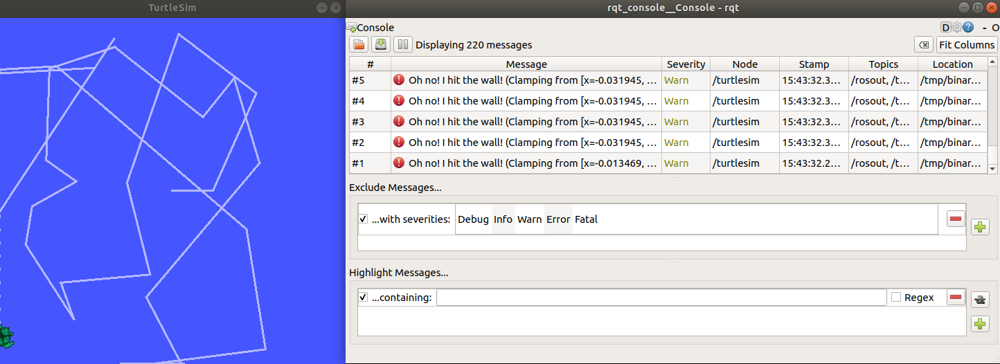

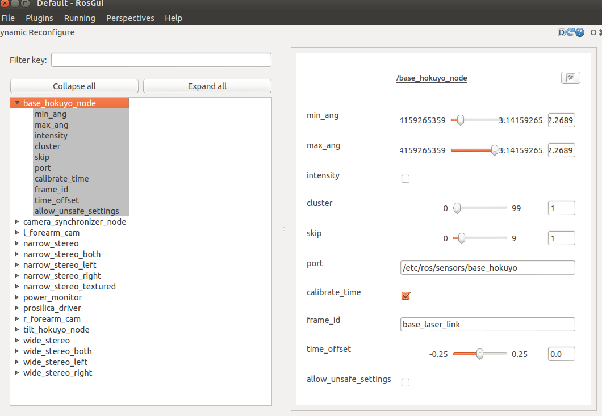

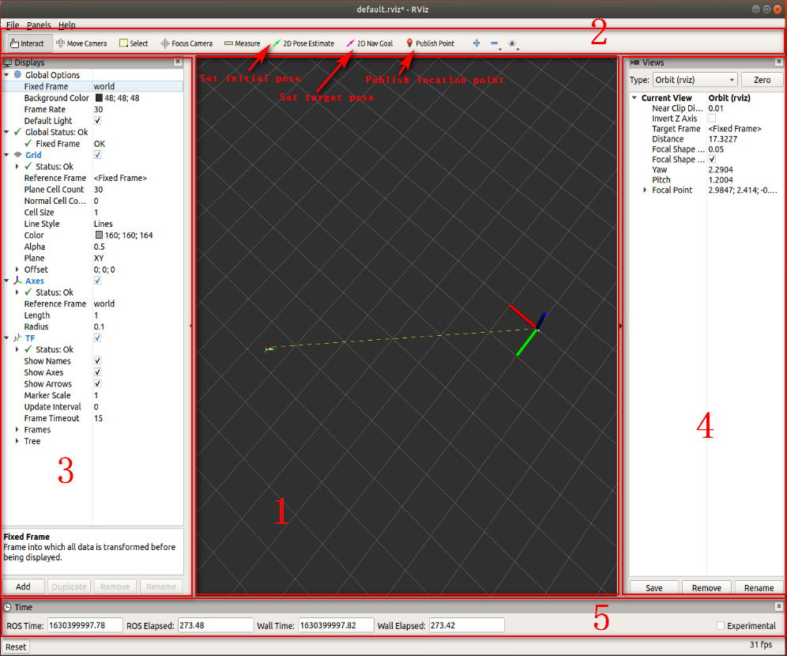

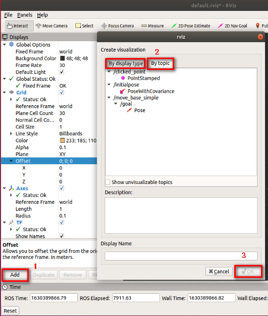


# 7.2.1.4 Publisher

### Publisher

The publisher, by definition, acts as a publisher. This message, which could be sent by the lower machine to the sensor information on the machine, was then packaged and sent to the subscriber of the topic; It may also be possible to calculate the data on the aircraft and to package them and send them to the subscriber who subscribes to the topic.


### Creation of workspace and topic kit

### Creation of workspaces

```bash
mkdir -p ~/catkin_ws/src
cd ~/catkin_ws/src
catkin_init_workspace
```


### Compilation workspace

```bash
cd ~/catkin_ws/
catkin_make
```


### Update environmental variables

```bash
source devel/setup.bash
```


### Examination of environmental variables

```bash
echo $ROS_PACKAGE_PATH
```


### Create packages

```bash
cd ~/catkin_ws/src
catkin_create_pkg learning_topic std_msgs rospy roscpp geometry_msgs turtlesim
```


Explanatory note: learning topic is the name of the functional kit

### Build packages

```bash
cd ~/catkin_ws
catkin_make
source ~/catkin_ws/devel/setup.bash
```


### Create a publisher

### Creation steps

Initialization of ROS nodes

2. Create handles

3) registration node information to ROS Master, including the name and type of information published and the length of the queue

4. Create and initialize message data

Five, recycle the message at a certain frequency

### C++ implementation

1) Create a C++ file (file suffixed.cpp) in the src folder of the package named turtle development publisher.cpp
(vim base use recalls: 14 with Vim editor)

```bash
touch turtle_velocity_publisher.cpp # create the file
vim turtle_velocity_publisher.cpp # edit the file
```


2) Copy the program code below to the turtle development publisher.cpp file

Code file: [7-2-1-4-publisher-turtle_velocity_publisher.cpp](./code/7-2-1-4-publisher-turtle_velocity_publisher.cpp)
```cpp
/*Create a turtlesim velocity publisher.*/
#include <ros/ros.h>
#include <geometry_msgs/Twist.h>
int main(int argc, char **argv){

    ros::init(argc, argv, "turtle_velocity_publisher");//Initialize the ROS node.

    ros::NodeHandle n;//Create a node handle.

    //Create a publisher for /turtle1/cmd_vel with geometry_msgs::Twist messages and queue size 10.
    ros::Publisher turtle_vel_pub = n.advertise<geometry_msgs::Twist>("/turtle1/cmd_vel", 10);

    ros::Rate loop_rate(10);//Set the loop rate.

    while (ros::ok()){
            //Initialize a message with the same type as the publisher.
        geometry_msgs::Twist turtle_vel_msg;
        turtle_vel_msg.linear.x = 0.8;
        turtle_vel_msg.angular.z = 0.6;

        turtle_vel_pub.publish(turtle_vel_msg);// Publish the velocity message.

        //Print the published velocity.
        ROS_INFO("Publsh turtle velocity command[%0.2f m/s, %0.2f rad/s]", turtle_vel_msg.linear.x, turtle_vel_msg.angular.z);

        loop_rate.sleep();//Sleep according to the loop rate.
    }
    return 0;
}
```

The edited project directory is structured as follows:

```bash
catkin_ws/
├── CMakeLists.txt
└── src/
    ├── CMakeLists.txt
    └── learning_topic/
        ├── CMakeLists.txt
        ├── package.xml
        └── src/
            └── turtle_velocity_publisher.cpp
```


3) Flowchart of the program, which corresponds to 1.3.1 content


4) In catkin ws/src/learning_topic/CMakeLists.txt, under the built area, add the following:

(vim base use recalls: 14 with Vim editor)

Code file: [7-2-1-4-publisher-example-02.cmake](./code/7-2-1-4-publisher-example-02.cmake)
```cmake
add_executable(turtle_velocity_publisher src/turtle_velocity_publisher.cpp)
target_link_libraries(turtle_velocity_publisher ${catkin_LIBRARIES})
```


Note to change the CMakeLists.txt at the right path


5. Recompilation of codes under workspace directory

```bash
cd ~/catkin_ws
catkin_make
source devel/setup.bash     # source the workspace so ROS can find the program
```


Operational procedures

Open first terminal running roscore:

```bash
roscore
```


Run Little Turtle Node

```bash
rosrun turtlesim turtlesim_node
```

Run the launcher, keep sending speed to the turtle.

```bash
rosrun learning_topic turtle_velocity_publisher
```

7. Expected result


8. Description of the operation of the procedure

When you enter the list of topics at the terminal, you will find the topic of /turtle1/cmd_vel.

We'll find out with Rostopicinfo /turtle1/cmd_vel


This means that the turtle is a subscriber to the speed topic of /turtle1/cmd_vel, so the publisher keeps sending speed data and when the turtles are received, they start moving at speed.

### Python implementation

1) Under the package directory, create a new folder scripts, and then a new Python file (file suffix.py) under the scripts folder named turtle development publisher.py

2) Copy the next program code to the turtle development publisher.py file

Code file: [7-2-1-4-publisher-suffix.py](./code/7-2-1-4-publisher-suffix.py)
```python
#!/usr/bin/env python3

import rospy
from geometry_msgs.msg import Twist

def turtle_velocity_publisher():

    rospy.init_node('turtle_velocity_publisher', anonymous=True) # Initialize the ROS node.

    # Create a turtlesim velocity publisher on /turtle1/cmd_vel. The message type is geometry_msgs/Twist and the queue size is 8.
    turtle_vel_pub = rospy.Publisher('/turtle1/cmd_vel', Twist, queue_size=8)


    rate = rospy.Rate(10) # Set the loop rate.

    while not rospy.is_shutdown():
        # Initialize a geometry_msgs::Twist message.
        turtle_vel_msg = Twist()
        turtle_vel_msg.linear.x = 0.8
        turtle_vel_msg.angular.z = 0.6

        # Publish the message.
        turtle_vel_pub.publish(turtle_vel_msg)
        rospy.loginfo("linear is:%0.2f m/s, angular is:%0.2f rad/s",
                turtle_vel_msg.linear.x, turtle_vel_msg.angular.z)


        rate.sleep()# Sleep according to the loop rate.

if __name__ == '__main__':
    try:
        turtle_velocity_publisher()
    except rospy.ROSInterruptException:
        pass
```


3. PROJECT Flowchart


4. Operational procedures

Open first terminal running roscore

```bash
roscore
```

Run Little Turtle Node

```bash
rosrun turtlesim turtlesim_node
```

Run the launcher, keep sending speed to the turtle.

```bash
rosrun learning_topic turtle_velocity_publisher.py
```

Note: Before running, an enforceable permission needs to be added to the turtle development publisher.py to open the terminal in the turtle development publisher.py folder.

```bash
sudo chmod a+x turtle_velocity_publisher.py
```


> All Pythons need to add execution permissions, otherwise they'll be wrong!

## Figures

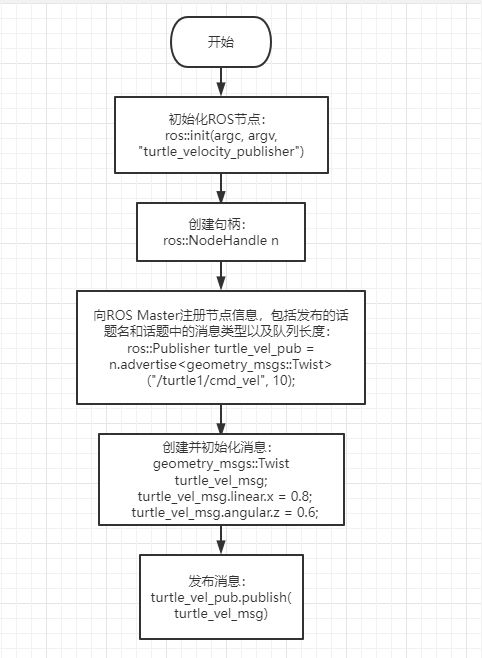

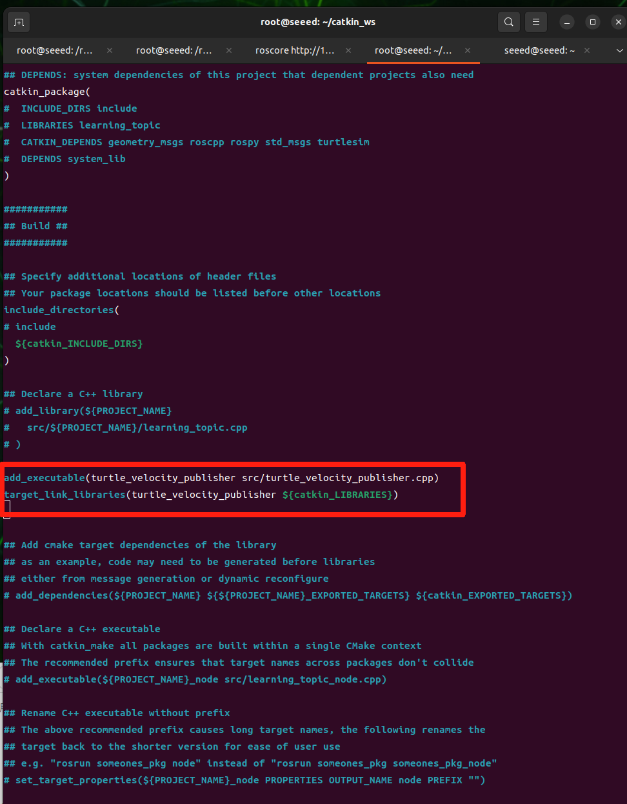

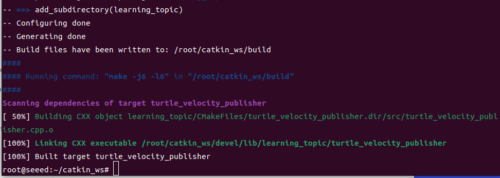

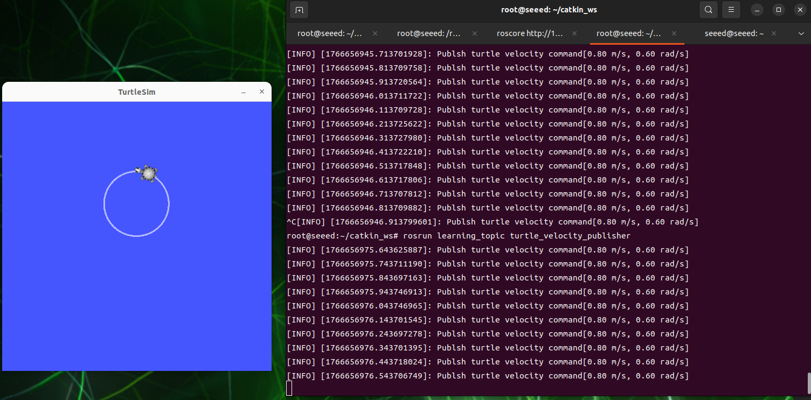

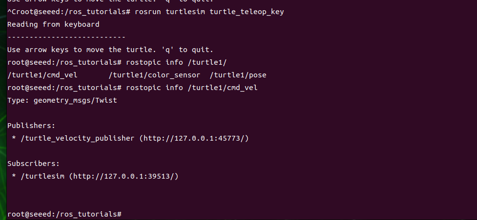

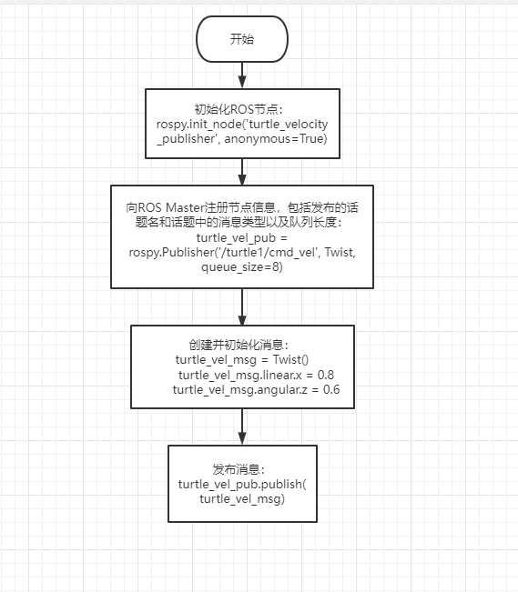


# 7.2.1.5 Subscriber

### Subscribers

subscribes, receive the data published by the publisher, and then enters its callback function, where the received data is processed. The core content is a callback function, and each subscriber subscribes to the topic.

### Create a subscriber

### Creation steps

Initialization of ROS nodes

2. Create handles

3. Topics for subscription

4. Loop the topic message and get it back to the callback function

5 ), finish message processing in a callback function.

> This chapter ' s workspace follows the created workspace in section IV.


### C++ implementation

1) Create a new C++ file in the `publishing' tutorial directory under the src folder of the created package named turtle pose subscriber.cpp

2) Copy the lower program code to the turtle pose subscriber.cpp file

Code file: [7-2-1-5-subscriber-subscriber.cpp](./code/7-2-1-5-subscriber-subscriber.cpp)
```cpp
/*Create a subscriber for the current turtlesim pose.*/
#include <ros/ros.h>
#include "turtlesim/Pose.h"
// The callback runs when a subscribed message is received.
void turtle_poseCallback(const turtlesim::Pose::ConstPtr& msg){
    // Print the received message.
    ROS_INFO("Turtle pose: x:%0.3f, y:%0.3f", msg->x, msg->y);
}

int main(int argc, char **argv){

    ros::init(argc, argv, "turtle_pose_subscriber");// Initialize the ROS node.

    ros::NodeHandle n;//Create a node handle.

    // Create a subscriber for /turtle1/pose and register poseCallback.
    ros::Subscriber pose_sub = n.subscribe("/turtle1/pose", 10, turtle_poseCallback);

    ros::spin(); // Wait for callbacks.

    return 0;
}
```


```bash
catkin_ws/
├── CMakeLists.txt
└── src/
    ├── CMakeLists.txt
    └── learning_topic/
        ├── CMakeLists.txt
        ├── package.xml
        └── src/
            └── turtle_velocity_publisher.cpp
            └── turtle_pose_subscriber.cpp
```


3) Flowchart of the program, corresponding to 5.2.1 content


4) In catkin ws/src/learning_topic/CMakeLists.txt, under the built area, add the following:

(vim base use recalls: 14 with Vim editor)

```bash
Add executeable (turtle pose subscriber src/turtle_pose_subscriber.cpp)
{\cHFFFFFF}{\cH00FFFF}
```


5. Codes compiled under the workspace directory

```bash
cd ~/catkin_ws
catkin_make
source devel/setup.bash     # source the workspace so ROS can find the program
```


Operational procedures

Open first terminal running roscore

```bash
roscore
```

Second terminal runs the turtle node.

```bash
rosrun turtlesim turtlesim_node
```

The third terminal runs subscription node and continues to receive data on the delivery position of turtles

```bash
rosrun learning_topic turtle_pose_subscriber
```

7)


8. Description of the operation of the procedure

After running the little turtle's node, the turtles keep sending their position messages, and the topic is,

/turtle1/pose

And when it runs, it receives data messages sent by turtles, and then prints them in the echo function.

### Python implementation

1) Under the package directory, create a new folder scripts and then a new Python file (file suffix.py) in the scripts folder, named turtle pose subscriber.py

2) Copy the next program code to the turtle pose subscriber.py

Code file: [7-2-1-5-subscriber-suffix.py](./code/7-2-1-5-subscriber-suffix.py)
```python
#!/usr/bin/env python3

import rospy
from turtlesim.msg import Pose

def poseCallback(msg):
    rospy.loginfo("Turtle pose: x:%0.3f, y:%0.3f", msg.x, msg.y)

def turtle_pose_subscriber():

    rospy.init_node('turtle_pose_subscriber', anonymous=True)# Initialize the ROS node.

    # Create a subscriber for /turtle1/pose and register poseCallback.
    rospy.Subscriber("/turtle1/pose", Pose, poseCallback)


    rospy.spin()# Wait for callbacks.

if __name__ == '__main__':
    turtle_pose_subscriber()
```


3. PROJECT Flowchart


4. Operational procedures

Run roscore

```bash
roscore
```

Run Little Turtle Node

```bash
rosrun turtlesim turtlesim_node
```

Run the subscriber and continue receiving data on the delivery position of the turtle

```bash
rosrun learning_topic turtle_pose_subscriber.py
```

## Figures

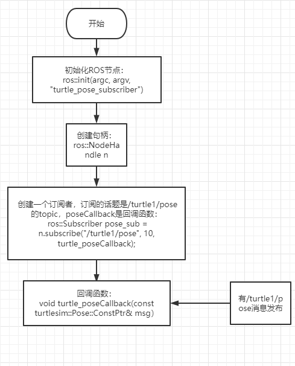

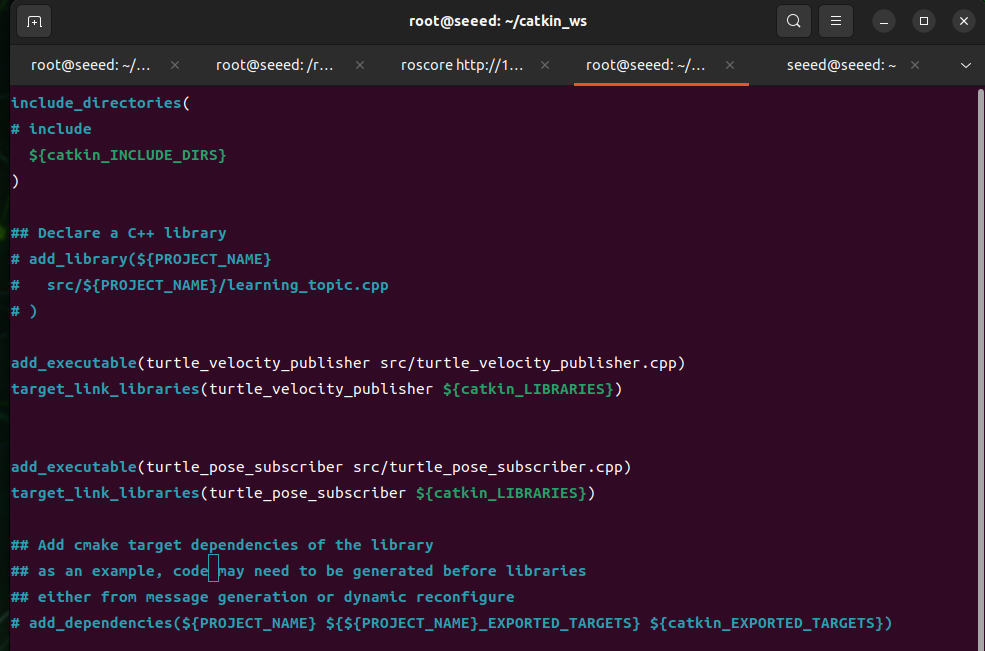

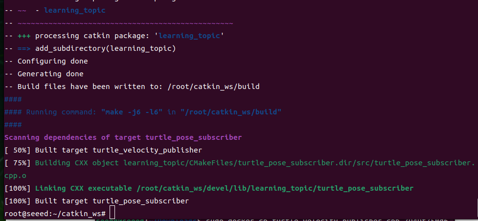

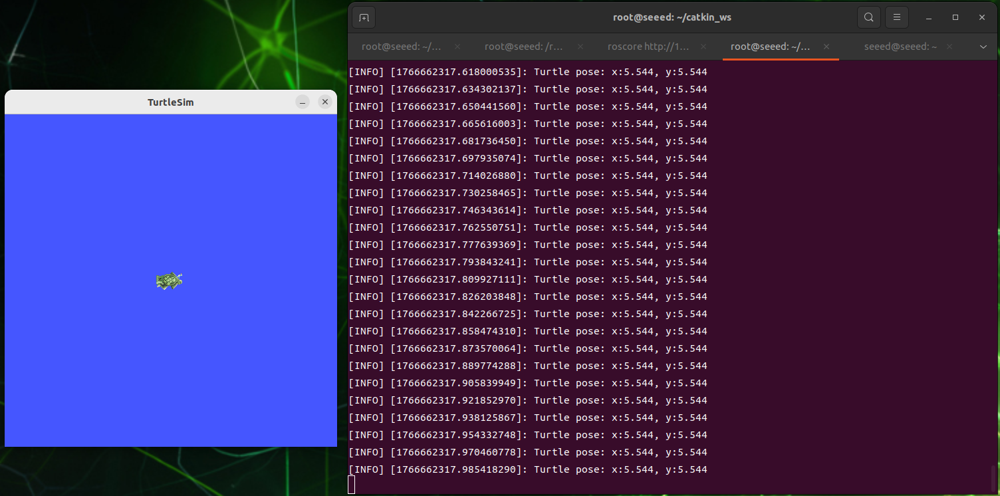

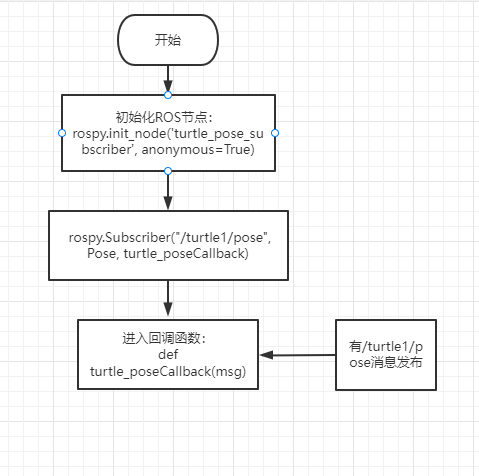


# 7.2.1.6 Custom Topic Messages and Usage

> Run the commands in the ROS 1 Noetic Docker container described in [7.2.1.1 Introduction to ROS 1](#7211-introduction-to-ros-1).

This section creates and uses a custom topic message named `Information.msg`. The example continues with the `learning_topic` package created earlier.

## Create the Message File

Create the `msg` directory and define the custom message:

```bash
cd ~/catkin_ws/src/learning_topic
mkdir -p msg
vim msg/Information.msg
```

Code file: [7-2-1-6-custom-topic-messages-and-usage-Information.msg](./code/7-2-1-6-custom-topic-messages-and-usage-Information.msg)
```msg
string company
string city
```

## Update package.xml

Add message generation/runtime dependencies to `package.xml`:

```xml
<build_depend>message_generation</build_depend>
<exec_depend>message_runtime</exec_depend>
```

## Update CMakeLists.txt

Add message generation to `CMakeLists.txt`:

```cmake
find_package(catkin REQUIRED COMPONENTS
  roscpp
  rospy
  std_msgs
  message_generation
)

add_message_files(
  FILES
  Information.msg
)

generate_messages(
  DEPENDENCIES
  std_msgs
)

catkin_package(
  CATKIN_DEPENDS message_runtime
)
```

Build the workspace:

```bash
cd ~/catkin_ws
catkin_make
source devel/setup.bash
```

## C++ Publisher and Subscriber

Create the following files under `~/catkin_ws/src/learning_topic/src`.

Code file: [7-2-1-6-custom-topic-messages-and-usage-Information_publisher.cpp](./code/7-2-1-6-custom-topic-messages-and-usage-Information_publisher.cpp)
```cpp
/**
 * Publish /company_info with the custom learning_topic::Information message type.
 */
#include <ros/ros.h>
#include "learning_topic/Information.h"

int main(int argc, char **argv)
{
    ros::init(argc, argv, "company_information_publisher");
    ros::NodeHandle nh;

    ros::Publisher info_pub = nh.advertise<learning_topic::Information>("/company_info", 10);
    ros::Rate loop_rate(1);

    while (ros::ok())
    {
        learning_topic::Information info_msg;
        info_msg.company = "Seeed";
        info_msg.city = "Shenzhen";

        info_pub.publish(info_msg);
        ROS_INFO("Information: company:%s city:%s", info_msg.company.c_str(), info_msg.city.c_str());
        loop_rate.sleep();
    }
    return 0;
}
```

Code file: [7-2-1-6-custom-topic-messages-and-usage-Information_subscriber.cpp](./code/7-2-1-6-custom-topic-messages-and-usage-Information_subscriber.cpp)
```cpp
/**
 * Subscribe to /company_info with the custom learning_topic::Information message type.
 */
#include <ros/ros.h>
#include "learning_topic/Information.h"

void companyInfoCallback(const learning_topic::Information::ConstPtr& msg)
{
    ROS_INFO("Company: %s, city: %s", msg->company.c_str(), msg->city.c_str());
}

int main(int argc, char **argv)
{
    ros::init(argc, argv, "company_information_subscriber");
    ros::NodeHandle nh;
    ros::Subscriber sub = nh.subscribe("/company_info", 10, companyInfoCallback);
    ros::spin();
    return 0;
}
```

Add the executables to `CMakeLists.txt`:

```cmake
add_executable(Information_publisher src/Information_publisher.cpp)
target_link_libraries(Information_publisher ${catkin_LIBRARIES})
add_dependencies(Information_publisher ${PROJECT_NAME}_generate_messages_cpp)

add_executable(Information_subscriber src/Information_subscriber.cpp)
target_link_libraries(Information_subscriber ${catkin_LIBRARIES})
add_dependencies(Information_subscriber ${PROJECT_NAME}_generate_messages_cpp)
```

Build and run:

```bash
cd ~/catkin_ws
catkin_make
source devel/setup.bash
roscore
rosrun learning_topic Information_publisher
rosrun learning_topic Information_subscriber
```

## Python Publisher and Subscriber

Create the following files under `~/catkin_ws/src/learning_topic/scripts`, then make them executable.

Code file: [7-2-1-6-custom-topic-messages-and-usage-Information_publisher.py](./code/7-2-1-6-custom-topic-messages-and-usage-Information_publisher.py)
```python
#!/usr/bin/env python3
import rospy
from learning_topic.msg import Information

def information_publisher():
    rospy.init_node('information_publisher', anonymous=True)
    info_pub = rospy.Publisher('/company_info', Information, queue_size=10)
    rate = rospy.Rate(1)

    while not rospy.is_shutdown():
        info_msg = Information()
        info_msg.company = 'Seeed'
        info_msg.city = 'Shenzhen'
        info_pub.publish(info_msg)
        rospy.loginfo('Information: company:%s city:%s', info_msg.company, info_msg.city)
        rate.sleep()

if __name__ == '__main__':
    information_publisher()
```

Code file: [7-2-1-6-custom-topic-messages-and-usage-Information_subscriber.py](./code/7-2-1-6-custom-topic-messages-and-usage-Information_subscriber.py)
```python
#!/usr/bin/env python3
import rospy
from learning_topic.msg import Information

def company_info_callback(msg):
    rospy.loginfo('Company: %s, city: %s', msg.company, msg.city)

def information_subscriber():
    rospy.init_node('information_subscriber', anonymous=True)
    rospy.Subscriber('/company_info', Information, company_info_callback)
    rospy.spin()

if __name__ == '__main__':
    information_subscriber()
```

```bash
chmod +x scripts/Information_publisher.py scripts/Information_subscriber.py
roscore
rosrun learning_topic Information_publisher.py
rosrun learning_topic Information_subscriber.py
```

## Figures

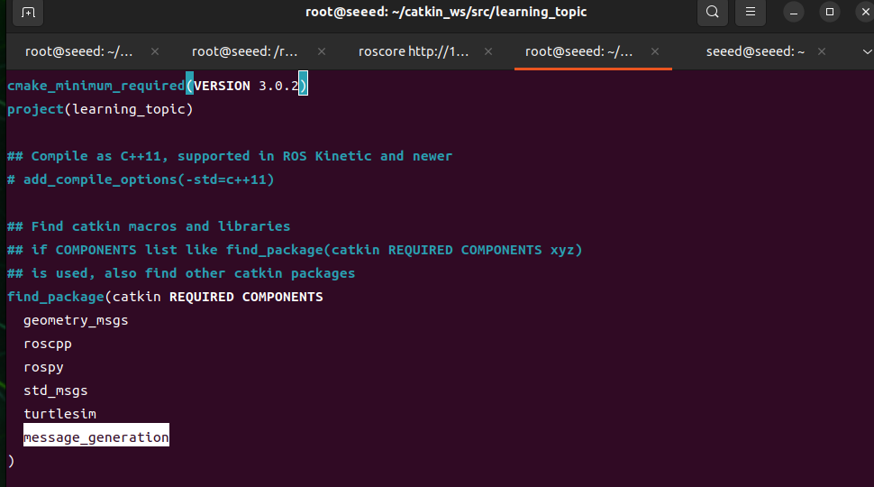

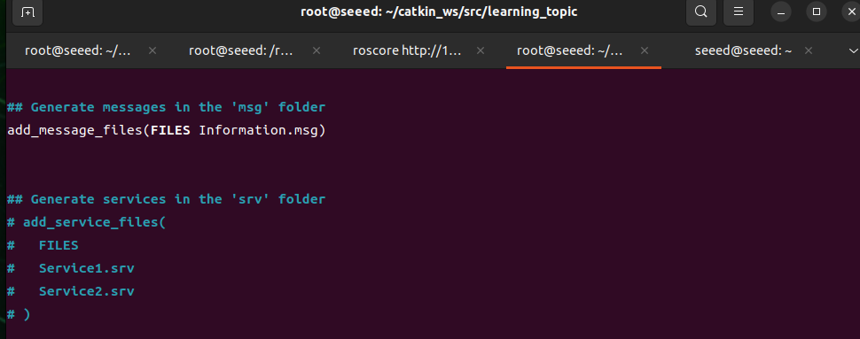

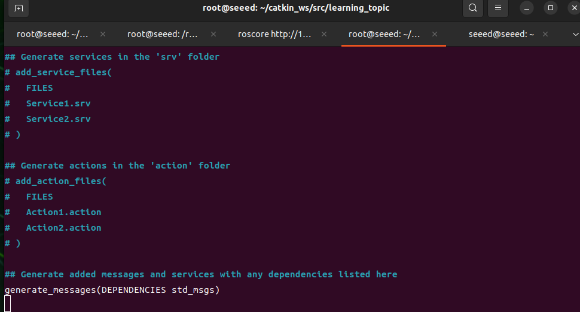

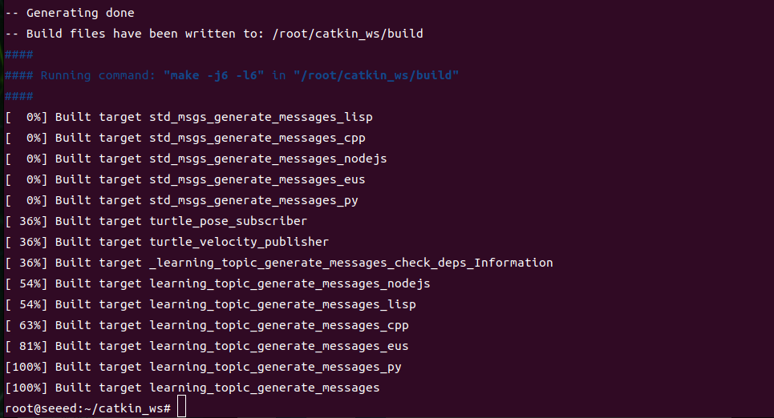

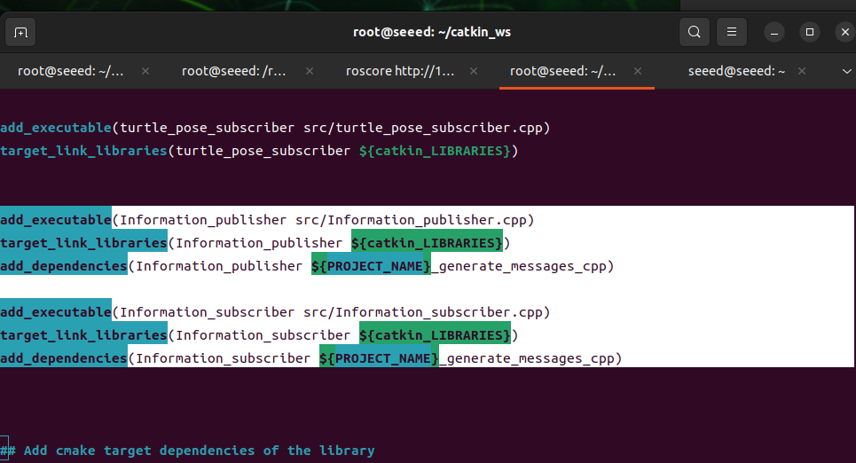

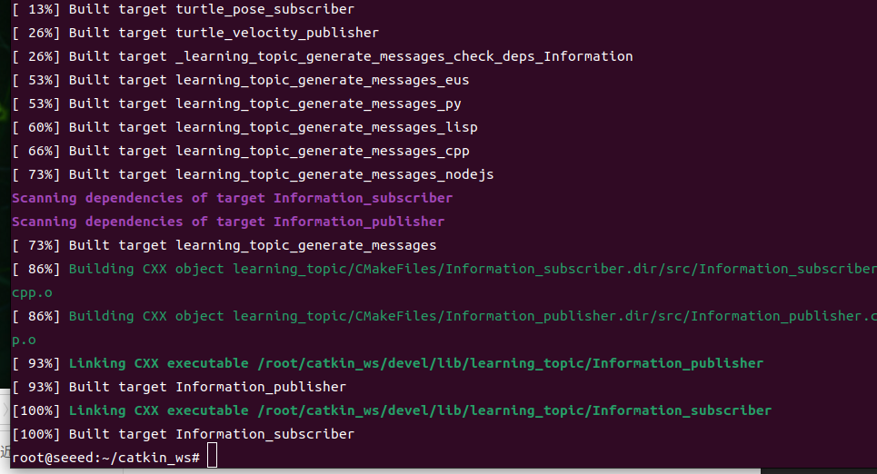

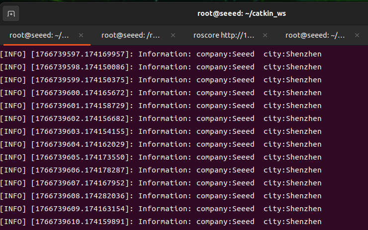

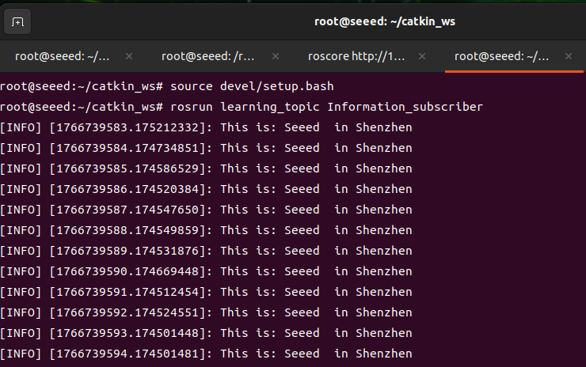


# 7.2.1.7 Client

> Run the commands in the ROS 1 Noetic Docker container described in [7.2.1.1 Introduction to ROS 1](#7211-introduction-to-ros-1).

In addition to the topic communication, there is a service communication. A client sends a request, and a server returns a response. This section focuses on the client, showing how to implement a client in C++ and Python.

### Preparatory work

> Continue using the `learning_server` package created in this section.

### Establishment of packages

1. Switch to ~/catkin_ws/src, terminal execution:

```bash
catkin_create_pkg learning_server std_msgs rospy roscpp geometry_msgs turtlesim
```

Switch to ~ directory to execute compilation:

```bash
catkin_make
```

### C++ implementation

### Steps towards realization

Initialization of ROS nodes

2. Create handles

3 ), create an example of client

4. Initializing and publishing service request data

5. RESPONSE RECEIVED BY server

### Create `a_new_turtle.cpp` under `~/catkin_ws/src/learning_server/src` and paste the following code.

a new turtle.cpp

Code file: [7-2-1-7-client-new.cpp](./code/7-2-1-7-client-new.cpp)
```cpp
/**
This example calls the turtlesim /spawn service to create a new turtle at the specified position.
*/

#include <ros/ros.h>
#include <turtlesim/Spawn.h>

int main(int argc, char** argv)
{

    ros::init(argc, argv, "a_new_turtle");// Initialize the ROS node.

    ros::NodeHandle node;

    ros::service::waitForService("/spawn"); // Wait for the /spawn service.

    ros::ServiceClient new_turtle = node.serviceClient<turtlesim::Spawn>("/spawn");//Create a service client for /spawn.

    // Initialize the turtlesim::Spawn request.
    turtlesim::Spawn new_turtle_srv;
    new_turtle_srv.request.x = 6.0;
    new_turtle_srv.request.y = 8.0;
    new_turtle_srv.request.name = "turtle2";

    // Call the service with x/y position and name parameters.
    ROS_INFO("Call service to create a new turtle name is %s,at the x:%.1f,y:%.1f", new_turtle_srv.request.name.c_str(),
        new_turtle_srv.request.x,
        new_turtle_srv.request.y);

    new_turtle.call(new_turtle_srv);


    ROS_INFO("Spawn turtle successfully [name:%s]", new_turtle_srv.response.name.c_str());// Display the service call result.

    return 0;
};
```

1. Flowchart of procedures


2) In the CMakeLists.txt configuration, under the built area, add the following:

(vim base use recalls: 14 with Vim editor)

Code file: [7-2-1-7-client-example-02.cmake](./code/7-2-1-7-client-example-02.cmake)
```cmake
add_executable(a_new_turtle src/a_new_turtle.cpp)
target_link_libraries(a_new_turtle ${catkin_LIBRARIES})
```


3. Recompile code under workspace directory

```bash
cd ~/catkin_ws
catkin_make
source devel/setup.bash     # source the workspace so ROS can find the program
```


4) Open three terminal running programs

```bash
roscore
rosrun turtlesim turtlesim_node
rosrun learning_server a_new_turtle
```

5. Expected result


6. Process

Once the small turtle node is activated, the re-run a new turtle shows another turtle in the picture, because the little turtle node provides the service of /spawn, which produces another turtle turtle 2, which can be viewed through the rosservice list command, as shown below.


The parameters required for this service can be viewed through rosserviceinfo /spawn, as shown in the figure below.


It can be seen that four parameters are needed: x, y,theta,name, which are initialized in a new turtle.cpp

Code file: [7-2-1-7-client-turtle.cpp](./code/7-2-1-7-client-turtle.cpp)
```cpp
srv.request.x = 6.0;
srv.request.y = 8.0;
srv.request.name = "turtle2";
```

Note: Theta is not assigned, default is 0

### Python implementation

### Create `scripts/a_new_turtle.py` under `~/catkin_ws/src/learning_server` and paste the following code.

a_new_turtle.py

Code file: [7-2-1-7-client-a_new_turtle.py](./code/7-2-1-7-client-a_new_turtle.py)
```python
#!/usr/bin/env python3

import rospy
from turtlesim.srv import Spawn


def turtle_spawn():
    rospy.init_node('new_turtle')
    rospy.wait_for_service('/spawn')

    try:
        spawn_client = rospy.ServiceProxy('/spawn', Spawn)
        response = spawn_client(2.0, 2.0, 0.0, 'turtle2')
        return response.name
    except rospy.ServiceException as exc:
        rospy.logerr('Failed to call /spawn: %s', exc)
        return None


if __name__ == '__main__':
    name = turtle_spawn()
    if name:
        rospy.loginfo('Created a new turtle named %s.', name)
```

1. Flowchart of procedures


2. Opening three terminal running programs

```bash
roscore
rosrun turtlesim turtlesim_node
rosrun learning_server a_new_turtle.py
```

3) The effects of the operation and description of the procedure are consistent with the results achieved by C++, and here the parameters of how Python provides the service,

`response = spawn_client(2.0, 2.0, 0.0, "turtle2")`

The corresponding parameters are x, y,theta,name.

## Figures

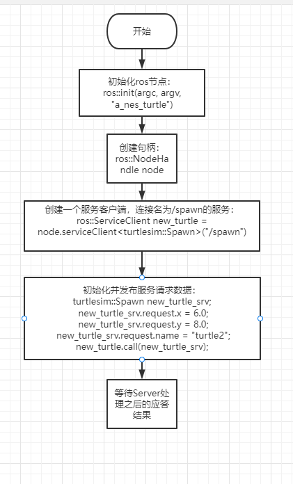

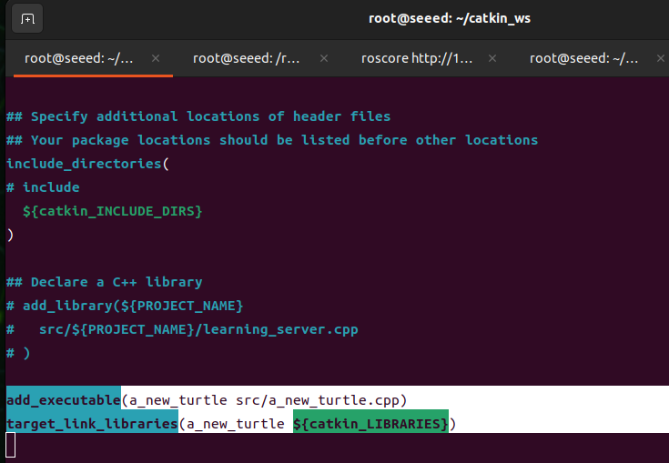

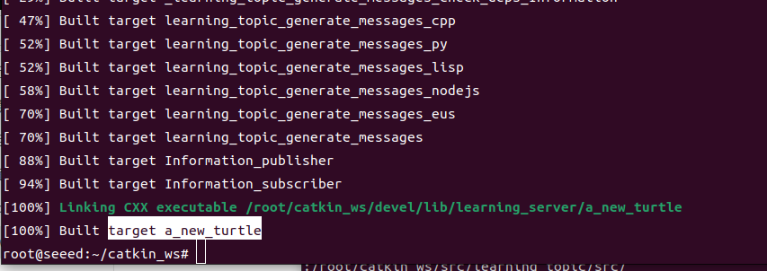

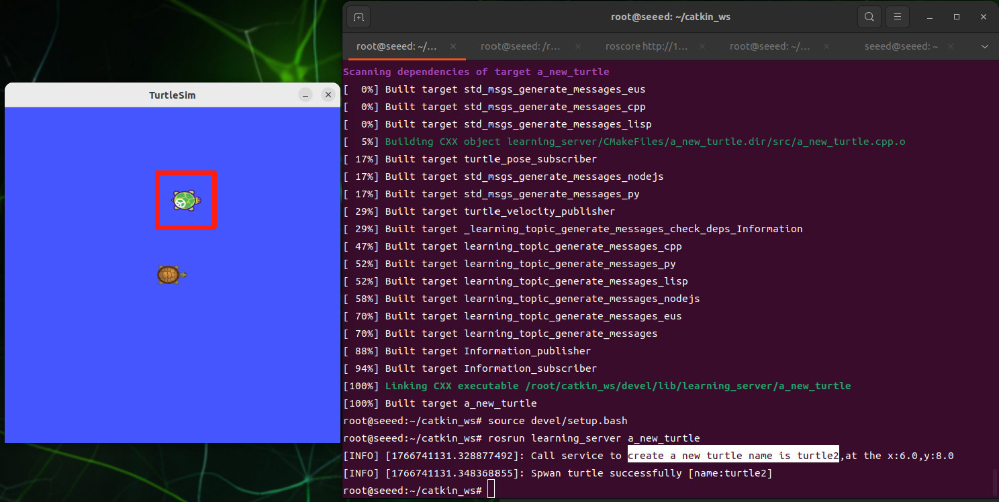

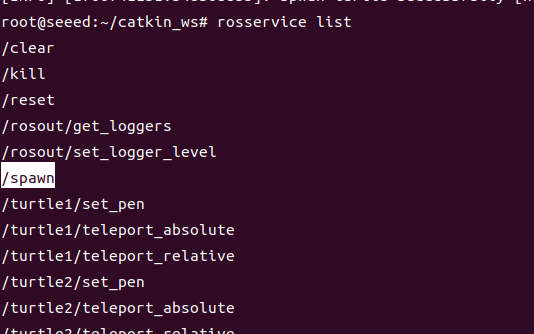

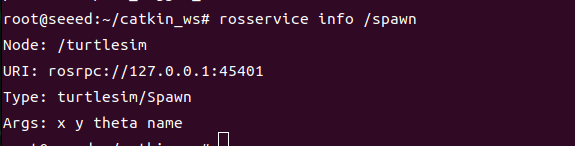

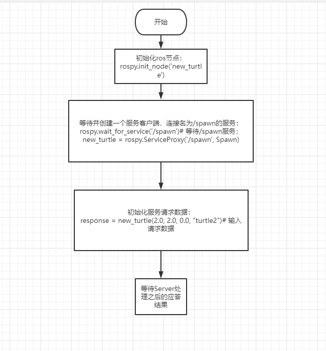


# 7.2.1.8 Server

> Run the commands in the ROS 1 Noetic Docker container described in [7.2.1.1 Introduction to ROS 1](#7211-introduction-to-ros-1).


When we talk about client requests and then service, we talk about service delivery.

> Continue using the `learning_server` package created in this section.

### C++ implementation

### Steps towards realization

Initialization of ROS nodes

2. Examples of the creation of Server

3) Loop waiting for service requests, enter a callback function

4) complete the functional processing of the service in the callback function and provide feedback on response data

### Create `turtle_vel_command_server.cpp` under `~/catkin_ws/src/learning_server/src` and paste the following code.


Code file: [7-2-1-8-server-new.cpp](./code/7-2-1-8-server-new.cpp)
```cpp
/**
This example provides /turtle_vel_command with the std_srvs/Trigger service type.
*/
#include <ros/ros.h>
#include <geometry_msgs/Twist.h>
#include <std_srvs/Trigger.h>

ros::Publisher turtle_vel_pub;
bool pubvel = false;

// Service callback: req is the request and res is the response.
bool pubvelCallback(std_srvs::Trigger::Request  &req,
                    std_srvs::Trigger::Response &res)
{
    pubvel = !pubvel;

        ROS_INFO("Do you want to publish the vel?: [%s]", pubvel==true?"Yes":"No");// Print the client request.

    // Set response data.
    res.success = true;
    res.message = "The status is changed!";

    return true;
}

int main(int argc, char **argv)
{

    ros::init(argc, argv, "turtle_vel_command_server");


    ros::NodeHandle n;

    // Create the /turtle_vel_command server and register pubvelCallback.
    ros::ServiceServer command_service = n.advertiseService("/turtle_vel_command", pubvelCallback);

    // Create a publisher for /turtle1/cmd_vel. The message type is geometry_msgs::Twist and the queue size is 8.
    turtle_vel_pub = n.advertise<geometry_msgs::Twist>("/turtle1/cmd_vel", 8);

    ros::Rate loop_rate(10);// Set the loop rate.

    while(ros::ok())
    {

        ros::spinOnce();// Process callbacks once.

        // Publish turtle velocity commands when pubvel is true.
        if(pubvel)
        {
            geometry_msgs::Twist vel_msg;
            vel_msg.linear.x = 0.6;
            vel_msg.angular.z = 0.8;
            turtle_vel_pub.publish(vel_msg);
        }

        loop_rate.sleep();//Sleep according to the loop rate.
    }

    return 0;
}
```

1. Flowchart of procedures


2) Configure in CMakeLists.txt, under the built area, add the following:

Code file: [7-2-1-8-server-example-02.cmake](./code/7-2-1-8-server-example-02.cmake)
```cmake
add_executable(turtle_vel_command_server src/turtle_vel_command_server.cpp)
target_link_libraries(turtle_vel_command_server ${catkin_LIBRARIES})
```

3. Codes compiled under the workspace directory

```bash
cd ~/catkin_ws
catkin_make
source devel/setup.bash     # source the workspace so ROS can find the program
```


4. Launching of four terminal running programs

```bash
roscore
rosrun turtlesim turtlesim_node
rosrun learning_server turtle_vel_command_server
rosservice call /turtle_vel_command
```

5. Expected result


6. Process

First, when running the little turtle node, you can enter the rosservice list at the terminal to see what the current service is, as follows:


And then we run the turtle vel command server program, and enter the rosservice list, and we find an extra turtle vel command server, as shown in the figure below.


And then we call this service by inputting it at the terminal, and we find little turtles doing round-the-clock motion, and if they call again, they stop. This is because, in the back-to-back service, we reverse the value of the pubvel, and then feedback back, the main function will judge the value of the pubvel, and if it's True, give speed instructions, and not for False.

### Python implementation

### Create `scripts/turtle_vel_command_server.py` under `~/catkin_ws/src/learning_server` and paste the following code.

turtle_vel_command_server.py

Code file: [7-2-1-8-server-turtle_vel_command_server.py](./code/7-2-1-8-server-turtle_vel_command_server.py)
```python
#!/usr/bin/env python3

import threading

import rospy
from geometry_msgs.msg import Twist
from std_srvs.srv import Trigger, TriggerResponse

pubvel = False
turtle_vel_pub = None


def publish_velocity_loop():
    rate = rospy.Rate(10)
    while not rospy.is_shutdown():
        if pubvel:
            vel_msg = Twist()
            vel_msg.linear.x = 0.6
            vel_msg.angular.z = 0.8
            turtle_vel_pub.publish(vel_msg)
        rate.sleep()


def pubvel_callback(req):
    global pubvel
    pubvel = not pubvel
    rospy.loginfo('Publish turtle velocity: %s', pubvel)
    return TriggerResponse(success=True, message='Velocity publishing toggled.')


def turtle_pubvel_command_server():
    global turtle_vel_pub
    rospy.init_node('turtle_vel_command_server')
    turtle_vel_pub = rospy.Publisher('/turtle1/cmd_vel', Twist, queue_size=8)
    rospy.Service('/turtle_vel_command', Trigger, pubvel_callback)
    threading.Thread(target=publish_velocity_loop, daemon=True).start()
    rospy.loginfo('Ready to receive /turtle_vel_command requests.')
    rospy.spin()


if __name__ == '__main__':
    turtle_pubvel_command_server()
```

1. Flowchart of procedures


2) Open three terminal running programs:

```bash
roscore
rosrun turtlesim turtlesim_node
rosrun learning_server turtle_vel_command_server.py
```


3. The effects of the operation of the procedure and the description of the procedure are consistent with those achieved by C++.

## Figures

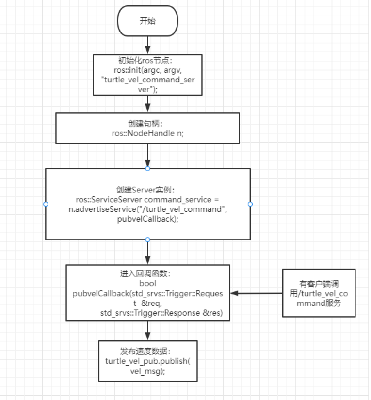

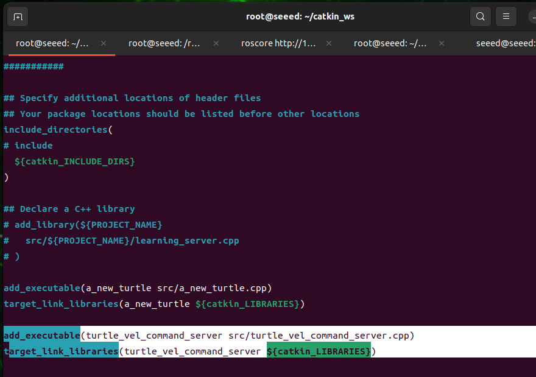

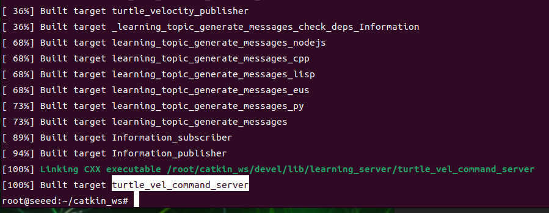

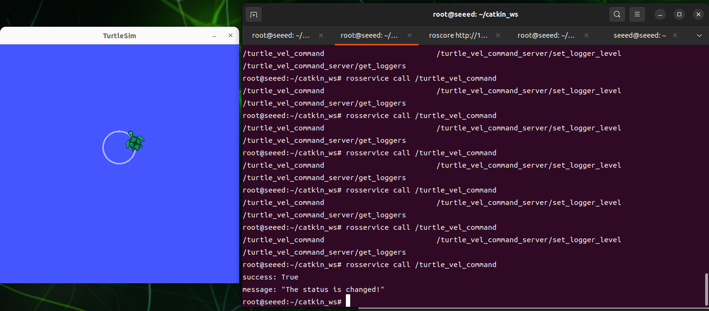

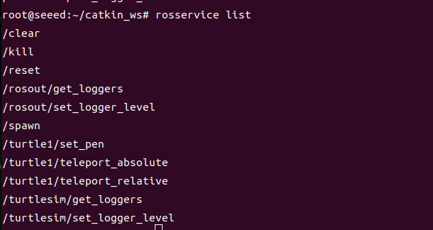

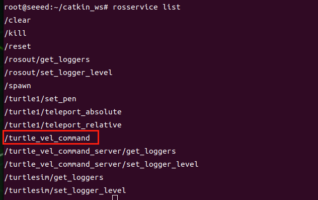

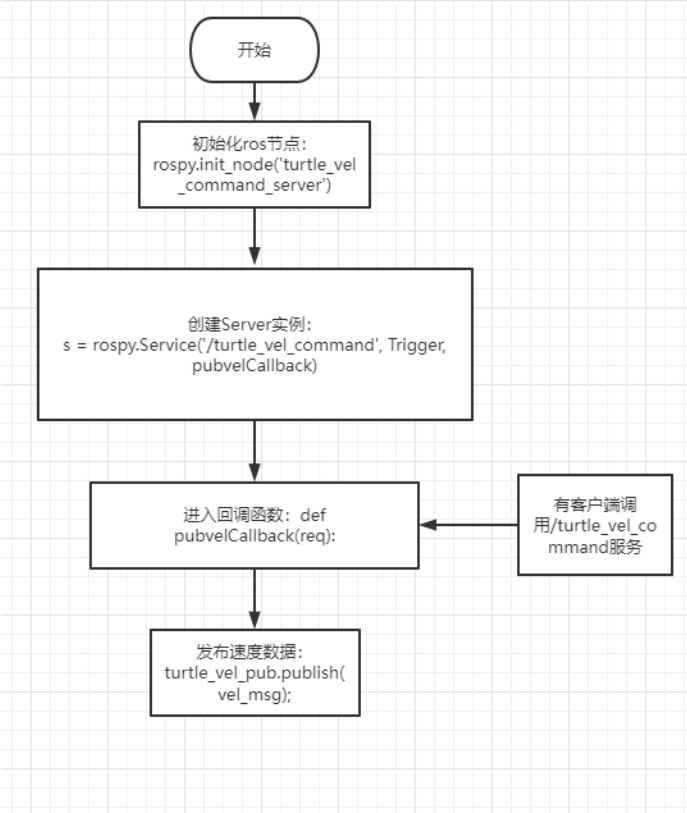


# 7.2.1.9 Custom Service Messages and Usage

> Run the commands in the ROS 1 Noetic Docker container described in [7.2.1.1 Introduction to ROS 1](#7211-introduction-to-ros-1).

This section defines a custom service named `IntPlus.srv` and implements a server/client pair in C++ and Python.

## Create the Service File

```bash
cd ~/catkin_ws/src/learning_server
mkdir -p srv
vim srv/IntPlus.srv
```

Code file: [7-2-1-9-custom-service-messages-and-usage-IntPlus.srv](./code/7-2-1-9-custom-service-messages-and-usage-IntPlus.srv)
```srv
int64 a
int64 b
---
int64 result
```

## Update package.xml and CMakeLists.txt

Add these dependencies to `package.xml`:

```xml
<build_depend>message_generation</build_depend>
<exec_depend>message_runtime</exec_depend>
```

Add service generation to `CMakeLists.txt`:

```cmake
find_package(catkin REQUIRED COMPONENTS
  roscpp
  rospy
  std_msgs
  message_generation
)

add_service_files(
  FILES
  IntPlus.srv
)

generate_messages(
  DEPENDENCIES
  std_msgs
)

catkin_package(
  CATKIN_DEPENDS message_runtime
)
```

Build the workspace:

```bash
cd ~/catkin_ws
catkin_make
source devel/setup.bash
```

## C++ Server and Client

Code file: [7-2-1-9-custom-service-messages-and-usage-IntPlus_server.cpp](./code/7-2-1-9-custom-service-messages-and-usage-IntPlus_server.cpp)
```cpp
#include <ros/ros.h>
#include "learning_server/IntPlus.h"

bool intPlusCallback(learning_server::IntPlus::Request &req,
                     learning_server::IntPlus::Response &res)
{
    ROS_INFO("number 1 is:%ld, number 2 is:%ld", req.a, req.b);
    res.result = req.a + req.b;
    return true;
}

int main(int argc, char **argv)
{
    ros::init(argc, argv, "IntPlus_server");
    ros::NodeHandle nh;
    ros::ServiceServer service = nh.advertiseService("/Two_Int_Plus", intPlusCallback);
    ROS_INFO("Ready to calculate two integers.");
    ros::spin();
    return 0;
}
```

Code file: [7-2-1-9-custom-service-messages-and-usage-IntPlus_client.cpp](./code/7-2-1-9-custom-service-messages-and-usage-IntPlus_client.cpp)
```cpp
#include <ros/ros.h>
#include "learning_server/IntPlus.h"

int main(int argc, char **argv)
{
    ros::init(argc, argv, "IntPlus_client");
    ros::NodeHandle nh;
    ros::service::waitForService("/Two_Int_Plus");
    ros::ServiceClient client = nh.serviceClient<learning_server::IntPlus>("/Two_Int_Plus");

    learning_server::IntPlus srv;
    srv.request.a = 8;
    srv.request.b = 6;

    if (client.call(srv)) {
        ROS_INFO("Result: %ld", srv.response.result);
    } else {
        ROS_ERROR("Failed to call /Two_Int_Plus");
    }
    return 0;
}
```

Add the executables to `CMakeLists.txt`:

```cmake
add_executable(IntPlus_server src/IntPlus_server.cpp)
target_link_libraries(IntPlus_server ${catkin_LIBRARIES})
add_dependencies(IntPlus_server ${PROJECT_NAME}_generate_messages_cpp)

add_executable(IntPlus_client src/IntPlus_client.cpp)
target_link_libraries(IntPlus_client ${catkin_LIBRARIES})
add_dependencies(IntPlus_client ${PROJECT_NAME}_generate_messages_cpp)
```

Run the example:

```bash
roscore
rosrun learning_server IntPlus_server
rosrun learning_server IntPlus_client
```

You can also call the service directly:

```bash
rosservice call /Two_Int_Plus 5 6
```

## Python Server and Client

Code file: [7-2-1-9-custom-service-messages-and-usage-IntPlus_server.py](./code/7-2-1-9-custom-service-messages-and-usage-IntPlus_server.py)
```python
#!/usr/bin/env python3
import rospy
from learning_server.srv import IntPlus, IntPlusResponse

def int_plus_callback(req):
    rospy.loginfo('Ints: a:%d b:%d', req.a, req.b)
    return IntPlusResponse(req.a + req.b)

if __name__ == '__main__':
    rospy.init_node('IntPlus_server')
    rospy.Service('/Two_Int_Plus', IntPlus, int_plus_callback)
    rospy.loginfo('Ready to calculate two integers.')
    rospy.spin()
```

Code file: [7-2-1-9-custom-service-messages-and-usage-IntPlus_client.py](./code/7-2-1-9-custom-service-messages-and-usage-IntPlus_client.py)
```python
#!/usr/bin/env python3
import rospy
from learning_server.srv import IntPlus

if __name__ == '__main__':
    rospy.init_node('IntPlus_client')
    rospy.wait_for_service('/Two_Int_Plus')
    plus_client = rospy.ServiceProxy('/Two_Int_Plus', IntPlus)
    response = plus_client(22, 20)
    rospy.loginfo('Result: %d', response.result)
```

```bash
chmod +x scripts/IntPlus_server.py scripts/IntPlus_client.py
roscore
rosrun learning_server IntPlus_server.py
rosrun learning_server IntPlus_client.py
```

## Figures

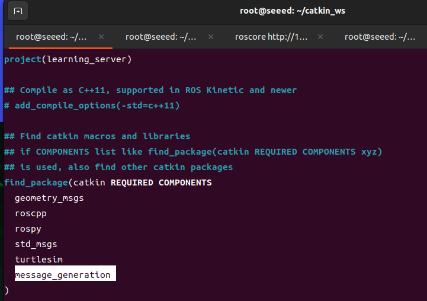

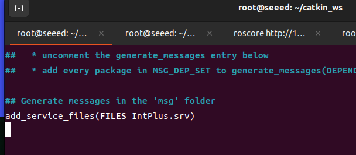

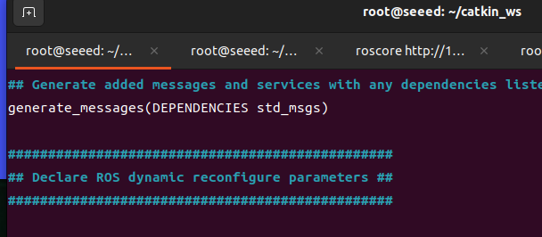

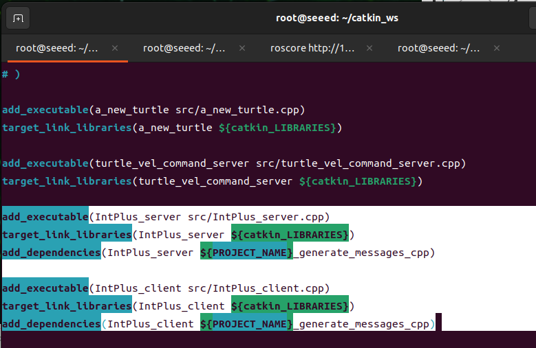

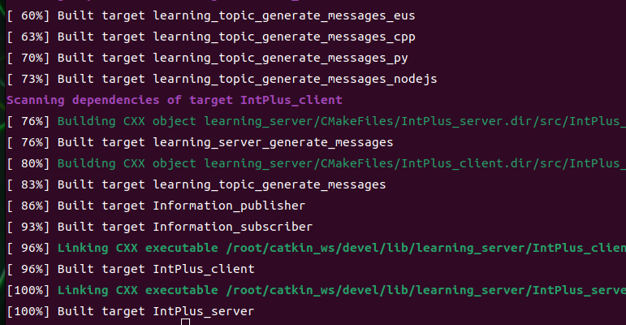


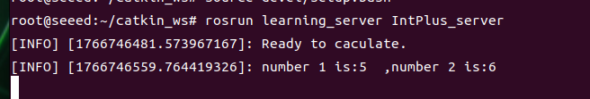


# 7.2.1.10 Publishing and Listening with TF

> Run the commands in the ROS 1 Noetic Docker container described in [7.2.1.1 Introduction to ROS 1](#7211-introduction-to-ros-1).

### tf packages

### tf is a package that allows users to track multiple coordinate systems over time, using tree-shaped data structures that help developers to change coordinates at any time, completion point between coordinates, vectors, etc., using time buffers and maintaining coordination alternations between multiple coordinates.

### Steps for use

1. Interception tf transformation

Receives all coordinates published in the cache system, transforms the data, and from which you search for the coordinates required.

2. Broadcasting tf transformation

(b) Broadcasts the coordinate alternation between the coordinates in the system. There may be tf-modified broadcasts in multiple parts of the system. Each broadcast can be inserted directly into the tf tree without any further synchronization.

### tf coordinates radio and listening programming achieved

### Create and compile packages

```bash
cd ~/catkin_ws/src
catkin_create_pkg learning_tf rospy roscpp turtlesim tf
cd..
catkin_make
```

### How to achieve a tf broadcaster

1. Definition of TF broadcaster (Transform Broadcaster);

2. Initialization of tf data and creation of coordinates;

3), release coordinates conversion (sendTransform);


### How to achieve a tf listening device

1. Definition of TF listening devices (TransformListener);

2) Find coordinates (waitForTransform, lookupTransform)


### C++ Language realization tf broadcaster

1) Create a C++ file (file suffixed with.cpp) in the src folder of the package

2) Copy the program code below to the turtle tf broadcaster.cpp file

Code file: [7-2-1-10-publishing-and-listening-with-tf-with.cpp](./code/7-2-1-10-publishing-and-listening-with-tf-with.cpp)
```cpp
#include <ros/ros.h>
#include <tf/transform_broadcaster.h>
#include <turtlesim/Pose.h>

std::string turtle_name;

void poseCallback(const turtlesim::PoseConstPtr& msg)
{

    static tf::TransformBroadcaster br;// Create a TF broadcaster.

    // Initialize TF data.
    tf::Transform transform;
    transform.setOrigin( tf::Vector3(msg->x, msg->y, 0.0) );//Set xyz coordinates.
    tf::Quaternion q;
    q.setRPY(0, 0, msg->theta);//Set Euler angles for x, y, and z rotation.
    transform.setRotation(q);

    br.sendTransform(tf::StampedTransform(transform, ros::Time::now(), "world", turtle_name));// Broadcast TF data between world and the turtle frame.
}

int main(int argc, char** argv)
{
    ros::init(argc, argv, "turtle_world_tf_broadcaster");// Initialize the ROS node.

    if (argc != 2)
    {
        ROS_ERROR("Missing a parameter as the name of the turtle!");
        return -1;
    }

    turtle_name = argv[1];// Use the input argument as the turtle name.

    // Subscribe to the turtle pose topic.
    ros::NodeHandle node;
    ros::Subscriber sub = node.subscribe(turtle_name+"/pose", 10, &poseCallback);

        // Wait for callbacks.
    ros::spin();

    return 0;
};
```

3. PROJECT Flowchart


4. Code resolution

First of all, subscribe to the /pose position of the turtle, and if the topic is published, then enters the back-to-back function. And then back to the tf's broadcaster, then initialize the tf data, the value of which is subscription to the /pose topic. Finally, the transformation of the coordinates of the world by small turtles is published through br.sendTransform, a function of sendTransform. There are four parameters, the first of which represents tf: (i.e. tf data previously initialized) coordinates of the Transform type, the second parameter is a time stamp, and the third and fourth is a variable source and target coordinates.


### C++ Language realization tf listening devices

1) Create a C++ file (file suffixed with.cpp) in the src folder of the package

2) Copy the program code below to fileturtle tf lister.cpp

Code file: [7-2-1-10-publishing-and-listening-with-tf-with.cpp](./code/7-2-1-10-publishing-and-listening-with-tf-with.cpp)
```cpp
/**
This example listens to TF data, computes velocity commands, and publishes them to turtle2.
turtle2->turtle1 = world->turtle*world->turtle2
*/

#include <ros/ros.h>
#include <tf/transform_listener.h>
#include <geometry_msgs/Twist.h>
#include <turtlesim/Spawn.h>

int main(int argc, char** argv)
{

    ros::init(argc, argv, "turtle1_turtle2_listener");// Initialize the ROS node.


    ros::NodeHandle node; // Create a node handle.

    // Call the service to spawn turtle2.
    ros::service::waitForService("/spawn");
    ros::ServiceClient add_turtle = node.serviceClient<turtlesim::Spawn>("/spawn");
    turtlesim::Spawn srv;
    add_turtle.call(srv);

    // Create a publisher for turtle2 velocity commands.
    ros::Publisher vel = node.advertise<geometry_msgs::Twist>("/turtle2/cmd_vel", 10);

    tf::TransformListener listener;// Create a TF listener.

    ros::Rate rate(10.0);

    while (node.ok())
    {
        // Get TF data between turtle1 and turtle2.
        tf::StampedTransform transform;
        try
        {
            listener.waitForTransform("/turtle2", "/turtle1", ros::Time(0), ros::Duration(3.0));
            listener.lookupTransform("/turtle2", "/turtle1", ros::Time(0), transform);
        }
        catch (tf::TransformException &ex)
        {
            ROS_ERROR("%s",ex.what());
            ros::Duration(1.0).sleep();
            continue;
        }

        // Compute angular and linear velocity from the relative pose between turtle1 and turtle2, then publish commands for turtle2.
        geometry_msgs::Twist turtle2_vel_msg;

        turtle2_vel_msg.angular.z = 6.0 * atan2(transform.getOrigin().y(),
                                        transform.getOrigin().x());
        turtle2_vel_msg.linear.x = 0.8 * sqrt(pow(transform.getOrigin().x(), 2) +
                                      pow(transform.getOrigin().y(), 2));
        vel.publish(turtle2_vel_msg);

        rate.sleep();
    }
    return 0;
};
```

3. PROJECT Flowchart


4. Code resolution

First, the service calls for the creation of another little turtle tortele2, and then creates a turttle 2 speed controller; Then create a listening device, listening and searching for the left of the turtle1 and tuetle2, which involves two functions:

Code file: [7-2-1-10-publishing-and-listening-with-tf-example-03.cpp](./code/7-2-1-10-publishing-and-listening-with-tf-example-03.cpp)
```cpp
waitForTransform and lookupTransform
waitForTransform(target_frame,source_frame,time,timeout)
```

The two fames represent the target coordinates and the source coordinates, respectively, and the times indicate the time to wait for a change between the two coordinates, since the change of coordinates is a blocking procedure and therefore need to be set up to indicate the time limit.

LookupTransform (target frame, source frame, transferform): given source frame and target coordinates (target frame), given the time between the two coordinates (transform).

We obtained the result of the coordinates transformation through the LoopupTransform and then x, x, x, x, x, x, x, x, x, x, x, x, x, x, x, x, x, x, x, x, x, x, x, x, x, x, x, x, x, x, x, x, x, x, x, x, x, x, x, x, x, x, x, x, x, x, x, x, x, x, x, x, x, x, x, x, x, x, x, x, x, x, x, x, x, x, x, x, x, x, x, x, x, x, x, x, x, x, x, x, x, x, x, x, x, x, x, x, x, x, x, x, x, x, x, x, x, x, x, x, x, x, x, x, x, x, x, x, x, x, x, x, x, x, x, x, x, x, x


### Modifications to CMakeLists.txt and compilations

1. Modifying CMakeLists.txt

Modify the src/learning_tf/CMakeLists.txt under the package by adding the following:

(vim base use recalls: 14 with Vim editor)

Code file: [7-2-1-10-publishing-and-listening-with-tf-example-04.cpp](./code/7-2-1-10-publishing-and-listening-with-tf-example-04.cpp)
```cpp
add_executable(turtle_tf_listener src/turtle_tf_listener.cpp)
target_link_libraries(turtle_tf_listener ${catkin_LIBRARIES})

add_executable(turtle_tf_broadcaster src/turtle_tf_broadcaster.cpp)
target_link_libraries(turtle_tf_broadcaster ${catkin_LIBRARIES})
```


2. Compile implementation documents

```bash
cd ~/catkin_ws
catkin_make
source devel/setup.bash     # source the workspace so ROS can find the program
```


### Demonstration of start-up and operational effects

1) Open six terminals and run the following commands:

```bash
roscore
rosrun turtlesim turtlesim_node
rosrun learning_tf turtle_tf_broadcaster __name:=turtle1_tf_broadcaster /turtle1
rosrun learning_tf turtle_tf_broadcaster __name:=turtle2_tf_broadcaster /turtle2
rosrun learning_tf turtle_tf_listener
rosrun turtlesim turtle_teleop_key  # start keyboard teleoperation for the turtle
```

2. Demonstrated impact


III. PROCEDURAL STATEMENTS

When the roscore is activated, the small turtle node is activated, and a small turtle will appear at the end; Then we publish two tf transformations, turtle1->world, turtle2->world, because if we want to know the change between turtle2 and turtle1, we need to know the change between them and trld; The tf listening program is then opened, at which point the terminal is found to produce another turtle, and the turtle2 will move towards turtle 1; Then we turn on the keyboard control, and then click the arrow to control the turtle1 movement, and the turtle2 will follow the turtle1 movement.


### tf broadcaster in Python language

1) Create a folder script in the package  tf to switch to this directory, create a new.py file named turtle tf broadcaster.py

2) Copy the program code below to fileturtle tf broadcaster.py

Code file: [7-2-1-10-publishing-and-listening-with-tf-new.py](./code/7-2-1-10-publishing-and-listening-with-tf-new.py)
```python
#!/usr/bin/env python3

import roslib
roslib.load_manifest('learning_tf')
import rospy

import tf
import turtlesim.msg

def handle_turtle_pose(msg, turtlename):
    br = tf.TransformBroadcaster()# Create a TF broadcaster.
    # Broadcast the TF transform between world and the named turtle.
    br.sendTransform((msg.x, msg.y, 0),
                     tf.transformations.quaternion_from_euler(0, 0, msg.theta),
                     rospy.Time.now(),
                     turtlename,
                     "world")

if __name__ == '__main__':

    rospy.init_node('turtle1_turtle2_tf_broadcaster')# Initialize the ROS node.

    turtlename = rospy.get_param('~turtle') # Get the turtle name from the parameter server.
    # Subscribe to the turtle pose topic.
    rospy.Subscriber('/%s/pose' % turtlename,
                     turtlesim.msg.Pose,
                     handle_turtle_pose,
                     turtlename)
    rospy.spin()
```

3. PROJECT Flowchart


### Python language achieves tf listening devices

1) Create a Python file (file suffixed with.py) in the profile linearning tf's script folder named turtle tf lister.py

2) Copy the program code below to the turtle tf lister.py file

Code file: [7-2-1-10-publishing-and-listening-with-tf-with.py](./code/7-2-1-10-publishing-and-listening-with-tf-with.py)
```python
#!/usr/bin/env python3
import rospy
import math
import tf
import geometry_msgs.msg
import turtlesim.srv

if __name__ == '__main__':
    rospy.init_node('turtle_tf_listener')# Initialize the ROS node.

    listener = tf.TransformListener()# Initialize a TF listener.

    rospy.wait_for_service('spawn')
    # Call the service to create another turtle named turtle2.
    spawner = rospy.ServiceProxy('spawn', turtlesim.srv.Spawn)
    spawner(8, 6, 0, 'turtle2')
    # Declare a publisher for turtle2 velocity.
    turtle_vel = rospy.Publisher('turtle2/cmd_vel', geometry_msgs.msg.Twist,queue_size=1)

    rate = rospy.Rate(10.0)
    while not rospy.is_shutdown():
        try:
            # Look up the TF transform between turtle2 and turtle1.
            (trans,rot) = listener.lookupTransform('/turtle2', '/turtle1', rospy.Time(0))
        except (tf.LookupException, tf.ConnectivityException, tf.ExtrapolationException):
            continue
        # Compute linear and angular velocity, then publish them.
        angular = 6.0 * math.atan2(trans[1], trans[0])
        linear = 0.8 * math.sqrt(trans[0] ** 2 + trans[1] ** 2)
        cmd = geometry_msgs.msg.Twist()
        cmd.linear.x = linear
        cmd.angular.z = angular
        turtle_vel.publish(cmd)
        rate.sleep()
```

3. PROJECT Flowchart


### Demonstration of start-up and operational effectiveness

1. Preparation of a lanch document

In the package directory, create a new folder launch, switch to launch, create a new launch file named Start tf demo py.launch, and copy the following into it:

Code file: [7-2-1-10-publishing-and-listening-with-tf-py.xml](./code/7-2-1-10-publishing-and-listening-with-tf-py.xml)
```xml
<launch>

    <!-- turtlesim node-->
    <node pkg="turtlesim" type="turtlesim_node" name="sim"/>
    <!-- broadcast turtle1 -> world -->
    <node name="turtle1_tf_broadcaster" pkg="learning_tf" type="turtle_tf_broadcaster.py" respawn="false" output="screen" >
      <param name="turtle" type="string" value="turtle1" />
    </node>
    <!-- broadcast turtle2 -> world -->
    <node name="turtle2_tf_broadcaster" pkg="learning_tf" type="turtle_tf_broadcaster.py" respawn="false" output="screen" >
      <param name="turtle" type="string" value="turtle2" />
    </node>
    <!--listener-->
    <node pkg="learning_tf" type="turtle_tf_listener.py" name="listener" />
    <!--turtle keyboard control node-->
    <node pkg="turtlesim" type="turtle_teleop_key" name="teleop" output="screen"/>
</launch>
```


2. Launch

```bash
roslaunch learning_tf start_tf_demo_py.launch
```

When the application is running, the mouse clicks on the window that runs lanch, press the arrow key, and the turtle2 moves with the turtle1.

3) Operational effects are broadly consistent with C++

## Figures

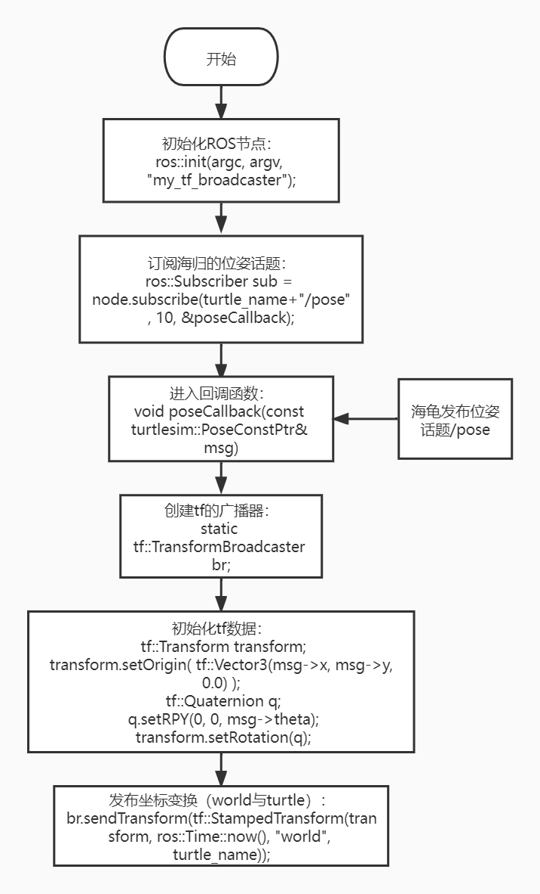

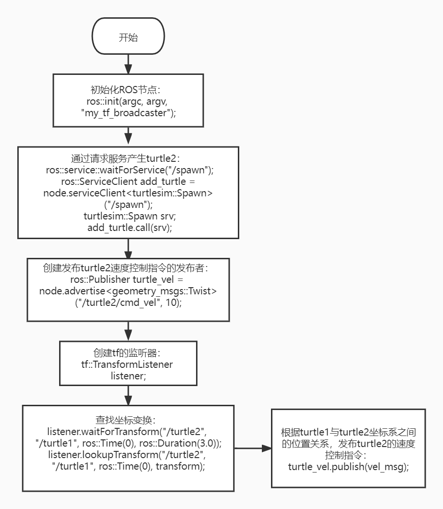

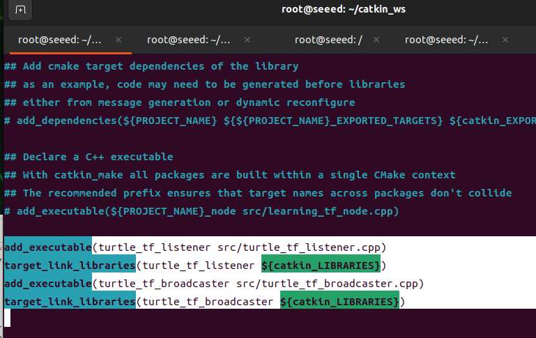

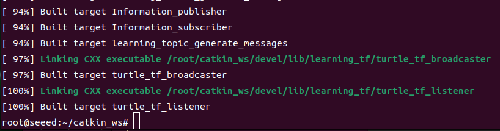

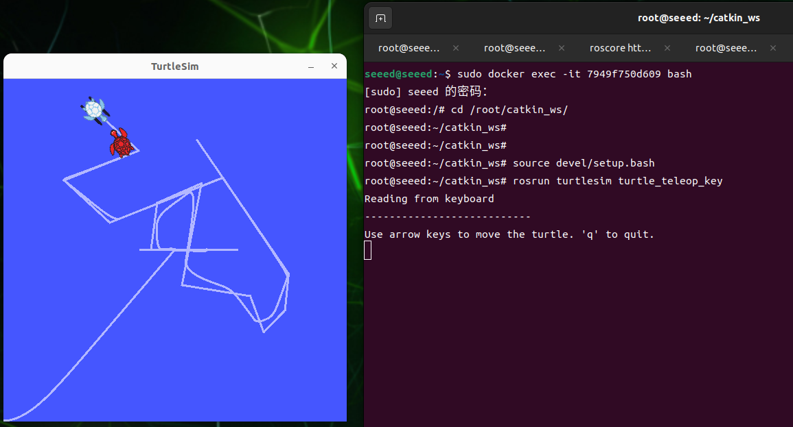

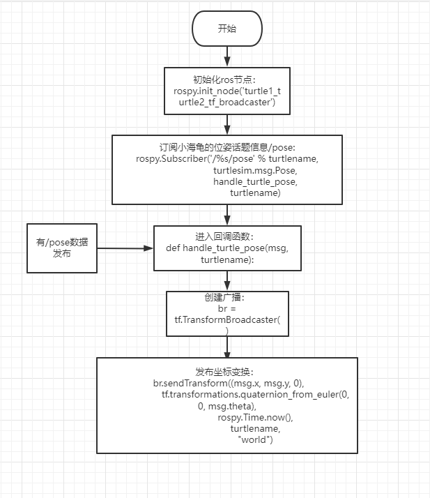

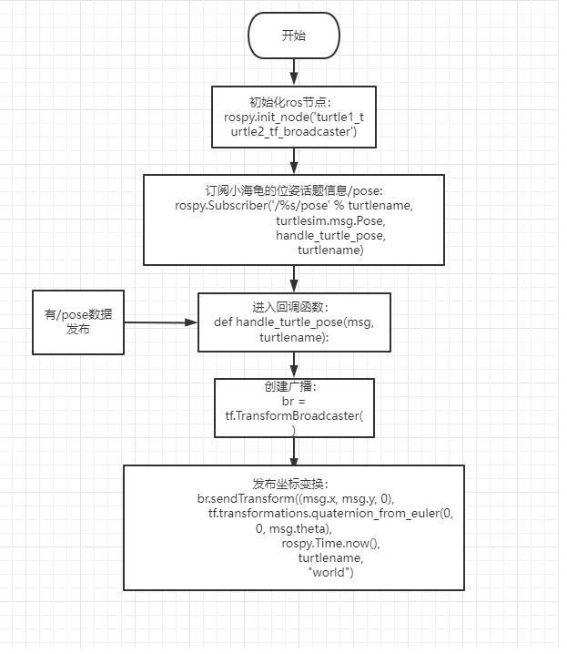
