# ROS 1 Noetic Vision Applications

This chapter covers practical ROS 1 vision workflows on reComputer Jetson, including camera preview, QR recognition, pose estimation, object detection, AR markers, OpenCV, and MediaPipe examples.

> Long runnable examples are saved under `./code/`, and related figures are saved under `./images/`.

# Contents

- [7.2.2.1 Read This First](#7221-read-this-first)

- [7.2.2.2 Camera Preview](#7222-camera-preview)

- [7.2.2.3 QR Codes](#7223-qr-codes)

- [7.2.2.4 Human Pose Estimation](#7224-human-pose-estimation)

- [7.2.2.5 Object Detection](#7225-object-detection)

- [7.2.2.6 AR Vision](#7226-ar-vision)

- [7.2.2.7 OpenCV Applications](#7227-opencv-applications)

- [7.2.2.8 ROS + OpenCV Fundamentals](#7228-ros--opencv-fundamentals)

- [7.2.2.9 MediaPipe Development](#7229-mediapipe-development)

# 7.2.2.1 Read This First

## It's all about use.

The ROS 1 environment is in the Docker mirror and needs a Docker base to be fully operational!

Note: Docker mirrors can only run visual cases using USB cameras!


## Get into Docker.

Open a terminal to enter the following command into the docker mirror for ROS 1

```bash
sudo docker run -it \
  --net=host \
  --privileged \
  -v /dev:/dev \
  -v /tmp/.X11-unix:/tmp/.X11-unix \
  -e DISPLAY=$DISPLAY \
  -e QT_X11_NO_MITSHM=1 \
  ros:noetic
```

## Figures


# 7.2.2.2 Camera Preview

## Camera Preview

## Enter the ROS 1 Docker mirror

```bash
sudo docker run -it \
  --net=host \
  --privileged \
  -v /dev:/dev \
  -v /tmp/.X11-unix:/tmp/.X11-unix \
  -e DISPLAY=$DISPLAY \
  -e QT_X11_NO_MITSHM=1 \
  ros:noetic
```


## View parameters supported by cameras

Enter the following command to see the device name of the USB camera map:

```bash
ls /dev/video*
```


See the flow format, frame, resolution of USB cameras supported according to the corresponding device index numbers (0 to n):

```bash
# Install v4l2 utilities if they are not already installed:
apt update
apt install v4l-utils ffmpeg
```


```bash
v4l2-ctl -d /dev/video0 --list-formats-ext
```


## Camera preview image -- terminal command

Terminals can open USB cameras with ffplay

```bash
ffplay -f v4l2 -i /dev/video0
```


## Camera preview - Python script

Run local USB cameras to test scripts:

```bash
 cd source_code/ROS 1/
 python3 CameraPreview.py
```

Script will go through available USB cameras to display and print frame rates


CameraPreview.py's source code is as follows:

Code file: [7-2-2-2-camera-preview-CameraPreview.py](./code/7-2-2-2-camera-preview-CameraPreview.py)
```python
#!/usr/bin/env python3
import cv2
import glob
import time
import os

def list_video_devices():
    """Return the /dev/video* device list."""
    devs = sorted(glob.glob("/dev/video*"))
    return devs

def try_open_camera(dev):
    """Try to open a camera device."""
    cap = cv2.VideoCapture(dev, cv2.CAP_V4L2)
    if not cap.isOpened():
        cap.release()
        return None
    return cap

def main():
    devices = list_video_devices()
    if not devices:
        print("❌ No /dev/video* found")
        return

    print("🔍 Found video devices:")
    for d in devices:
        print("  ", d)

    cams = []
    for dev in devices:
        cap = try_open_camera(dev)
        if cap:
            print(f"✅ Opened {dev}")
            cams.append((dev, cap))
        else:
            print(f"❌ Failed {dev}")

    if not cams:
        print("❌ No usable cameras")
        return

    cam_index = 0
    last_time = time.time()
    fps = 0.0

    print("\nControls:")
    print("  n: next camera")
    print("  p: previous camera")
    print("  q / ESC: quit\n")

    while True:
        dev, cap = cams[cam_index]

        ret, frame = cap.read()
        if not ret:
            cv2.putText(
                frame,
                "Camera read failed",
                (30, 50),
                cv2.FONT_HERSHEY_SIMPLEX,
                1,
                (0, 0, 255),
                2,
            )
        else:
            now = time.time()
            fps = 1.0 / (now - last_time)
            last_time = now

            # FPS display
            cv2.putText(
                frame,
                f"FPS: {fps:.2f}",
                (20, 40),
                cv2.FONT_HERSHEY_SIMPLEX,
                1,
                (0, 255, 0),
                2,
            )

            # Device name display
            cv2.putText(
                frame,
                dev,
                (20, frame.shape[0] - 20),
                cv2.FONT_HERSHEY_SIMPLEX,
                0.7,
                (255, 255, 255),
                2,
            )

        cv2.imshow("CameraPreview", frame)

        key = cv2.waitKey(1) & 0xFF
        if key in [27, ord("q")]:  # ESC / q
            break
        elif key == ord("n"):
            cam_index = (cam_index + 1) % len(cams)
            print(f"➡ Switch to {cams[cam_index][0]}")
            time.sleep(0.2)
        elif key == ord("p"):
            cam_index = (cam_index - 1) % len(cams)
            print(f"⬅ Switch to {cams[cam_index][0]}")
            time.sleep(0.2)

    for _, cap in cams:
        cap.release()
    cv2.destroyAllWindows()

if __name__ == "__main__":
    main()
```

## Figures


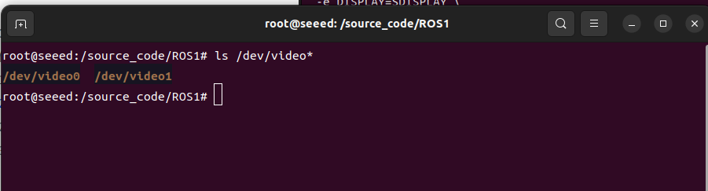

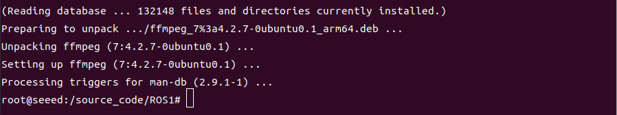

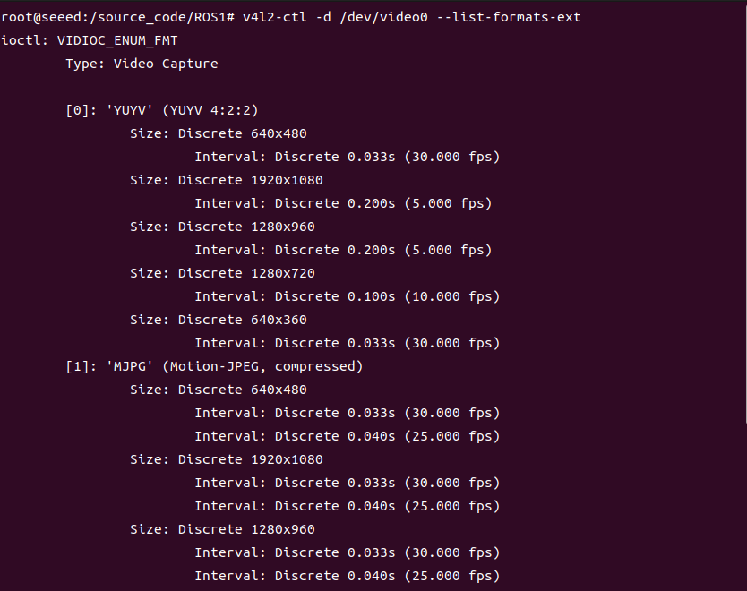

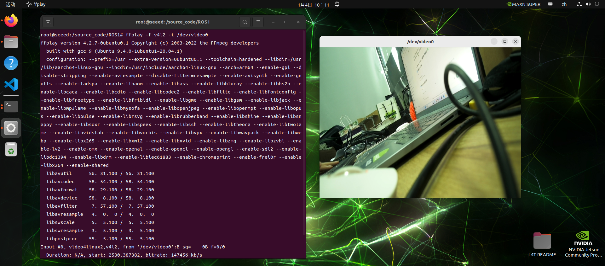

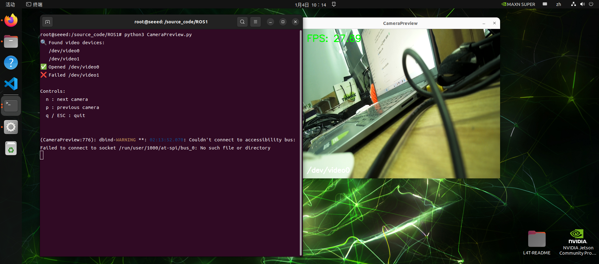


# 7.2.2.3 QR Codes

## Introduction to 1 QR Code

QR code is one of the two-dimensional barcodes, and QR comes from the acronym "Quick Response" in English, which means rapid response, and comes from an inventor's hope that the QR code will be decoded quickly. The QR code is not only of high information capacity, reliability and cost, but also indicates that multiple textual information, such as Chinese characters and images, are confidential and false and are easily used. More importantly, the QR code technology is open source.

## Introduction to QR

### Characteristics of QR code

Data values in QR code contain duplicate information (redundancy values). Thus, even if up to 30 per cent of the two-dimensional code structure is destroyed, it does not affect the readability of the two-dimensional code. The storage space for the QR code is as much as 7089 bits or 4296 characters, including punts and special characters, all written into the QR code. In addition to numbers and characters, it is possible to encode words and phrases (such as web sites). The code structure becomes more complex as more data are added to the QR code and the size of the code increases.

### QR 2D code creation and recognition

Installation dependency:

Code file: [7-2-2-3-qr-codes-install-deps.sh](./code/7-2-2-3-qr-codes-install-deps.sh)
```bash
sudo apt update
sudo apt install -y python3-pip libzbar-dev
python3 -m pip install qrcode pyzbar
```


Creates an qrcode object, which can directly run qr code create.py scripts in the directory:

```bash
python3 qrcode_create.py
```

A two-dimensional code (QR-code) with a set logo is generated in the figure folder in the working directory. The location of the preset logo picture is also in the figure folder. The effect of the 2D code generated is as follows:


qrcode create.py's source code is as follows:

Code file: [7-2-2-3-qr-codes-create.py](./code/7-2-2-3-qr-codes-create.py)
```python
#!/usr/bin/env python3
import os
import qrcode
from PIL import Image
from pathlib import Path


def add_logo(img, logo_path):
    # Add logo, open logo image
    icon = Image.open(    logo_path)
    img_w, img_h = img.size
    # Set the size of the logo
    factor = 6
    size_w = int(img_w / factor)
    size_h = int(img_h / factor)
    icon_w, icon_h = icon.size
    if icon_w > size_w: icon_w = size_w
    if icon_h > size_h: icon_h = size_h
    # Resize the logo
    icon = icon.resize((icon_w, icon_h), Image.Resampling.LANCZOS)
    # Center the logo
    w = int((img_w - icon_w) / 2)
    h = int((img_h - icon_h) / 2)
    # Paste the logo
    img.paste(icon, (w, h), mask=None)
    return img


def create_qrcode(data, file_name, logo_path):
    '''
    version: Integer from 1 to 40, controls the size of the QR code.
    error_correction: Controls the error correction function. Can be one of the following:
        ERROR_CORRECT_L: About 7% or fewer errors can be corrected.
        ERROR_CORRECT_M (default): About 15% or fewer errors can be corrected.
        ERROR_CORRECT_H: About 30% or fewer errors can be corrected.
    box_size: Controls the number of pixels in each box of the QR code.
    border: Controls the number of boxes for the border (the default is 4).
    '''
    qr = qrcode.QRCode(
        version=1,
        error_correction=qrcode.constants.ERROR_CORRECT_H,
        box_size=10,
        border=4)
    # Add data to the QR code
    qr.add_data(data)
    print(data)
    qr.make(fit=True)
    img = qr.make_image(fill_color="green", back_color="white")
    # Add logo if file exists
    if Path(logo_path).is_file():
        img = add_logo(img, logo_path)
    # Save and show the image
    img.save(file_name)
    img.show()
    return img


if __name__ == '__main__':
    file_path = "./figures"
    logo_path = file_path + "/seeed_logo.png"
    out_img = file_path + '/seeed_logo_qr.jpg'
    text = input("Please enter:")
    create_qrcode(text, out_img, logo_path)
```

The parameters for creating QR-code mean the following:

Code file: [7-2-2-3-qr-codes-example-03.py](./code/7-2-2-3-qr-codes-example-03.py)
```python
'''
    Parameters:
    version：integer from 1 to 40 that controls QR-code size.
             use None with fit if you want the library to choose automatically.
    error_correction：controls QR-code error correction.
    ERROR_CORRECT_L：about 7% or fewer errors can be corrected.
    ERROR_CORRECT_M (default): about 15% or fewer errors can be corrected.
    ROR_CORRECT_H：about 30% or fewer errors can be corrected.
    box_size：controls the pixel size of each QR-code cell.
    border：controls the border width in cells; the default 4 is the standard minimum.
    '''
```

When you generate a 2-dimensional code, you can print it out (A4-size enough) for the 2-dimensional recognition test.

The recognized function code segments are as follows:

Code file: [7-2-2-3-qr-codes-example-04.py](./code/7-2-2-3-qr-codes-example-04.py)
```python
def decodeDisplay(image, font_path):
    gray = cv.cvtColor(image, cv.COLOR_BGR2GRAY)
    # Convert decoded text to Unicode before drawing it on the image.
    barcodes = pyzbar.decode(gray)
    for barcode in barcodes:
        # Extract the QR code bounding box.
        (x, y, w, h) = barcode.rect
        # Draw the barcode bounding box on the image.
        cv.rectangle(image, (x, y), (x + w, y + h), (225, 0, 0), 5)
        encoding = 'UTF-8'
        # Convert the decoded bytes to a string before drawing.
        barcodeData = barcode.data.decode(encoding)
        barcodeType = barcode.type
        # Draw the decoded data and type on the image.
        pilimg = Image.fromarray(image)
        # Create a drawing object.
        draw = ImageDraw.Draw(pilimg)
        # Parameter 1: font file path. Parameter 2: font size.
        fontStyle = ImageFont.truetype(font_path, size=12, encoding=encoding)
        # Parameter 1: text position. Parameter 2: text. Parameter 3: text color. Parameter 4: font.
        draw.text((x, y - 25), str(barcode.data, encoding), fill=(255, 0, 0), font=fontStyle)
        # Convert the PIL image back to an OpenCV image.
        image = cv.cvtColor(np.array(pilimg), cv.COLOR_RGB2BGR)
        # Print barcode data and type to the terminal.
        print("[INFO] Found {} barcode: {}".format(barcodeType, barcodeData))
    return image
```


In the qr code recognition directory, initiate the detection of the 2-dimensional code:

```python
qrcode_parsing_usb.py
```

The results of the tests are illustrated below, and a test box is drawn after the 2D code is identified.

## Figures

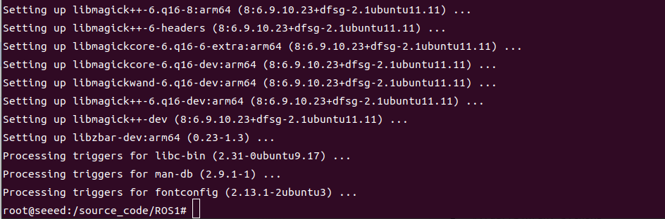

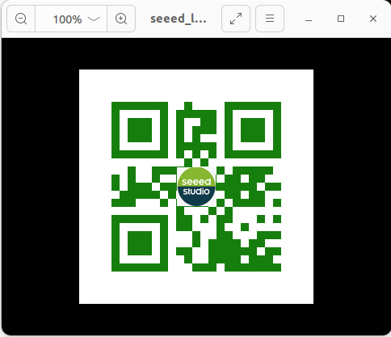

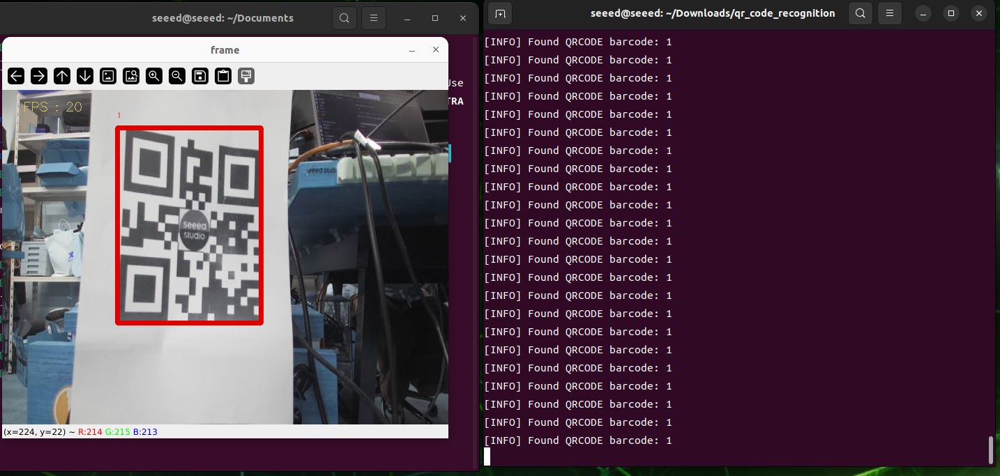


# 7.2.2.4 Human Pose Estimation

## Human Pose Estimation


## Introduction

Human Posture Assessment is a computer-based visual technology designed to automatically identify and locate the location of key human joints through images or videos and to model the bone structure of the human body. Human Pose Estimation, which are widely applied in the areas of action identification, intelligent surveillance, human interaction, motor analysis, rehabilitation and virtual reality, are key technologies for connecting “seeing the human body” and “understanding human behaviour”.


## II. Rationale


First, the human images entered are sent to the volume neural network (CNN) for characterization, with high-level semantic profiles; The network structure was then divided into two branches, one for predicting Part Confidence Maps (Keypoint Confidence Chart), for showing the probability distribution of positions in space for individual human joints, and the other for predicting Part Affinity Fields (PAFs, Body Associated Fields), for describing links and directional information between different joints in a vector form. Based on the confidence map, which detects the candidate node, and using the directional consistency information provided by PAF, model the connection between the nodes as the bipartite Matching problem in the diagram, by matching the joint nodes that belong to the same person correctly and gradually building the complete human skeleton. Further, it is estimated that multi-person gestures can be considered as a multi-Person Parsing problem, which translates multi-point connections into graphic matching issues, and uses the classic two-dimensional matching method, such as the Hungarian Algorithm, to find the best joint nodes combination and thus achieve accurate and stable estimates of multiple human gestures.

## Commencement of proceedings

### Access to ROS 1 docker mirrors

```bash
sudo docker run -it \
  --net=host \
  --privileged \
  -v /dev:/dev \
  -v /tmp/.X11-unix:/tmp/.X11-unix \
  -e DISPLAY=$DISPLAY \
  -e QT_X11_NO_MITSHM=1 \
  ros:noetic
```

Installation Dependence

```bash
apt-get update
apt-get install -y libatlas-base-dev libprotobuf-dev protobuf-build
apt-get install python3-pip
pip install \
  https://files.pythonhosted.org/packages/c0/b7/20228024ef7bcfaa9cad2cb2514f3f7cc7a2c2c16715dc65cb01c793693c/mediapipe-0.10.9-cp38-cp38-manylinux_2_17_aarch64.manylinux2014_aarch64.whl

# Check whether the installation succeeded.
python3 -c "import mediapipe as mp; print(mp.__version__)"
```


### Use of pictures for reasoning

Enter code file directory, run code script

```bash
cd sources_code/ROS 1
python3 target_pose_img.py
```


### Use of video imagery reasoning

Run code script

```bash
```

## Figures

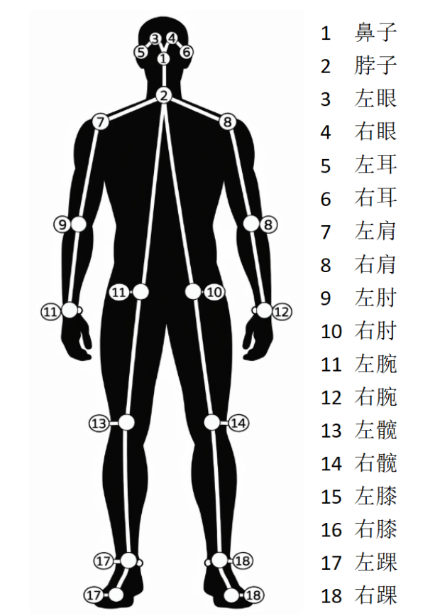

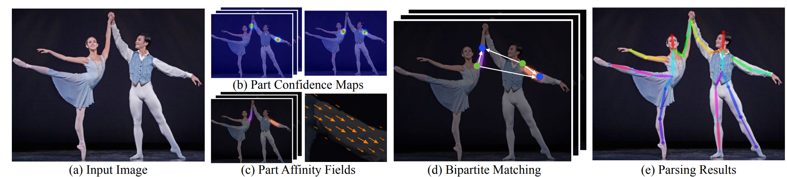

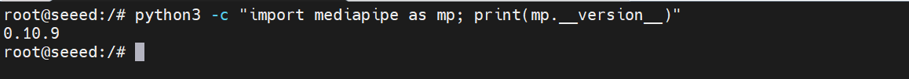


# 7.2.2.5 Object Detection

## Object Detection

In in-depth learning, Target Detection is one of the core tasks of computer visualization and is designed to identify and mark all interested objects in the image. Common methods fall into two main categories:

Two-stage testing:
Method of representation is R-CNN, Fast R-CNN, Fast R-CNN. Mr. Region Products, then classify and return each candidate area. These methods are highly accurate, but are relatively slow and suitable for scenarios that require high accuracy.

One-stage testing:
The method of representation is YOLO (You Only Look Once), SSD (Single Shot MultiBox Detector). The object categories and boundary frames are projected directly on the feature maps without the need to generate candidate areas at a fast pace suitable for real-time detection, but with an early accuracy of slightly less than two stages.


This title will demonstrate how to use the dnn module of OpenCV to achieve the target test


## Start Program

### Pictures of reasoning

Enter code directory, run scripts

```bash
cd sources_code/ROS 1
python3 target_detect_img.py
```


### Logical cameras

Enter code directory, run scripts

```bash
cd sources_code/ROS 1
python3 target_detect_video.py
```

# 7.2.2.6 AR Vision

## AR Visual

Enhanced reality (AR, Augmented Reality) refers to the use of computer-based visual technology to superimpose virtual information or three-dimensional models in real time into images or videos of the real world, thereby enhancing user perception and interactive experience of the environment. It achieves spatial alignment and real-time interaction between virtual objects and the real world through video capture of real-life scenarios, combined with technology such as target detection, feature-point tracking and depth estimation, and is widely used in areas such as play and entertainment, industrial design, education training and navigation.


## Enter ROS 1 Docker Mirror

```bash
sudo docker run -it \
  --net=host \
  --privileged \
  -v /dev:/dev \
  -v /tmp/.X11-unix:/tmp/.X11-unix \
  -e DISPLAY=$DISPLAY \
  -e QT_X11_NO_MITSHM=1 \
  ros:noetic
```


## Camera marked.


ROS officially provides a camera calibration package to easily mark USB cameras:

```bash
apt install ros-noetic-camera-calibration
apt install ros-noetic-usb-cam
```


### Launch USB camera nodes

```bash
roslaunch usb_cam usb_cam-test.launch
```


### Preparation of pallets

Download and print tablets for A4 size

### Commence marking nodes

Open another terminal into the docker mirror for ROS 1, run the marked nodes

```bash
sudo docker run -it \
  --net=host \
  --privileged \
  -v /dev:/dev \
  -v /tmp/.X11-unix:/tmp/.X11-unix \
  -e DISPLAY=$DISPLAY \
  -e QT_X11_NO_MITSHM=1 \
  ros:noetic

  rosrun camera_calibration cameracalibrator.py \
  --size 8x6 --square 0.025 image:=/usb_cam/image_raw camera:=/usb_cam
```

Parameter description:

--size 8x6: Number of internal angles (column x row) (8x6 = 48 angles of a 9x7 grid)

--square 0.025: each square long, unit m (24mm)

Image topic

Camera: =/usb_cam: Camera Namespace


Mark Interface

X: Left and right movement of chess grids in camera view

Y: Chess panes moving up and down in camera view

Size: Back and forth of the board in the camera view

Skew: Chess pane tilted in camera view

After a successful start, the board is placed in the center of the picture, changing positions. The system will be self-identified, the best being that the lines below X, Y, Size, Skew are filled as much as possible with data collection from red to yellow.

Click on the Calibrate to calculate the inside of the camera, which shows that the interface may show no response, but the terminal still has an output and wait!


After a successful calculation, the terminal displays the parameters of the camera and click SAVE to save the camera parameters.


The result will be stored by default at /tmp/calibrationdata.tar.gz

Depress it and move to tag parameters. yaml files to script code directory

```bash
mv tmp/ost.yaml /source_code/ROS 1/sources
```


### Run Script

Run the AR script in the ROS 1 Docker container:

```bash
python3 simple_AR.py
```

Code file: [7-2-2-6-ar-vision-example-01.py](./code/7-2-2-6-ar-vision-example-01.py)
```python
#!/usr/bin/env python3
# simple_AR.py
# common lib
import os
import sys
import time
import cv2 as cv
import numpy as np
import yaml

print("import done")

cv_edition = cv.__version__
print("cv_edition: ",cv_edition)

def load_camera_from_ost(yaml_path: str):
    with open(yaml_path, 'r') as f:
        params = yaml.safe_load(f)
    camera_data = params['camera_matrix']['data']
    dist_data = params['distortion_coefficients']['data']
    camera_matrix = np.array(camera_data, dtype=np.float32).reshape(3, 3)
    dist_coeffs = np.array(dist_data, dtype=np.float32).reshape(-1, 1)
    return camera_matrix, dist_coeffs

def draw_stickman(img, img_pts):
    cv.line(img, tuple(img_pts[18]), tuple(img_pts[4]), (0, 0, 255), 3)
    cv.line(img, tuple(img_pts[18]), tuple(img_pts[6]), (0, 0, 255), 3)
    cv.line(img, tuple(img_pts[18]), tuple(img_pts[21]), (0, 0, 255), 3)
    cv.line(img, tuple(img_pts[21]), tuple(img_pts[19]), (0, 0, 255), 3)
    cv.line(img, tuple(img_pts[21]), tuple(img_pts[20]), (0, 0, 255), 3)
    cv.line(img, tuple(img_pts[21]), tuple(img_pts[22]), (0, 0, 255), 3)
    cv.circle(img, tuple(img_pts[22]), 15, (0, 0, 255), -1)
    cv.line(img, tuple(img_pts[74]), tuple(img_pts[72]), (0, 255, 0), 3)
    cv.line(img, tuple(img_pts[74]), tuple(img_pts[73]), (0, 255, 0), 3)
    cv.line(img, tuple(img_pts[74]), tuple(img_pts[37]), (0, 255, 0), 3)
    cv.line(img, tuple(img_pts[37]), tuple(img_pts[76]), (0, 255, 0), 3)
    cv.line(img, tuple(img_pts[37]), tuple(img_pts[77]), (0, 255, 0), 3)
    cv.line(img, tuple(img_pts[37]), tuple(img_pts[75]), (0, 255, 0), 3)
    cv.circle(img, tuple(img_pts[75]), 15, (0, 255, 0), -1)
    return img

def main():
    print("start")

    pattern_size = (8,6)
    yaml_path = os.path.join(os.path.dirname(__file__), 'sources', 'ost.yaml')
    camera_matrix, dist_coeffs = load_camera_from_ost(yaml_path)

    object_points = np.zeros((pattern_size[0] * pattern_size[1], 3), np.float32)
    object_points[:,:2] = np.mgrid[0:pattern_size[0], 0:pattern_size[1]].T.reshape(-1, 2)

    axis = np.float32([
            [0, 0, -1], [0, 8, -1], [5, 8, -1], [5, 0, -1],
            [1, 2, -1], [1, 6, -1], [4, 2, -1], [4, 6, -1],
            [1, 0, -4], [1, 8, -4], [4, 0, -4], [4, 8, -4],
            [1, 2, -4], [1, 6, -4], [4, 2, -4], [4, 6, -4],
            [0, 1, -4], [3, 2, -1], [2, 2, -3], [3, 2, -3],
            [1, 2, -3], [2, 2, -4], [2, 2, -5], [0, 4, -4],
            [2, 3, -4], [1, 3, -4], [4, 3, -5], [4, 5, -5],
            [1, 2, -3], [1, 6, -3], [5, 2, -3], [5, 6, -3],
            [3, 4, -5], [0, 6, -4], [5, 6, -4], [2, 8, -4],
            [3, 8, -4], [2, 6, -4], [2, 0, -4], [1, 5, -4],
            [3, 0, -4], [3, 2, -4], [0, 3, -4], [1, 2, -4],
            [4, 2, -4], [5, 3, -4], [2, 7, -4], [3, 7, -4],
            [3, 3, -1], [3, 5, -1], [1, 5, -1], [1, 3, -1],
            [3, 3, -3], [3, 5, -3], [1, 5, -3], [1, 3, -3],
            [1, 3, -6], [1, 5, -6], [3, 3, -4], [3, 5, -4],
            [0, 0, -4], [3, 1, -4], [1, 1, -4], [0, 2, -4],
            [2, 4, -4], [4, 4, -4], [0, 8, -4], [5, 8, -4],
            [5, 0, -4], [0, 4, -5], [5, 4, -4], [5, 4, -5],
            [2, 5, -1], [2, 7, -1], [2, 6, -3], [2, 6, -5],
            [2, 5, -3], [2, 7, -3]
            ])

    capture = cv.VideoCapture(0)
    if cv_edition[0] == '3':
        capture.set(cv.CAP_PROP_FOURCC, cv.VideoWriter_fourcc(*'XVID'))
    else:
        capture.set(cv.CAP_PROP_FOURCC, cv.VideoWriter.fourcc('M', 'J', 'P', 'G'))
    capture.set(6, cv.VideoWriter_fourcc('M', 'J', 'P', 'G'))
    capture.set(cv.CAP_PROP_FRAME_WIDTH, 640)
    capture.set(cv.CAP_PROP_FRAME_HEIGHT, 480)

    last_time = time.time()
    fps = 0.0

    while True:
        ret, frame = capture.read()
        if not ret:
            break

        now = time.time()
        fps = 1.0 / max(1e-6, (now - last_time))
        last_time = now
        gray = cv.cvtColor(frame, cv.COLOR_BGR2GRAY)

        retval, corners = cv.findChessboardCorners(
            gray,
            pattern_size,
            None,
            flags=cv.CALIB_CB_ADAPTIVE_THRESH + cv.CALIB_CB_NORMALIZE_IMAGE + cv.CALIB_CB_FAST_CHECK,
        )

        if retval:
            corners = cv.cornerSubPix(
                gray,
                corners,
                (11, 11),
                (-1, -1),
                (cv.TERM_CRITERIA_EPS + cv.TERM_CRITERIA_MAX_ITER, 30, 0.001),
            )
            retval, rvec, tvec, _inliers = cv.solvePnPRansac(
                object_points,
                corners,
                camera_matrix,
                dist_coeffs,
            )
            if retval:
                image_points, _jacobian = cv.projectPoints(
                    axis,
                    rvec,
                    tvec,
                    camera_matrix,
                    dist_coeffs,
                )
                img_pts = np.int32(image_points).reshape(-1, 2)
                frame = draw_stickman(frame, img_pts)

                cv.putText(frame, "AR Active - 2 Stickman", (10, 60), cv.FONT_HERSHEY_SIMPLEX, 0.9, (0, 255, 0), 2)
            else:
                cv.putText(frame, "Pose estimation failed", (10, 60), cv.FONT_HERSHEY_SIMPLEX, 0.9, (0, 0, 255), 2)
        else:
            cv.putText(frame, "No chessboard detected", (10, 60), cv.FONT_HERSHEY_SIMPLEX, 0.9, (0, 0, 255), 2)

        cv.putText(frame, f"FPS: {fps:.1f}", (10, 30), cv.FONT_HERSHEY_SIMPLEX, 1, (0, 255, 0), 2)
        cv.imshow('frame', frame)

        action = cv.waitKey(1) & 0xFF
        if action == ord('q') or action == 113:
            break

    capture.release()
    cv.destroyAllWindows()

if __name__ == "__main__":
    main()
```

## Figures

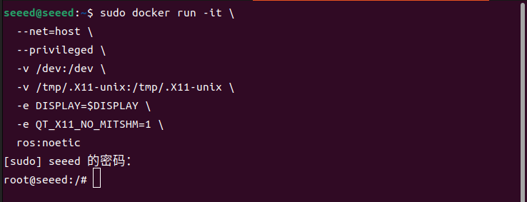

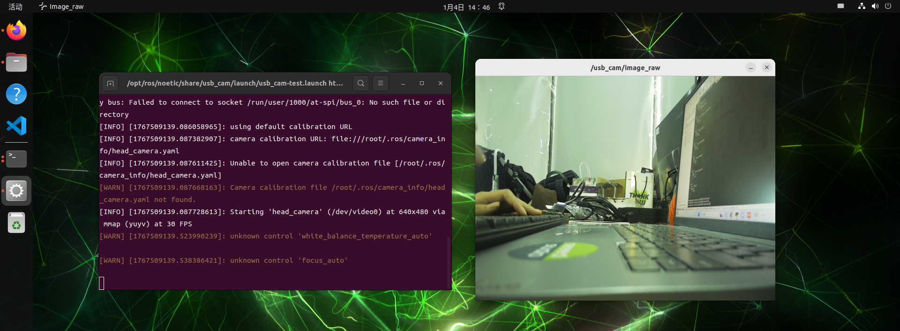

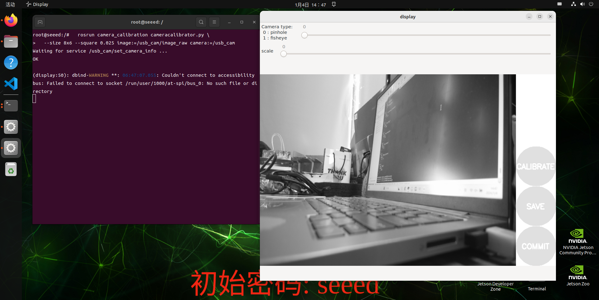

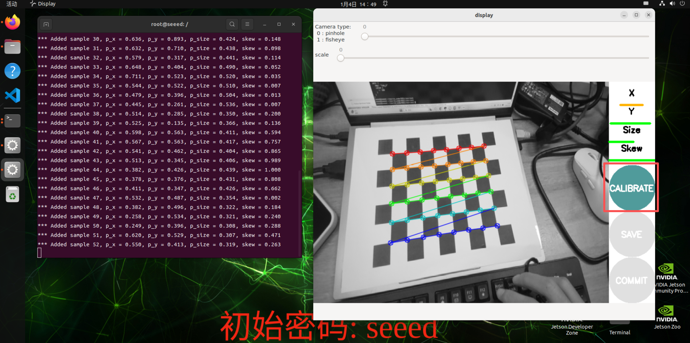

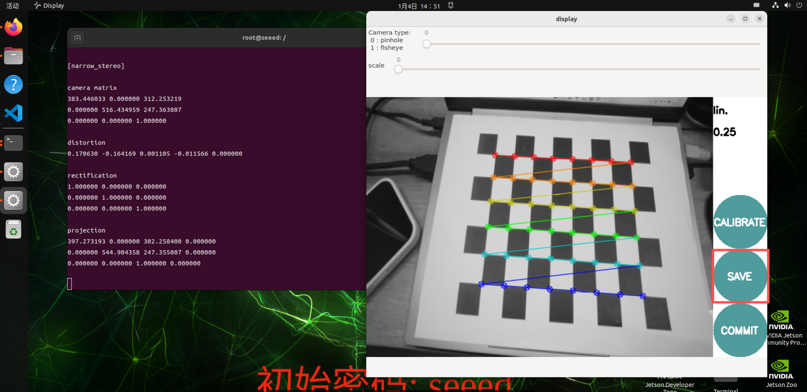

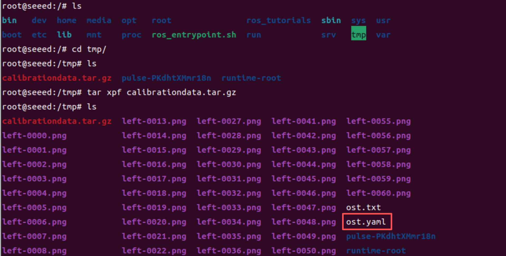

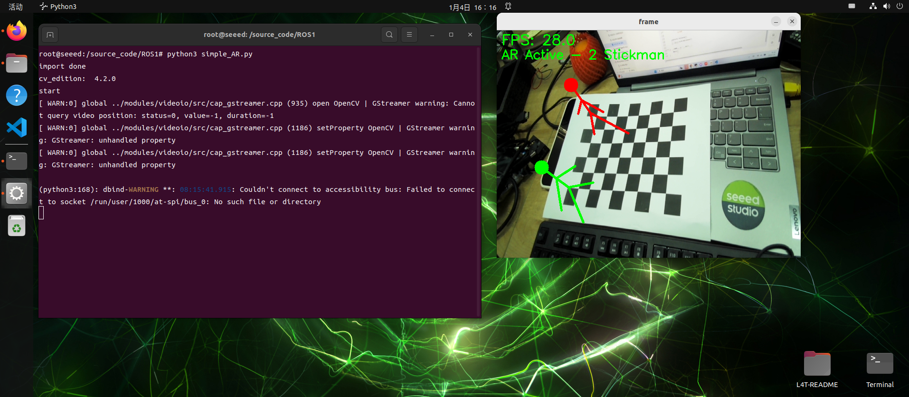


# 7.2.2.7 OpenCV Applications

## OpenCV Application

Opencv apps is a set of functionality packages maintained by the ROS community, which encapsulates a large number of OpenCV image processing and computer visualizations into ROS nodes, allowing the input of a standard topic to be called directly in the ROS system, without having to prepare the OpenCV code itself.


## Start Opencv apps

### Start docker

```bash
sudo docker run -it \
  --name ros_noetic \
  --net=host \
  --privileged \
  -v /dev:/dev \
  -v /tmp/.X11-unix:/tmp/.X11-unix \
  -e DISPLAY=$DISPLAY \
  -e QT_X11_NO_MITSHM=1 \
  ros:noetic
```

### Installation

```bash
apt install ros-noetic-opencv-apps
apt install -y ros-noetic-usb-cam


# Check whether the installation succeeded.
roscd opencv_apps
# Open another terminal.
sudo docker exec -it ros_noetic bash

rosrun opencv_apps face_detection image:=/usb_cam/image_raw
```

### Activate camera

```bash
roslaunch usb_cam usb_cam-test.launch
```

### Use Opencv apps

Only one function can be run at a time. The command needs to be run after the camera is activated:

```bash
roslaunch opencv_apps face_recognition.launch image:=/usb_cam/image_raw          # Face recognition
roslaunch opencv_apps corner_harris.launch image:=/usb_cam/image_raw             # Harris corner detection
roslaunch opencv_apps camshift.launch image:=/usb_cam/image_raw                  # Object tracking
roslaunch opencv_apps contour_moments.launch image:=/usb_cam/image_raw           # Contour moments
roslaunch opencv_apps convex_hull.launch image:=/usb_cam/image_raw               # Convex hull
roslaunch opencv_apps discrete_fourier_transform.launch image:=/usb_cam/image_raw # Discrete Fourier transform
roslaunch opencv_apps edge_detection.launch image:=/usb_cam/image_raw            # Edge detection
roslaunch opencv_apps face_detection.launch image:=/usb_cam/image_raw            # Face detection
roslaunch opencv_apps fback_flow.launch image:=/usb_cam/image_raw                # Optical flow detection
roslaunch opencv_apps find_contours.launch image:=/usb_cam/image_raw             # Contour detection
roslaunch opencv_apps general_contours.launch image:=/usb_cam/image_raw          # General contour detection
roslaunch opencv_apps goodfeature_track.launch image:=/usb_cam/image_raw         # Feature point tracking
roslaunch opencv_apps hls_color_filter.launch image:=/usb_cam/image_raw          # HLS color filtering
roslaunch opencv_apps hough_circles.launch image:=/usb_cam/image_raw             # Hough circle detection
roslaunch opencv_apps hough_lines.launch image:=/usb_cam/image_raw               # Hough line detection
roslaunch opencv_apps hsv_color_filter.launch image:=/usb_cam/image_raw          # HSV color filtering
roslaunch opencv_apps lk_flow.launch image:=/usb_cam/image_raw                   # LKoptical flow algorithm
roslaunch opencv_apps people_detect.launch image:=/usb_cam/image_raw             # People detection
roslaunch opencv_apps phase_corr.launch image:=/usb_cam/image_raw                # Phase correlation displacement detection
roslaunch opencv_apps pyramids.launch image:=/usb_cam/image_raw                  # Image pyramid
roslaunch opencv_apps rgb_color_filter.launch image:=/usb_cam/image_raw          # RGB color filtering
roslaunch opencv_apps segment_objects.launch image:=/usb_cam/image_raw           # Foreground segmentation
roslaunch opencv_apps simple_flow.launch image:=/usb_cam/image_raw               # Simple optical flow
roslaunch opencv_apps smoothing.launch image:=/usb_cam/image_raw                 # Smoothing filter
roslaunch opencv_apps threshold.launch image:=/usb_cam/image_raw                 # Thresholding
roslaunch opencv_apps watershed_segmentation.launch image:=/usb_cam/image_raw    # Watershed segmentation
```

### Preview

Activate the camera and activate one of the Opencv apps features to view the image in the following way.

### Local access

Enter the following command and select the corresponding topic to see the effect:

rqt image view

### LAN viewing

Under the same local area network, enter IP:port (8080) in the browser, for example:

192.168.7.47:8080 # IP refers to host IP

## References

wiki: http://wiki.ros.org/opencv_apps

Source: https://github.com/ros-perception/opencv_apps.git

Most of the codes were originally taken from https://github.com/Itseez/opencv/tree/master/samples/cpp.

# 7.2.2.8 ROS + OpenCV Fundamentals

## Function Overview

ROS has already assembled OpenCV (3.x and above) during installation, and the images are transmitted in RS in sensor msgs/Image message format and cannot be processed directly with OpenCV. To this end, ROS provides cv bridge for:

An efficient conversion between ROS Image ↔ OpenCV Mat (nompy array) is the central bridge for ROS image processing.

## Functional package dependent configuration

### package.xml

Code file: [7-2-2-8-ros-plus-opencv-fundamentals-package.xml](./code/7-2-2-8-ros-plus-opencv-fundamentals-package.xml)
```bash
<?xml version="1.0"?>
<package format="2">
  <name>ros_opencv_demo</name>
  <version>0.0.1</version>
  <description>
    ROS + OpenCV sample package that uses cv_bridge to subscribe to USB camera images and process them with OpenCV.
  </description>

  <!-- maintainer information -->
  <maintainer email="you@example.com">your_name</maintainer>

  <!-- open-source license -->
  <license>BSD</license>

  <!-- build tool -->
  <buildtool_depend>catkin</buildtool_depend>

  <!-- ================= core dependencies ================= -->

  <!-- Python / ROS -->
  <depend>rospy</depend>

  <!-- ROS messages -->
  <depend>std_msgs</depend>
  <depend>sensor_msgs</depend>

  <!-- image-related dependencies -->
  <depend>cv_bridge</depend>
  <depend>image_transport</depend>

  <!-- Optional: enable this if you use PCL later. -->
  <!-- <depend>pcl_ros</depend> -->

  <!-- ================= optional exports ================= -->
  <export>
  </export>

</package>
```

### CMakeLists.txt (Python node minimised)

Code file: [7-2-2-8-ros-plus-opencv-fundamentals-example-02.cmake](./code/7-2-2-8-ros-plus-opencv-fundamentals-example-02.cmake)
```bash
cmake_minimum_required(VERSION 3.0.2)
project(ros_opencv_demo)
find_package(catkin REQUIRED COMPONENTS
  roscpp
  rospy
  std_msgs
  sensor_msgs
  cv_bridge
  image_transport
)
catkin_package()
include_directories(
  ${catkin_INCLUDE_DIRS}
)
```

## Start USB camera node

```bash
# Install dependencies if needed.
apt install -y ros-noetic-usb-cam
roslaunch usb_cam usb_cam-test.launch
```

## Colour Image Subscription Node (full code)

File name: usb_cam_image.py

Code file: [7-2-2-8-ros-plus-opencv-fundamentals-usb_cam_image.py](./code/7-2-2-8-ros-plus-opencv-fundamentals-usb_cam_image.py)
```bash
#!/usr/bin/env python3

import rospy
import cv2
from sensor_msgs.msg import Image
from cv_bridge import CvBridge, CvBridgeError


class UsbCamImageNode:
    def __init__(self):
        rospy.init_node("usb_cam_image_node", anonymous=True)

        self.bridge = CvBridge()

        # subscribe to USB camera images
        self.image_sub = rospy.Subscriber(
            "/usb_cam/image_raw",
            Image,
            self.image_callback,
            queue_size=1
        )

        rospy.loginfo("USB Camera Image Subscriber Started")

    def image_callback(self, msg):
        try:
            # ROS Image → OpenCV BGR
            frame = self.bridge.imgmsg_to_cv2(msg, desired_encoding="bgr8")
        except CvBridgeError as e:
            rospy.logerr(e)
            return

        # display the image
        cv2.imshow("USB Camera Image", frame)
        cv2.waitKey(1)


if __name__ == "__main__":
    try:
        UsbCamImageNode()
        rospy.spin()
    except rospy.ROSInterruptException:
        pass
    finally:
        cv2.destroyAllWindows()
```


### Grant enforcement powers

```bash
chmod +x usb_cam_image.py
cd /ros_ws
catkin_make
```

## Run Example

Install Multi- Terminal Tool

```bash
apt-get install terminator
# Run
terminator
```

Open another terminal horizontally using the ctrl + Shift + o shortcut in the popup terminal interface

### Terminal 1: Launch camera.

# Roslaunch usb cam usb cam-test.launch

### Terminal 2: Run Subscription Node

rosrun ros opencv demo usb_cam_image.py

You will see an OpenCV window showing USB cameras in real time.


## View Node Communications

Start another terminal operation:

```bash
rqt_graph
```

## Figures

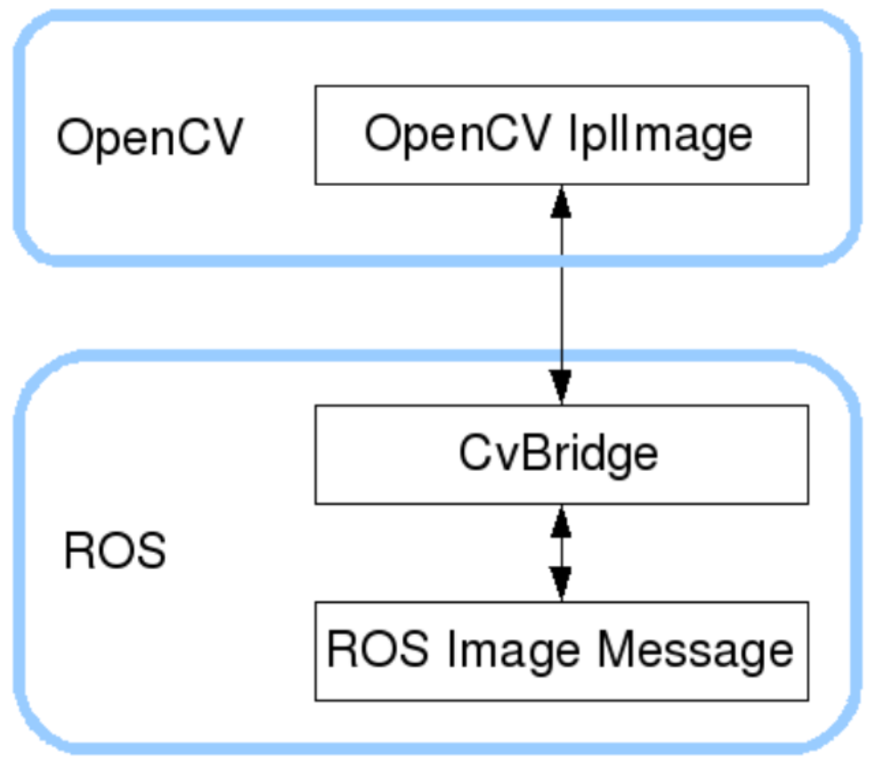

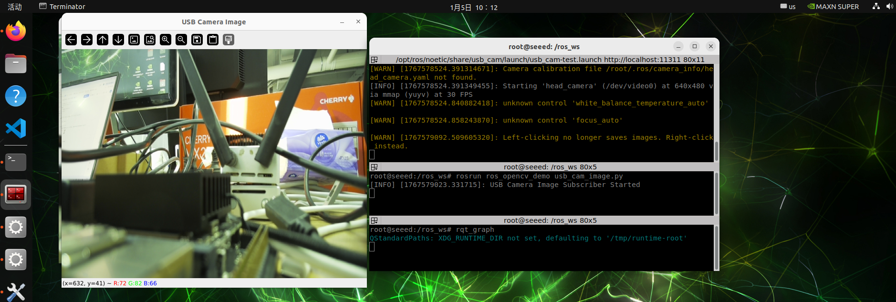

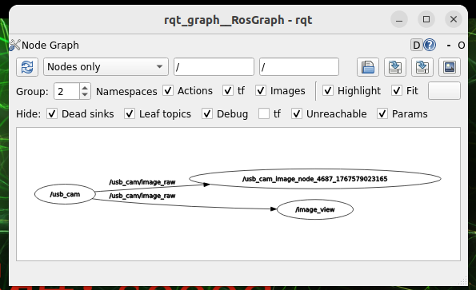


# 7.2.2.9 MediaPipe Development

## MediaPipe Introduction

MediaPipe is a high-performance cross-platform sensor calculation framework for the open-source Google dedicated to the construction of real-time visual and multi-modular treatment current lines. It is used extensively for such tasks as human attitude estimation, hand recognition, human face detection and key point tracking, by means of a graphic calculation (Graph), which links the modules of camera input, model reasoning and reprocessing efficiently. MediaPipe incorporates a variety of light quantitative depth learning models that support CPU real-time reasoning and are very friendly to embedded platforms (e.g. Jetson, mobile) and developers can quickly achieve stable, low-delayed real-time sensory applications with a small number of codes.


Deep learning solutions in MediaPipe


Click on a picture to view the complete spreadsheet

## Start docker

```bash
sudo docker run -it \
  --net=host \
  --privileged \
  -v /dev:/dev \
  -v /tmp/.X11-unix:/tmp/.X11-unix \
  -e DISPLAY=$DISPLAY \
  -e QT_X11_NO_MITSHM=1 \
  ros:noetic
```

## Case used

### Hand test

```bash
cd sources_code/ROS 1/mediapipe
python3 hand.py
```


## Face check.

```bash
cd sources_code/ROS 1/mediapipe
python3 face_detection.py
```


## Face effects.

```bash
cd sources_code/ROS 1/mediapipe
python3 face_effect.py
```


## D Object Identification

```bash
cd sources_code/ROS 1/mediapipe
python3 object_reg.py
```


## Brush

```bash
cd sources_code/ROS 1/mediapipe
python3 virtual_brush.py
```


## Gear recognition.

```bash
cd sources_code/ROS 1/mediapipe
python3 gesture_recognition.py
```


### Finger control.

```bash
cd sources_code/ROS 1/mediapipe
python3 hand_control.py
```


## Posturing

```bash
cd sources_code/ROS 1/mediapipe
python3 pose_estimation.py
```


## Face test

```bash
cd sources_code/ROS 1/mediapipe
python3 face_mesh.py
```


## Overall testing

```bash
cd sources_code/ROS 1/mediapipe
python3 holistic.py
```


## Case Split

```bash
cd sources_code/ROS 1/mediapipe
python3 selfie_segmentation.py
```

## Figures

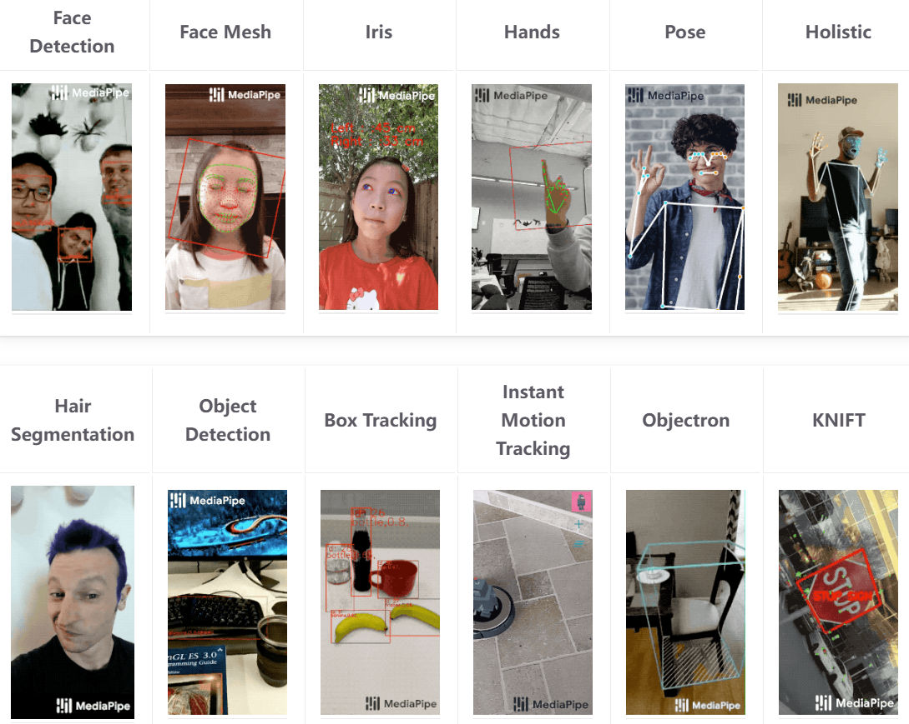

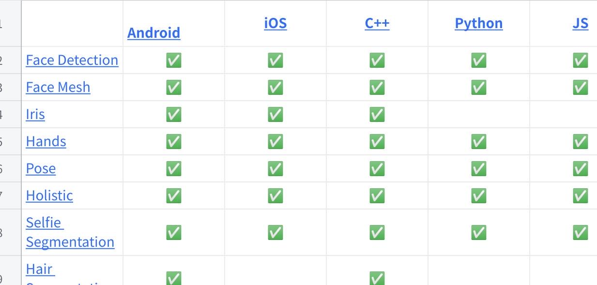

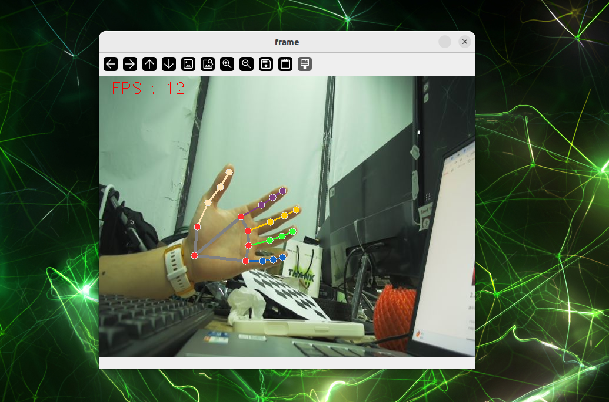

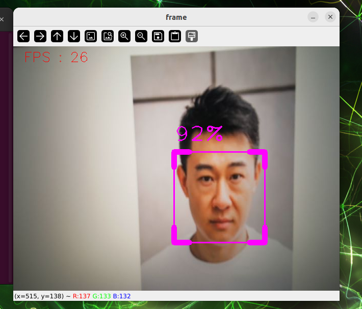

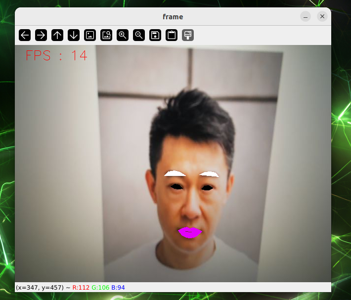

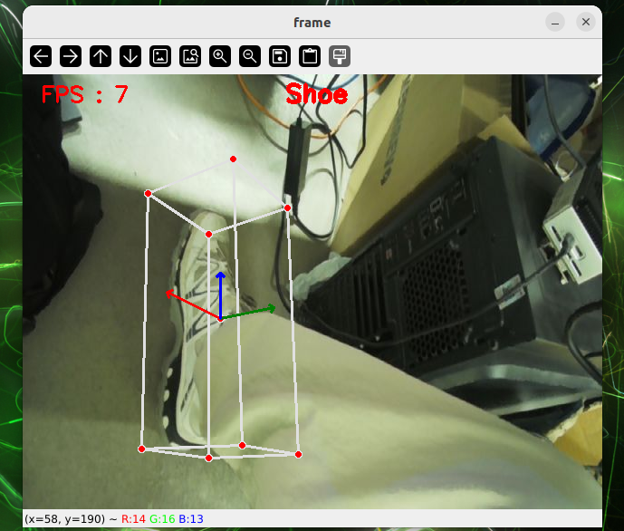

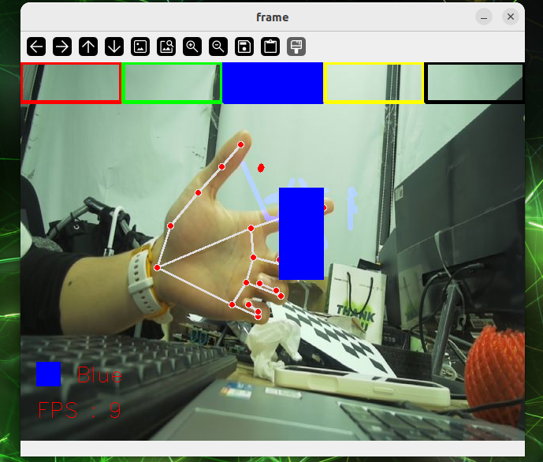

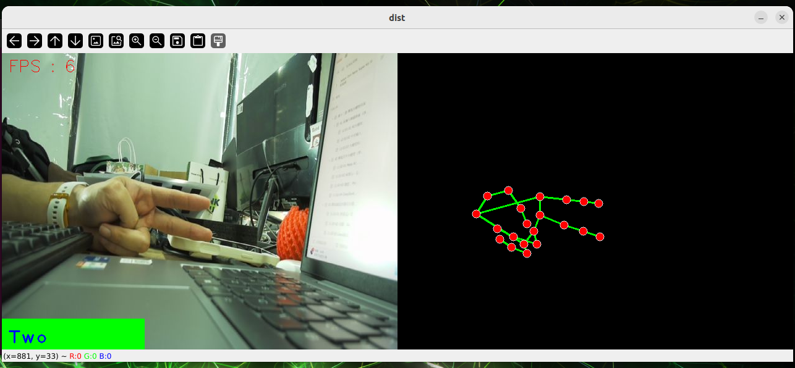

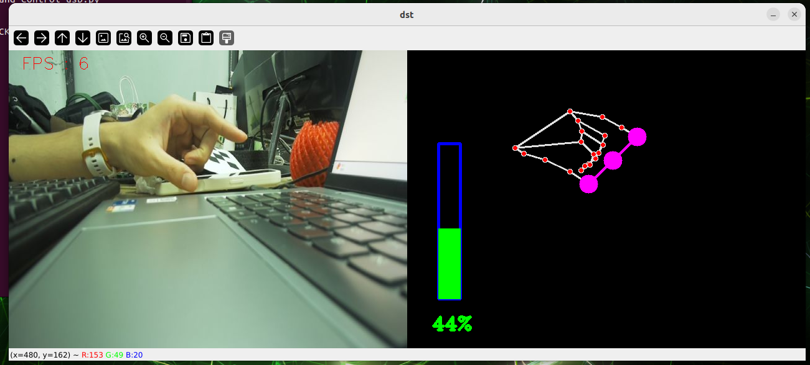

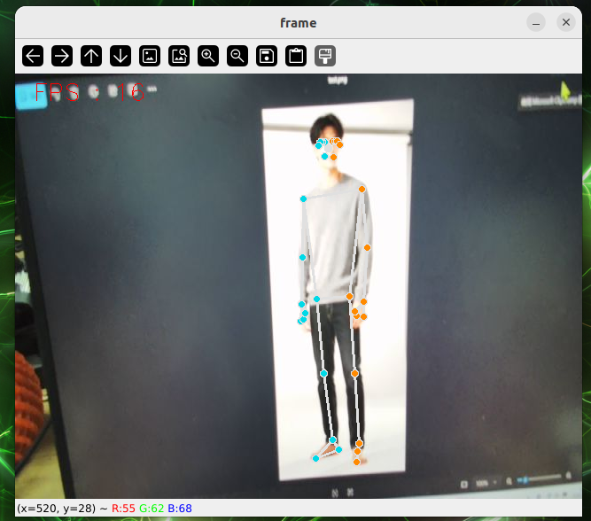

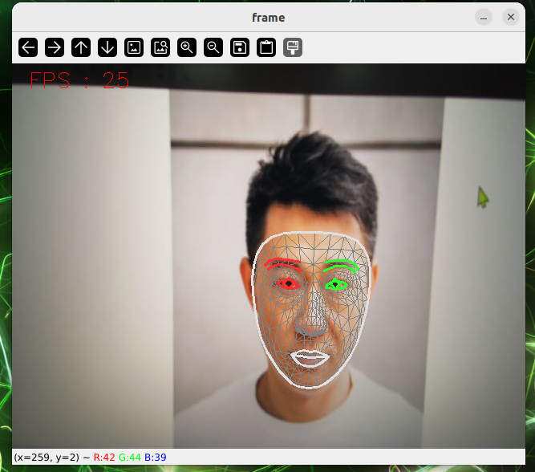

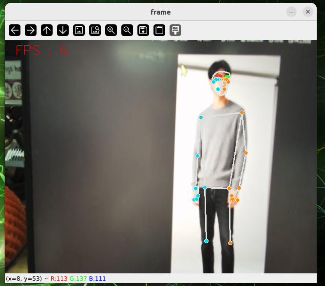

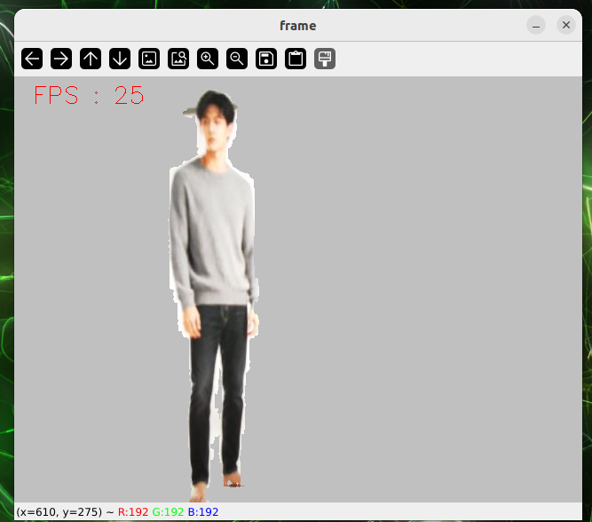
