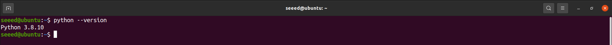
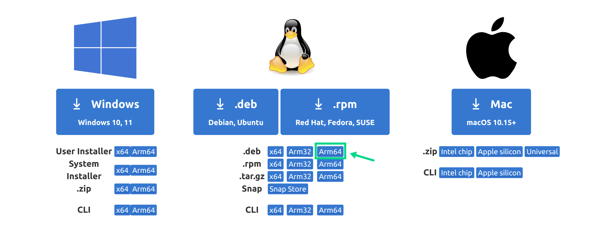
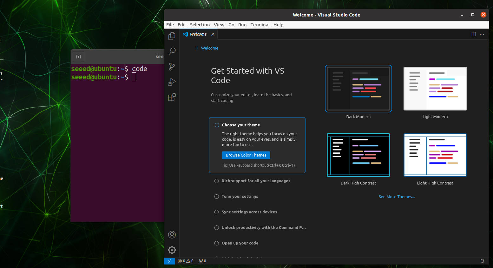
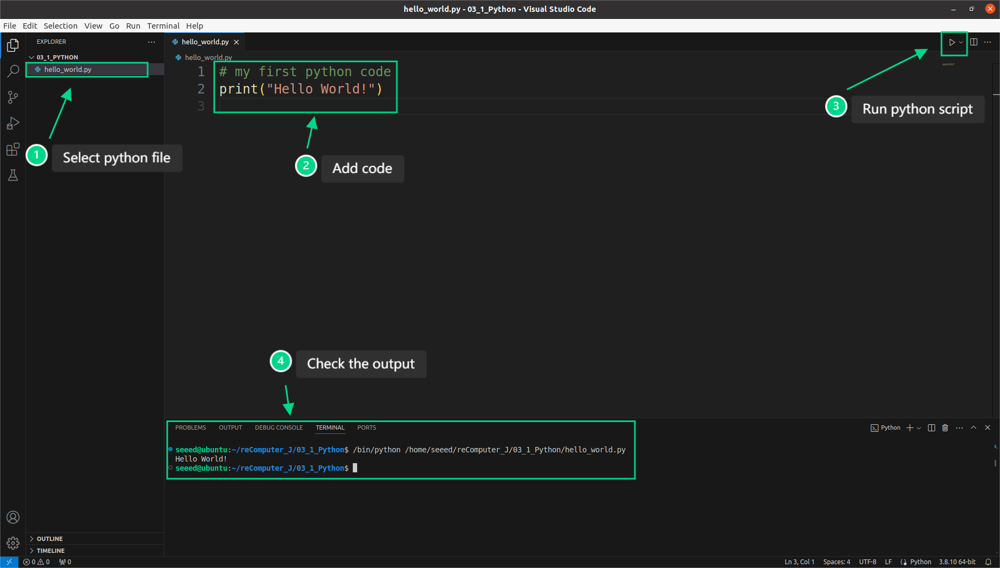

# Python and Programming Fundamentals

A programming language is a formal language used to communicate with computers. Developers write instructions that enable computers to perform specific tasks. Among the many programming languages, Python is particularly popular due to its simplicity, ease of learning, powerful features, and wide range of applications. It excels in fields such as data science, artificial intelligence, and web development.

<p align="center">
  <a href="https://www.python.org/">
    
  </a>
</p>

In this section, we will learn how to set up the Python programming environment on reComputer and create and run our first Python script on reComputer. Additionally, we have compiled a list of excellent open-source Python learning resources for you to choose from based on your needs.

To complete the experiments in this section, you should be familiar with basic Linux commands and have a reComputer device with Nvidia Jetpack 5.1.1 installed.


## Setting Up the Programming Environment

The Nvidia Jetpack 5.1.1 operating system comes pre-installed with Python 3.8. We can open the Jetson terminal and enter the command `python --version` to check the Python version.



For convenient learning and development, it is recommended to install Microsoft's free source code editor, Visual Studio Code (VSCode).

**Step 1:** Visit the official VSCode website to download the installer.



> Please note that the Nvidia Jetson's CPU is an `Arm64` architecture, so we need to download the Arm64 version of the installer.

**Step 2:** Open a terminal in the directory containing the installer package and use the dpkg command to install the deb file:

```bash
cd <dir-of-deb>
# For example: cd Downloads
sudo dpkg -i code_xxxx_amd64.deb
# For example: sudo dpkg -i code_1.60.0-1630504426_amd64.deb
```

**Step 3:** After the installation is complete, we can start VSCode in the terminal with the following command:

```bash
code
```



> Please refer to [this](https://code.visualstudio.com/docs) for more configuration information on VSCode.


## Hello World

The first demo in most programming language courses is typically printing "hello world" in the terminal. This course is no exception. Please follow the tutorial below to create and run our first Python script on Jetson.

**Step 1:** Create the first Python script for this course in the root directory:

```bash
mkdir -p ~/reComputer_J/3.1_Python
touch ~/reComputer_J/3.1_Python/hello_world.py
```

**Step 2:** Open VSCode in the directory where the script is located:

```bash
cd ~/reComputer_J/3.1_Python
code .
```

**Step 3:** In the left navigation bar, we can see `hello_world.py`. Enter the following code in the python file:

```bash
# Our first python code
print("Hello, World!")
```


> Explain the code:
> - `# Our first python code:` This is a comment, used to help read and understand the code.
> - `print():` This is a built-in Python function used to display information on the console.
> - `"Hello, World!":` This is a string, a data type used to store and manipulate text.


**Step 4:** Click the run button to see the result of the Python script in the terminal. 



If you see `Hello, World!` printed in the terminal, you have successfully run your first Python program.

## Python Basic Syntax

Due to space constraints, we cannot list all Python syntax here. Fortunately, there are many excellent open-source tutorials on the internet about Python. If you need a deeper understanding of Python syntax, please refer to:

| **Tutorial** | **Type** | **Description** |
|:---------:|:---------:|:---------:|
| [Python Tutorial - Python Full Course for Beginners](https://www.youtube.com/watch?v=_uQrJ0TkZlc) | video | A beginner-friendly Python video tutorial, where the author spends six hours covering common Python syntax.
 |
| [python-course.eu](https://python-course.eu/python-tutorial/) | doc | Provides a comprehensive and in-depth introduction to the Python language.
 |
| [Project Based Learning](https://github.com/practical-tutorials/project-based-learning?tab=readme-ov-file#python) | doc | Learning Python through projects. 
 |


